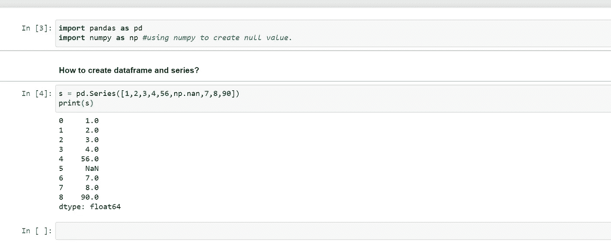
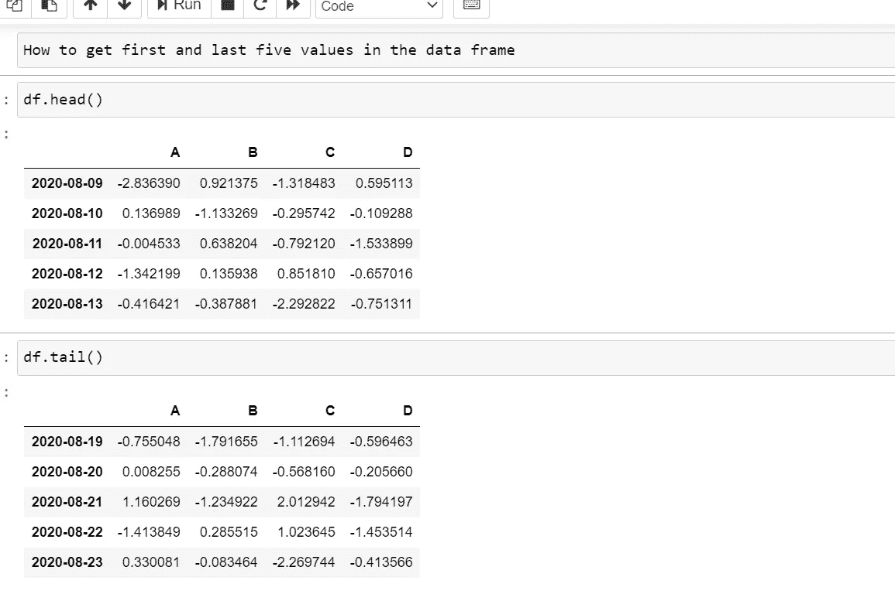

# 蟒蛇皮熊猫

> 原文：<https://medium.com/analytics-vidhya/pandas-in-python-5e2aaea8188a?source=collection_archive---------20----------------------->

Pandas 用于数据操作、分析和清理。

**什么是数据帧和序列？**

**Dataframe** 是一个二维的、大小可变的、潜在异构的表格数据。

它包含行和列，算术运算可以应用于行和列。

**系列**是一个一维标签数组，能够保存任何类型的数据。它可以是整数、浮点、字符串、python 对象等。熊猫系列不过是 excel 表格中的一列。

## 如何创建 dataframe 和 series？

s = pd。系列([1，2，3，4，56，np.nan，7，8，90])
打印



**如何通过传递 numpy 数组来创建 dataframe？**

1.  d= pd.date_range('20200809 '，periods=15)
    print(d)
2.  df = pd。DataFrame(np.random.randn(15，4)，index= d，columns = ['A '，' B '，' C '，' D'])
    print(df)


**如何通过传递对象字典创建数据框？**

df1 = pd。DataFrame({'A':[1，2，3，4]，
'B': pd。时间戳(' 20200809 ')，
'C': pd。Series(1，index= list(range(4))，dtype='float32 ')，
'D':np.array([5]*4，dtype= 'int32 ')，
' E ':" Lolitha " })
print(df)


**如何找到数据帧的数据类型？**


**如何找到数据帧中的前五个和后五个值？**

df = pd。DataFrame(np.random.randn(15，4)，index= d，columns = ['A '，' B '，' C '，' D'])
print(df)

使用 df.head()和 df.tail()



**查找索引和列**


**数据帧通过排序索引**


**按数值排序数据。**

df.sort_values(by='D ')


**如何在数据框中选择单列？**


**如何选择数据框中的单列？**


**如何使用标签选择数据？**


**如何使用标签选择多路访问？**


**如何对行进行切片？**


```
How to get particular values in a data frame?
df.loc[‘20200821’,[‘D’,’C’]]
D   -0.008524
C    0.479541
Name: 2020-08-21 00:00:00, dtype: float64How to get scalar Value?
df.loc[d[0],['D','A']]D    0.861121
A   -0.063109
Name: 2020-08-09 00:00:00, dtype: float64
```

Github 知识库链接-python 中的熊猫. ipynb-[https://github.com/lolithasherley7/lolitha.git](https://github.com/lolithasherley7/lolitha.git)

希望这给处理熊猫的基本想法。一定要试一试。