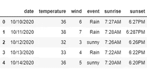

# ' | '，'，|熊猫| '，'，|用 Python…

> 原文：<https://medium.com/analytics-vidhya/pandas-in-python-a6a8004c3f7e?source=collection_archive---------29----------------------->

Pandas 是一个 python 库，用于数据分析、操作和清理。

系列和数据帧是 pandas 中的两种数据结构。

**Series —** Series 是一维数组，可以存储任何类型的数据，

**什么是数据帧…？**

数据框是可变的二维数组，具有异构的表格数据。DataFrame 是一个结构化的 API，它可以用表格形式(行和列)表示数据，可以保存各种类型的列，这些列都有标签 acces。

由于 pandas 是用于数据分析的最流行的 python 库，dataframe 是它的主要数据结构。


照片由[黛比·莫勒](https://unsplash.com/@djmle29n?utm_source=medium&utm_medium=referral)在 [Unsplash](https://unsplash.com?utm_source=medium&utm_medium=referral) 拍摄

**系列和数据帧之间的差异-**

*   系列是 pandas 中的一种数据结构，它只能有一个带索引的列表。
*   Dataframe 是一个或多个系列的集合，用于分析数据。

熊猫的一些最常见的用途是用于库存预测、统计等。

其中一个例子是，了解 API 的功能，用于废弃天气数据。


照片由 [Hannah Domsic](https://unsplash.com/@bananabear?utm_source=medium&utm_medium=referral) 在 [Unsplash](https://unsplash.com?utm_source=medium&utm_medium=referral) 上拍摄

如果数据存储在。csv 或 excel 文件，API 用于发送最新的天气数据，然后根据用户请求重新格式化所需的数据。

**数据帧的语法-**

```
*class* pandas.DataFrame**(***data=None***,** *index=None***,** *columns=None***,** *dtype =None***,** *copy=False***)**
```

**参数** -

**数据—** 数据是一种数组(结构化或同构)、可迭代、字典或数据帧。

字典可以是一个系列、数组或类似列表的对象。

**索引—** 索引或类似数组

**列**索引或数组状

用于结果框架的列标签。如果没有提供列标签，将默认为 RangeIndex (0，1，2，…，n)。

**数据类型—** 只允许一个数据类型。

**复制—** 是一个布尔值，默认为假

熊猫数据帧的每一列都有一个数据类型。

**在 Pandas 中创建数据帧的不同方式-**

*   使用 CSV 文件
*   使用 EXCEL 文件
*   从字典上
*   从词典列表中
*   从元组列表
*   来自 narray / lists 字典
*   使用 read_html 方法

**(1)使用 CSV 文件-**

逗号分隔值文件是最常见的存储数据的文件格式。

这可以通过使用 read_csv()函数来完成。

语法-

```
pandas.read_csv(filepath_or_buffer)
```

示例-

```
import pandas as pd
weather = pd.read_csv("../input/mount-rainier-weather-and-climbing data/Rainier_Weather.csv")
```

输出-


**(2)使用 Excel 文件-**

read_excel()函数用于将 excel 文件读入 panda 数据帧。

支持的文件扩展名为 xls、xlsx、xlsm、xlsb、odf、ods 和 odt。提供一个选项来读取单个工作表或工作表列表。

**语法-**

```
pandas.read_excel(file_path)
```

示例-

```
import pandas as pd
weather = pd.read_excel("weather.xls)
```

**(3)** **出自字典-**

**语法-**

```
*classmethod* DataFrame.from_dict**(***data***,** *orient='columns'***,** *dtype=None***,** *columns=None***)**[[source]](https://github.com/pandas-dev/pandas/blob/v1.1.3/pandas/core/frame.py#L1230-L1309)
```

示例-

```
weather_data = {
    'date': ['10/10/2020', '10/11/2020', '10/12/2020', '10/13/2020', '10/14/2020'],
    'temperature': [36, 38, 32, 33, 36],
    'wind': [6, 7, 3, 4, 5],
    'event': ['Rain', 'Rain', 'sunny', 'Rain', 'sunny'],
    'sunrise': ['7:27AM', '7:28AM', '7:26AM', '7:22AM', '7:20AM'],
    'sunset': ['6:27PM', '6:287PM', '6:26PM', '6:22PM', '6:20PM']
}
pd.DataFrame.from_dict(weather_data)
```

输出-



**(4)来自字典列表-**

示例-

```
weather_data = [
                { 'date' : '10/14/2020' , 'temperature' : '35' , 'wind' : '5' , 'event' : 'Sunny','sunrise': '7:20AM','sunset':'6:20PM'},
                { 'date' : '10/13/2020' , 'temperature' : '38' , 'wind' : '4' , 'event' : 'Rain', 'sunrise': '7:22AM','sunset':'6:22PM'},
                { 'date' : '10/12/2020' , 'temperature' : '32' , 'wind' : '3' , 'event' : 'Sunny','sunrise': '7:26AM','sunset':'6:26PM'},
                { 'date' : '10/11/2020' , 'temperature' : '33' , 'wind' : '7' , 'event' : 'Rain', 'sunrise': '7:28AM','sunset':'6:28PM'},
                { 'date' : '10/10/2020' , 'temperature' : '36' , 'wind' : '6' , 'event' : 'Rain', 'sunrise': '7:27AM','sunset':'6:27PM'}
                ]df = pd.DataFrame(weather_data)
```

输出-


**(5)来自 narray/list 的 DIC**

示例-

```
weather_data = {
    'date': ['10/14/2020', '10/13/2020', '10/12/2020', '10/11/2020', '10/10/2020'],
    'temperature': [35, 38, 32, 33, 36],
    'wind': [5, 4, 3, 7, 6],
    'event': ['Sunny', 'Rain', 'Sunny', 'Rain', 'Rain'],
    'sunrise': ['7:20AM', '7:22AM', '7:26AM', '7:28AM', '7:27AM'],
    'sunset': ['6:20PM', '6:22PM', '6:26PM', '6:28PM', '6:27PM']
}df = pd.DataFrame(weather_data)
```

输出-


**熊猫运营-**

可以执行的一些操作是字符串处理、将函数应用于数据和柱状图

df.mean()

df.apply()

**字符串操作-**

示例-

a = pd。系列(['abc '，' xyz '，' zzz'])

a . str . upper()-将所有列名更改为大写

a . str . lower()-将所有列名更改为大写

**合并数据帧-**

两个数据帧的合并可以通过，

*   Concat()
*   加入()
*   合并()
*   groupby()

感谢阅读…