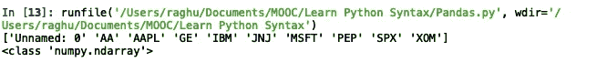

# 熊猫大师班——你的数据科学基础

> 原文：<https://medium.com/analytics-vidhya/pandas-masterclass-your-foundation-to-data-science-part-1-136474104d57?source=collection_archive---------14----------------------->

第 1 部分:基本数据帧操作


图片来源:走向数据科学

Pandas，Panel Data，是一个 Python 编程语言的软件库，对数据操作和分析非常有帮助。根据[维基百科](https://en.wikipedia.org/wiki/Pandas_(software))的说法，你可以用熊猫实现的是

*   用于集成索引的数据操作的 DataFrame 对象。
*   用于在内存数据结构和不同文件格式之间读写数据的工具。
*   数据对齐和缺失数据的综合处理。
*   数据集的整形和旋转。
*   大型数据集的基于标签的切片、花式索引和子集化。
*   数据结构列的插入和删除。
*   按引擎分组，允许对数据集进行拆分-应用-组合操作。
*   数据集合并和连接。
*   层次轴索引用于在低维数据结构中处理高维数据。
*   时间序列-功能:日期范围生成[【4】](https://en.wikipedia.org/wiki/Pandas_(software)#cite_note-4)和频率转换、移动窗口统计、移动窗口线性回归、日期移动和滞后。
*   提供数据过滤。

让我们开门见山，从 Python 中的 Pandas 实现开始，边做边学。这将是一个很长的帖子，给你一个全面的经验，学习熊猫玩你的数据。

这将是一系列或 3 到 4 个不同的帖子，将深入涵盖大熊猫的功能。

**1。创建易于引用的别名** 首先，我们必须使用语句`import pandas`将`pandas`库导入到我们的 python 程序中。更简单的选择是将它作为别名导入，这有助于我们减少每次执行与软件包相关的功能时键入整个单词`pandas`的麻烦。

```
import pandas as pd
```

**2。读取文件** 在`pandas`中读取文件的内容相当简单。`pandas`有多个内置函数可以直接读取各种类型的文件，不用担心文件的分隔符/分隔符。对于下面的例子，我们将使用`stock_px.csv`文件，该文件具有时间戳和 10 只不同股票的价格。


stock_px.csv 文件的部分内容

要读取 csv 文件，我们可以如下使用`read_csv()`函数。

```
results = pd.read_csv("stock_px.csv")
```

这会读取 csv 文件并将其存储到名为`results`的`DataFrame`中。类似地，我们有像`read_tsv()`这样的函数来读取制表符分隔的值`read_excel()`来读取 excel 文件，除了对于 excel，我们必须使用`sheetname`属性提及要读取的工作表名称，并提及工作表名称。

**DataFrame** 是一个带有潜在不同类型列的二维标签数据结构。你可以把它想象成一个电子表格或 SQL 表。当文件内容读入数据帧时，默认情况下，第一行被视为列标签。我们可以覆盖它，并使用下面的语法指定我们自己的列标签。

```
results1 = pd.read_csv("stock_px.csv", names=["Date & Time", "American Associates", "Apple", "General Electricals", "IGM", "JNJ","Microsoft", "PEP", "Sparx", "Xerox"])
```

这将省略`stock_px.csv`的第一个 like，并给出在`read_csv()`函数的`names= []`属性中提供的列名。


用户给定的列名

在读取文件时，如果我们希望默认系统生成列标签，并希望忽略 csv 文件的第一行，我们可以使用以下语法。

```
results1 = pd.read_csv("stock_px.csv", header=None)
```

这将从 0 开始分配列标签，并为后面的每一列递增 1。


系统生成的列名

**3。提取数据帧内容** 一旦我们能够在数据帧中检索文件的内容，Pandas 库提供了许多从数据帧中检索数据的函数。让我们从最基本的选项开始，然后再转向更复杂的选项。

为了显示一个数据帧的全部内容，我们所要做的就是打印出数据帧本身。系统打印数据帧的删节版本，以便在有限的显示空间内更具可读性。

```
print(results)
```


整个数据框架，结果，打印

**ii)打印数据帧的前几行或后几行** 我们有一些有用的函数，比如`head()`和`tail()`，它们默认分别打印数据帧的前 5 行和后 5 行，但是我们可以在`head()`或`tail()`函数中提供任何参数，比如 4 或 10，来打印那么多行。

```
print(results.head(2)) #prints the first 2 rows of DataFrame
print(results.tail()) #prints the last 5 rows of DataFrame
```


数据帧打印头(2)和打印尾()函数的输出

**iii)计算每列的行数** 为了给出每列的行数的**计数，我们可以使用下面的`count()` 函数。**

```
print(results.count())
```


count()函数的输出

**iv)数据帧的长度** 要简单地得到数据帧的**长度**，也就是行数，我们可以使用下面的`len()`函数。

```
print("Length of results dataframe is:",len(results))
```


数据帧的长度

**v)数据帧的列标签** 如果想要检索数据帧中所有**列标签**的列表，以便进一步处理，我们可以使用如下的`columns.values`属性，这将产生一个数组。

```
print(results.columns.values)
print(type(results.columns.values))
```



列名和结果的数据类型

让我们现在就开始，探索如何有选择地打印出某些行或列，或者两者的组合，或者应用了某些限制的结果。

**vi)打印特定列的所有行** 我们可以使用列标签有选择地打印数据帧的特定列的行。如果您想选择列标签的范围，您可以使用前面的方法`columns.values`检索列标签，然后从列表中选择值的范围。

首先，一个简单的打印一列所有行的例子，`'AA'`。

```
print(results['AA'])
```


打印“AA”列的所有行

打印第 2 列`'AA', 'AAPL' and 'PEP'`后的 10 行。这里，我们需要记住的是，当需要检索多个列值时，我们必须将它作为列表传递给下面给出的`results` DataFrame。

```
print(results[['AA', 'AAPL', 'PEP]][2:12])
```

这将跳过索引值为`0, 1`的前两行，然后开始打印从`2:11`开始的行。

**vii)使用 iloc 和 loc**这两个函数都采用格式`loc[rows, columns]`的值，其中 as `columns`是可选的。如果我们不指定任何列，它将打印整行。

iloc 和 loc 的基本区别在于，iloc 默认只接受系统分配的行和列值，这些值从`0`开始，每行递增 1。因此，如果我们有 10 行，行索引值默认为`0, 1, 2, 3, 4, 5, 6, 7, 8, 9`。

但是 loc 也接受用户定义的标签。在我们的数据框架中，索引`1`处的列有一个标签`'AA'`，我们可以使用`iloc[0, 'AA']`为行`0`检索列`'AA'`的值，而使用`loc`的唯一方法是采用系统定义的默认值`loc[0, 0]`。

考虑下面的例子

```
print(results.iloc[0, 0]) #prints timestamp of first row
print(results.loc[0, 'AAPL']) #prints value of 'AAPL' from first row
print(results.iloc[0:4]) #prints entire first 4 rows
print(results.loc[0:4, 'GE']) #prints values of GE from row index 0 to 3
```


运行上述 iloc 和 loc 示例的结果

我们可以进一步使用`loc`来过滤出基于特定条件的结果。如果我们希望只显示与某些行中的某些值匹配的结果，我们可以使用下面的语法。

```
print(results.loc[results['GE'] == 2.87])
#prints all rows where column 'GE' has a value 2.87print(results[['GE','AA']].loc[results['GE'] == 2.87])
#prints columns 'GE' and 'AA' only for columns where 'GE' has a value of 2.87
```


在很多情况下，我们需要依次获取索引号以及每一行的内容，然后对其应用一些逻辑。一种简单的迭代数据帧并获取数据的方法如下。

```
for index, row in results.iterrows():
    print("Index no.:",index)
    print(row)
```

一个简单的 3 行代码来完成这项工作。我们可以更进一步，仅通过针对`row`变量指定列标签来检索选择的列值。

```
for index, row in results.iterrows():
    print(index, row['AAPL'])
```

上面这段代码只在每次迭代中有选择地提取`'AAPL'`列的值。

在接下来的部分中，我将更多地讨论写入文件、数据帧内容排序、数据帧内容分组、数据帧数据操作、从 JSON、数据库中读取特定内容等。，以及许多其他有用的具体操作。

**系列各部分:**
[Pandas master class——你的数据科学基础(第一部分:基本数据帧操作)](/analytics-vidhya/pandas-masterclass-your-foundation-to-data-science-part-1-136474104d57)
[Pandas master class——你的数据科学基础(第二部分:特殊文件格式的数据帧操作)](/@raghupro/pandas-masterclass-your-foundation-to-data-science-part-2-e0abda580cc3)
[Pandas master class——你的数据科学基础(第三部分:排序、 过滤和分组数据帧数据并写入文件)](/@raghupro/pandas-masterclass-your-foundation-to-data-science-part-3-220cd683540e)
[Pandas master class—您的数据科学基础(第 4 部分:Pandas 函数)](/@raghupro/pandas-masterclass-your-foundation-to-data-science-part-4-736a233b0b70)
[Pandas master class—您的数据科学基础(第 5 部分:多索引数据帧、处理 na 值和组合数据帧)](/@raghupro/pandas-masterclass-your-foundation-to-data-science-part-5-5e86b812f6c3)