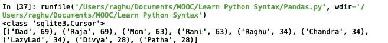
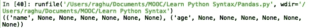
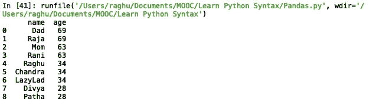
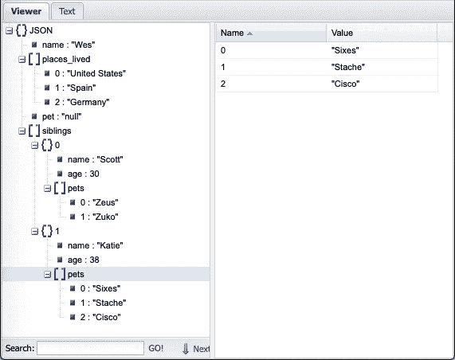
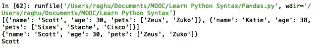
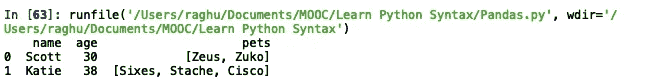
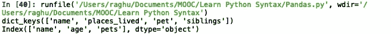
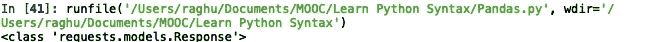
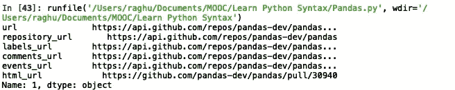

# 熊猫大师班——你的数据科学基础

> 原文：<https://medium.com/analytics-vidhya/pandas-masterclass-your-foundation-to-data-science-part-2-e0abda580cc3?source=collection_archive---------15----------------------->

## 第 2 部分:特殊文件格式的数据帧操作


图片来源:走向数据科学

欢迎回来！在上一篇文章中，我们已经简要介绍了 Pandas，以及如何使用 Pandas 库来读取各种文件类型并从数据帧中提取数据。

在本文中，我们将讨论如何将数据帧内容写入文件，如何读取数据库、JSON 数据和二进制数据等特殊数据类型，然后再对数据进行排序、过滤和分组。

**1。从数据库中读取数据** 在了解如何使用 Pandas 函数操作和充分利用数据之前，我们首先必须熟悉 Python 中处理数据库的过程。我们将使用 sqlite db 来探索这个过程，SQLite db 是一个基本的内存数据库，预安装在 Mac OS 和 Linux OS 上，并且是一个非常轻的软件包，可以安装在 Windows OS 上。涉及的各种基本步骤如下。

I)导入帮助我们执行命令的包
每个数据库都有各自的包，包中有各种预定义的函数，帮助我们处理数据库中的数据。下面是导入 sqlite 包的语法

```
import sqlite3
```

ii)创建与数据库的连接
然后我们建立与数据库的连接。在单个程序中，我们可以通过每次使用一个新的连接变量名来建立任意多的数据库连接。要遵循的语法是

```
db = sqlite3.connect("myDb1.sqlite")
```

这实际上试图连接到数据库`myDb`，如果它存在，否则它创建一个新的数据库`myDb1`。

iii)执行查询
一旦我们成功连接到数据库，我们就可以使用`execute`或`executemany`函数在数据库上执行任意数量的查询。这可以用例子来最好地解释。

```
#Creating a new table in the database
db.execute("CREATE TABLE test (name VARCHAR(50), age INTEGER)")
db.commit()
```

我们正在执行一个表创建查询，然后将更改提交给数据库。这将创建一个名为`test`的新表，表中的列`name`包含长度为 50 的可变字符类型字段和整数`age`。

我们可以使用同一个 execute 函数从`test`表中插入和检索数据。

```
db.execute("INSERT INTO test values(?, ?)", ("Raghu", 34))
```

这里我们必须记住的是，只有在 Python 中，表才以元组的形式存储和检索值。当我们传递参数时，它只能作为一个元组传递，就像上面的例子中给出的那样，这个例子基本上是在表的第一行插入值`"Raghu"`和`34`。

对于保存在列表或嵌套元组中的大型数据集，我们可以简单地执行如下的 For 循环

```
list1 = [("Divya", 28), ("Dad", 69), ("Mom", 63)]for entry in list1:
    db.execute("INSERT INTO test values(?, ?)", entry)
db.commit()
```

以上代码行将从列表`list1`中顺序读取每个元组，然后对每组值执行`insert`语句。

或者，我们可以使用更有用的`executemany`函数，如下所示

```
list1 = [("Divya", 28), ("Dad", 69), ("Mom", 63)]
db.executemany("INSERT INTO test values(?, ?), list1)
db.commit()
```

从数据库中选择内容有点不同。一旦我们执行了查询，它将结果存储到一个 cursor 对象中，然后这个对象要么被转换成一个可以迭代的列表，要么使用`fetchall()`函数来完成相同的工作。

```
results = db.execute("SELECT * FROM test ORDER BY age DESC")
print(type(results)) #showing type of result object
rows = results.fetchall()
print(rows)
```

或者

```
results = db.execute("SELECT * FROM test ORDER BY age DESC")
print(type(results)) #showing type of result object
rows = list(results)
print(rows)
```

两者都将创建一个名为`rows`的列表，存储`test`表的全部内容，其中每一行都作为一个元组存储，如下所示。



结果类型是光标。将 select 查询的输出打印为元组列表。

一旦我们能够从一个表中提取数据并将其存储在一个列表中，我们实际上就可以将它转换成一个数据帧，以便进一步处理数据。

第一步是使用`description`属性读取列标签。属性的第一个元素存储列名。

```
print(results.description)
```



每个元组的第一个元素具有列名

然后，我们使用 Pandas 的`DataFrame`函数将`test`表内容存储转换为`rows`变量中的列表，然后从`results.description`变量分配列标签。

```
pdResults = pd.DataFrame(rows, columns=[x[0] for x in results.description])
print(pdResults)
```



显示列表内容的数据框

**2。读取 JSON 数据**
最近，大多数使用 web APIs 的通信都是以 JSON 格式传输数据，因此掌握必要的技能来解析 JSON 数据并以数据帧的形式从中提取信息是非常必要的。

让我们从一个简单的 JSON 数据开始。请注意，只有当数据作为字符串传递时，Python 的 JSON 包才能使用默认函数解析 JSON 数据。考虑以下字符串格式的 JSON 数据。

```
obj = """{"name":"Wes",
       "places_lived":["United States", "Spain", "Germany"],
       "pet":"null",
       "siblings": [{"name":"Scott", "age":30, "pets":["Zeus", "Zuko"]},
                    {"name":"Katie", "age":38, "pets":["Sixes", "Stache", "Cisco"]}]
       }"""#we use """ to take the JSON data as string
```

当我们检查`obj`变量数据类型时，它也显示为`str`。

在导入`json`包之后，我们将 JSON 数据加载到一个变量中。JSON 数据加载到的变量将采用`dict`的形式。

```
import jsonresults = json.loads(obj)print(type(results)) #this prints out <class 'dict'>
```

我们可以使用在线免费的 JSON 可视化查看器来可视化地浏览 JSON 数据。你可以利用的一个网站是 JsonViewer 。上面的`obj` JSON 数据会显示如下。



存储 JSON 数据的 obj 变量的可视化表示

您可以使用`dumps()`函数将 JSON 数据从`dict`格式恢复到`str`格式。

```
dumpResults = json.dumps(results)
print(type(dumpResults)) #this prints out <class 'str'>
```

通过调用 dict 的`key`来读取特定的 JSON 数据，该 dict 输出与`key`相关联的`value`。

```
print(results["siblings"]) #prints all values of key 'siblings'
print(results["siblings"][0]) #prints the first value of key 'siblings'
print(results["siblings"][0]["name"]) #prints value of 'name' key in first value of 'siblings' key value.
```



以上三个打印报表的输出

一旦我们能够有选择地调用 JSON 数据，我们就可以将它转换成 DataFrame，只要所选键的`key`中的所有`values`长度相等。

```
dfResults = pd.DataFrame(results["siblings"], columns = ["name", "age", "pets"])
print(dfResults)
```

上面的代码调用`'siblings'`键来检索它的`values`，然后指定我们想要提取所有列，我们也可以省略`columns`属性，因为默认情况下它检索所有列的数据。



JSON 数据到数据帧输出

要获得 JSON 数据中所有键的列表，我们可以使用 dictionary 数据类型的`key()`函数。

```
print(results.keys()) #JSON data keys
print(dfResults.keys()) #DataFrame keys
```



打印 JSON 数据的密钥和部分加载 JSON 数据的数据帧

**3。从 web API 中读取数据** 正如我们刚刚讨论的将 JSON 数据加载到 DataFrame 中一样，现在让我们看另一个 JSON 例子，但是是从 Web API 中读取 JSON 数据。读取 web API 数据由 python 中的`requests`包处理。

```
import requestsurl = "[http://api.github.com/repos/pandas-dev/pandas/issues](http://api.github.com/repos/pandas-dev/pandas/issues)"
webData = requests.get(url)
print(type(webData))
```



get 函数的结果返回一个响应对象

函数`get()`用存储在另一个变量`webData`中的响应对象进行响应。然后，我们使用`json()`函数读取作为 web URL 响应接收的 JSON 数据。

```
jsonData = webData.json()
```

现在，变量`jsonData`存储了 JSON 数据，如前所述，可以使用任何在线 JSON 数据可视化器直观地看到这些数据。我们可以将部分 JSON 数据提取到一个 DataFrame 中，就像前面讨论 JSON 数据类型一样。

```
dfData = pd.DataFrame(jsonData, columns=['url', 'repository_url', 'labels_url', 'comments_url', 'events_url', 'html_url'])
print(dfData.iloc[1])
```



dfData 数据框中的示例行

**4。读取和操作二进制数据。** 机器学习中使用最多的二进制文件格式是 Pickle 文件格式和 HDF5 文件格式。由于大多数函数非常相似，我们将只举一个简单的读取和写入二进制数据 Pickle 文件格式的例子。

为了将存储在数据帧中的内容写入 Pickle 文件格式，我们使用具有以下语法的`to_pickle()`函数

```
results = pd.read_csv("stock_px.csv") #reading a csv file into a dataframe
results.to_pickle("pickleStocks") #stores in a pickle file format with name of the file as 'pickleStocks'
```

这将创建一个文件名为`pickleStocks`的 pickle 文件，并将数据帧`results`中的数据存储到其中。

为了从 pickle 文件中读取数据，我们使用如下的`read_pickle()`函数，将数据存储到数据帧中

```
pickleDf = pd.read_pickle("pickleStocks")
```

一旦我们知道了如何读写 pickle 格式的数据，接下来的操作就很简单了。

在这篇文章中，我们几乎完成了使用 Pandas 从各种类型的文件中读取内容，并部分介绍了使用`iloc`和`loc`函数选择性地显示 DataFrame 数据。在本系列接下来的部分中，我们将探索将 JSON 数据存储到文件中，对数据进行排序、过滤和分组。

**系列各部分:**
[Pandas master class——你的数据科学基础(第一部分:基本数据帧操作)](/analytics-vidhya/pandas-masterclass-your-foundation-to-data-science-part-1-136474104d57)
[Pandas master class——你的数据科学基础(第二部分:特殊文件格式的数据帧操作)](/@raghupro/pandas-masterclass-your-foundation-to-data-science-part-2-e0abda580cc3)
[Pandas master class——你的数据科学基础(第三部分:排序、 过滤和分组数据帧数据并写入文件)](/@raghupro/pandas-masterclass-your-foundation-to-data-science-part-3-220cd683540e)
[Pandas master class—您的数据科学基础(第 4 部分:Pandas 函数)](/@raghupro/pandas-masterclass-your-foundation-to-data-science-part-4-736a233b0b70)
[Pandas master class—您的数据科学基础(第 5 部分:多索引数据帧、处理 na 值和组合数据帧)](/@raghupro/pandas-masterclass-your-foundation-to-data-science-part-5-5e86b812f6c3)