# 熊猫大师班——你的数据科学基础

> 原文：<https://medium.com/analytics-vidhya/pandas-masterclass-your-foundation-to-data-science-part-3-220cd683540e?source=collection_archive---------26----------------------->

## 第 3 部分:对数据帧数据进行排序、过滤和分组，并写入文件


一旦我们知道如何在数据帧中读写数据，我们就可以对它执行各种有用的操作，包括排序数据、在各种条件下过滤数据、对数据分组、识别空值，然后用标准值填充它，获得数据的形状等。我们将首先讨论数据排序、在各种条件下过滤数据以及数据分组。

**1。排序数据**
一旦我们将数据加载到一个数据帧中，我们就可以按任何单个列或列的组合对数据进行排序。当我们使用多个列对数据进行排序时，优先选择指定的列。数据首先按排序函数中给出的第一列排序，如果第一列中有一个或多个值相似，则按排序函数中提到的第二列中的数据值排序。对于每一列，我们可以指定是按升序还是降序对数据进行排序，如果没有指定，默认值是升序。

现在，让我们来看几个在我们考虑的第一个数据集股票信息数据上实现的例子。我们分享下面文件的前 5 行，以提供文件结构的概述，数据被加载到 DataFram `results`。

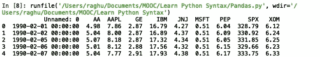

显示加载了股票数据的 5 行结果数据帧。

```
print(results.sort_values('AA', ascending = False))
#sorts results data by 'AA' column in descending order
```

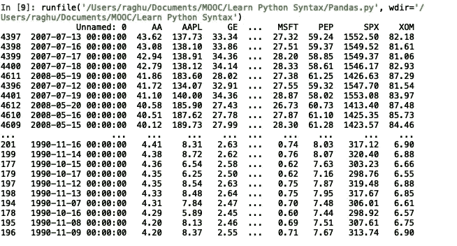

结果数据框按列“AA”降序排序

在下一个示例中，我们将首先按照`'AAPL'`列对`results`数据框中的数据进行升序排序，如果`'AAPL'`列中的值相似，我们将按照`'GE'`列进行降序排序。

```
print(results.sort_values(['AAPL','GE'], ascending = [True, False]))
```

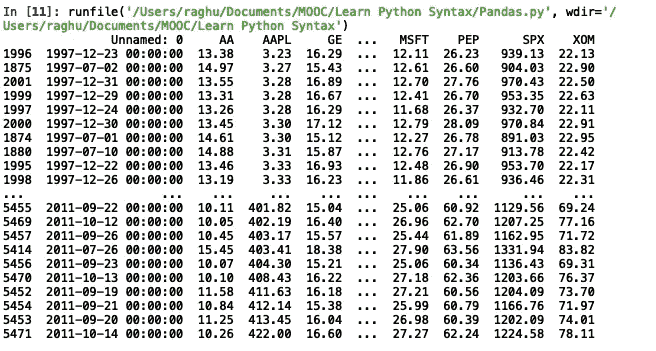

按“AAPL”列升序排序，然后按“GE”列降序排序

正如我们在上面的结果中看到的，行号`2001, 1999 and 1997`都有`'AAPL'`列值作为`3.28`。因此，它接下来对列`'GE'`应用排序，并按如上所示的降序排序。

**2。过滤数据** 在很多情况下，人们希望根据不同的标准有选择地从数据帧中检索数据。我们已经在 *vii)下使用 iloc 和 loc* 讨论了一些基本示例，这是我们系列 [Pandas Masterclass —您的数据科学基础(第 1 部分:基本数据帧操作)](/analytics-vidhya/pandas-masterclass-your-foundation-to-data-science-part-1-136474104d57)的第一部分。我们现在将了解如何实现更高级的数据过滤。

需要记住的几个基本点。每当我们在 DataFrame 数据上执行条件操作符检查时，它都返回布尔值，对于满足条件语句的列的任何行值都带有`True`，对于不满足条件语句的任何值都带有`False`。下面是一个小例子，处理的是我们在`results`数据框架中的同一个股票数据集。

```
print(results['AA'] > 5)
```

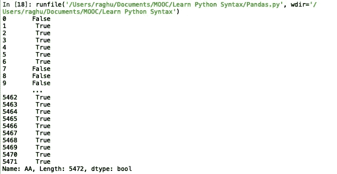

对列“AA”运行条件语句的结果

上面我们可以看到，行(指标值)`0`有`False`，后面是`True`为指标值`1 to 6`等。这实质上意味着索引值`0`的值小于 5，而索引值`1 to 6`的值大于 5。

然后，我们可以在一个`loc`函数中使用这个布尔结果，有选择地只打印出具有`True`值的索引，如下所示。

```
print(results.loc[results['AA'] > 5])
```

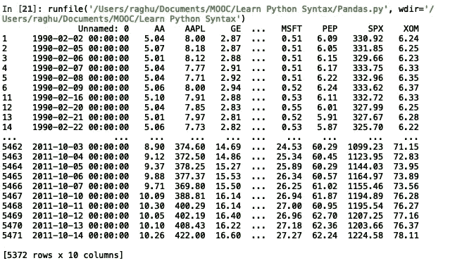

结果显示“AA”值大于 5

我们可以使用多个条件，使用 and 运算符`&`或运算符`|`或 not 运算符`~`来连接多个条件并相应地提取数据。

```
print(results.loc[(results['AA'] == 4.98) & (results['AAPL'] == 7.86)])
```

这将打印出列`'AA'`值为`4.98`且列`'AAPL'`值为`7.86`的数据帧内容。

```
print(results.loc[(results['AA'] == 4.98) | (results['AAPL'] == 7.86) | (results['SPX'] == max(results['SPX']))])
```

在这里，我们将它向前提升一个等级，并使用`max()`功能。这里我们用 or 运算符`|`连接了三个条件。执行上述代码将返回 DataFrame 中满足三个条件语句中至少一个的所有内容。最后一条语句基本上是说返回 DataFrame 的所有行，其中列`'SPX'`的值等于列`'SPX'`的最大值。

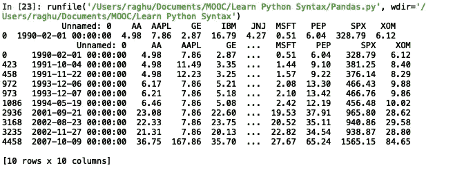

执行上述多重条件语句过滤的结果

筛选数据的其他方法是对包含字符串数据的列使用字符串函数。让我们考虑几个例子来处理含有泰坦尼克号乘客信息的数据。我们不讨论数据帧中数据的复杂细节，因为我们只考虑一列`'name'`并对其应用字符串函数来过滤数据。

```
print(titanicData.loc[titanicData['Name'].str.contains("John")]["Name"])
```

上面的条件使用了`contains()`字符串函数，并返回所有包含单词`'John'`的名字。

```
import re
print(titanicData.loc[titanicData['Name'].str.contains("pi[a-z]*", regex=True, flags=re.I)]["Name"])
```

我们也可以在`contains()`函数中使用正则表达式。这是一个复杂的话题，我不会在这里讨论，但如果你进一步感兴趣，你可以在 [W3Schools](https://www.w3schools.com/python/python_regex.asp) 中阅读更多相关内容。上面的表达式搜索名称中有`'pi'`后跟任意数量的字符`a-z`的名称。变量`flags`有多个参数，但我们使用的参数`re.I`表示删除区分大小写的搜索。

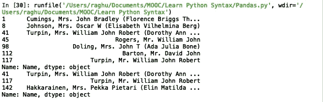

对代码片段执行上述操作的结果

我们可以使用条件筛选来更改作为条件筛选结果的数据的列值。我们将在下面讨论的代码对股票数据的列`'GE'`值进行条件过滤，然后对于满足条件的行，将列`'AAPL'`的值更改为 0。

```
print(results.head())
results.loc[results['GE'] == 2.87, 'AAPL'] = 0
print(results.head())
```

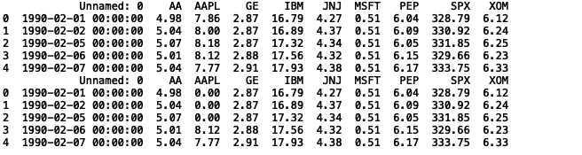

显示更改前后结果数据框的前 5 行

**3。分组数据** 分组数据相当直截了当。`groupby()`函数对列进行操作，并使用三个聚合函数`sum()`、`count()`和`mean()`中的任意一个对数据进行分组，这三个函数基本上按照`groupby()`函数中使用的列名对数据进行求和，计算值的数量，并分别求出值的平均值。举几个例子就很容易理解了。

考虑一个包含各种口袋妖怪及其属性(如名称、类型、HP、攻击等)细节的数据帧。下面显示了不同的列名，其中显示了一行中的数据，以了解数据帧中存在何种数据。

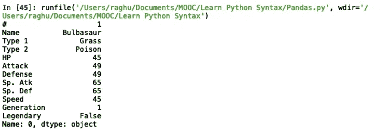

口袋妖怪数据框的一行

因为我们有有用的字段，如`'Type 1`和`'Type 2`，所以很容易运行各种分组语句来有效地显示结果。

如果我们想得到所有非对象值的平均值，然后按照`'Attack'`列进行排序，我们可以执行一行简单的代码来实现。

```
print(pokeData.groupby('Type 1').mean().sort_values('Attack', ascending = False))
```

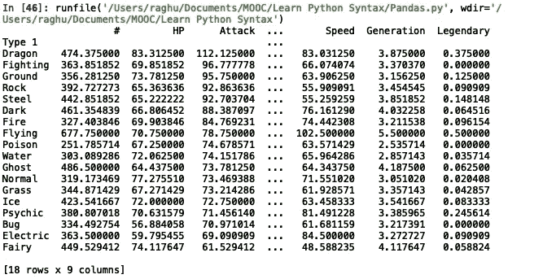

按类型 1 列分组的数据框内容和计算的平均值

上面的代码基本上是通过`'Type 1'`列对整个`pokeData`数据帧进行分组，然后对其他列的值组计算每种 Pokemon 的平均值。然后我们使用`sort_values()`函数按照`'Attack'`列值降序排序。

**4。将数据帧内容写入文件** 现在，我们已经介绍了最常用的数据操作，从将各种来源的数据加载到数据帧/数据系列，到对数据帧数据执行各种操作，如分组、排序和过滤，下一个逻辑步骤是了解如何将数据帧中的数据写入文件。

在 Pandas 中有许多有用的功能和任务来帮助执行各种操作，我将在本系列的下一部分中讨论这些功能和任务。

我们拥有的各种文件写入选项如下。([来源](https://pandas.pydata.org/pandas-docs/stable/user_guide/io.html))

```
df.to_csv() #csv format
df.to_json() #JSON format
df.to_html() #HTML format
df.to_clipboard() #to local clipboard
df.to_excel() #Excel format
df.to_hdf() #HDF format (binary)
df.to_feather() #Feather format
df.to_parquet #Parquet format
df.to_msgpack #Msgpack format
df.stata("filename") #stata format
df.pickle("filename") #pickle file format (binary)
df.to_sql() #SQL
df.to_gbq() #Google big query
```

我们为每个函数提供了各种有用的属性，从使用`columns = ['Col1', 'Col2']`属性指定只将特定的列写入文件，到使用`index = False`提示不要写入索引标签，以及使用`header = False`忽略列标签。完整的参数列表非常详尽，需要时可以参考。

使用各种文件格式编写数据的几个例子。我们将不讨论数据帧的确切内容，但是在执行下面给出的代码行之后，可以通过查看结果文件的快照来评估内容。

```
titanicDF.to_csv("testNoIndexNoHeader.csv", index = False, header = False)
```

这将 DataFrame `titanicDF`的内容写入一个名为`testNoIndexHeader.csv`的 CSV 文件，不包含任何列名或索引名，如下所示。

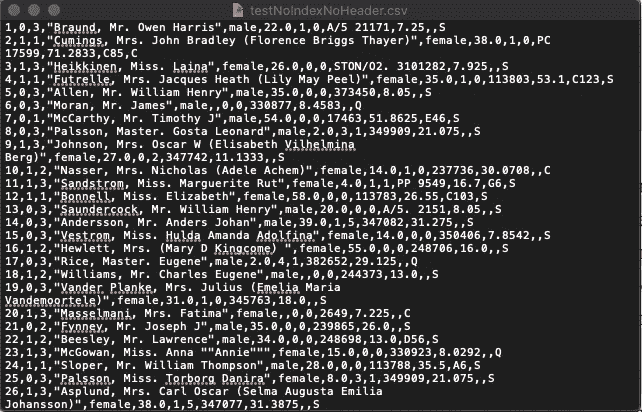

“testNoIndexNoHeader.csv”文件的快照

```
#titanicDF.to_csv("testOneColumnOnly.csv", columns = ["PassengerId"])
```

上面的代码将 DataFrame 的`'PassengeId'`列以及`titanicDF`的索引和列标签写入一个 CSV 文件`testOneColumnOnly.csv`，如下所示。

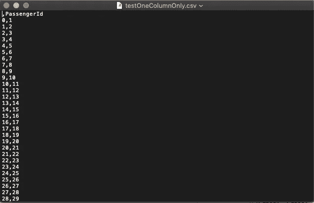

“testOneColumnOnly.csv”文件的快照

本系列的下一部分将会更加激动人心，上面讨论了一些复杂的功能和要实现的特定任务的细节。

**系列各部分:**
[Pandas master class——你的数据科学基础(第一部分:基本数据帧操作)](/analytics-vidhya/pandas-masterclass-your-foundation-to-data-science-part-1-136474104d57)
[Pandas master class——你的数据科学基础(第二部分:特殊文件格式的数据帧操作)](/@raghupro/pandas-masterclass-your-foundation-to-data-science-part-2-e0abda580cc3)
[Pandas master class——你的数据科学基础(第三部分:排序、 过滤和分组数据帧数据并写入文件)](/@raghupro/pandas-masterclass-your-foundation-to-data-science-part-3-220cd683540e)
[Pandas master class—您的数据科学基础(第 4 部分:Pandas 函数)](/@raghupro/pandas-masterclass-your-foundation-to-data-science-part-4-736a233b0b70)
[Pandas master class—您的数据科学基础(第 5 部分:多索引数据帧、处理 na 值和组合数据帧)](/@raghupro/pandas-masterclass-your-foundation-to-data-science-part-5-5e86b812f6c3)