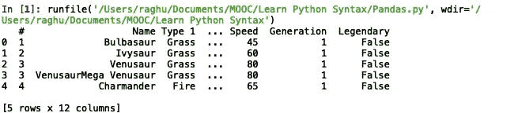
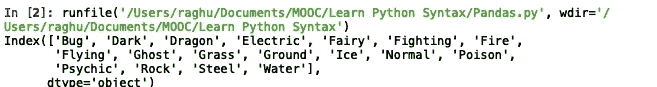
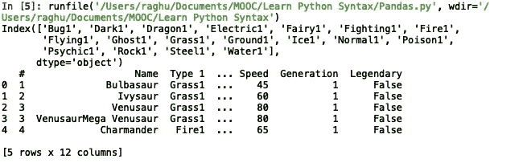
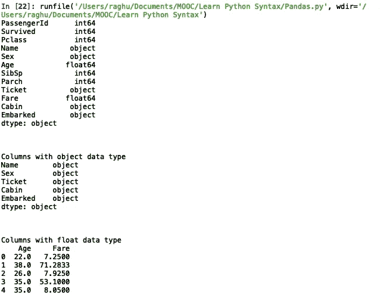
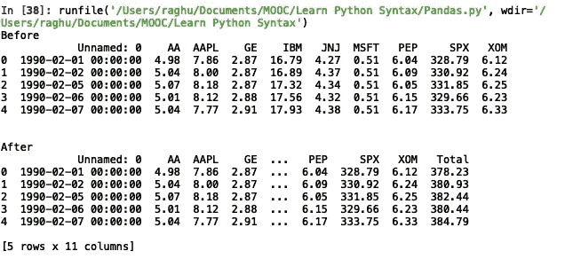
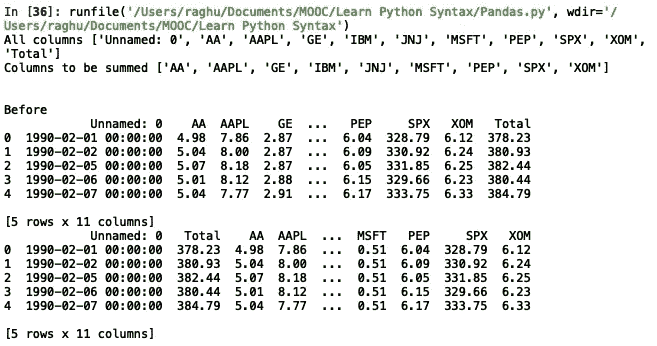
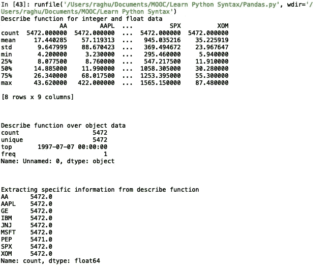
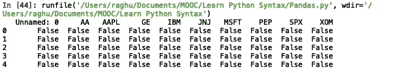
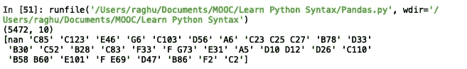

# 熊猫大师班——你的数据科学基础

> 原文：<https://medium.com/analytics-vidhya/pandas-masterclass-your-foundation-to-data-science-part-4-736a233b0b70?source=collection_archive---------16----------------------->

## 第四部分:熊猫的功能


**1。使用 chunksize 参数处理大型数据** 使用`chunksize`参数可以处理几个 GB 大小的大型数据，该参数有助于读取部分数据，根据需要对其应用各种处理，将其存储在临时变量中，然后将所有数据连接在一起。

我们将首先利用`chunksize`参数共享一个代码段，然后逐步解码。我们将实现两个不同的数据帧读取相同的 CSV 文件，只是为了验证两个数据帧最终是否具有相同的内容。

```
df = pd.read_csv("pokemon_data.csv")
print(len(df))newDf = pd.DataFrame(columns = df.columns)
for tempDf in pd.read_csv("pokemon_data.csv", chunksize = 5):
    newDf = pd.concat([newDf, tempDf])

print(len(newDf))#reading chunks of 5 rows at a time and then process it to do whatever 
```

前两行代码非常清楚，我们正在读取`pokemon_data.csv`文件，然后打印数据帧的长度。

接下来，我们尝试创建一个新的空数据帧`newDf`，其列标签类似于第一个数据帧`df`。在下一个`for`循环中，我们通过使用 Pandas 的`read_csv`函数中的`chunksize`参数，在每次迭代中仅读取 5 行`pokemon_data.csv`文件，然后将`newDF`连接到我们在每次迭代中读取的 5 行数据，最终得到与`df` DataFrame 中相同的数据。我们可以通过打印`newDf`数据帧的长度来验证这一点，该长度将与`df`数据帧的长度相同。

**2。现场参数** 在各种情况下，我们会对数据帧中某些列进行更改。为了反映数据帧中的变化，我们可以使用下面的代码给它重新分配数据帧。

```
new_results = new_results.reset_index(drop = True)
```

或者，我们可以如下使用`inplace`变量，而无需将数据帧重新分配给它本身。

```
new_results.reset_index(drop = True, inplace = True)
```

**3。更改列中的分类数据** 分类数据意味着数据帧的某一列中存在的值。例如，DataFrame 的列`'Age'`可能有像`28, 45, 67`这样的值。，这是该列的所有分类数据。

我们可能会遇到多种情况，我们将不得不改变分类数据。这个过程非常简单，可以用下面的例子来解释。

```
print(pokeData.head())
types = pd.Categorical(pokeData['Type 1'])
print(types.categories)
types.rename_categories([x+'1' for x in types.categories], inplace= True)
print(types)
pokeData['Type 1'] = types
print(pokeData.head()) 
```

我们首先打印出`pokeData`的前 5 行，以了解数据帧中存储了什么类型的数据。



pokeData 数据帧的前 5 行

现在，让我们尝试通过在每个类别值的末尾添加一个后缀“1”来更改列`'Type 1'`的分类数据。我们首先使用`pd.Categorical`函数将一列的所有分类数据加载到一个临时变量`types`中。然后我们打印`types`变量，只是为了检查列`'Type 1'`中的所有类别。



“类型 1”列的分类数据

然后我们使用`rename_categories()`功能来重命名类别。我们只需要确保新的类别名称作为一个列表提供，并且具有与原来相同数量的类别值。如果分类数据最初有 13 个不同的值，那么我们必须在`rename_categories()`函数中再次提供 13 个值作为列表。在这里，我们只是检索现有的类别名称，并为它们添加一个后缀“1”。

我们可以通过打印新的分类值来验证它们。我们可以再次将这些新值赋给数据帧的`'Type 1'`列。



显示新的分类数据并应用于数据框架

**4。列的数据类型** 我们可以使用`dtype`操作符找到数据帧列的数据类型，也可以直接使用`dtypes`函数或使用`select_dtypes`函数进一步过滤出属于特定数据类型的列。

```
print(titanicData.dtypes)
print("\n\nColumns with object data type")
print(titanicData.dtypes[titanicData.dtypes == "object"])
(or)
print(results.select_dtypes(include= ['float']).head())
```



显示所有列的数据类型并筛选出对象类型列

**5。对数据帧行数据的算术运算我们可以使用数据帧行中的浮点或整数值，很容易地对数据帧的所有行进行类似的算术运算。虽然我们可以使用简单的语法(如`results['AA'] + results['AAPL']`)在两列上直接使用操作符来生成`results`数据帧的所有行上的列`'AA'`数据和`'AAPL'`数据的总和，但我们也可以使用简单的函数(如`sum()`)来添加几列，而不是全部键入。对大型数据集非常有用。**

```
print("Before")
print(results.head())
results['Total'] = results.iloc[:, 1:10].sum(axis=1)
print("\n\nAfter")
print(results.head())
```

通过添加列`1 to 9`将`'Total'`列添加到现有`results`数据帧的右侧，并对由`axis = 1`指示的列求和。



通过添加列 1 至 9 生成“总计”列

**6。重新排列数据帧列** 考虑一个典型的用例，我们对所有行的某些列的值求和，并将其显示为总数。通常，新添加的总计列出现在数据帧的最右列，但如果我们想将总计列放在要添加的值的开始，我们可以很容易地做到这一点。考虑下面的例子，我们一直在使用的数据股票数据框架。

```
allCols = list(results.columns.values)
print("All columns", allCols)colsSummed = list(results.columns.values[1:10])
print("Columns to be summed", colsSummed)print("\n\nBefore")
print(results.head())
results = results[[allCols[0]] + [allCols[-1]] + colsSummed]
print(results.head())
```

我们可以使用数据帧的`columns.values`属性将数据帧中的所有列名作为一个列表，然后使用列表切片生成`colsSummed`变量，将已经求和的列分开以获得`'Total'`列。

然后我们可以做一个简单的重新排列，在数据帧中提到列名的顺序，如上所示。



将“总计”列移动到所需位置

**7。Describe function** Describe function 当在数据帧上执行时，默认情况下会分离出具有整数值或浮点值的列，并为我们提供行数、平均值、标准偏差、最小值、最大值等的快照。对`object`类型的数据执行`describe()`函数将会给出不同的细节，比如值的数量、唯一值的数量、最频繁值及其计数。让我们在股票数据上实现几个场景的`describe()`函数。

```
print(results.describe())
print(results['Unnamed: 0'].describe())
print(results.describe().loc["count"])
```

我们首先在整个数据帧上实现该函数，然后在对象数据上实现，然后只检索所有列的`'count'`值。



8。将文件读入数据帧
时，我们可以使用`skiprows`属性跳过正在读取的文件的行。

```
results = pd.read_csv("stock_px.csv", skiprows = [0,2,3])
results = pd.read_csv("stock_px.csv", skiprows = range(3,30), nrows = 40)
```

我们可以使用`range()`函数提供要跳过的文件的具体行号或一系列行。

`nrows`属性限制读入数据帧的行数。当我们设置`nrows = 40`时，我们只将`skiprows`属性中的前 40 行读入数据帧`results`。

9。找出数据帧
中的空值我们可以使用`isnull()`函数找出数据帧的`null`值。它返回一个布尔表，其中`True`的值为`null`，而`False`的值被填充。

```
print(pd.isnull(results).head())
```



在数据帧的前 5 行打印出调用 isnull()函数的结果

**10。数据帧的形状** 我们可以使用`shape`属性知道数据帧的形状，即行数 x 列数，该属性返回一个形式为`(rows, columns)`的元组。

```
results.shape
```

调用上述属性将返回值`(5472, 10)`，指示数据帧`results`中的`5472`行和`10`列。

**11。查找列的唯一值** 我们可以使用`unique()`函数来查找一个数组的所有唯一值，该函数返回一个包含所有唯一值的数组。

```
print(titanicData['Cabin'].unique())
```



“Cabin”列中所有唯一值的数组

**系列各部分:**
[Pandas master class——你的数据科学基础(第一部分:基本数据帧操作)](/analytics-vidhya/pandas-masterclass-your-foundation-to-data-science-part-1-136474104d57)
[Pandas master class——你的数据科学基础(第二部分:特殊文件格式的数据帧操作)](/@raghupro/pandas-masterclass-your-foundation-to-data-science-part-2-e0abda580cc3)
[Pandas master class——你的数据科学基础(第三部分:排序、 过滤和分组数据帧数据并写入文件)](/@raghupro/pandas-masterclass-your-foundation-to-data-science-part-3-220cd683540e)
[Pandas master class—您的数据科学基础(第 4 部分:Pandas 功能)](/@raghupro/pandas-masterclass-your-foundation-to-data-science-part-4-736a233b0b70)
[Pandas master class—您的数据科学基础(第 5 部分:多索引数据帧、处理 na 值和组合数据帧)](/@raghupro/pandas-masterclass-your-foundation-to-data-science-part-5-5e86b812f6c3)