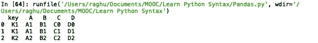

# 熊猫大师班——你的数据科学基础

> 原文：<https://medium.com/analytics-vidhya/pandas-masterclass-your-foundation-to-data-science-part-5-5e86b812f6c3?source=collection_archive---------23----------------------->

## 第 5 部分:多索引数据帧，处理 na 值和组合数据帧


**1。从数据框架中删除数据** 在 Pandas 框架中提供了两种不同的方法来删除数据。第一个是`del`关键字，另一个选项是`drop()`函数。`del`只能用来删除一列，而`drop()`功能可以根据需要删除行或列。我们将首先讨论如何在我们之前讨论的泰坦尼克号乘客数据上使用`del`,其结构如下所示，我们可以注意到它有 12 列。


显示 titanicData 数据帧第一行的内容

```
del titanicData['Cabin']
del titanicData['Embarked']
print(titanicData.head())
print(titanicData.shape)
```

使用`del`非常简单，我们必须指定我们想要一次删除数据帧中的哪一列。一旦我们运行该行代码，就对数据帧进行了更改，我们可以通过调用数据帧的`shape()`来验证这一点，它显示现在只有 10 列，因为我们已经从`titanicData`数据帧中删除了`'Cabin'`和`'Embarked'`列。


删除 2 列后的 titanicData 数据帧的结构

如前所述，`drop()`函数能够删除行和列。我们可以使用函数的`axis`参数来指示我们是否想要删除行或列。轴的默认值是`0`,表示对行的拖放操作，我们可以设置`axis = 1`表示对列的拖放操作。此外，更改不会直接反映在数据帧上，我们必须设置`inplace = True`或重新分配给数据帧以反映更改。

```
titanicData.drop(['PassengerId', 'Age'], axis = 1, inplace = True)
print(titanicData.head())
print(titanicData.shape)
```

上面的代码暗示我们希望从`titanicData`数据帧中删除`'PassengerId'`和`'Age'`列，同时提交对数据帧的更改。打印出数据帧的形状，我们可以看到列数从 10 列进一步减少到现在的 8 列。


显示实现 drop()后的 titanicData 数据帧结构和形状

我们也可以使用 drop 函数通过用索引值替换列值来删除行。首先举一个简单的例子，注意在`156`中实现 drop on rows 之前的行数。

```
titanicData.drop(0, inplace = True)
print(titanicData.shape())
```


删除 1 行后的 titanicData 数据帧的形状

我们可以删除一系列行，让我们看看如何删除索引号`1 to 9`。

```
titanicData.drop(range(1,10), inplace = True)
print(titanicData.shape())
```


删除 9 行后 titanicData 数据帧的形状

正如我们所看到的，数据帧中的行数从之前的 155 减少到了 146。

**2。设置和重置索引值** 创建数据帧时，索引值默认从`0`开始设置，并为下一行增加 1，但我们可以根据需要灵活设置任何索引值。让我们通过在现有索引值上添加字母`A`来为`titanicData`数据帧创建一个新的索引范围。这可以通过首先使用如下的列表理解从现有索引值创建新索引值的列表来容易地完成

```
newIndex = ['A'+x for x in titanicData.index]
print(newIndex)
```


列表新索引的内容

然后，我们可以在`titanicData`数据帧中创建一个新列，并将其设置为数据帧的新索引，如下所示。


数据框架中添加了新的索引列

```
titanicData['newIndex'] = newIndex
titanicData.set_index('newIndex', inplace = True)
print(titanicData.head())
```


列 newIndex 设置为 DataFrame 的索引值

如果出于某种原因，我们想要设置数据帧的默认索引值，我们可以通过使用`reset_index()`函数轻松实现。请注意，默认情况下，使用`reset_index()`函数还会将当前索引值保留为表中的一个单独列，为了避免这种情况，我们必须设置`drop = True`参数。

```
titanicData.reset_index(inplace = True) #drop = False by default
print(titanicData.head())titanicData.set_index('newIndex', inplace = True) #setting new index againtitanicData.reset_index(inplace = True, drop = True)
print(titanicData.head())
```


使用 reset_inde()，默认 drop = False，然后 drop = True

**3。使用多索引数据帧** 一个数据帧可以有多个索引，这样的数据帧索引称为多索引。使用它们会增加一层复杂性，但是一旦我们知道如何使用它们来检索必要的数据，这就非常容易了，几乎就像处理普通的数据帧一样。首先，让我们看看如何构建一个多索引数据框架。

```
outside = ['G1', 'G1', 'G1', 'G2', 'G2', 'G2']
inside = [1, 2, 3, 1, 2, 3]
arrayIndex = np.array([outside, inside])
heir_index = pd.MultiIndex.from_arrays(arrayIndex) #forming multi index from arrays
```

我们首先创建两个列表，第一个表示第一级索引值，下一个表示第二级索引值。然后，我们创建一个数组，该数组包含多对形式为`[[‘G1’ ‘G1’ ‘G1’ ‘G2’ ‘G2’ ‘G2’]
[‘1’ ‘2’ ‘3’ ‘1’ ‘2’ ‘3’]]`的索引值，然后使用`MultiIndex.from_arrays()`函数创建一个多重索引。

一旦我们准备好了多索引，我们就可以创建一个形状为`(6, 3)`的数据帧，其中填充了一些随机数和上面创建的来自`heir_index`的索引值。

```
data = np.round(np.random.rand(6,3),2)
df = pd.DataFrame(data = data, index= heir_index)
print(df)
```

我们正在生成一个大小为 6 行 2 列的嵌套列表的矩阵形式，随机数被截断到两位小数，然后创建一个多索引数据帧，如上所示。


如果需要，我们甚至可以指定索引名。

```
df.index.names = ['Outer', 'Inner']
print(df)
```


多指标标记

现在访问数据非常容易。要访问第一级(or) `'Outer'`索引，我们可以直接使用下面的`loc()`函数。

```
print(titanicData.loc['G1'])
```


调用外部索引 G1 的所有列

要调用内部索引，我们可以在一级索引上调用的现有`loc`函数之上使用`loc`函数，如下所示。

```
print(titanicData.loc['G1'].loc['2', 0:3]
```

以上数据打印`'G1'`索引的索引`'2'`，打印索引`'2'`的所有列值。


“G1”索引的索引“2”的数据

**4。在 DataFrame** 中传递 NaN 值，即使在我们处理的最完美的数据集中，我们最终也会遇到至少两个 NaN 值。了解在数据帧中清除和填充 NaN 值的基本操作是很重要的。

让我们首先创建一个非常基本的样本数据框架。

```
df = pd.DataFrame({'A':[1, 2, np.nan], 'B':[5, np.nan, np.nan], 'C':[1, 2, 3]})
df['States'] = "CA NV AZ".split()
df.set_index('States', drop = True, inplace = True)
print(df)
```


测向数据帧的内容

首先，让我们看看`dropna()`函数，它可以帮助我们删除具有`NaN`值的行或列。

要删除任何有`NaN`值的行，我们可以如下使用`dropna()`函数。

```
df.dropna(axis = 0, inplace = True) #default axis value is 0 as well
print(df)
```


删除具有 NaN 值的行的结果

在原始数据帧`df`中，我们可以看到索引`'NV'`和`'AZ'`都至少有 1 个`NaN`值，因此对行调用`dropna()`函数会删除这两个索引。

要删除具有`NaN`值的列，我们可以使用相同的语法，但是使用`axis = 1`来表示列方式操作。

```
df.dropna(axis = 1, inplace = True)
print(df)
```


删除具有 NaN 值的列的结果

让我们来看看一些有用的参数，这些参数使`dropna()`功能更强大。

`thresh`参数也表示阈值，意味着不删除至少有`thresh`个非 NaN 值的任何行/列。例如，如果我们指定`thresh = 2`，那么`dropna()`函数将不会删除任何至少有 2 个非 NaN 值的行/列。在我们的数据帧 df 中，索引`'CA'`和`'NV'`都至少有 2 个非 NaN 值，因此即使在调用了`dropna()`函数之后，这两行在最终结果中都将保持不变。

```
df.dropna(thresh = 2, inplace = True)
print(df)
```


删除具有 NaN 值且 thresh = 2 的行的结果

另一个有用的参数是`how`参数，它有两个值，或者是`'all'`或者是`'any'`。当我们选择`'all'`时，它删除所有值都为`NaN`的任何行/列，当我们选择`'any'`时，它删除至少有一个`NaN`值的任何行/列。

```
df.dropna(how="any", axis = 1, inplace = True)
print(df)
```


删除具有 NaN 值和 how = 'any '的列的结果

我们有一个有用的函数可以帮助我们填充数据帧`NaN`的值，它叫做`fillna()`。让我们从一个用`NaN`填充所有单元格的基本用例开始。

```
df.fillna("fill value", inplace = True)
print(df)
```


用“填充值”填充的 df 数据帧的所有 NaN 值

我们可以将它提升一个等级，并填充特定的列值。让我们看看如何用非 NaN 值的平均值填充`'A'`列的`NaN`值。

```
df['A'].fillna(value = df['A'].mean(), inplace = True)
print(df)
```


用非 NaN 值的平均值填充的列“A”NaN 值

我们可以进一步扩展它，用下面的代码将相同的逻辑应用于`df`数据帧的所有列。

```
for column in df.columns.values:
    df[column].fillna(value = df[column].mean(), inplace = True)
print(df)
```


所有列的 NaN 值填充了相应列的平均非 NaN 值

**5。使用 concat()函数连接数据帧** 我们在 Pandas 中有一个内置函数，可以帮助我们将任意数量的数据帧连接在一起。串联可以按行或按列发生，分别由设置为 0 或 1 的`axis`参数指示。

让我们创建三个数据帧来显示各种连接操作。

```
df1 = pd.DataFrame({'A':['A0', 'A1', 'A2', 'A3'], 'B':['B0', 'B1', 'B2', 'B3'], 'C':['C0', 'C1', 'C2', 'C3'], 'D':['D0', 'D1', 'D2', 'D3']}, index = [0, 1, 2, 3])df2 = pd.DataFrame({'A':['A4', 'A5', 'A6', 'A7'], 'B':['B4', 'B5', 'B6', 'B7'], 'C':['C4', 'C5', 'C6', 'C7'], 'D':['D4', 'D5', 'D6', 'D7']}, index = [4, 5, 6, 7])df3 = pd.DataFrame({'A':['A8', 'A9', 'A10', 'A11'], 'B':['B8', 'B9', 'B10', 'B11'], 'C':['C8', 'C9', 'C10', 'C11'], 'D':['D8', 'D9', 'D10', 'D11']}, index = [8, 9, 10, 11])print(df1)
print(df2) 
print(df3)
```


数据帧 df1、df2 和 df3 的内容

当我们不指定任何`axis`值时，缺省情况下会按行进行串联。

```
import pandas as pddfCat = pd.concat([df1, df2, df3])
print(dfCat)
```


按行连接的结果

由于我们在所有数据帧中都有相似的列名，这很容易理解，现在让我们看一下`df3`数据帧的一个小变化。如果列`'B'`被标记为`'E'`，则

```
df3 = pd.DataFrame({'A':['A8', 'A9', 'A10', 'A11'], 'B':['B8', 'B9', 'B10', 'B11'], 'C':['C8', 'C9', 'C10', 'C11'], 'D':['D8', 'D9', 'D10', 'D11']}, index = [8, 9, 10, 11])dfCat = pd.concat([df1, df2, df3])
print(dfCat)
```


逐行连接

在数据帧`df1`和`df2`中，我们没有列`'E'`，因此在结果`dfCat`中用`NaN`值填充。类似地，在数据帧`df3`中，我们没有列`'B'`，因此它在结果`dfCat`中有`NaN`值。

让我们通过在初始 DataFrame 数据上设置`axis = 1`来看看按列连接的结果。

```
dfCat = pd.concat([df1, df2, df3], axis = 1)
print(dfCat)
```


逐列连接

正如我们看到的第二个按行连接的例子，由于所有三个数据帧中的列的索引值不同，所以连接以这种方式发生。如果所有数据帧具有相似的索引值，那么`dfCat`的数据将如下所示。


当所有数据帧具有相同的索引值时，按列连接

**6。使用 merge()函数合并数据帧** Pandas 中提供的另一个有用的函数是`merge()`函数，它具有许多类似于 SQL 的`join`操作的强大功能。这是一个通过例子更容易理解的函数。

让我们创建一些样本数据框架来处理。数据帧的名称将是`left`和`right`。

```
left = pd.DataFrame({'key':['K0', 'K1', 'K2', 'K3'], 'A':['A0', 'A1', 'A2', 'A3'], 'B':['B0', 'B1', 'B2', 'B3']}, index = [0, 1, 2, 3])right = pd.DataFrame({'key':['K1', 'K1', 'K2', 'K4'], 'C':['C0', 'C1', 'C2', 'C3'], 'D':['D0', 'D1', 'D2', 'D3']}, index = [4, 5, 6, 7])
```


左右数据帧

在我们继续之前，让我们花点时间看看有哪些典型的合并操作。我们有四种不同的合并操作

I)内部——表示从两个不同的数据集中选择公共数据的内部合并
ii)外部——从两个数据集中选择所有数据，并在特定数据集中发现一些缺失数据时用`NaN`值填充
iii)左侧——选择所有左侧数据集，并在右侧数据集中缺失数据的地方填充`NaN`值
iv)右侧——选择所有右侧数据集，并在左侧数据集中缺失数据的地方填充`NaN`值。


各种合并操作的可视化表示

函数`merge()`的默认值是`inner`，但是我们可以使用`how = 'outer'`等指定其他类型的合并操作。

现在让我们深入一些例子。

```
df = pd.merge(left, right, how = 'inner', on= 'key')
print(df)
```



应用于数据帧的内部合并操作

当我们合并时，被认为实现合并操作的默认`key`将是第一列，但是使用`on = 'key'`参数我们可以指定哪一列被认为是用于合并的`key`。由于`k0`不存在于`right`数据帧中，该行在生成的数据帧中被完全省略。

假设我们在数据帧中没有相同的列名作为`key`，那么我们可以使用`left_on`和`right_on`参数来分别指示来自左表和右表的`key`值。

```
left = pd.DataFrame({'key1':['K0', 'K1', 'K2', 'K3'], 'A':['A0', 'A1', 'A2', 'A3'], 'B':['B0', 'B1', 'B2', 'B3']}, index = [0, 1, 2, 3])
right = pd.DataFrame({'key2':['K1', 'K1', 'K2', 'K4'], 'C':['C0', 'C1', 'C2', 'C3'], 'D':['D0', 'D1', 'D2', 'D3']}, index = [4, 5, 6, 7])df = pd.merge(left, right, how = 'inner', left_on = 'key1', right_on = 'key2') 
print(df)
```


在两个数据帧中使用不同关键字的合并操作

如果我们实现与`how = 'right'`的合并，我们可以看到下面的结果

```
df = pd.merge(left, right, how = 'right', on= 'key')
print(df)
```


用 how = 'right '合并运算

由于数据帧`left`没有`key`值`K4`，因此在`'A'`和`'B'`列中填充了`NaN`值。

**7。使用 join()操作** 连接数据函数`join()`与`merge()`非常相似，唯一不同的是`join()`认为操作是在`index`值上完成的，而在 merge 中我们使用`column`值作为`key`。我们可以在 join 中使用`on`参数，使其与`merge()`完全相同。

考虑以下示例数据帧来展示`join()`操作。

```
df1 = pd.DataFrame({'A':['A0', 'A1', 'A2', 'A3'], 'B':['B0', 'B1', 'B2', 'B3']}, index = ['K0', 'K1', 'K2', 'K3'])df2 = pd.DataFrame({'C':['C0', 'C1', 'C2', 'C3'], 'D':['D0', 'D1', 'D2', 'D3']}, index = ['K0', 'K2', 'K3', 'K4'])print(df1)
print(df2)
```


样本数据帧 df1 和 df2 内容

现在让我们看一些例子。

```
print(df1.join(df2))
```


df1 和 df2 上的默认联接操作

默认情况下，它在用于调用`join()`函数的数据帧`df1`上执行`left`连接。

让我们看看在`df1`和`df2`上执行`outer`连接的结果。

```
print(df1.join(df2, how = 'outer'))
```


df1 和 df2 数据帧上的外部连接

**8。对数据帧内容应用函数** Pandas 有一个名为`apply()`的函数，可以使用数据帧调用。`apply()`函数的参数是另一个函数。当我们在某些列上调用`apply()`函数时，它将列数据作为参数传递给我们在`apply()`中传递的函数，并执行函数中的语句。为了消除歧义，让我们看一些例子。

要考虑的样本数据帧

```
df = pd.DataFrame(np.array(range(100,110)), index = list(range(0,10)))
df[1] = np.array(range(200,210))
print(df)
```


数据帧 df 的内容

现在让我们定义一个简单的函数`testFunc`，它返回传递给它的`list`的总和。

```
def testFunc(x):
    return sum(x)
```

我们可以使用`apply`函数将列`'0'`和`'1'`传递给`testFunc()`，如下所示。

```
df['Sum'] = df[[0,1]].apply(testFunc, axis = 1)
print(df)
```


列“Sum”是调用 apply()函数的结果

让我们看看如何将整个列的细节传递给一个函数，以对其执行乘法运算，并将结果追加到现有的数据帧`df`。

```
def mul(x):
    return x[0] * x[1]
df['Multiply'] = df.apply(mul, axis = 1)
print(df)
```


应用结果(mul)

当我们在整个数据帧上调用`apply()`函数而没有指定哪些列必须被传递时，所有的列都将被传递给`apply()`中提到的函数。

**结论:** 虽然我已经尽了最大努力来涵盖 Pandas 中尽可能多的功能和用例，但这仍然是一个未涉及的详尽列表。我已经尽了最大努力来确保一个人能够学到足够的知识，如果情况需要学习更多知识的话，可以开始对熊猫的进一步探索。

如果你想让我包含更多关于熊猫的话题，请给我写关于 raghupro@gmail.com 的信。祝你好运！

**系列各部分:**
[Pandas master class——你的数据科学基础(第 1 部分:基本数据帧操作)](/analytics-vidhya/pandas-masterclass-your-foundation-to-data-science-part-1-136474104d57)
[Pandas master class——你的数据科学基础(第 2 部分:特殊文件格式的数据帧操作)](/@raghupro/pandas-masterclass-your-foundation-to-data-science-part-2-e0abda580cc3)
[Pandas master class——你的数据科学基础(第 3 部分:排序、 过滤和分组数据帧数据并写入文件)](/@raghupro/pandas-masterclass-your-foundation-to-data-science-part-3-220cd683540e)
[Pandas master class—您的数据科学基础(第 4 部分:Pandas 功能)](/@raghupro/pandas-masterclass-your-foundation-to-data-science-part-4-736a233b0b70)
[Pandas master class—您的数据科学基础(第 5 部分:多索引数据帧、处理 na 值和组合数据帧)](/@raghupro/pandas-masterclass-your-foundation-to-data-science-part-5-5e86b812f6c3)