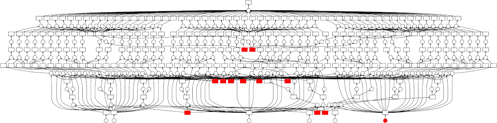
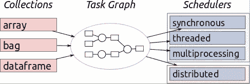

# 服用类固醇的熊猫:Dask-使用 python 代码的端到端数据科学

> 原文：<https://medium.com/analytics-vidhya/pandas-on-steroids-dask-end-to-end-data-science-with-python-code-1845d3722c8a?source=collection_archive---------7----------------------->

## 端到端并行数据科学从读取大数据到数据操作到可视化再到机器学习

拥有超能力的熊猫

俗话说，一个数据科学家 90%的时间花在清理数据上，10%的时间花在抱怨数据上。他们的抱怨可能包括数据大小、错误的数据分布、空值、数据随机性、数据捕获中的系统错误、训练集和测试集之间的差异等等。

一个常见的瓶颈主题是数据规模巨大，要么数据不适合内存，要么处理时间太长(大约几分钟),以至于固有的模式分析变得毫无意义。数据科学家天生就是好奇的人，他们想要识别和解释通常隐藏在粗略的拖放浏览中的模式。他们需要身兼数职，通过反复折磨(读取迭代)让数据招供😂)

在探索性数据分析过程中，他们身兼数职，从纽约出租车费用数据集([https://www.kaggle.com/c/new-york-city-taxi-fare-prediction](https://www.kaggle.com/c/new-york-city-taxi-fare-prediction))-ID、费用、行程时间、乘客和位置的 6 列最小数据集中，他们的问题可能包括:

> 1.票价如何逐年变化？
> 
> 2.这些年来旅行的次数增加了吗？
> 
> 3.人们喜欢独自旅行还是有人陪伴？
> 
> 4.随着人们变得更加懒惰，小距离骑行增加了吗？
> 
> 5.人们想在一天中的什么时间和一周中的哪一天去旅行？
> 
> 6.除了常规的机场接送外，最近这个城市是否出现了新的热点？
> 
> 7.人们是否在进行更多的城市间旅行？
> 
> 8.交通流量的增加是否会导致相同距离的更多费用/时间？
> 
> 9.是否有大量的接送点或交通繁忙的区域？
> 
> 10.数据中是否存在异常值，例如 0 距离和 100 美元以上的票价等等？
> 
> 11.假期和机场旅行期间的需求变化会增加吗？
> 
> 12.天气(如下雨或下雪)与出租车需求有关联吗？

即使回答了这些问题，也可能出现多个子线索，即我们能否预测 Covid 如何影响新年，每年的纽约马拉松如何改变出租车需求，特定路线是否更倾向于多名乘客(派对中心)与单名乘客(机场到郊区)。

为了消除这些好奇心，时间是至关重要的，让数据科学家等待 5 分钟以上来读取 csv 文件(55 Mn 行)或进行列添加，然后进行聚合是一种犯罪。此外，由于大多数数据科学家都是自学的，他们已经非常习惯于 pandas 数据框架 API，所以他们不会想要使用不同的 API(如 numba、Spark 或 datatable)重新开始学习过程。我尝试过在 DPLYR(R)、Pandas(Python)和 pyspark(Spark)之间周旋，考虑到需要统一的管道和代码语法，这有点令人失望/徒劳。不过，对于好奇的乡亲们，我在这里写了一个 pyspark 入门指南:[https://medium . com/@ ravish ankar _ 22148/billion-of-rows-milliseconds-time-pyspark-starter-guide-c1f 984023 bf2](/@ravishankar_22148/billions-of-rows-milliseconds-of-time-pyspark-starter-guide-c1f984023bf2)

在接下来的章节中，我试图提供一个关于 Dask 的实际操作指南，对我们心爱的熊猫做最小的建筑改动:

1.  数据读取和分析

达斯克 vs 熊猫速度

Dask 是如何将数据处理速度提高 90 倍的，例如熊猫的数据处理速度从 1 秒提高到 91 秒。

【https://dask.org/】来源:

*Dask 之所以如此受欢迎，是因为它使 Python 中的分析具有可伸缩性，并且不需要在 SQL、Scala 和 Python 之间来回切换。神奇的是，这个工具只需要最少的代码修改。它将计算分解成 pandas 数据帧，从而并行操作以实现快速计算。*

**

**来源:*[*https://docs.dask.org/en/latest/*](https://docs.dask.org/en/latest/)*

*2.数据聚合:*

*请注意，Pandas API 完全没有变化，它能够在几毫秒内执行聚合和排序。**计算()**懒惰计算结束时的函数，该函数将大数据的结果存储在 Pandas 数据帧中。*

*3.机器学习:*

*下面的代码片段提供了一个使用 XGBoost 在 Dask 中构建特性工程和 ML 模型的工作示例*

*基于 Dask 的特征工程和 ML 模型*

***结论:***

*Dask 是一个强大的工具，提供并行计算、大数据处理和创建端到端的数据科学管道。它有一个陡峭的学习曲线，因为 API 几乎类似于熊猫，它可以轻松处理内存不足的计算(大约 10 倍的 RAM)。*

*因为这是一个活的博客，我将在 Dask 系列中写下后续部分，我们将使用并行处理针对 Kaggle 排行榜。如果您在设置 Dask 时遇到任何问题，或者无法执行任何 Dask 操作，甚至是一般的聊天，请在评论中告诉我。快乐学习！！！*

*来源:*

1.  *[https://ml.dask.org/](https://ml.dask.org/)*
2.  *https://dask.org/*
3.  *[https://medium . com/@ ravish ankar _ 22148/billion-of-rows-milliseconds-time-py spark-starter-guide-c1f 984023 BF 2](/@ravishankar_22148/billions-of-rows-milliseconds-of-time-pyspark-starter-guide-c1f984023bf2)*
4.  *[https://towards data science . com/how-I-learn-to-love-parallelised-apply-with-python-pandas k-and-numba-f 06 b0b 367138](https://towardsdatascience.com/how-i-learned-to-love-parallelized-applies-with-python-pandas-dask-and-numba-f06b0b367138)*
5.  *[https://www . ka ggle . com/yuliagm/how-to-work-with-big-datasets-on-16g-ram-dask](https://www.kaggle.com/yuliagm/how-to-work-with-big-datasets-on-16g-ram-dask)*
6.  *[https://medium . com/better-programming/what-is-dask-and-how-it-can-help you-a-data-scientist-72 adec 7 CEC 57](/better-programming/what-is-dask-and-how-can-it-help-you-as-a-data-scientist-72adec7cec57)*