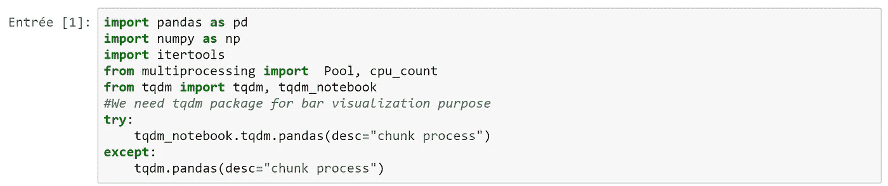
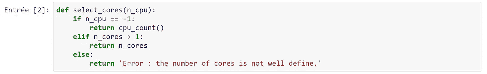
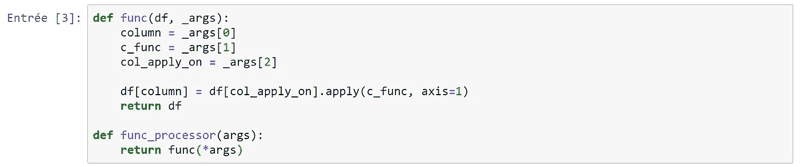
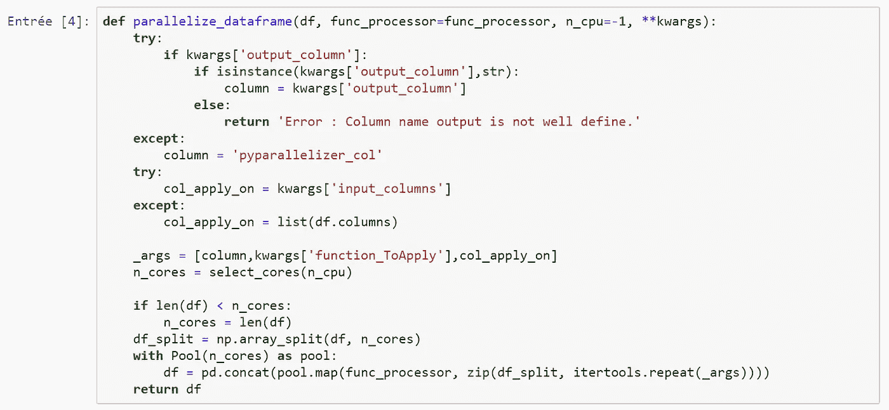
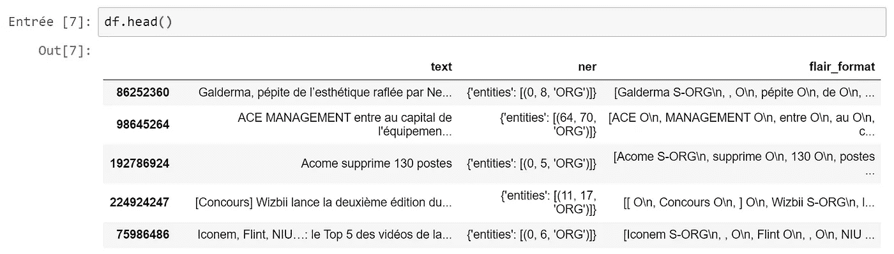
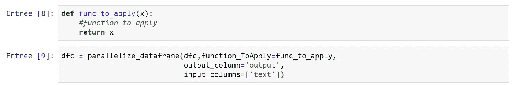
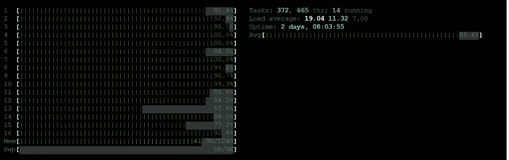

# 熊猫并行加速进程

> 原文：<https://medium.com/analytics-vidhya/pandas-parallelize-speed-up-process-2b086508baf9?source=collection_archive---------15----------------------->

当我们处理数据(无论大小)时，我们会遇到加快处理速度的问题。

为了解决这个问题，我们可以使用几个软件包:

*   熊猫申请(原生)
*   下前支索
*   达斯克

你可以在这里 了解更多关于那些套餐[**。尽管这些包的使用相对简单，但使用时的性能并不能推广到所有类型的数据(例如文本数据)。如果我们有了一台大机器(AWS**](https://gdcoder.com/speed-up-pandas-apply-function-using-dask-or-swifter-tutorial/) **[EC2 instance](https://aws.amazon.com/fr/ec2/pricing/on-demand/) ，Google……)，我们就不能使用所有的计算能力来处理你的数据，我们很快就会感到沮丧。**

本教程的目标是构建一个**并行化函数**，旨在利用机器的全部可能性来处理数据。我们将重点关注 pandas 和 for 循环并行化过程。

为此，我们将使用 python **多处理**池包。

## **1。什么是多重处理**

多重处理包允许程序员在给定的机器上充分利用多个处理器。它可以在 Unix 和 Windows 上运行。我们将主要使用池类，表示一个工作进程池。它有允许任务以几种不同的方式卸载到工作进程的方法。

多处理是一个 [**Pypi**](https://pypi.org/project/multiprocessing/) 包，安装起来非常容易。

## **2。如何使用多重处理进行并行化**

假设我们有一个非常大的 pandas 数据框架，我们需要在一个或多个列上计算并行化。(可以在 [**Github**](https://github.com/isaac47/dataframe-pyrallelizer) 上找到完整的脚本)。

我们将首先构建一个函数来选择要使用的 cpu 数量。

这个函数帮助我们选择所有可用的 CPU 或者设置我们想要使用的 CPU 数量。

接下来，我们将定义应用构造函数的函数。

函数定义了每一行的 pandas 应用过程。“ **func_processor** ”帮助我们获取多个参数。

接下来，我们将在前面函数的基础上构建数据帧并行化函数。

该函数将定义保持并行化过程。我们将首先获得所有的输入和输出参数；然后我们会定义 CPUto 的使用次数；最后，我们将根据我们选择的 CPU 数量将大数据帧分割成多个块，并同时应用每个块的映射过程。

为了使用这个函数，让我们举这个例子:

接下来，我们定义应用和运行流程的函数。

这就是结果(在 EC2 Aws 机器上)

正如你所看到的，我们同时使用所有的 CPU 和必要的内存。

**警告**:当我们使用多进程池时，它会不断地动态创建线程；那会填满内存，搞坏机器。为了解决这个问题，你可以通过激活**交换内存**来扩展内存(你可以在这里 阅读更多[)。您还可以设置线程的最大数量(这可能会限制函数的功能)。解决这个问题的最后一个方法是管理内存使用。这个任务可能很强，因为 Python 默认不提供对内存管理的访问(像 C 语言一样)。](/@isaackuissu/swap-space-ram-memory-extension-c7d371bdc2f0)

我在我的**pyparalizer**包中设计了一个实现这个任务的方法，你可以在这里 找到它[。这个包在 for 循环并行化的情况下也有帮助。](https://github.com/isaac47/pyparallelizer)

## **结论**

当我们处理大量数据时，我们会遇到速度处理问题。这个函数将帮助我们并行化我们的过程，我们可以通过这样做赢得几个小时。如果你像我一样厌倦了做“**数据等待**”，那就开始并行化吧。

## 不要做数据等待，开始编码！