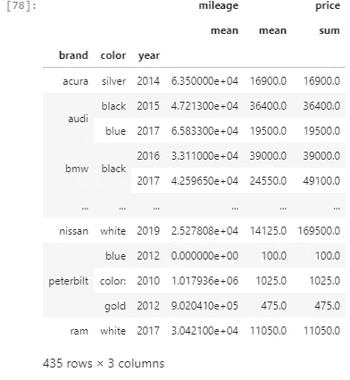

# 如何在熊猫中使用 pivot_table()并举例说明

> 原文：<https://medium.com/analytics-vidhya/pandas-pivot-table-with-examples-c174501fa9a1?source=collection_archive---------0----------------------->

## 你所需要知道的关于 pivot_table()在熊猫中的例子


在本文中，我们将通过示例学习如何在 Pandas 中使用 pivot_table()。根据熊猫官方文件。

# [透视表](https://pandas.pydata.org/pandas-docs/stable/reference/api/pandas.pivot_table.html):

”创建电子表格样式的数据透视表作为数据框架”。

数据透视表中的级别将存储在结果数据帧的索引和列上的多索引对象(分层索引)中。

它以表格形式比较输入要素/数据列。让我们来看一些例子，以便更好地理解。还有其他方法可以获得类似的结果，比如我下一篇文章中讨论的 Pandas Crosstab，但是现在，我们将使用 Kaggle 中的 Cars 数据集。

# 导入熊猫并加载数据

```
import pandas as pd
import numpy as np
data = pd.read_csv('USA_cars_datasets.csv')
```

如果你想跟进，请点击这里从[下载数据集。](https://www.kaggle.com/doaaalsenani/usa-cers-dataset)

```
data.head()
```


让我们只获取对我们有意义的几列，因为目的不是完全理解数据集。

```
data.columns
```


```
cols=['price', 'brand', 'model', 'year', 'title_status','mileage', 'color','state', 'country']data = data[cols]
data.head()
```


数据集和索引是创建简单数据透视表所必需的。让我们用品牌作为我们的指标。

```
pd.pivot_table(data, index='brand')
```


用这一行代码，它计算了所有数字列的平均值。它在计算一年的平均值，这没有任何意义，让我们暂时忽略它。

我们也可以通过在 aggfunc 中显式指定 mean 函数来获得相同的结果。

```
pd.pivot_table(data, index='brand',aggfunc='mean').head(10)
```


我们可以将其他内置函数传递给 aggfunc 或自定义函数，让我们试试我们的自定义函数。

```
def average_cars(price):
    return np.mean(price)pd.pivot_table(data, index='brand', values='price', aggfunc=[sum,average_cars]).head(10)
```


我们只是返回平均值，但这里的想法是，你可以传递任何函数，返回一个基于你的自定义逻辑的聚合结果。

我们可以通过一个列表在多个列上创建一个索引。

```
pd.pivot_table(data, index=['brand', 'color'], values='price', aggfunc='sum').head(10)
```


让我们来验证一下我们的结果

```
data[(data['brand']=='acura') ]
```


仅仅通过改变顺序，我们得到不同的统计数据。我们可以有一个想法，我们可以实现数据透视表。

如果我们想看总数。让我们按差额来做。

```
pd.pivot_table(data,
               index=['year','brand'],
               values=['price'],
               aggfunc='sum',
               fill_value=0,
               margins=True,
               margins_name='Total')
```


我们可以向 aggfunc 传递一个列表，其中包含一个函数列表，这些函数将应用于值中的列。

```
pd.pivot_table(data, index=['year','brand'],
               values=['price'],
               aggfunc=[np.sum,np.mean],
               fill_value=0,
               margins=True,
               margins_name='Total')
```


我们还可以向 aggfunc 传递一个字典来对值执行不同的函数。

```
pd.pivot_table(data, 
               index=['brand', 'color','year'], 
               values=['price','mileage'], 
               aggfunc={'price':np.sum,'mileage':np.mean}).head(10)
```


# 高级过滤

我们还可以在 values 中的特定列上传递要执行的函数列表。我们可以在一个数据框中获得上面显示的聚合数据，并执行 pandas 数据框操作来简化过滤。确保移除。head(10)在最后获得全部数据。

```
p_table = pd.pivot_table(data, 
               index=['brand', 'color','year'], 
               values=['price','mileage'], 
               aggfunc={'price':[np.sum,np.mean],'mileage':np.mean})
```

现在我们可以在数据帧上执行标准的熊猫过滤操作

```
p_table.query('color=="black"')
```


```
p_table.query('year > 2009')
```



记住品牌、颜色和年份是多重指数的一部分

```
p_table.index
```


如果索引值是像洲名的国家名称这样的大字符串，例如**‘美利坚合众国’**，那么我们可以像这样应用包含操作。这里我们有一个品牌在**级别 0** 颜色在**级别 1** 和年份在**级别 2**

```
p_table[p_table.index.get_level_values(0).str.contains('audi')]
```


这里 **get_level_values(level)** 将级别作为输入和返回列表或数组，然后在将其转换为字符串后，我们可以应用简单的包含在我们的美国示例中，我们将编写类似这样的内容**p _ table . index . get_level_values(0). str . contains(' Audi ')**只需在 get _ level _ values()中放置适当的级别

如果我们想基于列进行选择

```
p_table[p_table[('mileage', 'mean')]>170000]
```

或者简单地通过。点符号

```
p_table[p_table.mileage.values>170000]
```

两者返回相同的结果


# 结论:

在本文中，我试图解释 pivot_table 的用法，以及我们如何使用它通过简单的操作进行高级过滤来聚合数据。如果我们必须对数据集执行高级分析，首先尝试将数据集分成更小的单元，在另一个数据集中获取这些单元，然后对其应用过滤。另一个有用的方法是熊猫交叉表，我将在另一篇文章中解释。完整的笔记本可以在 [GitHub](https://github.com/muhammad055/DSArticles/blob/master/Pandas/Pandas%20crosstab%20and%20Pivot%20table.ipynb) 上找到。