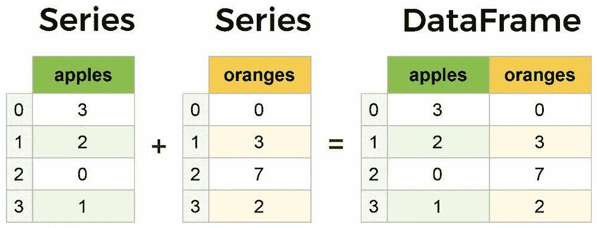
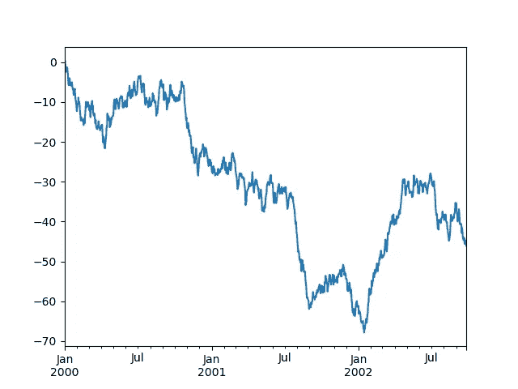
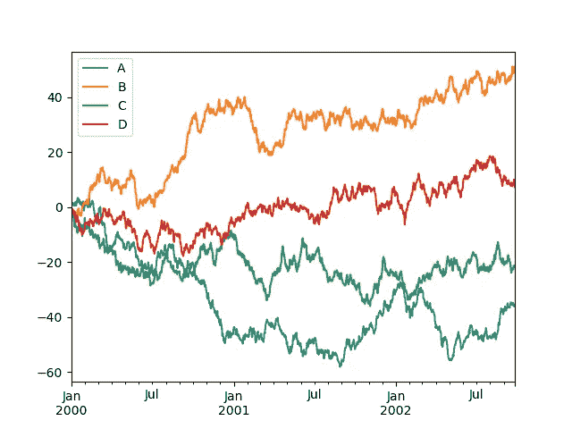

# 熊猫:强大的 Python 数据分析工具包

> 原文：<https://medium.com/analytics-vidhya/pandas-powerful-python-data-analysis-toolkit-359157dca8a9?source=collection_archive---------20----------------------->


# 熊猫是什么？


Python Pandas Dataframe 不仅仅是一个数组数据结构。Pandas 是一个强大的工具，可以让您:

*   将 JSON、CSV、数组、字典和其他数据转换为行和列格式。
*   使用名称而不是索引来处理它们(您仍然可以选择索引)

简而言之，Pandas 有点像电子表格，但它是一个使用代码而不是 Microsoft Excel 进行工作的电子表格。最大的好处:

*   Pandas 使极其复杂的数据转换变得简单而自然。
*   它包括大量的数学、分析和其他功能。

**入门**

这是对熊猫的简短介绍，主要面向新用户。

通常，我们导入如下内容:

```
**In [1]: import** **numpy** **as** **np****In [2]: import** **pandas** **as** **pd**
```

通过传递一个值列表来创建一个**序列**，让 pandas 创建一个默认的整数索引:

```
**In [3]:** s = pd.Series([1, 3, 5, np.nan, 6, 8])**In [4]:** s
**Out[4]:** 
0    1.0
1    3.0
2    5.0
3    NaN
4    6.0
5    8.0
dtype: float64
```

通过传递一个可以转换成类似系列的对象的**字典**来创建一个**数据框架**。

```
**In [9]:** df2 = pd.DataFrame(
 **...:**    {
 **...:**        "A": 1.0,
 **...:**        "B": pd.Timestamp("20130102"),
 **...:**        "C": pd.Series(1, index=list(range(4)), dtype="float32"),
 **...:**        "D": np.array([3] * 4, dtype="int32"),
 **...:**        "E": pd.Categorical(["test", "train", "test", "train"]),
 **...:**        "F": "foo",
 **...:**    }
 **...:** )
 **...:** **In [10]:** df2
**Out[10]:** 
     A          B    C  D      E    F
0  1.0 2013-01-02  1.0  3   test  foo
1  1.0 2013-01-02  1.0  3  train  foo
2  1.0 2013-01-02  1.0  3   test  foo
3  1.0 2013-01-02  1.0  3  train  foo
```



系列和数据框架

**查看数据:**

下面是如何查看框架的**顶排**和**底排**:

```
**In [13]:** df.head()
**Out[13]:** 
                   A         B         C         D
2013-01-01  0.469112 -0.282863 -1.509059 -1.135632
2013-01-02  1.212112 -0.173215  0.119209 -1.044236
2013-01-03 -0.861849 -2.104569 -0.494929  1.071804
2013-01-04  0.721555 -0.706771 -1.039575  0.271860
2013-01-05 -0.424972  0.567020  0.276232 -1.087401**In [14]:** df.tail(3)
**Out[14]:** 
                   A         B         C         D
2013-01-04  0.721555 -0.706771 -1.039575  0.271860
2013-01-05 -0.424972  0.567020  0.276232 -1.087401
2013-01-06 -0.673690  0.113648 -1.478427  0.524988
```

显示**索引，列**:

```
**In [15]:** df.index
**Out[15]:** 
DatetimeIndex(['2013-01-01', '2013-01-02', '2013-01-03', '2013-01-04',
               '2013-01-05', '2013-01-06'],
              dtype='datetime64[ns]', freq='D')**In [16]:** df.columns
**Out[16]:** Index(['A', 'B', 'C', 'D'], dtype='object')
```

***describe()*** 显示您的数据的快速统计汇总:

```
**In [19]:** df.describe()
**Out[19]:** 
              A         B         C         D
count  6.000000  6.000000  6.000000  6.000000
mean   0.073711 -0.431125 -0.687758 -0.233103
std    0.843157  0.922818  0.779887  0.973118
min   -0.861849 -2.104569 -1.509059 -1.135632
25%   -0.611510 -0.600794 -1.368714 -1.076610
50%    0.022070 -0.228039 -0.767252 -0.386188
75%    0.658444  0.041933 -0.034326  0.461706
max    1.212112  0.567020  0.276232  1.071804
```

***通过**轴**分拣*** :

```
**In [21]:** df.sort_index(axis=1, ascending=**False**)
**Out[21]:** 
                   D         C         B         A
2013-01-01 -1.135632 -1.509059 -0.282863  0.469112
2013-01-02 -1.044236  0.119209 -0.173215  1.212112
2013-01-03  1.071804 -0.494929 -2.104569 -0.861849
2013-01-04  0.271860 -1.039575 -0.706771  0.721555
2013-01-05 -1.087401  0.276232  0.567020 -0.424972
2013-01-06  0.524988 -1.478427  0.113648 -0.673690
```

***按**值**排序*** :

```
**In [22]:** df.sort_values(by="B")
**Out[22]:** 
                   A         B         C         D
2013-01-03 -0.861849 -2.104569 -0.494929  1.071804
2013-01-04  0.721555 -0.706771 -1.039575  0.271860
2013-01-01  0.469112 -0.282863 -1.509059 -1.135632
2013-01-02  1.212112 -0.173215  0.119209 -1.044236
2013-01-06 -0.673690  0.113648 -1.478427  0.524988
2013-01-05 -0.424972  0.567020  0.276232 -1.087401
```

**数据的选择:**

虽然用于选择和设置的标准 Python / Numpy 表达式很直观，并且对于交互式工作很方便，但是对于生产代码，我们推荐优化的 pandas 数据访问方法，`.at`、`.iat`、`.loc`和`.iloc`。

选择单个列，产生一个`[**Series**](https://pandas.pydata.org/pandas-docs/stable/reference/api/pandas.Series.html#pandas.Series)`，相当于`df.A`:

```
**In [23]:** df["A"]
**Out[23]:** 
2013-01-01    0.469112
2013-01-02    1.212112
2013-01-03   -0.861849
2013-01-04    0.721555
2013-01-05   -0.424972
2013-01-06   -0.673690
Freq: D, Name: A, dtype: float64
```

***通过*** `[]`选择，切割**行**。

```
**In [24]:** df[0:3]
**Out[24]:** 
                   A         B         C         D
2013-01-01  0.469112 -0.282863 -1.509059 -1.135632
2013-01-02  1.212112 -0.173215  0.119209 -1.044236
2013-01-03 -0.861849 -2.104569 -0.494929  1.071804**In [25]:** df["20130102":"20130104"]
**Out[25]:** 
                   A         B         C         D
2013-01-02  1.212112 -0.173215  0.119209 -1.044236
2013-01-03 -0.861849 -2.104569 -0.494929  1.071804
2013-01-04  0.721555 -0.706771 -1.039575  0.271860
```

通过标签在**多轴上选择:**

```
**In [27]:** df.loc[:, ["A", "B"]]
**Out[27]:** 
                   A         B
2013-01-01  0.469112 -0.282863
2013-01-02  1.212112 -0.173215
2013-01-03 -0.861849 -2.104569
2013-01-04  0.721555 -0.706771
2013-01-05 -0.424972  0.567020
2013-01-06 -0.673690  0.113648
```

**按位置选择:**

通过传递的整数的位置进行选择:

```
**In [32]:** df.iloc[3]
**Out[32]:** 
A    0.721555
B   -0.706771
C   -1.039575
D    0.271860
Name: 2013-01-04 00:00:00, dtype: float64
```

通过整数切片，类似于 numpy/Python:

```
**In [33]:** df.iloc[3:5, 0:2]
**Out[33]:** 
                   A         B
2013-01-04  0.721555 -0.706771
2013-01-05 -0.424972  0.567020
```

# 缺失数据:


> pandas 主要使用值`np.nan`来表示缺失的数据。默认情况下，它不包括在计算中。

重新索引允许您更改/添加/删除指定轴上的索引。这将返回数据的副本。

```
**In [55]:** df1 = df.reindex(index=dates[0:4], columns=list(df.columns) + ["E"])**In [56]:** df1.loc[dates[0] : dates[1], "E"] = 1**In [57]:** df1
**Out[57]:** 
                   A         B         C  D    F    E
2013-01-01  0.000000  0.000000 -1.509059  5  NaN  1.0
2013-01-02  1.212112 -0.173215  0.119209  5  1.0  1.0
2013-01-03 -0.861849 -2.104569 -0.494929  5  2.0  NaN
2013-01-04  0.721555 -0.706771 -1.039575  5  3.0  NaN
```

删除任何缺少数据的行。

```
**In [58]:** df1.dropna(how="any")
**Out[58]:** 
                   A         B         C  D    F    E
2013-01-02  1.212112 -0.173215  0.119209  5  1.0  1.0
```

填补缺失数据。

```
**In [59]:** df1.fillna(value=5)
**Out[59]:** 
                   A         B         C  D    F    E
2013-01-01  0.000000  0.000000 -1.509059  5  5.0  1.0
2013-01-02  1.212112 -0.173215  0.119209  5  1.0  1.0
2013-01-03 -0.861849 -2.104569 -0.494929  5  2.0  5.0
2013-01-04  0.721555 -0.706771 -1.039575  5  3.0  5.0
```

获取值为`nan`的布尔掩码。

```
**In [60]:** pd.isna(df1)
**Out[60]:** 
                A      B      C      D      F      E
2013-01-01  False  False  False  False   True  False
2013-01-02  False  False  False  False  False  False
2013-01-03  False  False  False  False  False   True
2013-01-04  False  False  False  False  False   True
```

# 绘图:

> 我们使用标准惯例来引用 matplotlib API:

```
**In [131]: import** **matplotlib.pyplot** **as** **plt****In [132]:** plt.close("all")**In [133]:** ts = pd.Series(np.random.randn(1000), index=pd.date_range("1/1/2000", periods=1000))**In [134]:** ts = ts.cumsum()**In [135]:** ts.plot()
**Out[135]:** <AxesSubplot:>
```



在数据帧上，`[**plot()**](https://pandas.pydata.org/pandas-docs/stable/reference/api/pandas.DataFrame.plot.html#pandas.DataFrame.plot)`方法可以方便地绘制所有带标签的列:

```
**In [136]:** df = pd.DataFrame(
 **.....:**    np.random.randn(1000, 4), index=ts.index, columns=["A", "B", "C", "D"]
 **.....:** )
 **.....:** **In [137]:** df = df.cumsum()**In [138]:** plt.figure()
**Out[138]:** <Figure size 640x480 with 0 Axes>**In [139]:** df.plot()
**Out[139]:** <AxesSubplot:>**In [140]:** plt.legend(loc='best')
**Out[140]:** <matplotlib.legend.Legend at 0x7fa9468dc220>
```



# 获取数据输入/输出

# CSV:

```
**In [141]:** df.to_csv("foo.csv")
```

[从 csv 文件中读取。](https://pandas.pydata.org/pandas-docs/stable/user_guide/io.html#io-read-csv-table)

```
**In [142]:** pd.read_csv("foo.csv")
**Out[142]:** 
     Unnamed: 0          A          B          C          D
0    2000-01-01   0.350262   0.843315   1.798556   0.782234
1    2000-01-02  -0.586873   0.034907   1.923792  -0.562651
2    2000-01-03  -1.245477  -0.963406   2.269575  -1.612566
3    2000-01-04  -0.252830  -0.498066   3.176886  -1.275581
4    2000-01-05  -1.044057   0.118042   2.768571   0.386039
..          ...        ...        ...        ...        ...
995  2002-09-22 -48.017654  31.474551  69.146374 -47.541670
996  2002-09-23 -47.207912  32.627390  68.505254 -48.828331
997  2002-09-24 -48.907133  31.990402  67.310924 -49.391051
998  2002-09-25 -50.146062  33.716770  67.717434 -49.037577
999  2002-09-26 -49.724318  33.479952  68.108014 -48.822030[1000 rows x 5 columns]
```

# HDF5:

写入 HDF5 存储。

```
**In [143]:** df.to_hdf("foo.h5", "df")
```

从 HDF5 商店读取。

```
**In [144]:** pd.read_hdf("foo.h5", "df")
**Out[144]:** 
                    A          B          C          D
2000-01-01   0.350262   0.843315   1.798556   0.782234
2000-01-02  -0.586873   0.034907   1.923792  -0.562651
2000-01-03  -1.245477  -0.963406   2.269575  -1.612566
2000-01-04  -0.252830  -0.498066   3.176886  -1.275581
2000-01-05  -1.044057   0.118042   2.768571   0.386039
...               ...        ...        ...        ...
2002-09-22 -48.017654  31.474551  69.146374 -47.541670
2002-09-23 -47.207912  32.627390  68.505254 -48.828331
2002-09-24 -48.907133  31.990402  67.310924 -49.391051
2002-09-25 -50.146062  33.716770  67.717434 -49.037577
2002-09-26 -49.724318  33.479952  68.108014 -48.822030[1000 rows x 4 columns]
```

# Excel:

写入 excel 文件。

```
**In [145]:** df.to_excel("foo.xlsx", sheet_name="Sheet1")
```

从 excel 文件中读取。

```
**In [146]:** pd.read_excel("foo.xlsx", "Sheet1", index_col=**None**, na_values=["NA"])
**Out[146]:** 
    Unnamed: 0          A          B          C          D
0   2000-01-01   0.350262   0.843315   1.798556   0.782234
1   2000-01-02  -0.586873   0.034907   1.923792  -0.562651
2   2000-01-03  -1.245477  -0.963406   2.269575  -1.612566
3   2000-01-04  -0.252830  -0.498066   3.176886  -1.275581
4   2000-01-05  -1.044057   0.118042   2.768571   0.386039
..         ...        ...        ...        ...        ...
995 2002-09-22 -48.017654  31.474551  69.146374 -47.541670
996 2002-09-23 -47.207912  32.627390  68.505254 -48.828331
997 2002-09-24 -48.907133  31.990402  67.310924 -49.391051
998 2002-09-25 -50.146062  33.716770  67.717434 -49.037577
999 2002-09-26 -49.724318  33.479952  68.108014 -48.822030[1000 rows x 5 columns]
```

**总结…**

在本文中，我们讨论了 Pandas 的基础知识，包括创建数据框、处理缺失值和数据检索方法。据说数据科学家 80%的工作是数据处理和操作。所以，如果你选择用 python 来完成你的 ML 项目，了解熊猫是如何工作的是非常重要的。