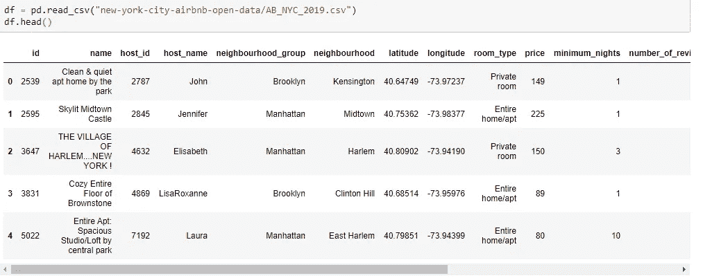
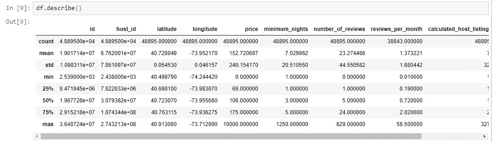
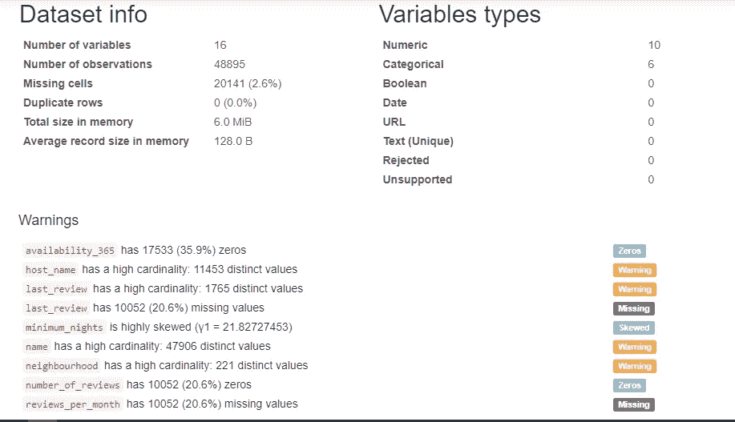
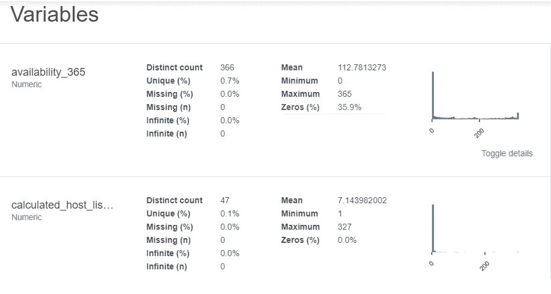
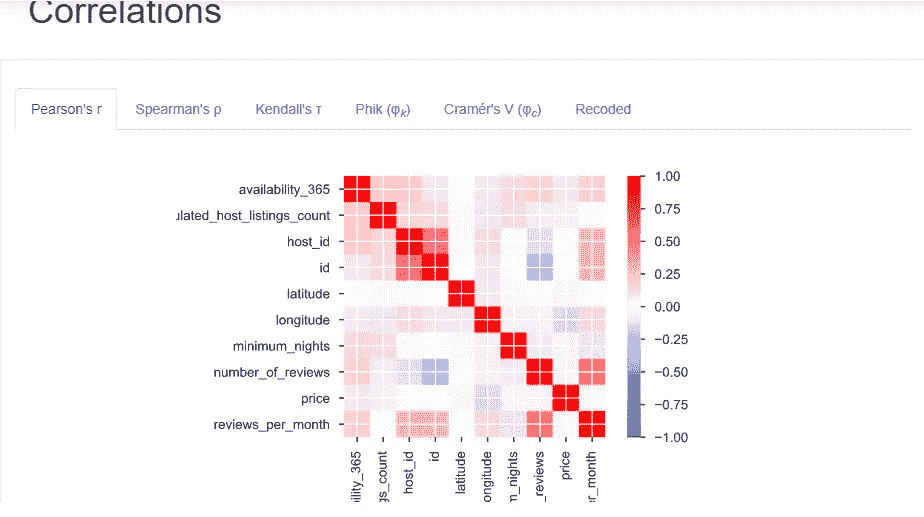

# 熊猫简介

> 原文：<https://medium.com/analytics-vidhya/pandas-profiling-5ecd0b977ecd?source=collection_archive---------1----------------------->


在 [Unsplash](https://unsplash.com?utm_source=medium&utm_medium=referral) 上由 [Carlos Muza](https://unsplash.com/@kmuza?utm_source=medium&utm_medium=referral) 拍摄的照片

[](https://pypi.org/project/pandas-profiling/) [## 熊猫-侧写

### 从 pandas 数据框架生成配置文件报告。pandas 的 df.describe()函数很棒，但对…来说有点基础

pypi.org](https://pypi.org/project/pandas-profiling/) 

如果你是一个熟悉数据科学的人，我可以自信地说你一定已经意识到了 EDA 的强大。这是我自己做的第一次数据分析，当然，我受到了我在互联网上关注的其他数据科学家的影响。到目前为止，我广泛使用了**熊猫**和 **Matplotlib** 。 **Pandas** 用于数据操作，而 **Matplotlib** ，嗯，用于绘制图形。

这个可爱的(*现在是 22 摄氏度，加尔各答的局部多云*)周日早晨，是我的消遣。在过去的几周里，我一直专注于我的新欢 Azure 数据工厂——数据湖项目。然而，最近，我遇到了这个神奇的包，因为它已经成为快速分析大型数据集的必要工具。说够了。让我们开始吧。

让我们看一个例子。让我们深入探究*纽约市 Airbnb 开放数据——美国纽约市 Airbnb 房源和指标(2019)。我没有开玩笑，这是目前 Kaggle 上最热门的趋势数据集。*

 [## 数据集| Kaggle

### 下载数千个项目的开放数据集+在一个平台上共享项目。探索热门话题，如政府…

www.kaggle.com](https://www.kaggle.com/datasets) 

让我们从同样的熊猫面包和黄油开始。

```
import pandas as pd
df = pd.read_csv("new-york-city-airbnb-open-data/AB_NYC_2019.csv")
df.head()
```



```
df.describe()
```



虽然上面的输出包含大量信息，但它并没有告诉您您可能感兴趣的所有内容。

## 熊猫-侧写

```
pip install pandas-profiling
import pandas_profiling
```

您需要运行这个一行程序来一次性分析整个数据集。超级容易！

```
df.profile_report(style={‘full_width’:True})
```



对于每个变量—



而且，很容易得到快速的关联—



或者你可以把它导出到一个 HTML 报告中—

```
profile = df.profile_report(title=’Pandas Profiling Report’)
profile.to_file(output_file=”Pandas Profiling Report — AirBNB .html”)
```

这里是[笔记本](https://nbviewer.jupyter.org/gist/kuharan/36e6cb4bd9004cbda214dd2ee17bff3e)的链接，它包含了我在这个演示中使用的全部代码。直到下一次，继续侧写！

# 一些主要更新:

自从我写这篇文章以来，熊猫概况一直在不断发展。有一些主要的更新:

```
from pandas_profiling import ProfileReport
profile = ProfileReport(df, title="Pandas Profiling Report")
```

## 深入探索

您可以按照自己喜欢的任何方式配置配置文件报告。

```
profile = ProfileReport(df, title='Pandas Profiling Report', explorative=True)
```

## Jupyter 小部件或 Iframe

```
profile.to_widgets()
profile.to_notebook_iframe()
```

## 保存报告

```
# As a string
json_data = profile.to_json()

# As a file
profile.to_file("your_report.json")
```

## 大型数据集

这是最有趣的更新之一。我们经常需要处理大型数据集，这就是答案。版本 2.4 引入了最小模式。这是一个默认配置，禁用昂贵的计算(如相关性和动态宁滨)。使用以下语法:

```
profile = ProfileReport(large_dataset, minimal=True)
profile.to_file("output.html")
```

## 高级设置

```
profile = df.profile_report(title='Pandas Profiling Report', plot={'histogram': {'bins': 8}})
profile.to_file("output.html")
```