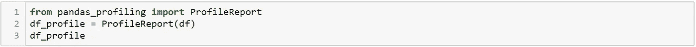
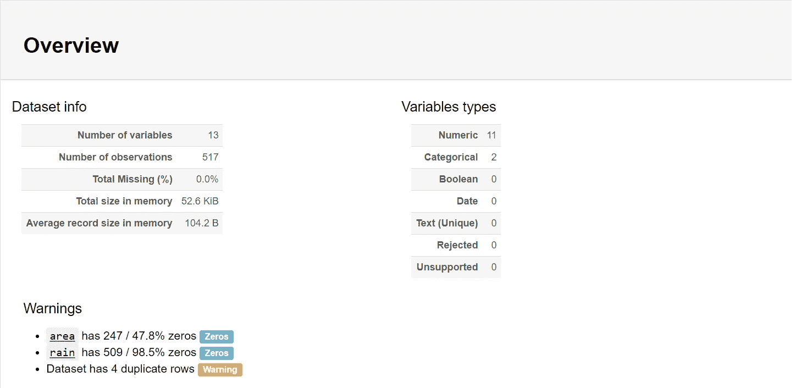
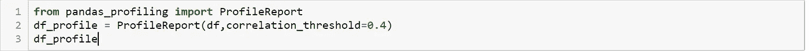
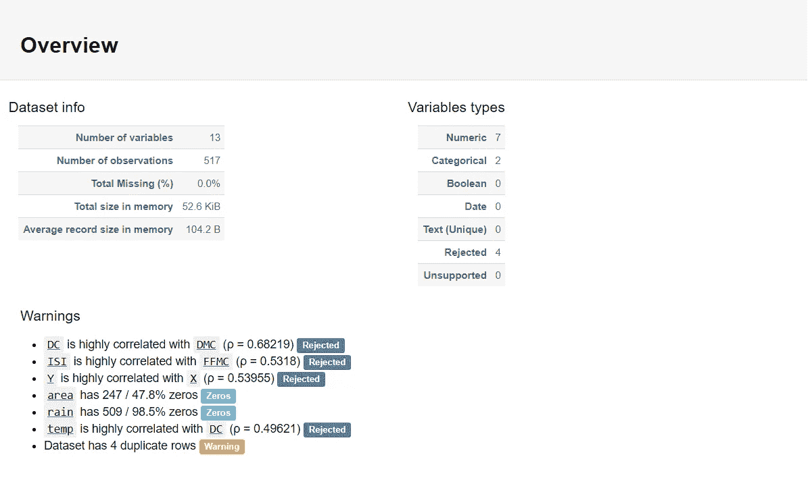
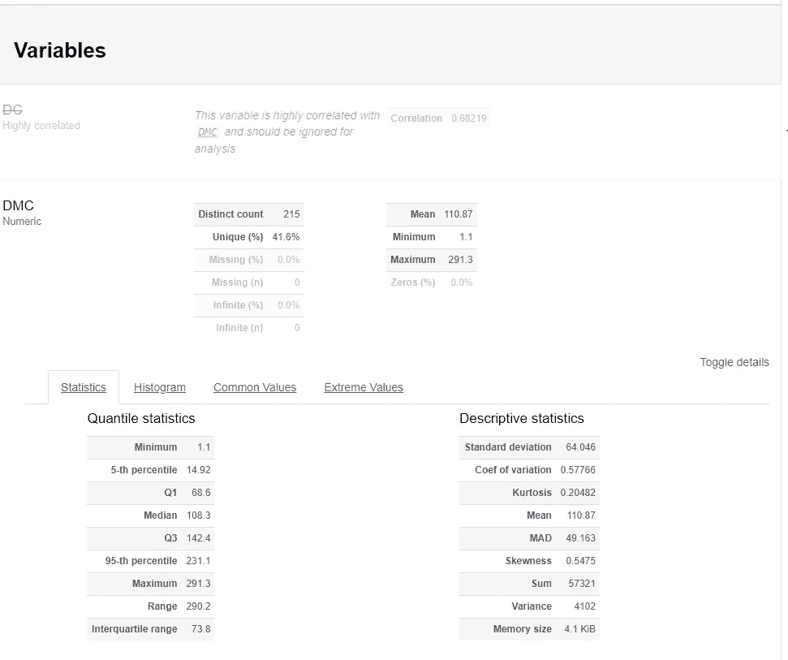
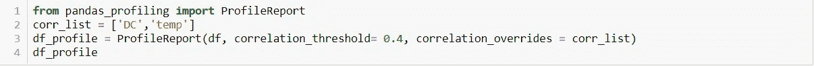
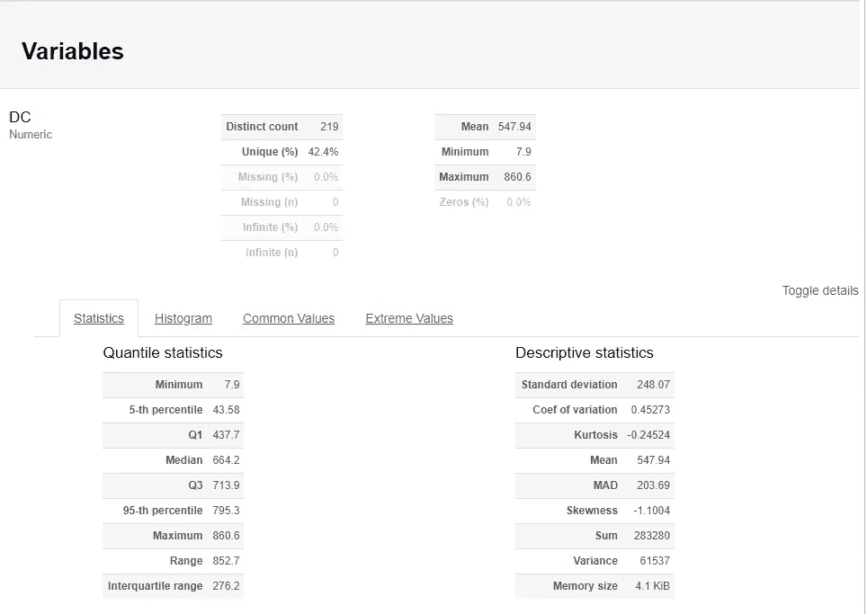
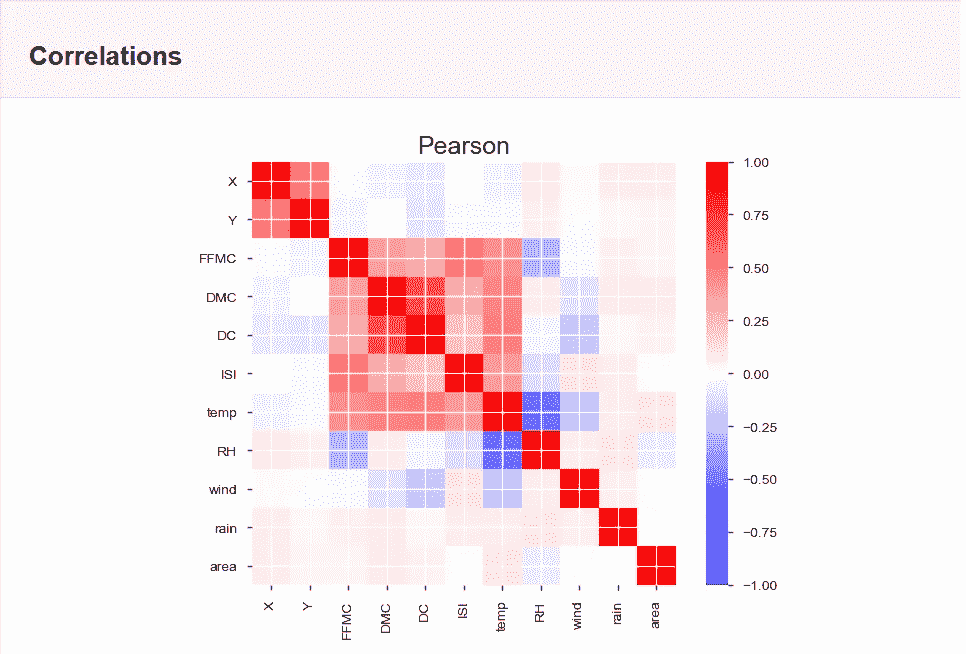
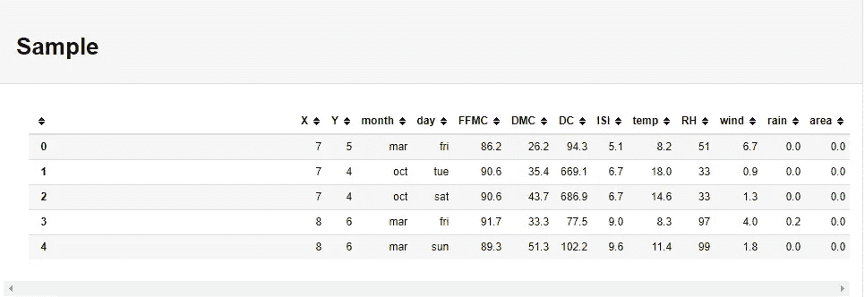

# 熊猫概况-一行代码为您的 EDA

> 原文：<https://medium.com/analytics-vidhya/pandas-profiling-one-line-code-for-your-eda-ee35d2020ea1?source=collection_archive---------13----------------------->

探索性数据分析(EDA)是数据科学管道中最重要的部分。它帮助我们充分理解我们的数据，发现模式、异常和测试潜在的假设。它还帮助我们定义我们希望从数据中获得的洞察力。有很多方法来执行我们的 EDA，它们都涉及到对所有相关变量的大量重复过程。这项任务变得更加复杂和耗时，尤其是当我们处理高维数据集时。

最简单也是最常用的方法是 pandas *describe()* 函数。它给了我们一些重要的统计数据，但我们仍然需要执行其他繁琐的任务来完成我们的 EDA。还有另一个强大的替代方法叫做熊猫概况分析。

Pandas profiling 是一个开源的 python 模块，可以生成 EDA 配置文件报告，如描述性统计、分位数统计、最频繁值、直方图、相关性和缺失值。所有这些都是用一行代码完成的。

首先，我们需要在这里安装 pandas _ profiling。

*pip 安装熊猫——简介*

或者

*康达安装-康达锻造熊猫-剖析*

下一步是导入 pandas profiling &编写一行代码。对于这篇博客，我将使用来自 UCI 机器学习库的[森林火灾](https://archive.ics.uci.edu/ml/datasets/Forest+Fires)数据集。

带有默认参数的代码

这段代码显示了一页的报告。但为了简单起见，我将尝试展示报告的四个主要部分，即概述、变量、相关性和样本。

1.  **概述**

*数据集信息*:这个部分显示了我们的数据的一般信息，比如变量/列的数量、缺失值和观察值的数量。它和熊猫非常相似。 *info()函数。*

*变量类型:*除了常见的数字&分类类型，其他变量如布尔和日期也可识别。

默认参数概述

*警告:*显示有价值的信息，如零值、重复值和被拒绝的变量。为了显示关于警告部分的更多信息，我将通过将关联阈值调整为 0.4(默认为 0.9)来重新运行报告。

相关阈值为 0.4

现在，我们的警告部分显示了相关系数和由于高相关性而被拒绝的变量。

# 2.变量

为每列生成以下统计信息:

**分位数统计:**最小值、Q1、中位数、Q3、最大值、极差、四分位差

**描述性统计:**均值、众数、标准差、总和、中位数绝对偏差、变异系数、峰度、偏度。

**直方图:**连续变量的频率分布和分类变量的计数。

**常用值:**常用值及其频率

**极值:**五个最小值和最大值及其频率。

“DC”一栏在报告中被忽略了

高度相关的变量将被忽略并从报告中排除。在我们的示例中，“DC”由于与“DMC”高度相关而被拒绝，并被忽略。但是您可以通过调整 *correlation_overrides* 来包含这些变量，并提供一个包含您想要显示的被拒绝列的列表。

覆盖被拒绝的变量

包括被拒绝的列

# 3.相关

这显示了高度相关的变量、Spearman、Pearson 和 Kendall 矩阵的热图

相互关系

# 4.样品

这就像 pandas *head()* 函数，它显示了数据的前五个样本。

数据的前五个样本

最后，您可以通过在代码中包含该内容来导出 HTML 格式的报告。

超文本标记语言

希望这有助于加快你的 EDA。

感谢阅读！

**参考文献:**

[**https://pypi.org/project/pandas-profiling/#types**](https://pypi.org/project/pandas-profiling/#types)

[**https://medium . com/@ indata labs/why-start-a-data-science-project-with-explorative-data-analysis-f 90 c 0 EFC be 49**](/@InDataLabs/why-start-a-data-science-project-with-exploratory-data-analysis-f90c0efcbe49)