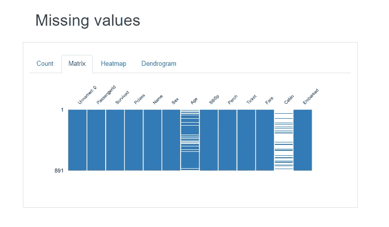

# 熊猫剖析:EDA 的一行神奇代码

> 原文：<https://medium.com/analytics-vidhya/pandas-profiling-one-line-magical-code-for-eda-51db924f3ac4?source=collection_archive---------19----------------------->


[粘土银行](https://unsplash.com/@claybanks?utm_source=medium&utm_medium=referral)在 [Unsplash](https://unsplash.com?utm_source=medium&utm_medium=referral) 拍摄的照片

# 使用 Pandas Profiling Python 库进行自动探索性数据分析

探索性数据分析是一种探索/分析数据集的方法，以可视化的形式生成见解。EDA 用于了解数据集的主要特征。

EDA 帮助我们了解缺失值、计数、均值、中位数、分位数、数据分布、变量之间的相关性、数据类型、数据形状等。对于 EDA，我们需要写很多行代码，这需要很多时间。

**为了让 EDA 更容易更快，我们可以为 EDA 编写一行神奇的代码。**

EDA 可以使用名为 **Pandas Profiling 的 python 库来实现自动化。这是一个很棒的工具，可以创建交互式 HTML 格式的报告，非常容易理解和分析数据。让我们探索 pandas profiling，用一行代码在很短的时间内完成 EDA。**

# 安装 Pandas Profiling:

使用 pip 包安装

```
!pip install pandas-profiling
```

使用 conda 包进行安装

```
conda install -c conda-forge pandas-profiling
```

# 加载数据集

在本文中，我使用了 Titanic 数据集。

```
import pandas as pddf=pd.read_csv(“titanic2.csv”)df.head()
```


泰坦尼克号数据集

## 数据集属性的描述

幸存—幸存(0 =否；1 =是)
Pclass —乘客等级(1 =第一级；2 =第二；3 = 3 日)
姓名—乘客姓名
性别—性别(男/女)
年龄—年龄
Sibsp —船上兄弟姐妹/配偶人数
Parch —船上父母/子女人数
船票—票号
票价—乘客票价
客舱—客舱
上船—上船港(C =瑟堡；Q =皇后镇；S =南安普敦

# 对我们的数据框运行 pandas_profiling 的代码，它返回 Pandas Profiling 报告。

```
import pandas_profiling as pppp.ProfileReport(df) #to display the report
```


熊猫概况报告

你可以看到我们的 Pandas Profiling EDA 报告在一行代码的帮助下完成了。

# 熊猫概况报告由以下部分组成:

1.  **概述**
2.  **变数**
3.  **互动**
4.  **相互关系**
5.  **缺失值**
6.  **样品**

# 1.概述部分:


报告的概览部分

本节提供总体数据集信息。**数据集统计**和 V **变量类型**。

**数据集统计**显示列、行、缺失值等。

**变量类型**显示数据集属性的数据类型。它还显示了**“警告”、**，其中显示了哪些特性与其他特性高度相关。

# 2.可变截面


本节详细介绍了每个功能的相关信息。当我们点击如上图所示的**切换细节**选项时，新部分出现。


本部分显示了统计数据、直方图、常用值和特征的极值。

# 3.相关部分


相关部分

本节借助 Seaborn 的热图展示了各种功能是如何相互关联的。我们可以轻松地在不同类型的相关性之间切换，如**皮尔森、斯皮尔曼、肯德尔**和**菲克。**

# 4.缺失值部分


缺失值部分



我们可以从上面显示的计数和矩阵图中看到“年龄”和“客舱”列中缺少的值。

# 5.样本部分


前 10 行


最后 10 行

此部分显示数据集的前 10 行和后 10 行。

我希望“熊猫概况”库将有助于更快更容易地分析数据。你觉得这个漂亮的图书馆怎么样？继续尝试，并在回复部分提及你的经历。

# 在你走之前

感谢阅读！如果你想和我联系，请随时通过 jsc1534@gmail.com 或我的 LinkedIn 个人资料联系我。