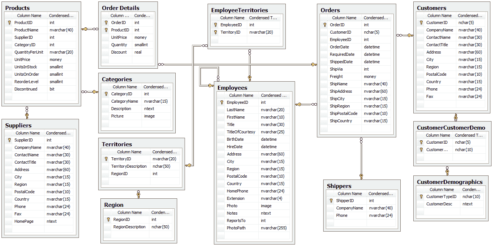
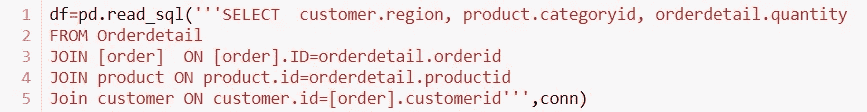

# 熊猫，SQL 和 t 测试

> 原文：<https://medium.com/analytics-vidhya/pandas-sql-and-t-tests-254af4ed82b2?source=collection_archive---------11----------------------->

Pandas 是一个强大的 python 库，SQL 是一个无处不在的数据库语言，t-tests 是一个非常有用的假设检验工具。这些工具本身都是不可思议的工具，但是这个项目是关于三者的协同使用。最重要的是，用它们从数据中提取意义和价值。

微软众所周知的 [Northwind Traders 数据库](http://https://www.geeksengine.com/article/northwind.html)通过如下一些相互连接的数据库描述了公司的运营情况:

罗斯文贸易模式

关于该公司的信息分布在 13 个相互连接的表中，每个表中的连接由唯一的键链接。表格描述了公司经营的不同领域；例如，有一个客户表和一个产品表，这两个表由第三个表链接，客户在第三个表中订购产品。分别理解这一切是从三本不同的书中提取一个故事。SQL 就是我们如何把这个故事写成自己的书

学习 SQL 本身就是一个挑战，但我很高兴有机会使用另一种语言，并了解它与 python 的不同之处。没有一种**正确的**方式来构建查询语言或编码语言，每一种语言都有其长处和短处，但最重要的是，它有自己的结构和命令。学习 SQL 是一个必要的提醒，事情有时就是不同，不是更好，不是更坏，只是不同。我期待着在未来拓展我在 SQL 和其他语言方面的才能，将我的编码技能提升到另一个层次。

SQL 与 python 的结合可以通过 **sqlite3** 库来完成，该库可以很好地与 pandas 交互来创建数据帧。因为，当事情可以变得容易时，为什么要变得困难呢？通过使用 pandas 命令 **pd.read_sql()** 并传递我的(精心构造的)sql 查询，我能够创建一个只从多个表中提取相关信息而不提取其他信息的数据帧。我把我的故事从所有这些书中摘录下来，编成了一本易读的小册子。下面是一个例子:

优雅，阿米利特？

当然，熊猫在数据操作、可视化和探索性数据分析方面大放异彩，这是回答任何数据问题的第一步(查看这篇关于[可视化数据](https://ktzioumis.github.io/visualizing)的博文)。问题是 t 检验从何而来。t 检验是惊人的，t 检验是*一种用于确定两组均值之间是否存在显著差异的推断统计，这两组均值在某些特征上可能是相关的。*(感谢 [Investopedia](https://www.investopedia.com/terms/t/t-test.asp) ！).这实际上意味着一个 t 测试，就像这个大鸟的 gif，会告诉你这些东西中的一个是否和另一个不一样。

重要的是，t 检验是一种统计方法。不是“是”或“否”,我们从 t 检验中得到的输出是一个概率——来自测试数据集的样本均值相等的可能性。由我们来决定 p 值是否足以拒绝或不拒绝(重要！我们不接受零假设，我们不能拒绝零假设。这个决定有点武断，对于这个项目，我将这个标准设置为 0.05。这是一个常见的阈值，意味着样本具有相同均值的可能性为 5%。如果 t 检验 p 值低于这个值，我确定 5%的概率太低，不能接受均值相等。

能够用统计学上的信心声明数据组**是**不同的，这是我们提取意义和价值的地方。这种能力对于我正在分析的(想象中的)业务有着非常广阔的潜力。在这个项目中，我用它来确定 4 个问题的答案:

1.折扣对顾客订购的产品数量有统计上的显著影响吗？如果是，折扣是多少？
2。某些产品类别在美洲或欧洲卖得更好？
3。延迟交货会影响客户的订单吗？
4。每位员工的销售区域数量会影响他们的销售数字吗？

每个问题都涉及到业务的不同方面:

1.按价格分类的销售量
2。分地区销量
3。供应链物流
4。员工绩效

正是这种多样性给人留下了深刻的印象。通过将表数据库中的 SQL 查询链接在一起以创建 pandas 数据框架，并执行 t-test 分析，可以深入了解业务、其运营及其客户、供应商和员工的表现的各个方面。

 [## ktzioumis/Northwind-Traders

### 在这个项目中，我们将使用 Northwind 数据库——一个由微软创建的免费开源数据集…

github.com](https://github.com/ktzioumis/Northwind-Traders)