# 熊猫:透视和多索引

> 原文：<https://medium.com/analytics-vidhya/pandas-stack-unstack-pivot-table-crosstab-5cb9a16fe020?source=collection_archive---------3----------------------->

## 数据透视表、堆叠/拆分是处理多索引对象的基本方法


从杂乱中找到简单

创建强大的预测引擎始于创建正确的数据集。在大多数现实生活中的数据科学问题中，我们没有一个干净的和准备好的数据集来建立模型。在整个过程中，

*   我们定义问题和范围，
*   定义和创建响应变量，派生新功能，
*   做大量的数据处理和可视化。

而以上步骤又都需要熊猫。在上一个练习中，我们讨论了指数 P [和 as 指数解释](https://towardsdatascience.com/pandas-index-explained-b131beaf6f7b)，这对更好地了解熊猫至关重要。上一篇文章解释了选择和过滤的索引用法。在本练习中，我们看到了使用*堆栈/拆分、Pivot_table、交叉表*进行数据处理&可视化。我们将使用 *UCI 机器学习成人数据集*

> **业务问题:**分类(一个人收入 50k 以上或以下)；**响应特征:**标签；**预测因素**:国家、年龄、教育、职业、婚姻状况等。

以下是解释笔记本的片段，GitHub repo 的这个练习可以从最后的链接中克隆。正在读取数据😌

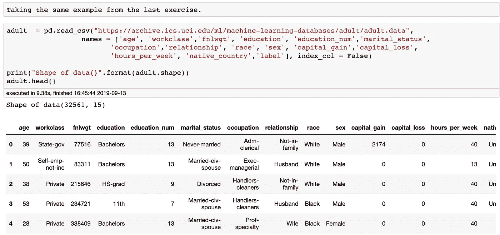

一些预测特征是年龄、*工作阶级*、*教育程度*、*婚姻状况*、*种族、性别、原籍国、每周小时数*，而响应特征是*标签*。另外，我们将标签值 *< =50K、> 50K* 分别替换为 *0* 和 *1* 。

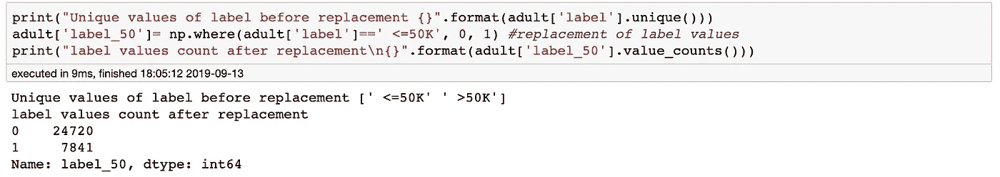

*双变量分析*解释并验证特征之间的关系。分类特征需要 *groupby* 并应用函数来理解它们与数字和其他分类特征的关系。在这种情况下，Pandas Pivot_table、Stack/ Unstack &交叉表方法非常强大。

# 数据透视表 _ 表格

它有三个参数，名称如下:索引、列和值。数据集的分类特征可以在索引和列中传递。新表格的单元格值取自作为 values 参数给出的列。

回到我们的数据集，通常，收入经常与职业相关。那么，我们就以职业为支点，看看哪些职业有高收入人群。

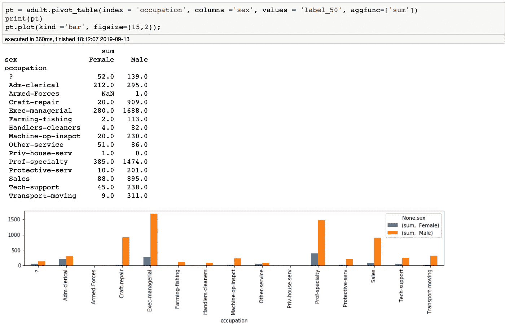

高管、专业人士和销售人员中收入超过 5 万英镑的男性和女性人数最多，这可能会成为一个重要特征。

在旋转过程中也可以使用多列，我们可以使用 pivot_table，如下所示。

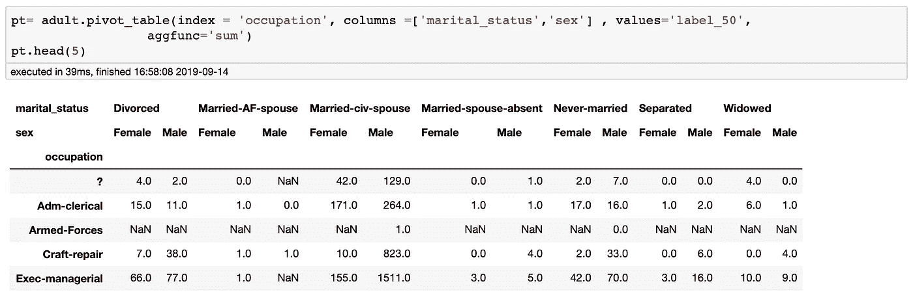

多索引列

另外，检查**点索引**和**点列，**将打印 pivot_table 的索引和列。多索引列可以简化为一个级别，也可以像下面这样重命名:-

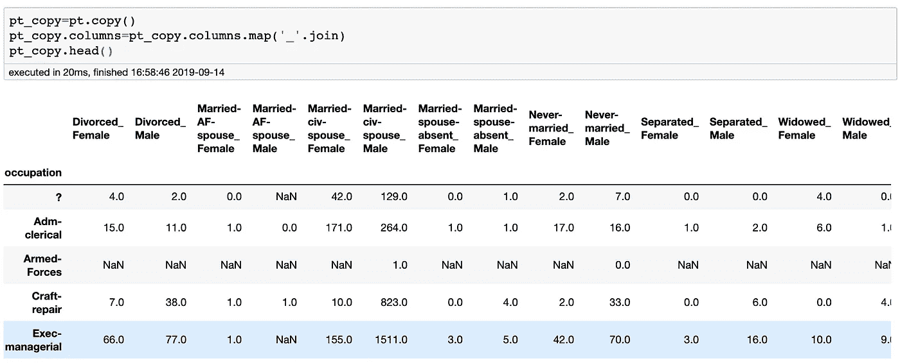

合并前两层后的单层柱

# 交叉表

*pd.crosstab* 可以像 *pivot_table* 一样使用，但是默认情况下，它计算两个(或更多)**分类特性的简单频率表。**因为*值*对于交叉表不是强制的，但是*值*和*聚合函数*可以被传递，如果需要的话。
让我们看一个简单的*交叉表*的例子，并绘制它。教育也是估算收入的一个重要因素。

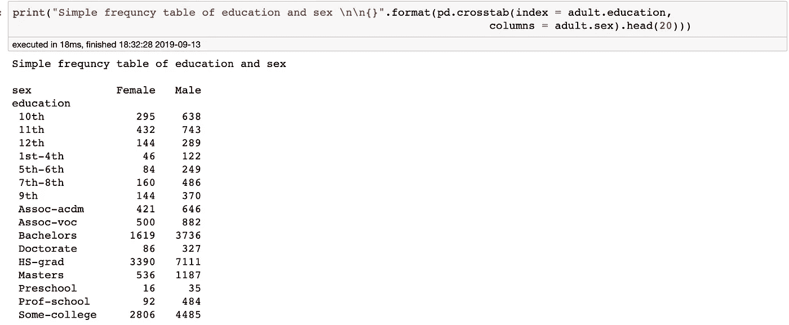

教育和性别频率表

通过传递*值*和*聚集*参数，可以像 pivot_table 一样使用交叉表。下面是在交叉表的帮助下，跨越教育和性别(男/女)特征的收入超过 50K 的人的条形图

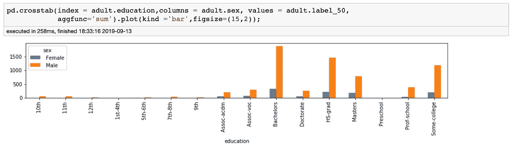

十字选项卡图:x 轴上的索引和 y 轴上的值

pd.cross tab 还有一个参数*归一化*。当我们进行双变量分析时，频率表也可以标准化以显示百分比*而不是计数:*

```
pd.crosstab(adult.education,adult.label_50, normalize = True)
```

# 堆叠/拆分

堆叠一个数据帧意味着移动*最里面的列*索引成为*最里面的行索引*。相反的操作称为拆垛。
**什么是堆叠**？-如果我们有多个索引列，并且通过将最内部的列级别移动到最内部的行级别来减少数据集列。所以堆栈是*列到行(最里面)。* **什么是拆垛？-** 如果我们有多个索引行，并且我们通过将最内部的行级别移动到最内部的列级别来减少数据集行。所以*拆垛*是*行到列(最里面)。* 在我们下载的数据中，我们没有任何多重索引，但是我们的透视数据集有多重索引。查看数据透视表数据集

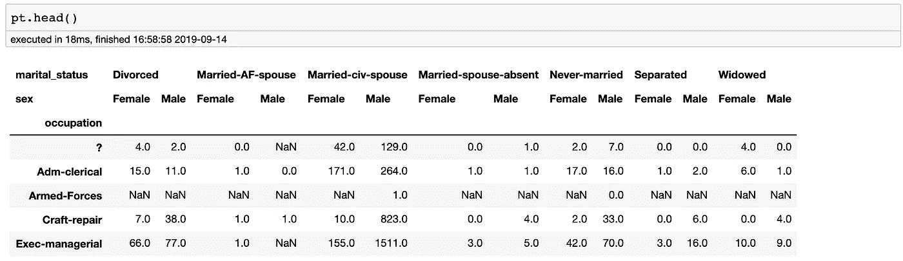

初始数据透视表

*stack* 将内部级别列移动到内部级别行，并且可以再次取消堆叠，使其回到原始的枢轴形状。

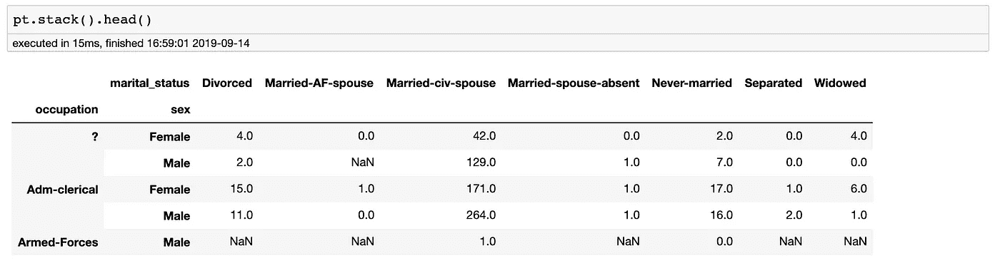

堆叠后的数据透视表

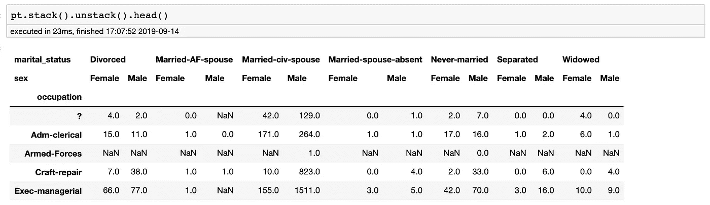

堆叠和拆分带来了原始数据透视表

通过参数*级别，可直接在不同级别进行堆叠/拆堆。*

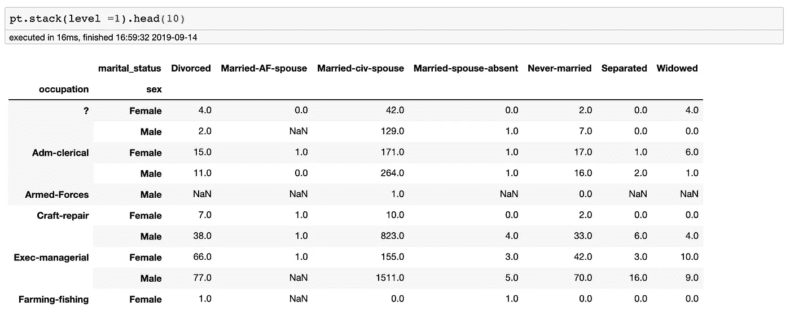

这些方法真的帮助我们把那些见解和模型解释带出来。分层/多级索引非常令人兴奋，因为它为一些非常复杂的数据分析和操作打开了大门，特别是对于处理更高维度的数据。这个练习的 Jupyter nb 可以从 [Github repo 下载。](https://github.com/manu007sharma/PandasAll)

感谢阅读。如果你喜欢过这篇文章，你可能也会喜欢 [*熊猫指数——隐形*](https://towardsdatascience.com/pandas-index-explained-b131beaf6f7b) *灵魂、* [*缩放&变换&*](https://towardsdatascience.com/transformation-scaling-of-numeric-features-intuition-7f4436e8e074) *哪里*

*   *更多请关注我上* [*中*](/@manusharma_66718)
*   *让我们连线上*[*Linkedin*](http://www.linkedin.com/in/data2datasciences/)