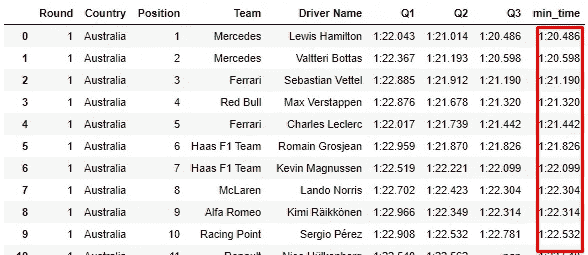
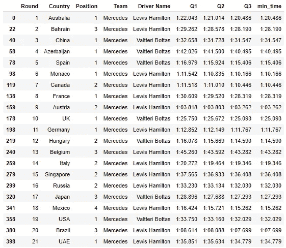
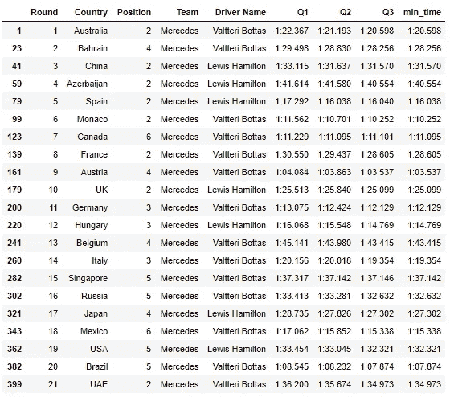
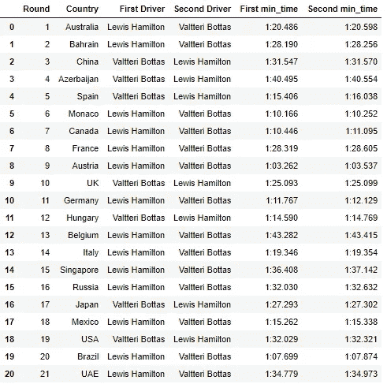
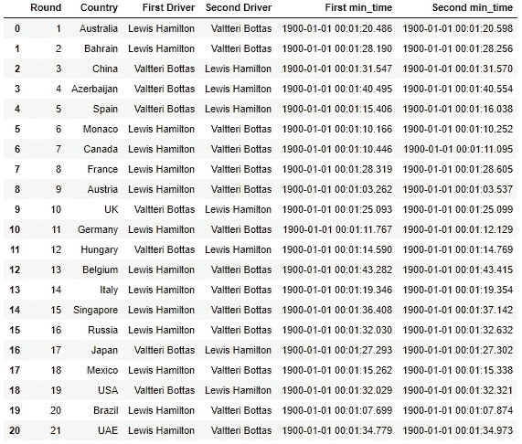
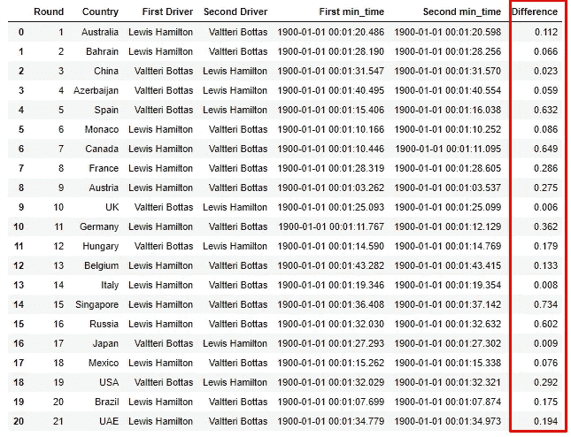
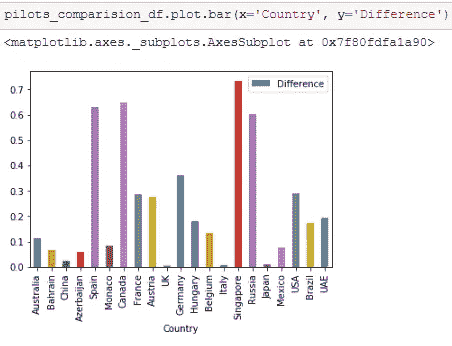
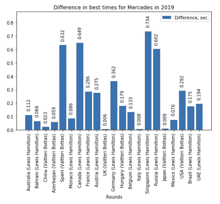

# 熊猫时光机

> 原文：<https://medium.com/analytics-vidhya/pandas-time-machine-38fcb2e77dd3?source=collection_archive---------45----------------------->

pandas 中的 Datetime 格式并使用 matplotlib 绘制图表。


乔尔·穆尼斯在 [Unsplash](https://unsplash.com?utm_source=medium&utm_medium=referral) 上拍摄的照片

在我的[上一篇文章](/@tomcat_iv/fly-to-jupyter-notebook-3c0b90f6825b)中，我开始学习如何使用 Jupyter notebook，从 REST API 加载数据并解析 JSON。

在这里，我继续学习如何与 Jupyter 和熊猫一起工作。

## 任务:通过这个参数找到一个最小次数并比较一个团队中的飞行员。

在 Pandas 中添加一个最小列非常简单:

这里，我们创建一个新列“最小时间”(results_df['最小时间'])，并分配 Q1、Q2 和 Q3 的最小值:



现在让我们为每个团队创建一个数据集:

要创建具有搜索标准的数据集，我们需要将该标准放在数据集的方括号中。例如，对于梅赛德斯来说，它看起来像:

```
results_mercedes = results_df[results_df[‘Team’] == ‘Mercedes’]
```

也许可以动态地创建这些数据集，但这是一次性的工作，所以这样做就足够了。

现在我们要把每轮的第一名和第二名分开。让我们试着用奔驰的数据集来做。

因为之前我们的数据集是按 **Round+Position** 排序的，所以这种排序在新的数据集中是相同的。这意味着所有奇数位置是第一位，所有偶数位置是第二位。

为了创建一个仅具有奇数位置的新数据集，我们需要使用 Python 构造**【first:last:step】**来获得看起来如下的概率:

[::2]表示—从零(参数[first:last:1]的默认值)开始，以步长等于 2 结束。 **iloc** 是一个 pandas 方法，它返回一个具有给定索引的向量。

结果看起来像这样:



看起来不错。现在是第二个位置，所有的矢量都是偶数行。

应该差不多，只是从元素 1 开始而不是从零开始。

结果是:



现在，为了找出差异，我们需要创建另一个数据集，将两个驱动因素放在一个向量中。数据集列将如下所示:

```
[“Round”, “Country”, “First Driver”, “Second Driver”, “First min_time”, “Second min_time”]
```

让我们使用 for 循环来创建它:



第一眼看上去不错。但是这里有一个问题—字符串格式的时间，所以我们不能仅仅将它们作为时间来比较，我们需要将类型改为 datetime。

我们将“第一分钟时间”和“第二分钟时间”转换为日期时间格式 **format='%M:%S.%f'** ，这意味着**分:秒.毫秒**。



是的，我知道，这些“1900-01-01 ..”看起来不酷，但现在我看到它是一种日期时间格式，可以找到秒的差异:



很好，又快又简单。“差异”栏的格式为 **timedelta** 。

现在让我们画一张图:



看起来不错，但还可以更好。

我想看看谁是第一名，以及每一列的确切差异。

为此我们可以使用 matplotlib 库。

在这里，我们创建一个地块，设置标题“2019 年梅赛德斯最佳时间的差异”，初始化轴，刻度，标签和图例。

并在每列上创建一个带有值的标签:



看起来不错！

**结论:**在本文中，我们将学习如何使用 tome 和 timedelta 值，以及如何使用 matplotlib 绘制图表。