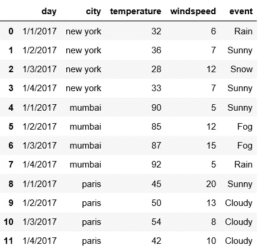
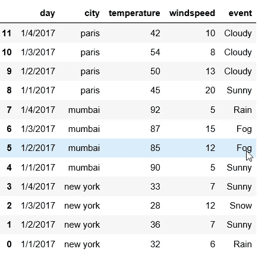
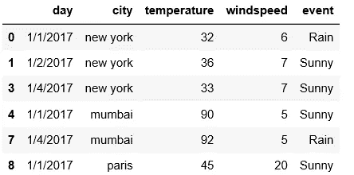
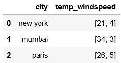
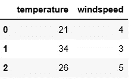
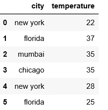
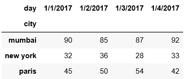
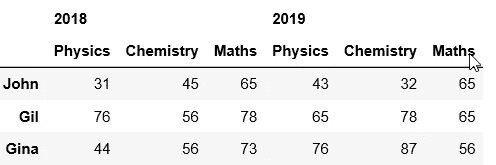
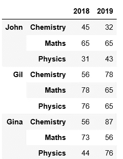

# 数据科学家的熊猫把戏

> 原文：<https://medium.com/analytics-vidhya/pandas-tricks-for-data-scientists-465902163545?source=collection_archive---------4----------------------->

## 熊猫让任何数据科学家的生活更轻松

> 数据科学是操纵数据，寻找模式，并提出解决方案来增加收入，降低费用，从而提高整体业务盈利能力――肯·波洛


图片由 [Stan W.](https://unsplash.com/@stanyw)

> 数据科学家花费大约 80%的时间处理数据并从中获得洞察力。因此，我们必须用聪明的方法来减少数据预处理/清理的时间。熊猫永远不会通过减少你的时间来帮你解读数据。Pandas 是用于数据操作和数据分析的最常用的 Python 库。

在这篇文章中，我将尝试借助天气数据来解决最有用的熊猫技巧，当你开始应用它们时，你会感到惊讶。

> 首先，让我们通过读取 CSV 文件来查看数据

```
import pandas as pddf = pd.read_csv("weather.csv")
df
```

> 输出



气象资料

# 1.颠倒顺序

借助 loc 属性，通过对数据帧进行切片，可以实现反转。 *loc 用于访问一组行或列*。

*第一个 collon 指定选择所有行，第二个 collon 指定选择所有列。通过指定-1，我们将能够颠倒顺序。*

```
df.loc[::-1]
```

> 输出



按行反转

# 2.按多个类别过滤数据

在天气数据中，事件属性具有多个类别，如雨、雪、晴等。如果你想得到下雨或晴天的数据怎么办？？？ *isin* 函数帮助过滤它们。

```
df[df.event.isin([‘Rain’,’Sunny’])]
```

> 输出



过滤数据

# 3.将列值拆分为多列

## 创建包含城市及其属性的数据框

```
df1 = pd.DataFrame({‘city’:[‘new york’,’mumbai’,’paris’] , ‘temp_windspeed’: [[21,4],[34,3],[26,5]]})
```

> 输出



气象资料

在上图中，我们可以看到第二个属性值是一种既有温度又有风速的列表。让我们试着把这些值分成两列。这可以通过在第二列应用一个系列来完成。

```
df2 = df1.temp_windspeed.apply(pd.Series)
df2.rename(columns= {0:'temperature',1:'windspeed'})
```

> 输出



拆分后

# 4.组合两个数据帧

在现实生活中，我们可能总是不处理单一的数据源，我们可能有来自不同来源的数据，可以通过组合它们进行分析。*联系功能帮助您合并两个数据框。*

## 创建两个数据框

```
df1 = pd.DataFrame({
 “city”: [“new york”,”florida”,”mumbai”],
 “temperature”: [22,37,35]
})df2 = pd.DataFrame({
 “city”: [“chicago”,”new york”,”florida”],
 “temperature”: [35,28,25]
})
```

## 连接创建的数据框

```
pd.concat([df1, df2],ignore_index=True)
```

> 输出



组合后

# 5.在枢轴上转动

假设您想要查看每个城市当天的温度。简单来说，如果我想分析每个城市的温度每天是如何变化的。Pivot 使这些事情变得简单，它就在这里！！！。

```
df.pivot(index=’city’,columns=’day’,values=”temperature”)
```

> 输出



透视数据

# 6.使再成形

假设您想要分析学生两年的成绩，并以下面的格式给出。

```
header = pd.MultiIndex.from_product([[‘2018’,’2019'],[‘Physics’,’Chemistry’,’Maths’]])
data=([[31,45,65,43,32,65],[76,56,78,65,78,65],[44,56,73,76,87,56]])
df = pd.DataFrame(data,
 index=[‘John’,’Gil’,’Gina’],
 columns=header)
```



学生数据

我们可以通过使用 stack 函数将上述数据重新排列成行，以便进一步分析。

```
df.stack()
```

> 输出



重塑后

## 参考

[1]凯文·马卡姆，数据学院，[https://www.dataschool.io/easier-data-analysis-with-pandas/](https://www.dataschool.io/easier-data-analysis-with-pandas/)

[2]代码基础知识，[https://www.youtube.com/channel/UCh9nVJoWXmFb7sLApWGcLPQ](https://www.youtube.com/channel/UCh9nVJoWXmFb7sLApWGcLPQ)

> 希望你喜欢它！！！敬请期待！！！我会尽可能地收集/创造更多的技巧，并带来另一篇有惊人技巧的文章！！！！。请对任何疑问或建议发表评论！！！！！