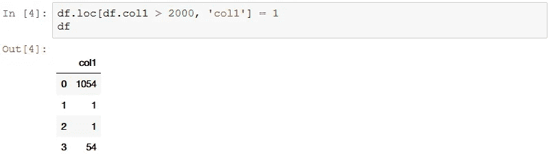

# 我希望我作为一个初学者知道的熊猫技巧

> 原文：<https://medium.com/analytics-vidhya/pandas-tricks-i-wish-i-knew-as-a-beginner-a9291c6883a6?source=collection_archive---------13----------------------->


资料来源:edureka.co

Python 是一种容易学习的语言，主要是因为它的代码可读性和语法简单性。尽管掌握一项技能需要时间和练习，不管它有多简单。其中一个技能是[熊猫](https://pandas.pydata.org/) python 包。数据科学领域的几乎每个人，无论是初学者还是专业人士，都会在数据操作步骤的某个地方陷入困境，难怪数据科学家的大部分时间都花在数据清理和格式化上。

在这篇文章中，我们将会看到一些真正有用和有效的熊猫技巧，它们将会为你节省大量的时间。这些建议是基于我的个人经验，并提供了熊猫文档链接。让我们开始吧。

# **1。圆点符号**

在 pandas 中，最常见的切片方法是使用:

```
sliced_column = df['column1'] #Returns a pandas series
```

使用方括号和引号的要求使得这个简单的任务有点乏味，谢天谢地，有一个替代的方法来完成这个任务，而且简单得多:

```
sliced_column = df.column1 #Returns the same pandas series as above
```

从['col']到的简单更改。col 不仅节省了时间，还使代码更加简洁。虽然如果列名包含空格或除下划线(_)之外的任何其他特殊字符，就不能使用这个技巧，但是您总是可以重命名您的列:)

# 2.更换变得容易

在许多情况下，您可能需要根据特定条件将数据帧中的值替换为另一个值，例如，如果值低于特定阈值，则替换为 0，如果值高于阈值，则替换为 1。

传统的做法是:



使用 loc 进行索引

更简单的方法:


[np.where()](https://numpy.org/doc/1.18/reference/generated/numpy.where.html) 返回一个 numpy 数组，符号 **np.where(cond，a，b)** 本身就很有语义，告诉读者当 cond 为真时用 *a* 替换否则用 *b 替换。*这里的问题是不能忽略 else 部分，这意味着即使条件为假也不能保留现有值。

# 3.applymap()或 apply()

先说一下 [applymap()](https://pandas.pydata.org/pandas-docs/stable/reference/api/pandas.DataFrame.applymap.html) ，applymap()函数执行元素式转换，并不是为复杂函数设计的。我们所说的按元素转换是指 applymap()将把基本转换应用于数据帧中的每一个元素。


当要转换整个数据帧时，使用 applymap()将减少代码量(与 apply()相比)。

现在让我们来看看 [apply()，](https://pandas.pydata.org/pandas-docs/stable/reference/api/pandas.DataFrame.apply.html)apply()函数可以对数据帧执行更复杂的操作，方法是将数据逐行或逐列传递给一个函数，然后该函数处理数据并返回结果。


更详细的比较包括 map():


资料来源:stackoverflow/cs95

# 4.组合数据帧

Pandas 提供了 4 种不同的方法来组合数据帧，即:

*   [加入](https://pandas.pydata.org/pandas-docs/stable/reference/api/pandas.DataFrame.join.html)
*   [合并](https://pandas.pydata.org/pandas-docs/stable/reference/api/pandas.DataFrame.merge.html)
*   [追加](https://pandas.pydata.org/pandas-docs/stable/reference/api/pandas.DataFrame.append.html)
*   [串联](https://pandas.pydata.org/pandas-docs/stable/reference/api/pandas.concat.html)

其中有多少是真正需要的？只需将其中两个连接并合并！作为一个初学者，我总是不知道在合并两个数据帧时应该使用什么技术，下面是解决方法。

当要沿行或列轴追加另一个数据帧时，使用 concat，因此我们可以说 concat()替代 append()，而对于在键上联接两个数据帧，使用 merge()而不是 join()。Merge 充当 sql 连接，因此可以是 inner、outer、left 和 right。


资料来源:dofactory.com

以下是 concat:


合并:


如何:指定执行内|外|左|右的联接类型

开:指定用于合并的键

Merge 有许多更有用的参数，例如 left_on 和 right_on，以防两个数据帧中的键名不同，或者使用后缀来重命名公共列名，以便区分列的源。

# 5.生成日期范围

Pandas [date_range()](https://pandas.pydata.org/pandas-docs/stable/reference/api/pandas.date_range.html) 将简化提升到另一个层次，让我们先来看看如何使用 datetime 包生成开始日期和结束日期之间的日期列表:


现在，仅仅得到一系列日期就已经做了大量的工作，让我们看看熊猫如何处理这个问题:


很明显 pandas 在这里赢了，我发现当我需要 X 轴上的日期时，这种技术在执行数据可视化时很有用。

**出发前:**

所以这是熊猫的一些最有用的工具，我希望我作为一个初学者知道，并节省了我相当多的时间。我强烈建议您通读每个函数的文档，以便对它有完整的了解。谢谢你来看我，并且一直读到最后。祝您愉快:)