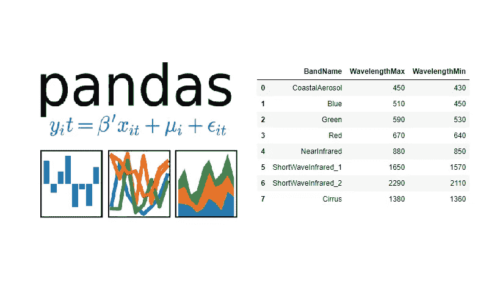

# 熊猫教程-索引，切片，日期和时间

> 原文：<https://medium.com/analytics-vidhya/pandas-tutorial-indexing-slicing-date-times-e02d230ff485?source=collection_archive---------3----------------------->



我们现在正试图用 Python 的 Pandas 库来进行数据分析。

Pandas 是一个数据分析库。Pandas 依赖于并使用`NumPy`——Python 库进行快速数值数组计算。例如，您可以使用 DataFrame 属性`.values`将 DataFrame `df`表示为 NumPy 数组。您还可以将 Pandas 数据结构传递给 NumPy 方法。

# 索引

熊猫数据帧是带有标记行和列的表格数据结构。数据帧的行由索引标记。数据帧的列本身是称为`Series`的特殊数据结构。Pandas 系列是一维带标签的 numpy 数组，dataframe 是列为系列的二维 numpy 数组。

因此，数据帧可以像 numpy 数组或 Python 列表一样进行切片。我们使用冒号来指定切片的`Start`、`End`和`Stride`。Pandas 数据框架提供了几种灵活的方法来索引您将要处理的数据子集。

```
In [1]: import pandas as pd
In [2]: df = pd.read_csv('sales.csv', index_col='month')
In [3]: df
Out[3]:      eggs    salt     fish
 month
 Jan         47       12.0    17
 Feb         110      50.0    31
 Mar         221      89.0    72
 Apr         77       87.0    20
 May         132      NaN     52
 Jun         205      60.0    55
```

## 方括号

我们可以用方括号选择数据的某些部分。本例中的第一个括号选择列标签，第二个括号选择行标签。

```
In [4]: df['eggs']['Feb']
Out[4]: 110
```

上面的代码选择了二月份销售的鸡蛋，即 110。这是一种非常方便的方式来截取您可能正在寻找的特定结果。一点也不复杂，但它可能是你工作中的宝贵资源。

## 使用列属性和行标签

Pandas 还允许您将列链接到数据帧，然后使用方括号分割所需的行标签。值得注意的是，这只适用于单个单词或多个单词用下划线连在一起的列。

```
In [5]: df.fish['Mar']
Out[5]: 72
```

上面的代码分割了三月份销售的鱼的数量，即 72 条。

## 使用`.loc` 或`.iloc A`辅助

从 Pandas 的数据帧中分割数据的另一种方法是使用“访问器”。这些访问器告诉 panda slice 将焦点转向何处，以及在要切片的数据中要寻找什么。`.loc`访问器使用给定的`labels`分割数据，而`.iloc`使用`Index positions`分割数据。

```
In [6]: df.loc['May','fish']
Out[6]: 52In [7]: df.iloc[4,2]
Out[7]: 52
```

第一段代码使用`.loc`访问器分割了 5 月份销售的鱼的数量。在`.loc`之后，我们传递一个字符串列表，首先指定我们想要切片的行，然后指定我们感兴趣的行中的列。

第二位类似地使用`.iloc`访问器分割了 5 月份销售的鱼的数量。使用`.iloc`，我们传递一个整数列表。第一个整数指定我们感兴趣的行的索引，第二个整数指定列的索引。行和列的索引从 0 开始，所以`May`假设索引为`4`，而`fish`的索引为 2。

## 仅选择一些列

在某些情况下，我们只想分割一些列，我们使用带方括号的嵌套列表来实现这一点。

```
In [8]: df_new = df[['eggs','salt']]
In [9]:df_new
Out[9]:          eggs       salt
      month
      Jan         47        12.0
      Feb        110        50.0
      Mar        221        89.0
      Apr         77        87.0
      May        132         NaN
      Jun        205        60.0
```

# 切片数据帧

切片可以使用或不使用访问器来完成。我们将看几个例子，说明如何使用和不使用访问器来分割数据帧的各个部分。

我们仍将使用之前加载的销售数据框架。

## 切割柱的部分

```
In [1]: df['eggs'][1:4]
Out[1]: month
        Feb     110
        Mar     221
        Apr      77
```

这段代码选择了 eggs 列，并对从 2 月到 4 月售出的鸡蛋数量进行切片。第一个括号选择列，下一个括号选择所需的行。

# 1.使用。loc[ ]访问器

## 分割所有行和一些列

```
In [2]: df.loc[:,'eggs':'salt']
Out[2]:          eggs      salt
        month         
        Jan       47       12.0
        Feb      110       50.0
        Mar      221       89.0
        Apr       77       87.0
        May      132        NaN
        Jun      205       60.0
```

正如我们已经看到的`.loc[]`访问器，传递的第一个字符串指定选择的行，在逗号后面传递的第二个字符串指定要切片的列。

在这种情况下，我们希望选择数据帧的所有行和其中的一些列，我们使用冒号`:`来表示选择所有行。仅使用冒号，而不指定任何范围，会选择一行或一列的全部。但是，如果将冒号放在两个字符串或两个整数之间，它会选择所指示的两点之间的所有数据。

`df.loc[:,'eggs':'salt']`选择几个月的鸡蛋和鱼的销售额。`'eggs':'salt'`仅选择鸡蛋和盐，因为鸡蛋和盐列之间没有项目。如果两列之间有列，它们也会被选中。

## 分割一些行和所有列

```
In [3]: df.loc['Jan':'Apr',:]
Out[3]:       eggs     salt    fish
      month
      Jan     47       12.0     17
      Feb     110      50.0     31
      Mar     221      89.0     72
      Apr     77       87.0     20
```

这段代码对 dataframe 的行`'Jan'`到`'April'`以及所有列(鸡蛋、盐和鱼的销售额)进行切片。注意，我们使用了一个单独的冒号`:`来选择所有列。我本可以使用`'eggs':'fish'`，那也是准确的。

## 分割一些行和一些列

```
In [4]:df.loc['Mar':'May','salt':'fish']
Out[4]:        salt     fish
       month       
       Mar     89.0       72
       Apr     87.0       20
       May      NaN       52
```

这段代码将 3 月到 4 月的盐和鱼的销售记录分割开来。语法类似于早期的语法。`'Mar':'May'`选择 3 月到 4 月的行，而`'salt':'fish'`为我们提供这几个月的盐和鱼的销售情况。

# 2.使用。iloc[ ]访问器

## 分割所有行和一些列

```
In [5]: df.iloc[:,0:1]
Out[5]:          eggs      salt
        month         
        Jan       47       12.0
        Feb      110       50.0
        Mar      221       89.0
        Apr       77       87.0
        May      132        NaN
        Jun      205       60.0
```

这类似于使用`.loc[]`访问器。冒号`:`分割整行，`0:1`是第一列和第二列的索引。对一些行和所有列进行切片也是如此。

## 分割一些行和一些列

```
In [6]:df.iloc[2:5,1:]
Out[4]:        salt     fish
       month       
       Mar     89.0       72
       Apr     87.0       20
       May      NaN       52
```

这个代码相当于`df.loc[‘Mar’:’May’,’salt’:’fish’]`的`iloc[]`。它削减了 3 月至 5 月的盐和鱼销售额。

## 特殊切片

```
In [1]: df.iloc[:5,:]
```

从开始到第 5 行切片。第 5 行不包含，并选择所有相应的列条目。

```
In [2]: df.iloc[-5:,:]
```

从底部到倒数第五行的切片…当然，还有所有相应的列条目。

```
In [3]: df.iloc[::3,-1]
```

这将从最后一列的 0 开始每隔 3 行进行切片。

## 使用列表而不是切片

```
In [4]: df.loc['Jan':'May',['eggs','fish']]
Out[4]:        eggs    fish
      month    
      Jan       47      17
      Feb      110      31
      Mar      221      72
      Apr       77      20
      May      132      52
```

上面的代码对行`January`到`'May'`进行切片，并选择嵌套列表中传递的列。在这个例子中，返回了从 1 月到 5 月的鸡蛋和鱼的销售额。

```
In [5]:df.iloc[[0,4,5],0:2]
Out[5]:          eggs      salt
        month         
        Jan       47       12.0
        May      132        NaN
        Jun      205       60.0
```

就像`.loc[]`一样，我们传递我们感兴趣的列或行的列表，而不是分割它们。在上面的例子中，我们选择了月份`January`、`May`和`June`，然后对第一列和第二列进行切片。该代码返回一月、五月和六月鸡蛋和盐的所有销售额。

# 日期和时间

在使用 Pandas 读取日期时间对象时，我们需要在使用`pd.read_csv()`函数将数据加载到 dataframe 时指定`'parse_dates=True'`。

`'parse_dates=True'`关键字参数(Kwarg)帮助将`ISO 8601`格式的日期和时间从指定的列转换成日期时间对象。

`ISO 8601`格式看起来像这样`yyyy-mm-dd hh:mm:ss`

让我们来看一家公司的产品销售数据:(Sale-feb-2015.csv)

```
 Date                 Company          product      Unit
0  2015-02-02 08:30:00   Hooli             Software       3
1  2015-02-02 21:00:00   Mediacare         Hardware       9
2  2015-02-03 14:00:00   Initech           Software      13
3  2015-02-04 15:30:00   Streeplex         Software      13
4  2015-02=04 22:00:00   Acme Corporation  Hardware      14 
```

我们可以看到这个文件包含至少一列日期时间。我们必须告诉`read_csv()`用`'parse_dates=True'`将所有兼容的列解析为 datetime 对象。此外，我们希望使用`index_cols='Date'`将日期列作为索引

```
In [1]: import pandas as pd
In [2]: sales=pd.read_csv('Sales-feb-2015.csv',                    parse_dates=True,index_cols='Date')
In [3]: sales
Out[3]:                Company          product      Unit 
    Date
 2015-02-02 08:30:00   Hooli             Software       3
 2015-02-02 21:00:00   Mediacare         Hardware       9
 2015-02-03 14:00:00   Initech           Software      13
 2015-02-04 15:30:00   Streeplex         Software      13
 2015-02=04 22:00:00   Acme Corporation  Hardware      14
```

## 选择单一日期时间

记住`.loc`可用于按行和按列分割数据。

我们可以对日期时间做同样的事情。例如，我们可以选择在 2 月 19 日晚上 11 点购买的公司。

```
In [4]: Sales.loc['2015-02-19 23:00:00','Company']
Out[4]: 'Mediacare'
```

## 选择全天

```
In [5]:Sales.loc['2015-2-4']
Out[5]:               Company           Product   Unit
Date
2015-02-04 15:30:00  Streeplex          Software   13
2015-02-04 22:00:00  Acme Corporation   Hardware   14
```

注意，我们没有指定列名，所以所有的列都被返回。

部分日期时间字符串的替代格式

*   `Sales.loc['February 5, 2015']`
*   `Sales.loc['2015-Feb-5']`

Pandas 还允许对整月、整年等进行部分选择。

*   整整几个月:`Sales.loc['2015-2']`
*   全年:`Sales.loc['2015']`

## 切片日期和时间

我们可以通过提供由冒号`:`分隔的`Start`和`Stop`字符串来分割部分日期时间字符串。

```
In [6]: Sales.loc['2015-2-16':'2015-2-20']
```

这将分割从 2 月 16 日到 2 月 20 日的所有销售记录。

## 将字符串转换为日期时间

Pandas `.to_datetime()`方法用于将`ISO 8601`格式的字符串转换成 pandas datetime 对象。

```
In [7]: night_sales=pd.datetime(['2015-2-11 20:00','2015-2-11 21:00'
    ..: '2015-2-11 22:00','2015-2-11 23:00'])
In [8]:night_sales
Out[8]:
       DatetimeIndex(['2015-02-11 20:00:00','2015-02-11 21:00:00',
       '2015-02-11 22:00:00','2015-02-11 23:00:00'],
        dtype='datetime64[ns]',freq=None)
```

## 重新索引数据帧

```
In [9]: Sales.reindex(night_sales)
Out[9]:                Company       Product      Units
2015-02-11 20:00:00    Initech        Software       7.0
2015-02-11 21:00:00     NaN            NaN           NaN
2015-02-11 22:00:00     NaN            NaN           NaN
2015-02-11 23:00:00    Hooli          Software       4.0
```

重建索引包括提供新的索引并根据需要匹配数据。如上所示，reindex 返回了一个新的 dataframe，其中有 4 行对应于`night_sales`中的时间。

当使用带有缺失条目的 reindex 时，我们可以使用参数`'Method=ffill'`覆盖默认的用`NaN`归档。(正向填充)。还有一个`'Method=bfill'`(回填)。它用最近的前一个条目或最近的后一个条目填充列。

我将在后续教程中详细讨论这些问题。

现在应该就这些了。我希望你能从这篇教程帖子中得到乐趣。

下次见，编码快乐！