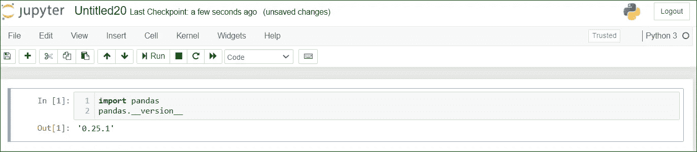
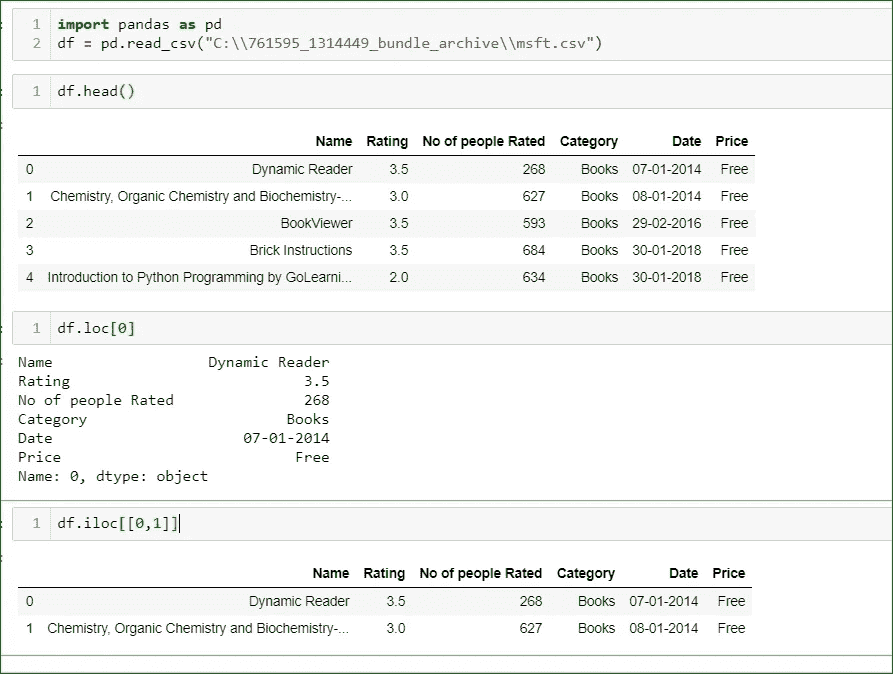
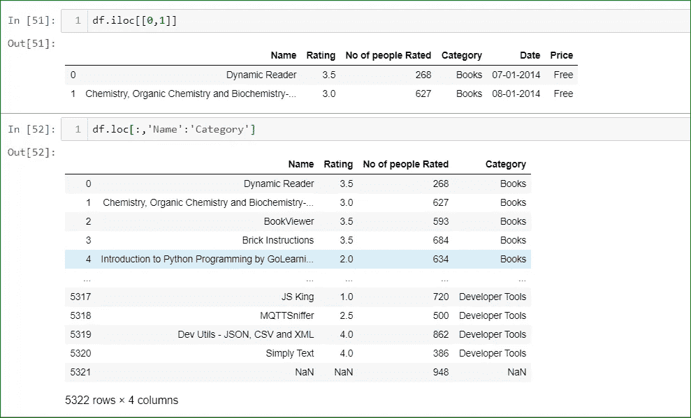
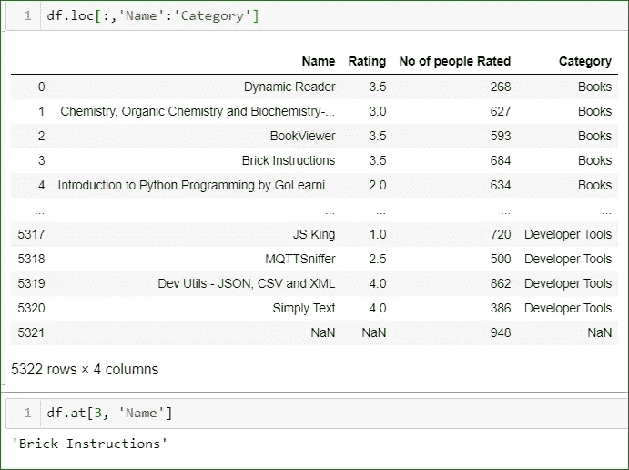
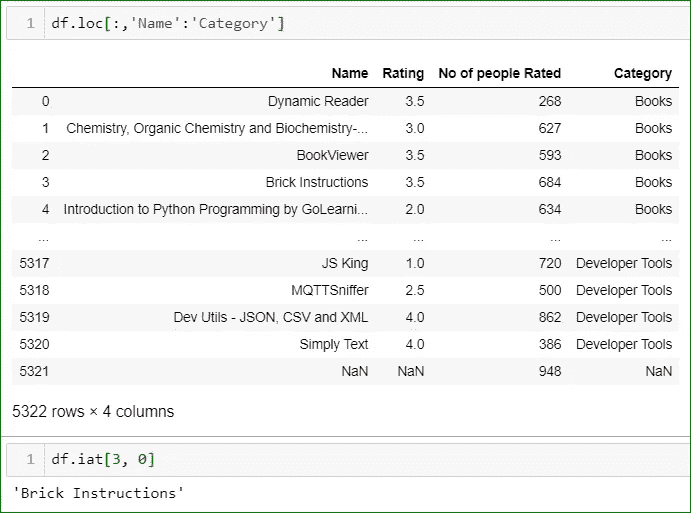
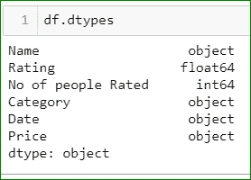
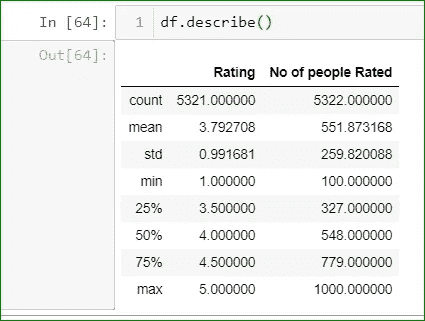
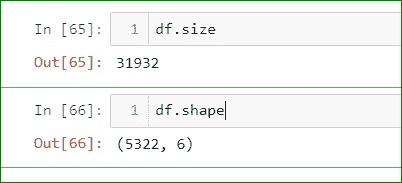
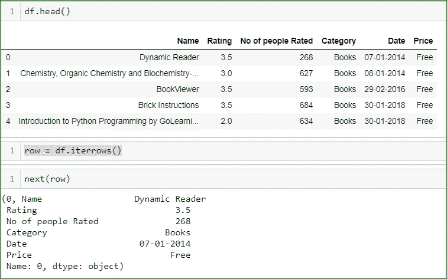

# 熊猫——从零到英雄——第二部分

> 原文：<https://medium.com/analytics-vidhya/pandas-zero-to-hero-part-2-9af4fe28cd65?source=collection_archive---------25----------------------->

在上一篇文章中，我与你分享了如何从 **pandas** 库开始，有哪些方法可以用来做数据分析。如果你想看一看，你可以在这里查看。

在这篇文章中，我将分享一些更基本的方法，可以帮助你了解更多的数据分析。如果你想开始一个数据工程师/数据科学家/机器学习的职业生涯，你必须知道所有做数据分析的方法。**你对数据了解得越多，你就越能从中获取信息。**

在开始之前，你首先要检查的是你正在使用的熊猫的版本。您可以通过运行以下命令来实现这一点

```
pandas.__version__
```



检查版本

让我们从一些数据分析开始，这些数据是关于微软 Windows 商店中的应用程序的，你可以从 [kaggle](https://www.kaggle.com/vishnuvarthanrao/windows-store) 下载数据

*   名称:应用程序的名称。
*   评级:应用程序的评级。
*   评价人数:评价应用程序的人数。
*   类别:应用的类别。
*   约会。:过帐的日期。
*   价格。:应用程序的价格。

以便查看特定位置的数据并理解数据。我们将使用 **Iloc、loc、isat**

```
iloc : it is used to select row or columns based on integer value
```

您可以在下面的示例中看到如何使用 iloc，它可以采用多个值，例如

> 整数:df.iloc[9]
> 
> 整数列表:df.loc[1，2，4]
> 
> 布尔数组:df . loc[[真，假，真]]
> 
> 切片:df.iloc[0:4]
> 
> lambda 函数:df . iloc[**lambda**x:x . index % 2 = = 0]



使用通过标签访问行和列的 **loc** 可以获得类似的结果。可以将上述相同的值传递给 loc 以获得所需的结果。在下面的示例中， **df.loc[:，' Name':'Category']** 选择从' **Name** '到' **Category** '开始的列的所有行



Loc 示例

M 任何时候我们想要找到位置处的值，即“**名称**列中的第三个值，为此我们使用 **df.at** (类似 loc)和 **df.iat** (类似 iloc)。我们使用这些来设置和获取序列或数据帧中的单个值。



df.at



df.iat



知道数据类型

> **Df.dtypes** 对于了解 dataFrame 列的数据类型很有用。如果您知道数据类型，它将帮助您决定可以对数据执行哪些操作

我们都想知道有多少行有空值以及数据的形状。熊猫数据框架提供了一种使用 df.shape、df.info()一次性检查所有信息的简单方法。他们会告诉您数据的结构。



df 统计

作为数据分析师，您想进入下一步，我们想知道数据中的值的范围。但是**等待**时，范围只能给数据帧中的数值，而不能给字符串值。您可以通过运行**df . description**命令来实现这一点。因为数据有两个数字列，所以只对这两个列执行操作(见上图)。



我们很在行，因为我们已经学会了选择数据，知道数据类型，知道范围。现在我们想知道数据框中的元素数量，这可以通过使用 **df.size** 来实现，如果我们想知道数据集的形状，即数据中的行数和列数，我们需要使用 **df.shape** ，其中 df.shape[0]定义行数，df.shape[1]定义列数。

在的最后一节，我们将讨论如何迭代数据框中的值。如果我们想迭代数据框列中的行，那么我们需要创建数据框的生成器对象，然后使用 next 函数迭代每个值。



df.iterows()用于创建生成器对象和 next 来迭代值，每次如果运行 next 函数，它将跳转到下一行。

df.items()用于对列或系列对进行迭代，它给出的结果由作为元组的 dataFrame 列和系列内容组成。

# 谢谢你一直读到最后一篇文章。这是《熊猫——归零英雄》的第二篇文章，我会在接下来的一天分享更多的文章。

**请对本文进行反馈，如果您想了解更多，请发表评论！继续关注！快乐编码并订阅:**