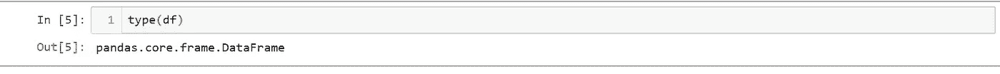
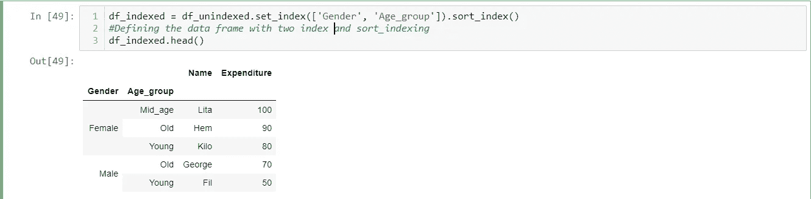

# 熊猫-从零到英雄(系列-1)

> 原文：<https://medium.com/analytics-vidhya/pandas-zero-to-hero-series-1-5f6ee546dc53?source=collection_archive---------23----------------------->

## 熊猫深潜

我们都使用不同的工具来分析数据，如果我告诉你有一种使用 python 进行数据分析的简单方法，会怎么样？

ython 是一种解释语言，我们经常使用它，Pandas 库是每个 python 程序员必须学习的库。它以简单灵活的方式提供数据分析和操作。让我们开始吧。

在开始之前，您想安装它吗？对吗？给你，你可以用 pip 安装熊猫

> pip 安装熊猫#这是一个简单的命令
> 
> pip 安装熊猫= = 0 . 25 . 1 #这个不错

这两个命令做同样的事情，第一个命令让你下载最新的软件包，第二个命令让你指定你需要安装的版本。是不是很神奇？？？

如果你想了解你正在使用的熊猫版本，你可以试试图书馆。__version__(即熊猫。__version__)才能知道。

版本检查

# 从不同的文件格式中读取数据

熊猫可以让你从不同的文件格式读取数据，如 csv，xlsx，json，txt，html，从 SQL 数据库读取数据等等。重要的是，它让你用简单的语法以相同或不同的文件格式存储数据。

为了读取，我们必须使用 **read_*** (将*替换为您想要读取的文件格式，如 **read_csv** ， **read_xlsx** )而为了写入，我们必须使用**到 _*** (将*替换为您想要写入的文件格式，如**到 _csv** ，**到 _xlsx** )

读取文件

将数据帧保存到 csv

所有文件格式都被读入称为 **Pandas Dataframe 的表状结构。**我们可以将数据存储到类型为**pandas . core . frame . data frame 的变量中(**仅供参考，我们使用 type()函数来检查数据类型)

我向您展示了从文件的。创建数据框还有其他方法，如下所示:

从字典创建数据帧，其中字典的每个关键字是列名**和值**是该列中的信息(即数据)行。“索引”值也被定义为唯一地寻址该数据帧。****

****记住字典的每个值(即列表)的长度必须与所有其他列表的长度相等(索引也是如此)，否则会出现错误****

****

**从字典创建数据框**

**接下来，从列表的列表中创建数据框，下面是代码片段！每个列表都在列表数据框中的**行**中，我们用关键字**列**来指定列的名称**

****

**从列表中的列表创建数据框**

**到目前为止，我们只看到了一个索引数据框，我们也可以创建多个索引数据框。别担心，我会展示它们的样子，以及我们如何从中获得更多有用的信息。**

> **多索引是查看数据和更好地理解数据的另一种有效方法。图中所示的代码首先创建数据框，然后设置索引。选择作为索引的列应该唯一地定义数据。**

**例如，性别，它可以有两个值(**男性或女性**)和年龄 _ 组，它可以有(**年轻，年老，中年**)。这两个是数据中的重复值。我们已经使用 set_index()函数将其设置为索引。**

****

**多索引数据帧**

****

**排序索引**

**我们还可以使用 **sort_index** ()对指标值进行排序，并且可以传递 **level** 参数对不同级别的值进行排序，如**性别、年龄组****

> **d**ATA frame . sort _ index(level = ' Age _ group '**)**
> 
> **data frame . sort _ values(by =[' Name '])**

****sort_values** 可用于对数据中的值进行排序。下面是代码片段，这将有助于您更好地理解。如果您希望删除我们创建的所有多索引层次结构，我们可以运行下面的命令。我们的数据框在创建或导入时将是一样的。**

> **DataFrame.reset_index(原地=真)**

****

**重置索引**

**也有从元组、数组、两个列表的乘积创建多索引数据帧的方法，另一个数据帧不使用 set_index()。**

**本文的最后一个主题:groupby()，这类似于 SQL group by 函数，我们根据其他列对相似的值进行分组。例如将所有性别和年龄组分组，以查看哪个组花费了多少支出。**

****

**我们也可以用单一指数，计算哪个性别群体花钱多。**

****

**用求和函数分组**

**此外，还可以创建类型为"**pandas . core . group by . generic . data frame group by**"的分组数据框，并使用 get_group()函数分别检索每个组的详细信息。**

****

**get_group 函数**

## **感谢你阅读这篇文章直到最后。这是“熊猫——从零到英雄”的第一篇文章，在接下来的日子里，我会分享更多关于这个话题的文章。**

**敬请期待！快乐编码:)**