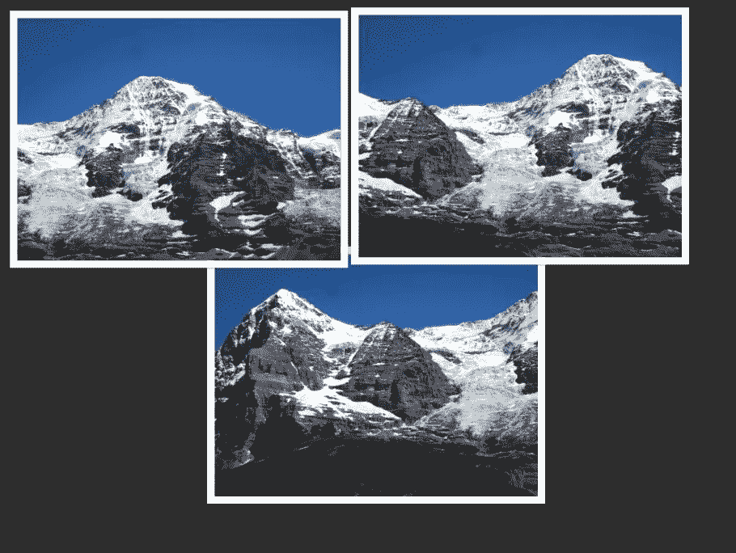
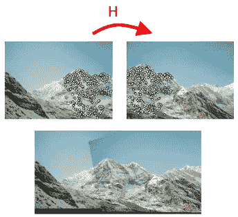
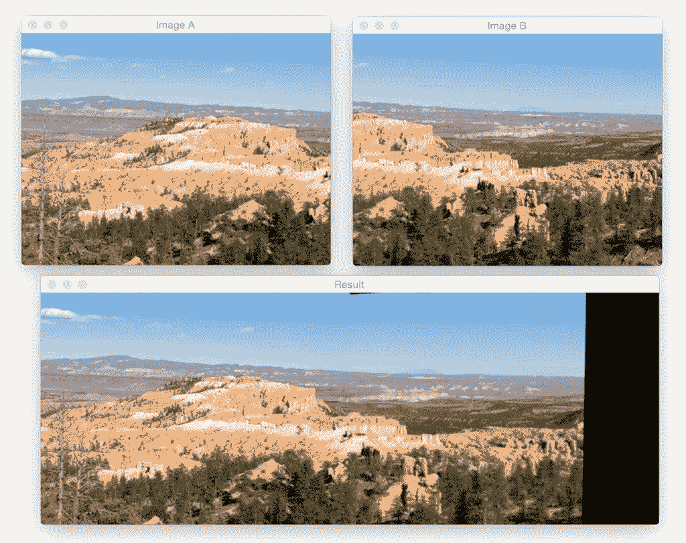
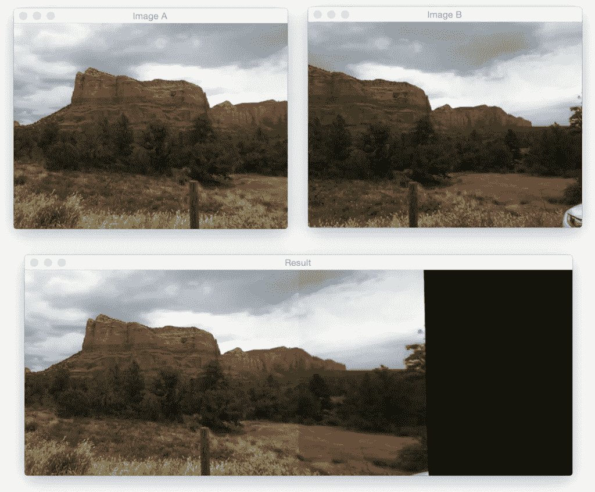

# 利用 OpenCV 的图像拼接形成全景图

> 原文：<https://medium.com/analytics-vidhya/panorama-formation-using-image-stitching-using-opencv-1068a0e8e47b?source=collection_archive---------0----------------------->



# 背景

你好，朋友们，

你们中的一些人可能知道，我正在写一系列的文章来解释今天的移动相机的各种常见功能，如全景、HDR、慢镜头、重影等。

同样，本文是我关于全景图/图像拼接的两部分文章系列的第一部分。本文将关注使用两幅图像形成全景的基础，这将在下一篇文章中使用，我们将看到如何将多幅图像拼接在一起。

# 我们开始吧

为了构建我们的图像全景，我们将利用计算机视觉和图像处理技术，例如:关键点检测和局部不变描述符；关键点匹配；RANSAC 和透视扭曲。

既然有 [***主要区别*** 如何 OpenCV 2.4.X 和 OpenCV 3。x 处理关键点检测和局部不变描述符](https://www.pyimagesearch.com/2015/07/16/where-did-sift-and-surf-go-in-opencv-3/)(比如 SIFT 和 SURF)，我已经特别注意提供与 ***和*** 两个版本兼容的代码(当然前提是你编译的 OpenCV 3 支持 opencv_contrib)。

# OpenCV 全景拼接



关键点和局部不变量提取示例

我们的全景拼接算法包括四个步骤:

*   **步骤#1:** 检测关键点(狗、哈里斯等。)并提取局部不变描述符(SIFT、SURF 等)。)来自两个输入图像。
*   **步骤#2:** 匹配两幅图像之间的描述符。
*   **步骤#3:** 使用 [RANSAC 算法](https://en.wikipedia.org/wiki/RANSAC)使用我们匹配的特征向量来估计[单应矩阵](https://en.wikipedia.org/wiki/Homography_(computer_vision))。
*   **步骤#4:** 使用从**步骤#3** 获得的单应矩阵应用扭曲变换。

我们将把所有这四个步骤封装在 panorama.py 中，其中我们将定义一个用于构建全景图的 ***Stitcher*** 类。

Stitcher 类将依赖于 [imutils](https://github.com/jrosebr1/imutils) Python 包，所以如果您的系统上还没有安装它，那么您将希望现在就安装它:

```
# import the necessary packages
import numpy as np
import imutils
import cv2
class Stitcher:
def __init__(self):# determine if we are using OpenCV v3.X
self.isv3 = imutils.is_cv3(or_better=True)
def stitch(self, images, ratio=0.75, reprojThresh=4.0,showMatches=False): # unpack the images, then detect keypoints and extract
 # local invariant descriptors from them
 (imageB, imageA) = images
 (kpsA, featuresA) = self.detectAndDescribe(imageA)
 (kpsB, featuresB) = self.detectAndDescribe(imageB) # match features between the two images
 M = self.matchKeypoints(kpsA, kpsB, featuresA, featuresB, ratio, reprojThresh) # if the match is None, then there aren’t enough matched
 # keypoints to create a panorama
 if M is None:
 return None
```

缝合方法只需要一个参数 images，这是我们将要缝合在一起形成全景图的(两个)图像的列表。

我们还可以有选择地提供 ratio，用于匹配特征时的 David Lowe 比率测试(在本教程的后面会详细介绍这个比率测试)，***repro thresh***，这是 RANSAC 算法允许的最大像素“回旋空间”，最后是 ***showMatches*** ，这是一个布尔值，用于指示关键点匹配是否应该可视化。

**第 4 行**解包图像列表(同样，我们假设它只包含两个图像)。图像列表的排序很重要:**我们希望图像按照*从左到右*的顺序提供。**如果图像是*而不是*按照这个顺序提供的，那么我们的代码仍然会运行——但是我们的输出全景图将只包含一个图像，而不是两个。

一旦我们打开了图像列表，我们调用第 5 行**和第 6 行**上的 ***检测和描述*** 方法。该方法简单地检测 ***关键点*** ，并从两幅图像中提取局部不变描述符(即 SIFT)。

给定关键点和特征，我们使用 ***匹配关键点*** ( **第 9 行和第 10 行**)来匹配两幅图像中的特征。我们将在本课稍后定义此方法。

如果返回的匹配 M 是 None，那么没有足够的关键点被匹配来创建全景，所以我们简单地返回到调用函数。

否则，我们现在准备应用透视变换:

```
# otherwise, apply a perspective warp to stitch the images
# together(matches, H, status) = M
result = cv2.warpPerspective(imageA, H,
(imageA.shape[1] + imageB.shape[1], imageA.shape[0]))
result[0:imageB.shape[0], 0:imageB.shape[1]] = imageB# check to see if the keypoint matches should be visualized
if showMatches:
vis = self.drawMatches(imageA, imageB, kpsA, kpsB, matches,status)# return a tuple of the stitched image and the
# visualization
return (result, vis)# return the stitched image
return result
```

假设 M 不为 None，我们在第 30 行**解包元组，给出关键点匹配的列表，从 RANSAC 算法导出的单应矩阵 H，以及最后的状态，指示使用 RANSAC 成功地空间验证了匹配中的哪些关键点的索引列表。**

给定我们的单应矩阵 H，我们现在准备将两幅图像缝合在一起。首先，我们调用***cv2 . warp perspective***，它需要三个参数:我们要扭曲的图像(在本例中是*右*图像)、 *3 x 3* 变换矩阵(H)，最后是输出图像的形状。我们通过对两幅图像的宽度求和，然后使用第二幅图像的高度，从输出图像中导出形状。

**第 2 行**检查我们是否应该可视化关键点匹配，如果是，我们调用 ***drawMatches*** 并将全景和可视化的元组返回给调用方法(**第 9–14 行**)。

否则，我们只需返回拼接后的图像(**第 17 行**)。

现在已经定义了 stitch 方法，让我们看看它调用的一些辅助方法。我们将从 ***检测开始，描述*** :

```
def detectAndDescribe(self, image):# convert the image to grayscale
gray = cv2.cvtColor(image, cv2.COLOR_BGR2GRAY)# check to see if we are using OpenCV 3.X
if self.isv3:# detect and extract features from the image
descriptor = cv2.xfeatures2d.SIFT_create()
(kps, features) = descriptor.detectAndCompute(image, None)# otherwise, we are using OpenCV 2.4.X
else:# detect keypoints in the image
detector = cv2.FeatureDetector_create(“SIFT”)
kps = detector.detect(gray)# extract features from the image
extractor = cv2.DescriptorExtractor_create(“SIFT”)
(kps, features) = extractor.compute(gray, kps)# convert the keypoints from KeyPoint objects to NumPy
# arrays
kps = np.float32([kp.pt for kp in kps])# return a tuple of keypoints and features
return (kps, features)
```

顾名思义，detectAndDescribe 方法接受图像，然后检测关键点并提取局部不变描述符。在我们的实现中，我们使用了 [**高斯差分**](http://www.cs.utexas.edu/~grauman/courses/fall2009/papers/local_features_synthesis_draft.pdf) (狗)关键点检测器和 [**SIFT 特征提取器**](https://en.wikipedia.org/wiki/Scale-invariant_feature_transform) **。**

在**第 5 行**上，我们检查是否正在使用 OpenCV 3.X。如果是，那么我们使用***cv2 . xfeatures 2d . SIFT _ create 函数*** 来实例化我们的狗关键点检测器和 SIFT 特征提取器。对 ***检测器和计算机*** 的调用处理提取关键点和特征(**行 54 和 55** )。

需要注意的是，你 ***必须*** 已经编译了 OpenCV 3。x 与[***opencv _ contrib***](https://github.com/itseez/opencv_contrib)支持使能。否则，您将得到一个错误，如 AttributeError:“模块”对象没有属性***“xfeatures 2d”***。如果是这样的话，请前往我的 [***OpenCV 3 教程页面***](https://www.pyimagesearch.com/opencv-tutorials-resources-guides/) ，在那里我将详细介绍如何安装 OpenCV 3，并为各种操作系统和 Python 版本启用***OpenCV _ contrib***支持。

如果我们使用 OpenCV 2.4，第 11–18 行处理。**cv2*。FeatureDetector_create 函数*** 实例化我们的关键点检测器(DoG)。调用 detect 返回我们的关键点集。

从那里，我们需要初始化 ***cv2。使用 SIFT 关键字设置我们的 SIFT 特征提取器。调用提取器的 compute 方法会返回一组特征向量，这些向量量化了图像中每个检测到的关键点周围的区域。***

最后，我们的关键点从关键点对象转换成一个 NumPy 数组(**行 69** )并返回给调用方法(**行 72** )。

接下来，我们来看看 ***匹配关键点*** 的方法:

```
def matchKeypoints(self, kpsA, kpsB, featuresA, featuresB,
ratio, reprojThresh): # compute the raw matches and initialize the list of actual
     # matches
     matcher = cv2.DescriptorMatcher_create(“BruteForce”)
     rawMatches = matcher.knnMatch(featuresA, featuresB, 2)
     matches = [] # loop over the raw matches
     for m in rawMatches:
        # ensure the distance is within a certain ratio of each
        # other (i.e. Lowe’s ratio test)
        if len(m) == 2 and m[0].distance < m[1].distance * ratio:
           matches.append((m[0].trainIdx, m[0].queryIdx)) # computing a homography requires at least 4 matches
     if len(matches) > 4:
        # construct the two sets of points
        ptsA = np.float32([kpsA[i] for (_, i) in matches])
        ptsB = np.float32([kpsB[i] for (i, _) in matches]) # compute the homography between the two sets of points
     (H, status) = cv2.findHomography(ptsA, ptsB, cv2.RANSAC,
 reprojThresh) # return the matches along with the homograpy matrix
     # and status of each matched point
     return (matches, H, status) # otherwise, no homograpy could be computed
     return None
```

***匹配关键点*** 函数需要四个自变量:与第一图像相关联的关键点和特征向量，随后是与第二图像相关联的关键点和特征向量。还提供了 David Lowe 的比率测试变量和 RANSAC 重投影阈值。

将特征匹配在一起实际上是一个相当简单的过程。我们简单地循环两个图像的描述符，计算距离，并找到每对描述符的最小距离。由于这是计算机视觉中非常常见的做法，OpenCV 有一个内置函数叫做 ***cv2。descriptor matcher _ create***为我们构造了特征匹配器。BruteForce 值表示我们将*彻底地*计算来自两幅图像的*所有特征向量*之间的欧几里德距离，并找到具有最小距离的描述符对。

对第 5 行**上的 knnMatch 的调用使用 *k=2* 在两个特征向量集之间执行 [***k-NN 匹配***](https://en.wikipedia.org/wiki/K-nearest_neighbors_algorithm) (指示返回每个特征向量的前两个匹配)。**

我们想要前两个匹配而不仅仅是前一个匹配的原因是因为我们需要应用 David Lowe 的比率测试来进行假阳性匹配修剪。

再次，**第 5 行**计算每对描述符的原始匹配——但是有可能这些对是假阳性的，这意味着图像补片实际上不是真正的匹配。在尝试修剪这些假阳性匹配时，我们可以单独循环每个原始匹配(**第 9 行**)，并应用 Lowe 比率测试，该测试用于确定高质量的特征匹配。劳氏比的典型值通常在*【0.7，0.8】*范围内。

计算两组点之间的单应性最少需要*四个匹配的初始组*。对于更可靠的单应性估计，我们应该具有实质上不止四个匹配点。

最后，我们的 Stitcher 方法中的最后一个方法 drawMatches 用于可视化两幅图像之间的关键点对应关系:

```
def drawMatches(self, imageA, imageB, kpsA, kpsB, matches, status):
    # initialize the output visualization image
    (hA, wA) = imageA.shape[:2]
    (hB, wB) = imageB.shape[:2]
    vis = np.zeros((max(hA, hB), wA + wB, 3), dtype=”uint8")
    vis[0:hA, 0:wA] = imageA
    vis[0:hB, wA:] = imageB # loop over the matches
    for ((trainIdx, queryIdx), s) in zip(matches, status):
       # only process the match if the keypoint was successfully
       # matched
       if s == 1:
         # draw the match
         ptA = (int(kpsA[queryIdx][0]), int(kpsA[queryIdx][1]))
         ptB = (int(kpsB[trainIdx][0]) + wA, int(kpsB[trainIdx][1]))
         cv2.line(vis, ptA, ptB, (0, 255, 0), 1) # return the visualization
    return vis
```

该方法要求我们传入两幅原始图像、与每幅图像相关联的一组关键点、应用劳氏比率测试后的初始匹配，以及最后由单应性计算提供的状态列表。使用这些变量，我们可以通过从第一幅图像中的关键点 *N* 到第二幅图像中的关键点 *M* 画一条直线来可视化“内侧”关键点。

现在我们已经定义了 Stitcher 类，让我们继续创建 stitch.py 驱动程序脚本:

```
# import the necessary packages
from pyimagesearch.panorama import Stitcher
import argparse
import imutils
import cv2# construct the argument parse and parse the arguments
ap = argparse.ArgumentParser()
ap.add_argument(“-f”, “ — first”, required=True,
 help=”path to the first image”)
ap.add_argument(“-s”, “ — second”, required=True,
 help=”path to the second image”)
args = vars(ap.parse_args())# load the two images and resize them to have a width of 400 pixels
# (for faster processing)
imageA = cv2.imread(args[“first”])
imageB = cv2.imread(args[“second”])
imageA = imutils.resize(imageA, width=400)
imageB = imutils.resize(imageB, width=400)# stitch the images together to create a panorama
stitcher = Stitcher()
(result, vis) = stitcher.stitch([imageA, imageB], showMatches=True)# show the images
cv2.imshow(“Image A”, imageA)
cv2.imshow(“Image B”, imageB)
cv2.imshow(“Keypoint Matches”, vis)
cv2.imshow(“Result”, result)
cv2.waitKey(0)
```

我们从在**2–5 号线**进口我们需要的包装开始。请注意，我们如何将 panorama.py 和 Stitcher 类放入 pyimagesearch 模块中，只是为了保持代码整洁。

***注意:*** *如果你在阅读这篇文章时遇到了组织代码的困难，请务必使用这篇文章底部的表格下载源代码。的。代码下载的 zip 文件将立即运行，不会出现任何错误。*

从那里，**第 8–14 行**解析我们的命令行参数:—首先，这是全景图中第一幅图像的路径(最左边的*图像)，其次，是全景图中第二幅图像的路径(最右边的*图像)。

**记住，这些图像路径需要按照*从左到右*的顺序提供！**

# **全景拼接结果:**


两幅图像之间匹配的关键点对应关系。

上图显示了两幅图像之间的关键点关系。您可以观察到，代码很容易识别两幅图像之间的所有关键点，并且使用这些图像，它可以很容易地缝合图像。



在上面的输入图像中，我们可以看到两幅输入图像之间有很大的重叠。全景图的主要增加部分是在拼接图像的右侧，我们可以看到更多的“突出部分”被添加到输出中。



现在你有了，使用 Python 和 OpenCV 的图像拼接和全景图构建！

# 总结:

在这篇博文中，我们学习了如何使用 OpenCV 执行图像拼接和全景构建。为*OpenCV 2.4 和 OpenCV 3 提供了图像拼接的源代码。*

我们的图像拼接算法需要四个步骤:(1)检测关键点和提取局部不变描述符；(2)图像间的描述符匹配；(3)应用 RANSAC 估计单应矩阵；以及(4)使用单应矩阵应用扭曲变换。

虽然简单，但在为两幅图像构建全景图时，该算法在实践中效果很好。在未来的博客文章中，我们将回顾如何构建全景图，以及如何为两张以上的图像执行图像拼接。

无论如何，我希望你喜欢这篇文章！