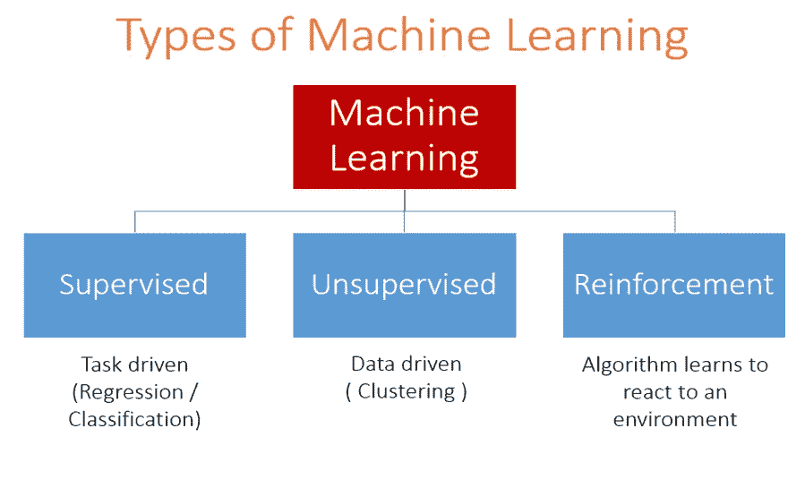
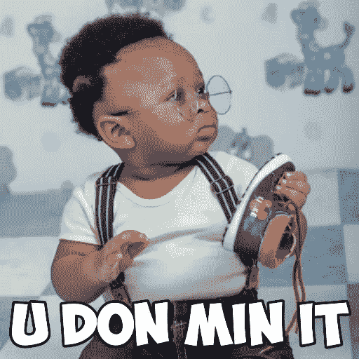
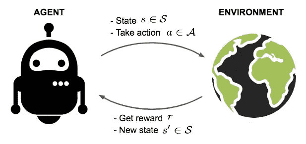
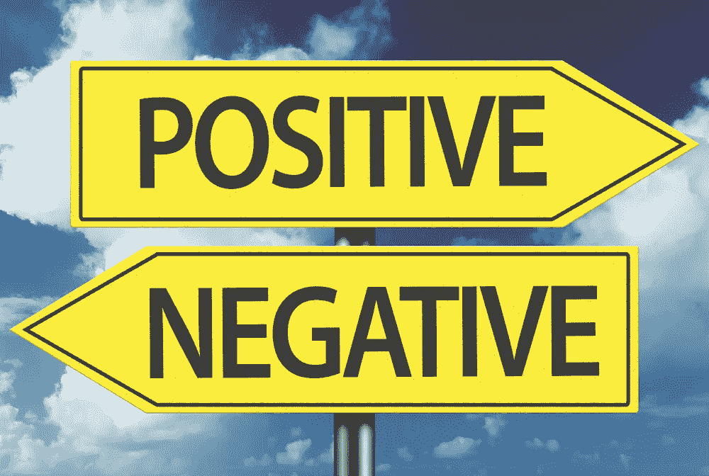
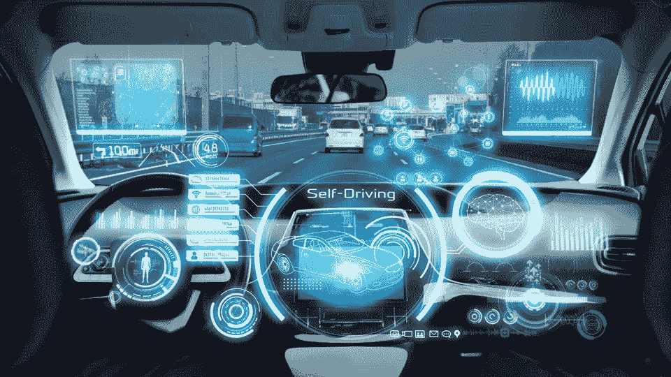
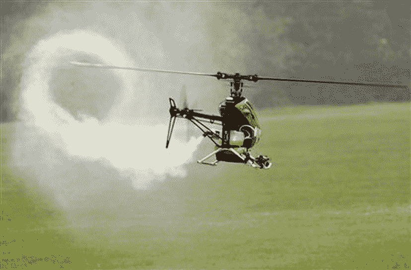
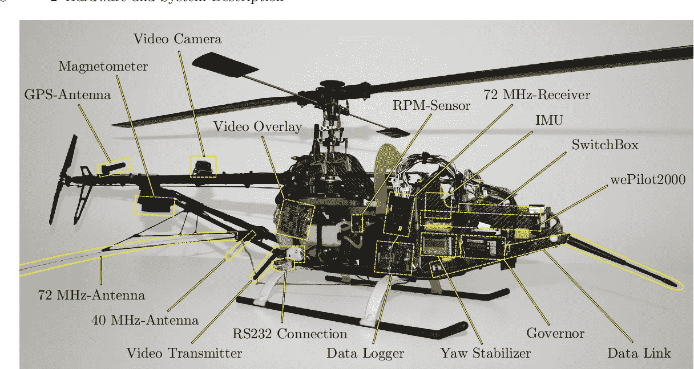

# 强化学习全景

> 原文：<https://medium.com/analytics-vidhya/panorama-of-reinforcement-learning-756c59c432f3?source=collection_archive---------17----------------------->

马库斯·斯皮斯克在 [Unsplash](https://unsplash.com?utm_source=medium&utm_medium=referral) 上的照片

你想象过强化学习背后的洗牌吗？

有些人对事物有特定的聚焦方式，有些人把他们的眼镜对准一个针孔，只聚焦在他们的目标上。其他人有一个巨大的奇观，他们可以看到全景。我是那种针孔样的人。

请和我一起浏览我在 [**数据科学尼日利亚**](https://www.datasciencenigeria.org/) 的实习出版物，在那里我接触到了该领域的顶级行业专家，我们都朝着一个目标前进 ***在 10 年内培养 100 万名人工智能人才。*** *不要被*遗漏，你也可以加入移动的 [**列车**](https://www.datasciencenigeria.org) 。

**大纲:**

*   **什么是机器学习？**
*   **强化学习与其他形式的机器学习技术有何不同？**
*   **强化学习术语(代理、动作、状态、环境和奖励)**
*   **正反强化学习**
*   **强化学习的应用**

# **什么是机器学习？**

照片由[凯尔·西蒙斯](https://unsplash.com/@kas923?utm_source=medium&utm_medium=referral)在 [Unsplash](https://unsplash.com?utm_source=medium&utm_medium=referral) 上拍摄

机器学习有时也用于人工智能。同时，它们是不同的方面，但似乎有相似的特征。

[维基百科](https://en.wikipedia.org/wiki/Machine_learning)对机器学习的定义是“是[算法](https://en.wikipedia.org/wiki/Algorithm)和[统计模型](https://en.wikipedia.org/wiki/Statistical_model)的[科学研究](https://en.wikipedia.org/wiki/Branches_of_science)，这些算法和[统计模型](https://en.wikipedia.org/wiki/Statistical_model)被[计算机系统](https://en.wikipedia.org/wiki/Computer_systems)用来在不使用明确指令的情况下，依靠模式和[推理](https://en.wikipedia.org/wiki/Inference)来代替。”

但如果我说，**机器学习是**一个研究领域，它使计算机能够从数据中学习，使用算法和统计模型完成特定任务，而无需显式编程。如果你仍然广泛地检查机器学习的所有其他定义，你会注意到所有人都在说同样的事情，但只是从不同的角度来看，他们都在谈论计算机收集数据(输入)，使用统计模型等从数据中学习(预处理)，最后我们有我们预测的结果(输出)。

机器学习可以分为三种类型:

来源:vidhya 分析

**监督学习:**这是一种机器学习，你有输入变量和输出变量，你使用一种算法来学习从输入到输出的映射函数。

**无监督学习:**这是一种只有输入数据，没有对应输出变量的机器学习。

**强化学习:**这是一种机器学习，算法学习对环境做出反应。

机器学习作为各种应用，如情感分析、电子邮件垃圾邮件检测、电子商务网站使用的推荐引擎等。

# 强化学习与其他类型的机器学习有什么不同？

> “婴儿学会爬、走，然后跑。在应用机器学习方面，我们正处于爬行阶段。”~戴夫·沃特斯

我们举个例子。你是怎么学会骑自行车的？有人告诉你如何乘车，而你只是按照指示去做吗？是什么样的学问？有些人有一种误解，认为这是**监督学习**，他们给出的理由是，当我开始骑自行车时，我叔叔抱着我，他在告诉我该做什么，等等。

充其量，他们只能告诉你小心，不要从自行车上掉下来，小心。那不算监督。如你所知，**监督学习**是指你准备好骑自行车，有人给你准确的步骤，比如用 5 磅的压力压下你的左脚。必须有人给你准确的控制信号让你骑自行车。现在你可能会想，如果有人给出这种指示，孩子永远也学不会骑自行车。

于是，人们马上说它是**无监督学习**。他们现在给出的理由是没有人告诉他们如何骑自行车。但是我们来分析一下这个。如果这真的是**无监督学习**，那么这意味着孩子们观看数百个其他骑自行车的人以及他们如何骑自行车的视频，找出模式，然后坐下来骑自行车并重复它。那本质上就是**无监督学习**；你有大量的数据，你找出模式，并尝试执行这些模式。

骑自行车不是这样的！你得下来试着自己骑。如何学习骑自行车？既不是**监督学习也不是**非监督学习。这是**强化学习**，你通过试错来学习。在这个学习过程中，告诉我们做得有多好的反馈信号要么是疼痛…哎哟！我摔倒了！好痛！下次我会避免导致这种情况的发生！还是奖励…哇！我在骑自行车！这感觉太棒了！我只需要继续做我现在正在做的事情。

通过这个例子，我们可以看到强化学习与其他机器学习技术有很大不同。

# **强化学习要素(状态、主体、环境和奖励)**

[https://lilian Weng . github . io/lil-log/2018/02/19/a-long-peek-into-reinforcement-learning . html](https://lilianweng.github.io/lil-log/2018/02/19/a-long-peek-into-reinforcement-learning.html)

*   **Agent:** 它是一个假想的实体，在一个环境中执行动作以获得某种报酬。
*   **环境(e):** 一个智能体要面对的场景。
*   **报酬:**当代理人执行特定的行动或任务时，给予他或她立即的回报。
*   **状态:**状态是指环境返回的当前情况。
*   **Policy (π):** 它是一种策略，由代理根据当前状态来决定下一步的行动。
*   **Value (V):** 相对于短期回报，预期长期回报有折扣。
*   **价值函数:**它指定一个状态的价值即奖励的总额。它是一个从那个状态开始就应该被期待的代理。
*   **环境模型:**这模仿了环境的行为。它有助于你做出推论，也有助于你决定环境的行为方式。
*   **基于模型的方法:**这是一种使用基于模型的方法来解决强化学习问题的方法。
*   **Q 值或动作值(Q):** Q 值与值颇为相似。两者之间唯一的区别是，它将一个额外的参数作为当前操作。

# **正负强化学习**

[https://elearning . easy generator . com/public/85087-Company-Values/](https://elearning.easygenerator.com/public/85087-Company-Values/)

**正强化**

*   **正向强化指的是**当某个事件因某个特定行为而发生时，增加该行为的强度和频率。换句话说，它对行为有积极的影响。一个理解概念的例子，经过努力学习，你在班上取得了第一名。现在你知道你的善举会带来积极的回报，那么你会越来越努力地继续这些善举。

**负强化学习**

*   **负强化意味着**得到负面的奖励，或者当你采取行动时得到一些不合意的东西。例如，你和你的家人去足球场踢足球，但你光着脚踢球，在这个过程中受伤了，所以继续踢球是不舒服的。下次你不穿足球鞋去球场踢足球，肯定又会不舒服。第三次你去球场时，带上你的足球鞋，通过这些动作，消极因素被消除了。

# **强化学习的应用**

强化学习的范围不时扩大。这部分是写给综合型读者的。

**自动驾驶(自动驾驶汽车)**

[https://in . Mashable . com/science/8657/researchers-develop-cross-car-games-for-autonomous-cars](https://in.mashable.com/science/8657/researchers-develop-cross-car-games-for-autonomous-cars)

自动驾驶汽车不再是科幻小说了。像丰田和福特这样的组织已经为 R&D 在这项技术上投入了数百万美元。

优步、Taxify、bolt 等目前向人类司机付费的出租车服务公司可能很快就会部署整个无人驾驶车队。在未来两到三年内，数十万辆自动驾驶汽车可能会出售给普通消费者。

谷歌在这方面也处于领先地位。谷歌自动驾驶汽车项目叫 Waymo 它代表了一种新的移动方式。

奥迪(2020 年)、福特(2021 年)、通用汽车(2020 年)、宝马(2021 年)、丰田(2020 年)、捷豹(2024 年)和日产(2020 年)等机构都在计划推出自动驾驶汽车。

**特技飞行自主直升机**

[https://www . Reuters . com/article/us-helicopter-robot-odd/self-flying-helicopter-gets-off-ground-idusn 1532338820080916](https://www.reuters.com/article/us-helicopter-robot-odd/self-flying-helicopter-gets-off-ground-idUSN1532338820080916)

斯坦福大学的计算机科学家成功创建了一个人工智能系统，可以让机器人直升机学习并表演高难度特技，同时观看其他直升机表演相同的目的。这就产生了自主直升机，它可以自己表演完整的特技飞行表演，酷吧！！！。

控制自主直升机飞行是最具挑战性的

[https://www . semantic scholar . org/paper/Modeling % 2C-guidance % 2C-and-control-of-aerobatic-of-an-Gerig/b 85560560 FB 42 D4 a 178 F8 e 66079 dffa 3 e 7469867](https://www.semanticscholar.org/paper/Modeling%2C-guidance%2C-and-control-of-aerobatic-of-an-Gerig/b85560560fb42d4a178f8e66079dffa3e7469867)

问题。尽管如此，人类专家可以通过广泛的计划可靠地驾驶直升机，包括特技飞行计划。

它是如何工作的？通过对最优控制问题进行强化学习，优化了模型和奖励函数。

**TD-Gammon**

[https://commons.wikimedia.org/wiki/File:Backgammon_lg.png](https://commons.wikimedia.org/wiki/File:Backgammon_lg.png)

TD-Gammon 是一种广泛使用的计算机双陆棋程序，开发于 1992 年。TD-Gammon 是一个神经网络，它自学玩双陆棋，并通过与自己玩游戏来改进其策略，并从结果中学习。这是一个很好的例子

一种强化学习算法。TD-Gammon 从随机的初始权重(以及随机的初始策略)开始，最终发展出强大的游戏水平。虽然原始描述

给出了棋盘的状态，但是由于内置了零信息，系统可以自学并发展出很强的中级水平的游戏能力。

此外，通过额外的手工制作功能，该系统表现出色。

[https://www . vector stock . com/royalty-free-vector/robotic-hand-with-heart-vector-27384593](https://www.vectorstock.com/royalty-free-vector/robotic-hand-with-heart-vector-27384593)

我想在这里画出屏幕，但你可以浏览更多关于强化学习的应用，因为这只是对什么是强化以及提供什么的概述。

请继续关注我的下一篇关于强化学习介绍的实践方面的文章:)