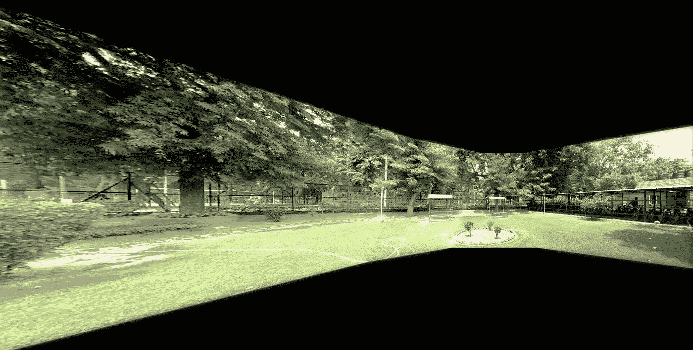

# 全景重建。

> 原文：<https://medium.com/analytics-vidhya/panoramic-reconstruction-ab9fa35a38ef?source=collection_archive---------10----------------------->

## 一个完全自动化的管道来缝合您的图像。

我希望你不要指望一次快门点击就能立刻捕捉到所有的美景。你猜怎么着？我们只需点击多个图像，然后将它们组合起来。我们就是这样一直看到遥远星系和行星的图像的。组合从不同时间和地点点击的多个图像。

当然，你可以直接去看代码。下面是 [*环节*](https://github.com/peek1999/Image-Stitching) 。

# 引言。

图像拼接的过程是具有 4 个阶段的流水线。

*   特征检测。
*   特征匹配。
*   全球一致。
*   混合。

让我们详细检查一下这些。

# 特征检测。

一般来说，你是如何识别任何事物的？你记得一些与众不同的*关于那个东西的“特征”。一些你能再次认出的东西。类似地，我们希望识别图像中的一些点/像素/位置，当图像在比例、角度、定位、光照、曝光等方面发生变化时，这些点/像素/位置可以保持一致。*

*我们表示这些特征的方式是使用一个叫做 ***“特征向量”的向量。****

*OpenCV 为我们提供了多种检测和描述特征的方法。这些是筛，冲浪，圆形，轻快。我用过 SIFT，但是你可以试着找出适合你的。*

*如果你需要重温 SIFT，你可以看看这篇文章。*

*让我们看看这个的代码。*

*这是属于“featureExtractor”类的方法，其实例是之前使用的“features”。*

*上面的这个函数用于查找所有图像中的特征，并在原始图像中定位它们。*

*这是属于“featureExtractor”类的方法，其实例是之前使用的“features”。*

*让我们看看从这些函数中我们得到了什么。*

****

*1.jpg，2.jpg*

****

*3.jpg，4.jpg*

*到目前为止，我们已经定位了所有输入图像中的特征，并找出了它们的代表性特征向量。*

# *特征匹配。*

*通常，我们可以使用欧几里德距离或点积或其他统计方法来匹配两个向量。但是我们将使用一种叫做“Flann Matcher”的东西，它更适合这个任务。一旦我们在两幅图像之间有足够数量的匹配，我们就可以使用 RANSAC 估计器来估计它们之间的单应变换。你可以在这里 阅读更多关于 Flann Matcher [*。*](https://docs.opencv.org/3.4/d5/d6f/tutorial_feature_flann_matcher.html)*

*如果输入图像从 0 到 n-1 编号，我们可以用 n*n 矩阵表示每对图像之间的匹配数。对于之前显示的图像，结果是这样的。*

> ***[[ 0，204，74，233]，[204，0，306，42]，[ 74，306，0，0]，[233，42，0，0]]***

*相同的代码如下所示。*

*此方法是使用类“transformExtractor”实例的文件“panorama.py”的一部分。*

*让我们看看我们能识别的匹配。*

********

*配对之间的 Flann 匹配。*

# *单应估计。*

**在下一部分，我需要读者多一点关注！:)**

*现在我们有了成对的单应性。假设这些是 H_01，H_02，H_03，H_12，H_13，H_23。注意，H_01 指的是将图像 0 变换到图像 1 的参考帧的单应性。*

*   *为了创建一个单一的全景图像，我们基本上是在试图重现单个相机可能看到的东西。所以我们试图根据给我们的图像之一来改变我们的图像。*
*   *选择中心图像作为参考是完全合理的，因为每个图像需要经历的平均变化量将被最小化，从而在所有变换之后产生最大的输出均匀性。*
*   *故障来了！我们不知道顺序。*

*我想出了一个算法，在某种程度上类似于 k-means 算法来找到这个顺序。请记住前面显示的代表每对匹配数量的矩阵。姑且称之为“探路者”。*

> ***[[ 0，204，74，233]，[204，0，306，42]，[ 74，306，0，0]，[233，42，0，0]]***

***在图像中寻找顺序。***

*   *选择一个随机图像作为中心图像。假设是 0。*
*   *从矩阵的行中找出最匹配的。233 对吗？*
*   *我现在肯定地知道 0 和 3 相邻出现，但是它是 0–3 还是 3–0 呢？Idk。我们会考虑的。现在我们先说 0–3。*
*   *现在你的列表中有 2 个元素，找出谁与 0 最匹配，谁与 3 最匹配。避免考虑已经在你的列表中的图片。如果已经获得了图像的最佳匹配，则选择下一个最佳匹配。0 的最佳匹配结果是 1，对应于 204 个匹配，3 的最佳匹配结果是 1，对应于 42 个匹配。*
*   *由于 204>42，0 获胜并在它的左侧获得图像 1，因此到目前为止顺序为{1，0，3}。如果 3 赢了，1 将有权发出命令{0，3，1}。*
*   *现在重复相同的过程，选择 1，3 作为支点，找出顺序，直到列表达到最大可能大小。最终的顺序是{2，1，0，3}。*
*   *一旦获得了完整的列表，我们需要验证我们一开始选择 0 作为中心图像的假设。我们用上一步获得的图像列表的中心来更新 0。以此为中心图像，重复整个过程。3 次迭代将会给你精确的顺序，如果不是 2 次的话。*

> ***重要-1:我们需要担心我们在这个算法中错过的最后一件事。我们不知道上面得到的顺序是图像从左到右的顺序还是从右到左的顺序。如果我们在第一步中选择 3–0 而不是 0–3，输出顺序将与我们现在得到的完全相反。***

***相对于基础图像变换所有图像。***

*   *让我们找出选择从上述算法接收的顺序的中心图像的变换，现在担心它现在是 l-r 还是 r-l。*
*   *我们对 pathFinder 算法做了一个小小的改变，我们记录了帮助我们建立完整列表的图像对。例如，0 的最佳匹配结果是 3。所以，(0，3)是一对。然后下一个最好的结果是 1 比 0。所以(0，1)是另一对。*

> ***重要-2:为什么需要这样做？待说明。***

*   *我们将最终相对于中心图像变换所有的图像。让我们在这里这样做，并假设顺序{2，1，0，3}从左到右。*
*   *选择 1 作为基础图像，相对于 1 变换其他图像。*
*   *对于图像 2，我们知道 H_12 读作“1 看到的图像 2”。*
*   *对于图像 0，我们知道 H_01 读作“0 看到的图像 1”。我们需要逆变换为逆(H_01)。*
*   *对于图 3，我们知道 H_13 仍然是 H_13。*

> *重要-3:这里有一个问题。待说明。*

*   *我们通过简单的计算逆(H_01)*Image(0)就知道了 image 0 看起来应该是怎样的 1。仅对图像 0 的中心进行相同的操作将给出其变换后的位置。将其与中心图像的位置进行比较。如果发生在右侧，则**重要-1 中的假设为真。否则，颠倒你假设的顺序。***
*   *我们计算了图像 3 在 1 看来像 H_13，但是你不想使用这个值，因为它不会给出很好的结果。远离中心出现的图像在变换时会变形。这就是为什么你要把 H_13 看成是单应矩阵上的一系列级联运算。H_13 =逆(H_01)*H_03。可以这样理解，当 1 看到的图像 0 与 0 看到的图像 3 级联时，1 会看到图像 3。为此，我们需要维护**重要-2 中提到的线对。**这也是**重要-3 中强调的问题。***

*现在我们可以放松了！*

***到目前为止我们做了什么？***

*   *我们已经确定了图像中的正确顺序。*
*   *我们还确定了基本图像。*
*   *我们知道如何在基本图像的参考系中变换其余的图像。*
*   *我们现在要做的就是缝合和融合它们。*

# *缝合。*

***我们不想做什么？***

*我们不想一次缝合一个图像！您可以在多个地方找到这种方法，但这不会每次都给你可靠的结果。如果数据中的图像数量很大，将会过度拉伸最右边和最左边的图像。*

> *重要提示-4:我们将创建一个单独的大平面，并将所有东西都投影到上面。*

*可以这样想，你有一个大小为 400*400*3 的中心图像。现在我们坐的飞机是 4000*4000*3 的。我们可以把第一张图片放在这个平面的中心。(注意这是翻译操作。)类似地，在我们的情况下，对于所有图像 0，2，3，我们可以平移所计算的单应性，并将这些图像投影到该平面上。我们不需要担心实际拼接它们或者寻找交叉点等等。*

*我们最终会看到的是，*

********

*如果我们把这些加起来会怎么样？你会看到全景。哇！*

**

*拼接图像。*

*我们在这里看到一条可见的接缝。我们可以通过混合来去除。我使用了拉普拉斯算子，但是你也可以使用其他的技术，比如阿尔法，图形切割等等。*

*应用拉普拉斯混合并通过简单的平均强度来平衡曝光可以为你提供无缝的结果，如下所示。您可以在 Git 上查看相同的代码。如果你弄清楚拉普拉斯混合的遮罩是如何从代码中生成的，那将会很有趣。在这篇文章中讨论这个似乎有点过头了。*

**