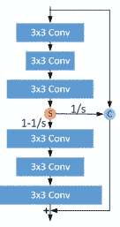

# 论文分析 1:使用 IDN 网络的单幅图像超分辨率[CVPR 2018]

> 原文：<https://medium.com/analytics-vidhya/paper-analysis-1-fast-and-accurate-single-image-super-resolution-using-idn-network-cvpr-2018-8db365d48fa2?source=collection_archive---------17----------------------->

*原文:*

# ***简介:***

*已经提出了大量的单幅图像超分辨率方法，主要是插值方法、重建方法以及示例方法。插值方法具有高的重建效率，因为它们使用 CNN 模型，但是这些方法也具有一些缺点*

1.  *它们具有很高的计算复杂度和很高的内存消耗。*
2.  *从卷积层出来的特征图被不加区别地直接传递到顺序网络，即每个特征图被赋予相同的权重。通俗地说，没有给出足够信息的特征地图也被赋予与给出图像的高价值特征的特征地图相同的重要性。([更多信息请参考挤压和激励网络研究论文](https://arxiv.org/pdf/1709.01507.pdf))*

*为了防止这些缺点，提出了 IDN(信息提取网络),因为与插值方法相比，它使用较少数量的滤波器来提供更快的性能。*

**

*图 1:信息提取网络架构*

*因此，这种方法有一个**特征提取**块，其中使用一系列卷积层从低分辨率( **LR** )图像中提取特征，随后是堆叠的多个**提取**块以提取残留信息，随后是**重构**块以获得高分辨率( **HR** )残留图像。*

*为了获得 HR 图像，我们对残差图像和上采样的 LR 图像进行元素相加操作(使用双三次插值)。*

*蒸馏装置由两个网络组成:*

1.  ****增强网络****
2.  ****压缩网络****

# ***网络结构:***

1.  ****特征提取*** :通过将图像经过一系列卷积层来提取特征。*

*所以数学上可以表示为:*

**

*等式 1:输入图像的特征提取*

***x** :输入图像到特征提取块*

***f** :特征提取*

***B₀** :提取特征*

*2. ***提取块*** :这个块是架构的核心，在这里特征提取后的特征图被增强，然后被提取以给出残留信息。*

**

*等式 2:蒸馏块*

***Fₖ** :第 k 个蒸馏块功能*

***Bₖ₋₁** :第 k 蒸馏块输入*

***Bₖ** :第 k 蒸馏块产量*

*该区块由两个网络组成:*

***增强网络**:增强单元由 2 个卷积网络组成，每个网络为 3 层模块。特征地图分为两部分，一部分表示短路径特征，另一部分表示长路径特征(参见下图)。*

**

*图 2:增强网络*

*长路径特征基本上是增强的短路径特征。然后将两个特征图组合在一起，以获得更丰富和有效的信息。因此，增强单元是为了提高网络的表示能力，而压缩网络是为了从增强单元的输出中滤除不想要的信息。*

*长路径特征是输入图像的增强特征，但是当图像通过六个卷积层时，有可能遗漏任何重要的信息，因此长路径特征和短路径特征的连接是必要的，因为短路径特征包含部分保留的信息，这些信息将填补任何重要的遗漏特征的空白。*

*增强单元的输入通过一个卷积网络，其后是一个泄漏的 ReLU(或 LReLU)。由于有 6 层，第 I 层的特征映射维数可以表示为 Dᵢ (i = 1，…。,6).*

*第三卷积层的输出通过激活函数，并被分成两部分。*

*我们已经提到，特征提取后输入到蒸馏块作为 Bₖ₋₁.*

*因此，我们可以将第三卷积层之后的输出表示为:*

**

*等式 3:短路径的输出*

*其中 Pk1:第 k 个增强单元中第一个卷积网络(短路径)的输出*

***Ca** :链式卷积层*

*在短路径之后，Pk1 的 D3/s 维度和第一卷积 layer(Bₖ₋₁的输入)被连接*

**

*等式 4:分割 Pk1 并连接*

***Rk** :切片后输出*

***C** :串联*

*对于长路径:*

**

*等式 5:长路径的输出*

***Cb** :卷积运算*

***Pk2** :长路径通过第二卷积网络后的输出*

*所以 **Pk** = Pk2 + Rk*

**

*等式 6:组合级联要素和长路径要素*

***压缩单元**:它是一个 1x1 卷积层，用于降维和提取相关信息。*

**

*等式 7:压缩单位*

*3. ***重构块*** :它是卷积层的一系列转置(参考图 1)。*

*因此，该架构的总体等式可以写成:*

**

*等式 8:模型的总输出*

***U** :原始图像的双三次插值*

***R** :重建块*

# ***损失函数:***

**

*等式 9 : MSE 损失*

*早期的超分辨率模型通常存在 MSE 损失，实验结果并不理想。*

**

*等式 10 : MAE 损失*

*在这个模型中，我们使用两个损失函数。可以看出，MSE 损失可以提高具有 MAE 损失的训练网络的性能。因此，该模型用 MAE 损失训练，然后用 MSE 损失微调。*

# ***实验及结果:***

*使用的数据集是**伯克利分割数据集***

*结果是这样的*

**

*结果 1:剩余图像及其数据分布*

*增强单元的特征图可以通过绘图来观察。*

**

*结果 2:平均特征图的可视化*

*因此，让我们来看看这个模型与其他模型相比表现如何。*

**

*结果 3:IDN 与其他方法的比较*

# ***结论:***

*因此，在信息提取网络的帮助下成功地实现了单幅图像的超分辨率，其中增强单元增强有用的特征，压缩单元滤除不需要的特征，最后重建图像。*

# *参考资料:*

1.  *[https://arxiv.org/pdf/1803.09454.pdf](https://arxiv.org/pdf/1803.09454.pdf)*
2.  *[https://ieeexplore.ieee.org/document/8913994/](https://ieeexplore.ieee.org/document/8913994/)*
3.  *[https://github.com/jangsoopark/IDN-TensorFlow](https://github.com/jangsoopark/IDN-TensorFlow)*
4.  *[https://github.com/Zheng222/IDN-Caffe](https://github.com/Zheng222/IDN-Caffe)*