# 论文分析 2:利用残差密集网络的图像超分辨率[CVPR 2018]

> 原文：<https://medium.com/analytics-vidhya/paper-analysis-2-image-super-resolution-using-residual-dense-network-cvpr-2018-6d0d78de5666?source=collection_archive---------24----------------------->

*原文:*

# ***简介:***

*CNN 已经在图像超分辨率(SR)方面取得了巨大的成功，但是它们的性能不是很有效，因为它们没有使用原始低分辨率(LR)图像的分层特征。*

*因此，剩余密集网络(RDN)被提出来解决 SR 中的这个问题，其中所有的层次特征都被用尽和利用。剩余密集块(RDB)是提取局部丰富特征的主要块。因此，RDB 允许从以前的 RDB 块直接连接到当前 RDB 的所有层，导致连续内存(CM)。*

*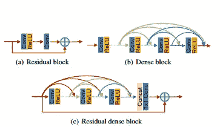*

*图 1:残余致密块*

*然后使用 RDB 的局部特征融合(LFF)从先前和当前局部特征中自适应地学习更有效的特征，并稳定更广泛网络的训练。*

*使用术语“层次特征”是因为这些特征为图像的重建提供了更多的线索。在 [MemNet 研究论文](http://cvlab.cse.msu.edu/pdfs/Image_Restoration%20using_Persistent_Memory_Network.pdf)中有一个类似于 RDN 的方法，其中所有子网都连接到一个门单元，但是本地卷积层彼此之间没有直接访问。参考下图。*

*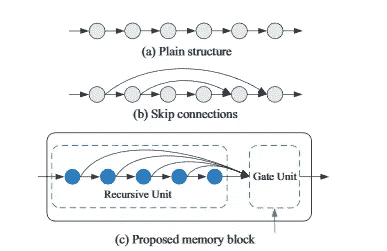*

*图 2 : Memnet 架构*

*如果我们谈论 RDN，我们会看到从当前 RDB 块的卷积层以及从先前 RDB 块的输出中提取并连接特征，这通过利用所有分层特征来简化重构。这种网络克服了 MemNet 的缺点。*

*RDB 由密集连接层和局部特征融合(LFF)以及局部剩余学习(LRL)组成。RDB 还支持 RBD 之间的连续内存，即一个 RDB 的输出可以直接访问所有后续 RDB，从而导致连续状态传递。RDB 中的卷积层可以直接访问该 RDB 中的所有后续卷积层，即卷积层将其信息传递给 RDB 中的后续卷积层。*

*LFF 主要用于连接先前的 RDB 特征和当前 RDB 的输入通过所有卷积层之后的特征，其中输入不是别的，正是先前 RDB 的输出特征。简而言之，要融合过去和现在 RDB 的特点，LFF 是适用的。*

# ***网络结构:***

*RDN 由 3 个主要单元组成:*

*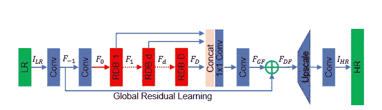*

*图 2:网络结构*

1.  **浅层特征提取**
2.  **残余致密块(RDB 氏)**
3.  **密集特征融合(DFF)**

*假设 Iʟʀ和 Isʀ分别是 RDN 的输入和输出。*

1.  ***浅层特征提取**:两个卷积层用于特征提取。*

*对于来自 LR 图像的第一卷积层，我们可以将其表示为:*

*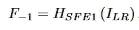*

*等式 1:来自第一卷积层的特征*

*其中 Hsғᴇ1:第一特征提取层的卷积运算*

*类似地，对于第二卷积层*

*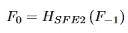*

*等式 2:来自第二卷积层的特征*

*其中 Hsғᴇ2:第二特征提取层的卷积运算*

*由于该论文已经提到只有 2 个卷积层将用于特征提取，所以 2 个操作用于特征提取。*

*2.**剩余密集块** : RDB 遵循连续存储机制，当前输出特征传递给后续层。*

*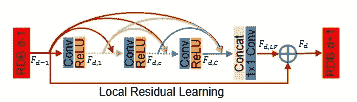*

*图 3:RDB 机制的示意图*

*每个卷积层的输出是先前层的特征与相应权重的乘积*

*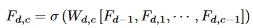*

*等式 3:DTH RDB 中 Cth 卷积层操作的输出*

*我们知道在神经网络中*新层=激活函数(前一层*相应的权重)**

*因此，等式 3 也遵循相同的原理，除了先前层是所有先前层和先前 RDB 的输出。*

*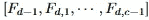*

*由 d-1 RDB 和卷积层产生的特征图的连接*

**局部特征融合:*这是从 RDB 所有卷积层生成特征图后的下一步。因此，先前 RDB 的特征地图被连接到当前 RDB，然后 1x1 卷积层，以输出基本特征。*

*我们可以将它表示为以下形式的方程:*

*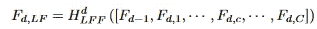*

*等式 4:局部特征融合*

*其中 hʟғғ:1x1 conv 层的功能*

*另一项表示先前 RDB 的输出以及当前 RDB 中 C 个卷积层的特征图的串联。*

**局部残差学习*:它是 RDB 的最终输出，其中我们计算的局部特征融合与先前 RDB 的输出相加。提高了网络表现能力。*

*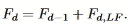*

*等式 5:局部剩余学习*

*3.**密集特征融合**:进行 LFF 和 LRL 后，提取局部密集特征。类似地，在执行全局特征融合(GFF)和全局剩余学习(GRL)之后，执行密集特征融合(DFF)以产生全局密集特征。*

*在连接所有 RDB 的输出特征之后，执行全局特征融合。*

*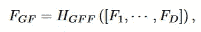*

*等式 6:GFF 之后的特征使用 RDB 的特征*

*Hɢғғ:它是 1x1 卷积层和 3x3 卷积层的组合，其中:*

*1×1 卷积层用于融合不同级别的特征，3×3 卷积层用于提取全局残差学习的特征。*

*全局残差学习就是 GFF 产生的特征和特征提取中第一卷积层之后的特征的总和。*

*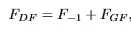*

*等式 7:执行 GRL 后的全局密集特征*

*对于**上采样**，我们使用了论文中的 ESPCN:“[使用高效亚像素卷积神经网络](https://arxiv.org/pdf/1609.05158.pdf)的实时单幅图像和视频超分辨率。*

# ***实验及结果:***

*通过实验，作者发现了一些极端的结果*

*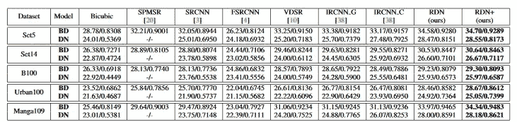*

*结果 1:平均值的比较。PSNR 想出了其他方法*

*以下是图片通过网络后的一些视觉效果*

*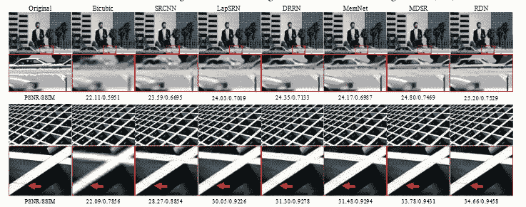**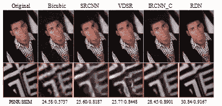

结果 2 : PSNR 和 SSIM 执行超分辨率后的两张不同的图片* 

# ***结论:***

*在浏览了网络体系结构及其性能之后，我们发现该模型的性能优于许多超分辨率体系结构，因为它有效地利用了网络的分层特征。*

*现在已经开发了很棒的超分辨率技术，但是这个模型对于 2018 年之前的超分辨率是最好的，没有任何复杂的架构或计算。*

# ***参考文献:***

1.  *[http://cvlab . CSE . MSU . edu/pdf/Image _ restore % 20 using _ Persistent _ Memory _ network . pdf](http://cvlab.cse.msu.edu/pdfs/Image_Restoration%20using_Persistent_Memory_Network.pdf)*
2.  *[https://arxiv.org/pdf/1609.05158.pdf](https://arxiv.org/pdf/1609.05158.pdf)*
3.  *[https://arxiv.org/pdf/1608.06993.pdf](https://arxiv.org/pdf/1608.06993.pdf)*
4.  *[https://github.com/yulunzhang/RDN](https://github.com/yulunzhang/RDN)*