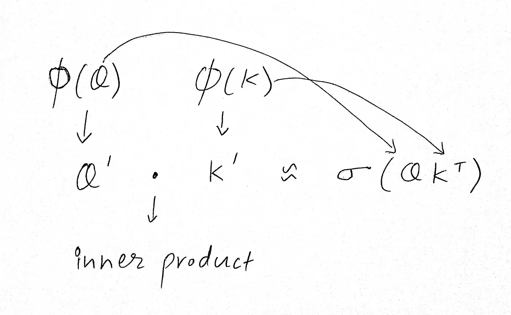
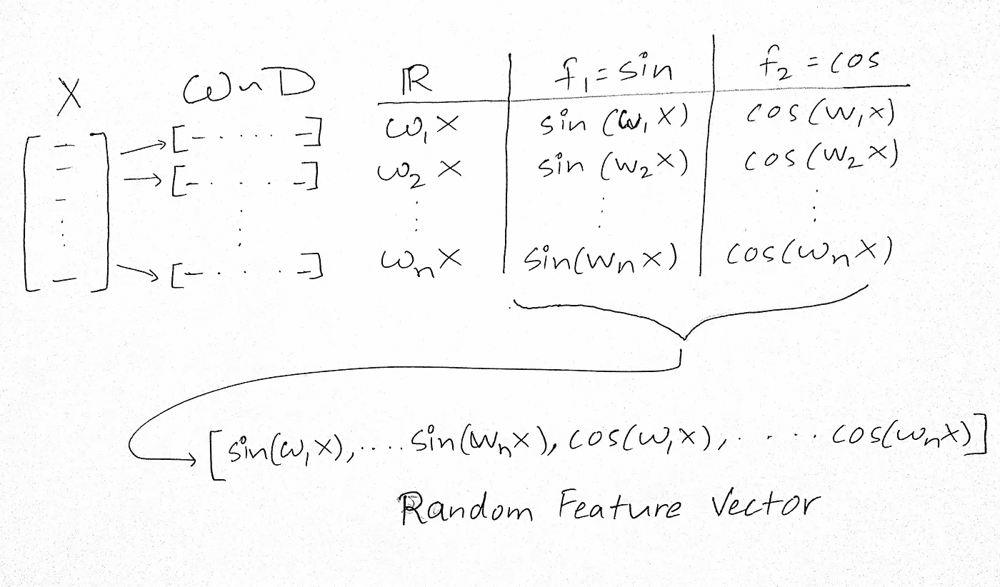

# 论文解释-反思表演者的注意力

> 原文：<https://medium.com/analytics-vidhya/paper-explained-rethinking-attention-with-performers-b207f4bf4bc5?source=collection_archive---------6----------------------->

通过(随机)特征图近似常规注意机制 AV(在 D⁻重整化之前)。虚线框表示计算的顺序以及相应的时间复杂度。图片摘自[论文。](https://arxiv.org/pdf/2009.14794.pdf)

# 简介和概述

表演者是一类新的模特，他们近似于[的变形金刚](https://arxiv.org/abs/1706.03762)。他们这样做不会遇到经典的 transformer 瓶颈，即 transformer 中的注意力矩阵具有与输入大小成平方关系的空间和计算要求，这限制了您可以向模型中输入多少输入(文本或图像)。表演者通过一种叫做**的技术通过正正交随机特征(FAVOR+)快速注意来解决这个问题。** Performers 是完全兼容常规变换器的线性架构，具有强大的理论保证:注意力矩阵的无偏或接近无偏估计，一致收敛，低估计方差。表演者；能够**可证明**准确且实用地估计正则(softmax)满秩注意力，但仅具有线性空间和时间复杂度，并且**不依赖于任何先验**如稀疏性或低秩性。表演者是第一个完全兼容常规变压器的线性架构。

# 常规注意机制与广义核心化注意

注意，X 作为输入。x 通过 Wq 变换成查询(Q ),通过 Wk 变换成键(K ),还通过 Wv 变换成值(V)。现在，通过将关键字(K)乘以查询(Q)来获得注意力图。我们应用 softmax 非线性来标准化地图。最后，我们将取值(V)并将其与地图相乘，以获得输出(Z)，称为自我关注矩阵。

文本数据的双向注意机制中的二次瓶颈。

这里 l 是输入符号序列的大小，d 是隐藏维度(潜在表示的维度)，exp()按元素应用，1ₗ是长度为 l 的全 1 向量，diag()是以输入向量作为对角线的对角矩阵。

如果能**把 softmax 分布**分解到**形成一个更低维的注意力矩阵(A)** 不是更简单吗？让我们假设，你可以先乘以 KᵀV，然后乘以 q，如果 d 比 l 小得多，这会节省很多计算

许多作者试图分解注意力矩阵(A ),但这是通过某些假设或添加太多偏见来完成的。例如，通过**位置敏感散列(LSH** )来利用稀疏性是许多技术中的一种。那么这篇论文提出了什么建议呢？作者使用了一个内核框架来描述双向注意力的 **FAVOR+算法**。

通过(随机)特征图近似常规注意机制 AV(在 D⁻重整化之前)。虚线框表示计算的顺序以及相应的时间复杂度。图片摘自[报。](https://arxiv.org/pdf/2009.14794.pdf)

在可内核化注意力中，一切都与注意力机制相同，但是，注意力矩阵(a)被分解成 q’和(k’)**、**ᵀ，它们被称为质数，因为它们不是查询和关键字(查询和关键字相乘形成注意力矩阵)。

所以在概念上，q '×(k ')**ᵀ**≈exp[(q×k**ᵀ**)**/√**d]。但是这种分解是如何发生的呢？作者提出了一个通用的可内核化的注意机制，以显示他们如何分解注意矩阵。

作者概括了这个问题，并使用 FAVOR+算法来解决它。他们说我们有 A(i，j) = **K** (qᵢ ᵀ，kⱼᵀ)形式的注意力矩阵 a，其中 qi/kj 代表 Q/K 中的第 I/j 个查询/关键行向量，并且某个核函数 K: Rᵈ× Rʳ→ R+被定义用于(通常是随机化的)映射:**φ**:rᵈ→rʳ+(对于某个 r > 0)如下:

近似公式。

现在，内核允许你在其他空间中表示内积。通过函数(**φ**)拉动时，两个输入的核函数(如上所示)将等于两个输入的内积之和。在上面的数学描述中，LHS 是非线性 softmax 核，而 RHS 是线性函数。这使我们能够使 Q’和 K’矩阵线性，然后您可以简单地首先将 K’乘以 V，然后乘以 Q’以减轻巨大的注意力矩阵 a。那么，它们如何逼近 softmax 注意力内核(K)？

# 逼近 Softmax 内核

作者使用了随机傅立叶特征的数学概念。他们明确地没有为<q class="jv hj">ᵀ>t21】≈exp[(q×k**ᵀ**)**/√**d]构造完全相等的高维空间，但是他们构造了一个近似，并且这个近似是任意好的。</q>

查询和键通过**φ函数**进行映射，该函数为我们提供 Q’和 K’。内积是在存在 Q’和 K’的任何维度空间中取的，其近似等于原始 Q 和 K 乘以 softmax 非线性。那么函数(**φ**)是什么样子的呢？

**φ函数。**图像取自[纸张。](https://arxiv.org/pdf/2009.14794.pdf)

这里 h(x)是输入的确定性函数， **√** m 是归一化因子， **ω** ₁….ωₗ **是从均匀高斯正态分布中提取的随机向量**围绕平均值 d 各向同性，f₁… fₗ是确定性函数，其余的是映射到总维度空间的向量(细节在下面给出)。

**对φ函数的深入直觉。**

在向量内部，有 L 个不同的子向量，它们都是一个接一个地连接在一起的。在每个子向量中，你总是有相同的重复项。让我们进一步分析一下。

x 是向量(Q 或 K)，ω是从各向同性均匀高斯正态分布 D 中提取的随机向量，但它们在整个算法中保持不变(有一种方法可以对它们进行重采样，但作者没有描述)。所以ω是一串随机向量。计算每个 x 与ω s '的内积，这给了我们实数，然后我们将有一个函数集合(在这种情况下是 f1 和 F2；可以更多)。

请注意:f1=sin 和 f2=cos 只是构型的例子，它可以是任何函数。

我们将制作一个表格，将实数放入函数中，并将表格展平为一个向量。这个向量被称为随机特征向量。最值得注意的是，这是一个例子，我们并不总是将 sin 和 cos 作为 f1 和 f2，这纯粹是一个例子。你甚至可以有一个功能或者多个功能。你也可以选择**采样多少ω，这是这里的参数**。

# 不同的选择，不同的内核

你有两个 h 和 f 的选择，它们是并行的。h 和 f 的选择决定了φ(**φ**)函数是什么，随后，它决定了这个φ(**φ**)函数对应于哪个核函数(K)。因此，通过选择正确的函数，您可以告诉该函数您想要逼近哪个核，然后通过对ω(**ω**)进行采样，您采样的ω(**ω**)越多，就越能精确地逼近该核。定义常规注意力矩阵 A 的 softmax-kernel 被给出为:

基于高斯核的内点积注意力矩阵近似。图片摘自[论文。](https://arxiv.org/pdf/2009.14794.pdf)

**softmax 内核通过使用高斯内核**来近似。如果我们选择 **h(x)=1，l=2，f1=sin，f2=cos** ，则分布为均值周围各向同性的正态分布，其中 **D= N (0，I𝒹)** 。这导致高斯核(K𝓰ₐᵤₛₛ).

此后，我们通过使用三角函数获得 softmax 核的随机特征图无偏近似，其中:

SM(x，y)的随机特征映射无偏近似值的值。图片摘自[论文。](https://arxiv.org/pdf/2009.14794.pdf)

使用 L=2，f1=sin，f2=cos 得到高斯核，然后前面的因子 h(x)得到 softmax 核。所以如果我们 **h，l，**和 **f** (f1，f2，…fn)如上所示我们称之为 SMᵗʳᶦᵍ(x，y)。值得注意的是，当我们通过 phi(**φ**)函数映射我们的查询和键，然后在它们之间生成内积，该内积将近似(取决于我们采样了多少 omega(**ω**)结果，就好像我们首先将它们相乘，然后通过 softmax 函数处理它们一样。这就简单多了，因为我们可以通过φ(**φ**)函数独立地处理它们，然后这只是一个线性运算，允许我们用 V 乘以 K，然后乘以 Q，而不是反过来，这是我们在应用 softmax 时被迫要做的。我们省略√d-重整，因为我们可以等效地重整输入键和查询。

# 为什么天真的方法不起作用！

注意模块为每个标记构造值向量的凸组合，其系数作为相应的重正化核分数给出。这就是使用产生非负分数的核的原因。应用具有潜在负维度值(sin/cos)的随机特征映射会导致不稳定的行为，尤其是当核得分接近 0(这是 A 的许多条目的情况，对应于不相关的表征)时，在这样的区域中由具有大方差的估计器来近似。这会导致异常行为，例如负对角线值重整器 D1，从而完全阻止训练或导致次优模型。作者从经验上证明了这就是 SMₘᵗʳᶦᵍ(x，y)的情况，并提供了详细的理论解释，表明 SMₘᵗʳᶦᵍ(x，y)的方差随着近似值趋于 0 而变大。这是为什么从未提出用于近似常规 softmax 注意力的鲁棒随机特征映射机制的主要原因之一。

# 经由正面特征的更好的近似

作者提出了一种不同的分解，一种对 softmax 核的不同近似。他们说我们也可以用下面的公式来近似 softmax 内核:

Softmax 核的正随机特征。图片摘自[论文。](https://arxiv.org/pdf/2009.14794.pdf)

我们可以用两种方式选择 h(x)，L，F(f1，f2，…)，D(如上图)。但是第二种选择更有意义，因为存在一点标准化因素。x 和 y 可以被认为是查询和键，z= x+y，这只是一个不同于以前的近似值，这个近似值很酷的一点是，近似值本身只有正值。如果我们将 **ω** 替换为**√d(ω/| |ω|)**，我们可以获得所谓的正则化 softmax-kernel SMREG，我们可以以类似的方式近似它，只需将 **D= N (0，I𝒹)** 变为 D = Unif(√dSᵈ⁻)，一种对应于半径为√d 的球面上的哈尔测度的分布(均匀分布)，获得估计量 SMREGₘ⁺.这种随机特征也可以用来精确地近似正则 softmax-kernel。

# 正交特征甚至更好

为了进一步减少估计量的方差(以便我们可以使用更少数量的随机特征 r)并更好地逼近，我们将不同的随机样本 **ω** ₁、…、 **ω** ₘ纠缠成完全正交。这可以在通过标准的 Gram-Schmidt 重正化过程使用各向同性分布 D(即，特别是在我们迄今考虑的所有核中)的同时保持无偏性。正交随机特征(orf)是一种众所周知的方法，但事实证明，它与我们为 softmax 引入的正随机特征(PRF)一起工作得特别好。这导致了第一个理论结果，表明 orf 可以用于减少任何维数 d 的 softmax/Gaussian 核估计量的方差。

**如果你喜欢这篇文章并获得了真知灼见，请考虑** [**请我喝杯咖啡** ☕️ **点击这里**](https://www.buymeacoffee.com/nakshatrasinghh) **:)**

# 参考

1.  [反思表演者的注意力。](https://arxiv.org/pdf/2009.14794.pdf)
2.  你所需要的只是注意力。

如果你喜欢这个帖子，请一定要鼓掌👏。💬连接？让我们来看看社会:****。****