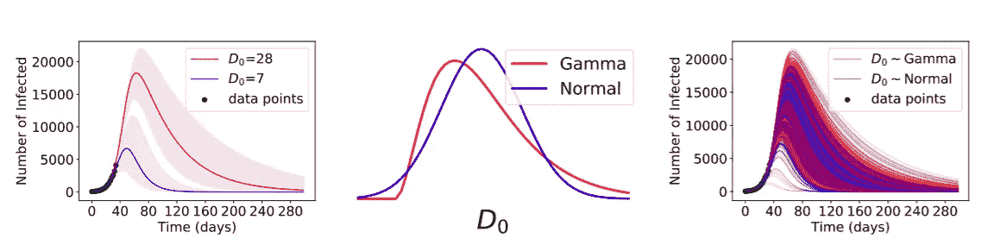
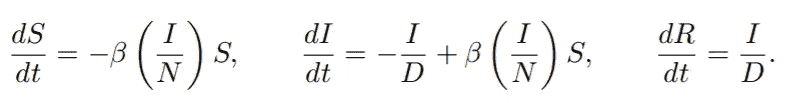
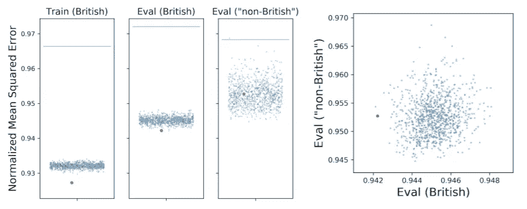
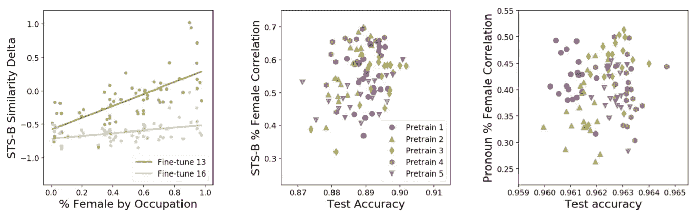

# 论文解释-现代机器学习中的欠规范

> 原文：<https://medium.com/analytics-vidhya/paper-explained-underspecification-present-in-modern-machine-learning-2cd59ab09560?source=collection_archive---------21----------------------->

简单流行病学模型中的欠特异性。图片取自 [**纸**](https://arxiv.org/pdf/2011.03395.pdf) 。

# 简介和概述

作者认为，指定不足是机器学习模型在现实世界领域部署时表现不佳的关键原因之一。可以这样想，你有一个很大的训练集，你在训练集上训练你的模型，然后在测试集上测试它，通常，它们来自同一个分布。但是，这里有一个警告，当您将训练好的模型部署到现实世界的生产中时，数据的分布是非常不同的，并且模型可能表现不好。因此，作者发现的欠规范问题是，当来自您的训练过程的所有模型在测试集上工作得同样好时，然而，它们在真实世界场景中的表现非常不同。可能有一个模型(来自不同的**随机种子值**)即使在现实世界中也表现良好，但其他模型表现不佳。这证实了**训练测试分割管道**未被详细说明，训练测试分割根本没有捕捉到真实世界数据的重要性。有两种方法可以解决这个问题，一种是**测试来自真实世界数据分布管道的所有模型，并部署工作良好的模型；另一种是**另一种方法是**在模型训练管道阶段添加规范，确保所有真实世界的功能都经过使用该管道的训练。**

# 流行病模型中的不确定性

特别是，作者考虑了简单的易感-感染-康复(SIR)模型，该模型经常被用作传染病流行病学中流行病模型的基础。该模型以 N 个人口中易感者(S)、感染者(I)和康复者(R)的数量随时间变化的速率来描述:

图片摘自 [**论文**](https://arxiv.org/pdf/2011.03395.pdf) 。

在该模型中，参数β表示疾病从感染者到易感人群的传播率，参数 D 表示受感染个体保持传染性的平均持续时间。让我们假设，一个疫情即将开始，一些数据点给了我们。我们需要用这些数据点来预测疫情的轨迹，所以我们要做的是将β和 D 参数拟合到这些数据点上。实际上有一个唯一的解，但是由于轨道的指数上升，这个解在数值上没有很好地说明。重要的是，在疫情的早期阶段，当观察到的数据点很小时，该模型的参数是由该训练任务指定的。这是因为，在此阶段，易感者的数量在总人口规模(N)下大致保持不变，而感染人数以β1/的速率呈指数增长。我们可以看到，我们在这个模型中处理的近似指数速率是**β1/d .**如果我们用这个表达式导出某个数，有许多设置/无穷多个对，它们等同于方程的 L.H.S 和 R.H.S。有许多不同的预测器(为了更简洁，我们之前讨论过的预测器对)可供选择，在真实世界数据中表现最好的预测器将被部署。不同预测器的训练设置并无不同，唯一不同的是预测器相对于真实数据的方差如此之大，以至于一些预测器表现良好，而其他预测器表现不佳。**不同的初始化分布(例如**伽玛或正态**)导致预测轨迹的不同分布。作者说**这是一个欠规范的典型例子。****

# 随机特征模型中的欠指定

指定不足也是过度参数化的自然结果，过度参数化是许多现代神经网络的关键属性。当参数多于数据点时，学习问题是根深蒂固的不确定性。作者实现了一个简单的两层网络，其中第一层是完全随机的，有点像线性模型。假设数据的某种分布，权重矩阵条目的某种分布( ***W*** )，然后训练 theta 参数( **θ** ) ，并对该模型发生的情况做出一些陈述。 **F𝓌(X) = θᵀσ( *W* x)。**

这样想，你从训练过程中得到的权重矩阵可能会有很大的不同，每个矩阵的解也可能不同。但是我们可以构建一个对抗性的数据集，它以一种更好的方式来描述模型。

# 医学基因组学中的欠特异性

这是一个医学基因组的例子，你可以看到有训练数据，评估数据来自相同的分布，然后评估数据来自分布之外。所以，这更像是一个域转移的例子。你可以看到，如果你根据训练数据进行训练，然后根据训练数据进行评估，你会得到归一化的均方误差，越低越好。红点是一个特定的启发式代表，表现稍好一点。如果您使用相同数据的评估集，您可以看到性能范围与训练集非常相似，但仍然可以接受。但是，当你离开发行集时，表现的范围是非常非常大的。此外，作者展示了一个图表来比较模型在分布中的评估集与分布外的评估集中的表现，您会看到相关性相当弱，您可能希望得到一条直线。

医学基因组学中线性模型的非特异性。(左)使用英国训练集、英国评估集和“非英国”评估集中的遗传特征的 PRS 模型的性能，通过归一化均方误差(MSE 除以真实方差，越低越好)测量。每个点代表一个 PRS 预测值。图片摘自****。****

# **BERT 模型中的欠指定**

**在 NLP 中，作者用 BERT 测试他们的演示。这很有趣，因为他们不仅测试不同的种子来微调 BERT，还测试不同的种子来预训练 BERT。所以，在这些语言模型中，你有一个预训练阶段和一个微调阶段，这两个阶段都有随机种子。作者表明，预训练的随机种子实际上将在这些模型在压力测试中的表现中发挥重要作用。在**语义文本相似性(STS)任务**中，预测器接受两个句子作为输入，并使用特定的度量标准对它们的相似性进行评分。STS 任务的预测值是通过微调美国劳工统计局(BLS)数据集上的 BERT 获得的。预测器实现了恒定的精度，根据范围从 0.87 到 0.90 的相关性来测量。在**代词解决(PR)任务**中，输入是一个带有代词的句子，该代词可能指代两个可能的先行词之一，预测器必须确定哪个先行词是正确的。PR 任务的预测器是通过在 OntoNotes 数据集上微调 BERT 获得的。预测器实现了恒定的精度，范围从 0.960 到 0.965。**

****

**对性别相关性的依赖受到随机初始化的影响。(左)女性和男性模板句子相似性的差距与职业的性别统计相关，显示在两个随机初始化的微调中。(右)预训练初始化显著影响在微调阶段编码的性别偏见的分布。图片摘自 [**论文**](https://arxiv.org/pdf/2011.03395.pdf) **。****

**这些图显示了三种重要的模式:**

1.  **与 BLS 统计的相关性有很大的差异:在 STS 任务中，相关性范围从 0.3 到 0.7；在代词解决任务上，范围是 0.26 到 0.51。**
2.  **测试准确性和性别相关性之间的关系很弱。[{STS 任务:置信区间= (0.00，0.39)，PR 任务:置信区间=(0.13，0.29)}]。**这表明学习准确的预测器不*而*需要学习强相关性。****
3.  **第三，**伪相关的编码对预训练时的随机种子很敏感**，而不仅仅是微调。**

# **结论和评论**

**我完全同意文件的建议。在已部署的环境中测试您的模型可能无法解决指定不足的问题，但在我看来这不是一个正确的解决方案。正如我们在流行病学演示中看到的，这是不可能的。不是每个人都可以专门为一项任务从头开始训练一个语言模型。所以我们确实需要经过预先训练的检查站。这个问题的一个实际解决方案是检查所有的模型检查点，看看在他们关心的特定维度上哪个是好的或者是坏的。我想说的是，添加您想要的规格并保持模型性能不变并不总是可能的。添加约束不会使模型达到相同的性能。总而言之，这是一篇你能认同的论文，其中的感悟，分析，问题，以及他们展示的例子都是真实的。特别是对于像谷歌这样的公司来说，这是相当重要的，因为他们建立了巨大的 S.O.T.A 模型。**

****如果你喜欢这篇文章并获得了真知灼见，请考虑** [**请我喝杯咖啡** ☕️ **点击这里**](https://www.buymeacoffee.com/nakshatrasinghh) **:)****

# **参考**

1.  **[欠规范对现代机器学习的可信度提出挑战](https://arxiv.org/pdf/2011.03395.pdf)，麻省理工学院，2020 年 10 月 28 日。**

**如果你喜欢这个帖子，请一定要鼓掌👏。💬连接？让我们来看看社会:[**http://myurls.co/nakshatrasinghh**](http://myurls.co/nakshatrasinghh)**。****