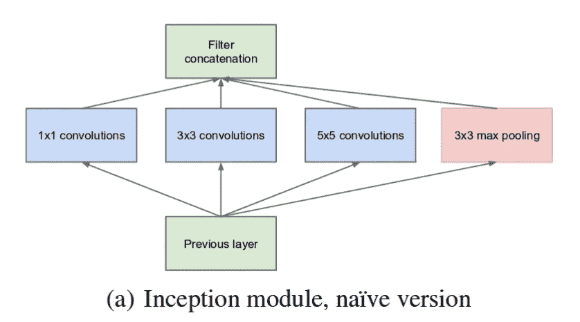
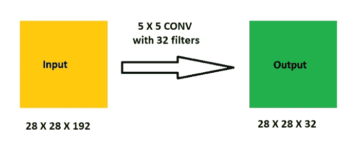
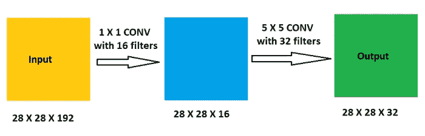
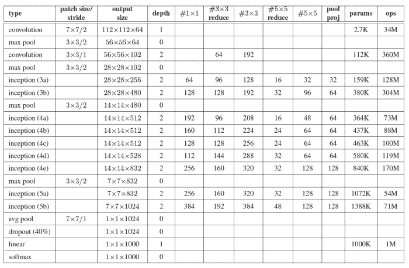
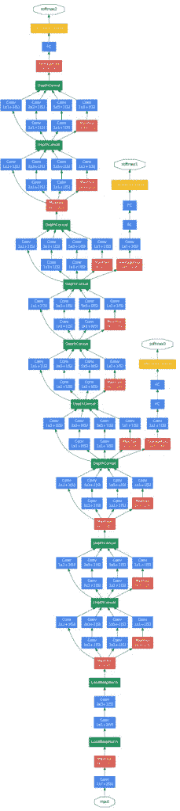

# 论文解释:用卷积更深入(谷歌网)

> 原文：<https://medium.com/analytics-vidhya/paper-explanation-going-deeper-with-convolutions-googlenet-the-ai-blog-b79574ac8fe0?source=collection_archive---------10----------------------->

Google 提出了一个名为 inception 的深度卷积神经网络，在 ILSVRC 2014 中取得了分类和检测的顶级结果。

> *ImageNet 大规模视觉识别挑战赛(ILSVRC)评估大规模对象检测和图像分类算法。一个高层次的动机是允许研究人员在更广泛的对象上比较检测的进展——利用相当昂贵的标记工作。另一个动机是测量用于检索和注释的大规模图像索引的计算机视觉的进展*
> 
> [T3【http://www.image-net.org/challenges/LSVRC/】T5](http://www.image-net.org/challenges/LSVRC/)

“用回旋更深入”实际上是受一个互联网迷因的启发:“我们需要更深入”


在 ILSVRC 2014 中，GoogLeNet 使用的参数比两年前在 2012 年比赛中使用的 [AlexNet](https://prabinnepal.com/alexnet-architecture-explained/) 少了 12 倍。

# 盗梦空间 v1 试图解决的问题

图像中的重要部分在大小上可以有很大的变化。例如，对象图像可以在不同的位置，一些图片被放大，而另一些被缩小。由于图像中的这种变化，为执行卷积运算选择正确的核大小变得非常困难。我们需要一个较大的核来提取图像中分布较多的对象的信息，而较小的核更适合于提取图像中分布较少的信息。

提高神经网络性能的主要途径之一是增加其规模。这包括增加其深度和尺寸。神经网络的规模越大，对应的参数数量就越多，这使得网络更容易过拟合，尤其是在有标签的训练样本有限的情况下。

网络规模增大的另一个缺点是计算资源的使用增加。如果更多的卷积层被链接，则导致计算资源的更多消耗。如果这些增加的容量没有得到有效利用，那么计算资源就会被浪费。

# 解决办法

为了解决这些问题，本文提出的解决方案是形成一个“更宽”而不是“更深”的网络，即所谓的“初始模块”。



*天真的初始模块*

“原始”初始模块对来自前一层的输入执行卷积，具有 3 种不同大小的内核或滤波器，具体为 1×1、3×3 和 5×5。除此之外，还执行最大池。输出然后被连接并发送到下一个初始模块。

“天真”方法的一个问题是，即使具有 5×5 卷积也可能导致在计算方面需要大量资源。一旦增加了合用，这个问题就更加突出了。

为了使我们的网络在计算上便宜，作者通过在 3×3 和 5×5 卷积之前添加 1×1 卷积来应用降维。让我们看看这些如何影响神经网络中的参数数量。

让我们看看 5×5 卷积的计算量是多少



*5 × 5 卷积，天真方式*

上述卷积运算的计算是:

**(⁵ )(192)(32)(2⁸ ) = 120，422，400** 次运营

为了减少如此大量的运算，可以使用降维。这里，在用更大的滤波器执行卷积之前，先用 1×1 滤波器进行卷积。

降维后，5×5 卷积的运算次数变为:



*5×5 卷积降维*

上述卷积的运算次数变为

**()(192)(16)(2⁸)= 2408448 次**运算，用于 **1 × 1** 卷积，

**(⁵ )(16)(32)(2⁸ ) = 10，035，200 次**运算，用于 **5 × 5** 卷积。

总共将有**2408448+10035200 = 12443648**个操作。计算量大大减少。

因此，在应用降维之后，我们的初始模块变成了:


*降维的初始模块。(来源:* [*盗梦空间 v1*](https://arxiv.org/pdf/1409.4842v1.pdf) *)*

GoogLeNet 是使用降维的初始模块构建的。GoogLeNet 由 22 层深度网络组成(包括 27 层池层)。所有的卷积，包括初始模块中的卷积，都使用整流线性激活。



GoogLeNet 是盗梦空间架构的化身。来源:原始论文

> 所有的卷积，包括初始模块中的卷积，都使用整流线性激活。在我们的网络中，感受野的大小为 224×224，采用 RGB 颜色通道，具有平均子牵引。“#3x3reduce”和“#5x5reduce”代表在 3×3 和 5×5 卷积之前使用的缩减层中 1×1 滤波器的数量。在 pool proj 列中的内置 max-pooling 之后，可以看到投影层中 1×1 滤镜的数量。所有这些缩小/投影层也使用整流线性激活
> 
> *原文*

GoogLeNet 是一个 22 层的深度，只计算带参数的层。对于这样深的网络，可能会出现诸如消失梯度的问题。为了消除这一点，作者引入了连接到中间层的辅助分类器，并帮助梯度信号传播回来。这些辅助分类器被添加到初始(4a)和(4d)模块的输出之上。来自辅助分类器的损失在训练期间被添加，而在推理期间被丢弃。

包括辅助分类器的侧边额外网络的确切结构如下:

*   具有 5×5 过滤器大小和跨距 3 的平均池层，导致(4a)的 4×4 512 输出和(4d)阶段的 4×4 528 输出。
*   具有 128 个滤波器的 1×1 卷积，用于降维和校正线性激活。
*   具有 1024 个单元和整流线性激活的全连接层。
*   输出丢失率为 70%的丢失层
*   以 softmax loss 作为分类器的线性图层(预测与主分类器相同的 1000 个类，但在推理时被移除)。

GoogLeNet 架构的系统视图如下所示:



*谷歌网络架构*

GoogLeNet 总共包括 9 个初始模块，即 3a、3b、4a、4b、4c、4d、4e、5a 和 5b。

# GoogLeNet 实施

了解了 inception 模块及其在 GoogLeNet 架构中的包含，我们现在在 [tensorflow](http://tensorflow.org) 中实现 GoogLeNet。GoogLeNet 的实现灵感来自 inception net 上的 analytics vidya [文章](https://www.analyticsvidhya.com/blog/2018/10/understanding-inception-network-from-scratch/#:~:text=The%20paper%20proposes%20a%20new,which%20is%2027%20layers%20deep.&text=1%C3%971%20Convolutional%20layer%20before%20applying%20another%20layer%2C%20which,mainly%20used%20for%20dimensionality%20reduction)。

导入所需的库:

```
from tensorflow.keras.layers import Layer
import tensorflow.keras.backend as K
import tensorflow as tf
from tensorflow.keras.datasets import cifar10
from tensorflow.keras.models import Model
from tensorflow.keras.layers import Conv2D, MaxPool2D, Dropout, Dense, Input, concatenate, GlobalAveragePooling2D, AveragePooling2D, Flatten
import cv2
import numpy as np
from keras.utils import np_utils
import math
from tensorflow.keras.optimizers import SGD
from tensorflow.keras.callbacks import LearningRateScheduler
```

接下来，我们将使用 cifar10 数据集作为我们的数据。

```
num_classes **=** 10**def** load_cifar_data(img_rows, img_cols): #Loading training and validation datasets (X_train, Y_train), (X_valid, Y_valid) **=** cifar10.load_data() #Resizing images X_train **=** np.array([cv2.resize(img, (img_rows, img_cols)) **for**       img **in** X_train[:,:,:,:]]) X_valid **=** np.array([cv2.resize(img, (img_rows, img_cols)) **for** img **in** X_valid[:,:,:,:]]) #Transform targets to keras compatible format Y_train **=** np_utils.to_categorical(Y_train, num_classes) Y_valid **=** np_utils.to_categorical(Y_valid, num_classes) X_train **=** X_train.astype('float32') X_valid **=** X_valid.astype('float32') #Preprocessing data X_train **=** X_train **/** 255.0 Y_train **=** X_valid **/** 255.0**return** X_train, Y_train, X_valid, Y_validX_train, Y_trian, X_test, y_test = load_cifar_data(224,224)
```

接下来是我们的初始模块

初始模块在 3×3 和 5×5 卷积运算之前包含 1×1 卷积。不同的卷积运算需要不同数量的滤波器，并将这些运算连接到下一层。

```
def inception_module(x, filters_1x1, filters_3x3_reduce, filters_3x3, filters_5x5_reduce, filters_5x5, filters_pool_proj, name=None):

    conv_1x1 = Conv2D(filters_1x1, (1,1), activation='relu', kernel_initializer=kernel_init, bias_initializer=bias_init)(x) conv_3x3 = Conv2D(filters_3x3_reduce, (1,1), padding='same', activation='relu', kernel_initializer=kernel_init, bias_initializer=bias_init)(x)    conv_3x3 = Conv2D(filters_3x3, (3,3), padding='same', activation='relu', kernel_initializer=kernel_init, bias_initializer=bias_init)(conv_3x3) conv_5x5 = Conv2D(filters_5x5_reduce, (1,1), padding='same', activation='relu', kernel_initializer=kernel_init, bias_initializer=bias_init)(x) conv_5x5 = Conv2D(filters_5x5, (3,3), padding='same', activation='relu', kernel_initializer=kernel_init, bias_initializer=bias_init)(conv_5x5) pool_proj = MaxPool2D((3,3), strides=(1,1), padding='same')(x) pool_proj = Conv2D(filters_pool_proj, (1, 1), padding='same',  activation='relu', kernel_initializer=kernel_init,  bias_initializer=bias_init)(pool_proj) output = concatenate([conv_1x1, conv_3x3, conv_5x5, pool_proj], axis=3, name=name)return output
```

获取模型的摘要

```
model.summary()epochs = 25 
initial_lrate = 0.01 
def decay(epoch, steps=100): 
    initial_lrate = 0.01 
    drop = 0.96 
    epochs_drop = 8 
    lrate = initial_lrate * math.pow(drop, math.floor((1+epoch)/epochs_drop)) 
return lrate sgd = SGD(lr=initial_lrate, momentum=0.9, nesterov=False) 
lr_sc = LearningRateScheduler(decay, verbose=1) 
model.compile(loss=['categorical_crossentropy', 'categorical_crossentropy', 'categorical_crossentropy'], loss_weights=[1, 0.3, 0.3], optimizer=sgd, metrics=['accuracy'])
```

使用我们的模型来拟合训练数据

```
history = model.fit(X_train, [y_train, y_train, y_train], validation_data=(X_test, [y_test, y_test, y_test]), epochs=epochs, batch_size=256, callbacks=[lr_sc])
```

**参考文献**

*   [https://www . analyticsvidhya . com/blog/2018/10/understanding-inception-network-from-scratch/](https://www.analyticsvidhya.com/blog/2018/10/understanding-inception-network-from-scratch/)
*   [用回旋加深](https://arxiv.org/abs/1409.4842)
*   [https://towards data science . com/a-simple-guide-the-versions-of-the-inception-network-7fc 52 b 863202](https://towardsdatascience.com/a-simple-guide-to-the-versions-of-the-inception-network-7fc52b863202)

*原载于 2020 年 6 月 5 日 https://prabinnepal.com*[](https://prabinnepal.com/paper-explanation-going-deeper-with-convolutions-googlenet/)**。**