# 论文综述——ADGAN:利用属性分解的 GAN 进行可控的人物图像合成(CVPR 2020)

> 原文：<https://medium.com/analytics-vidhya/paper-review-adgan-controllable-person-image-synthesis-with-attribute-decomposed-gan-1c45bddbe00a?source=collection_archive---------13----------------------->

# 内容

1.  摘要
2.  方法
3.  结果

# 1.摘要

*所有图片来自纸张*

[本文](https://arxiv.org/pdf/2003.12267.pdf)被(2020，口头陈述)接受，介绍了一个使用 GAN 进行姿态传递和组件属性传递的模型。

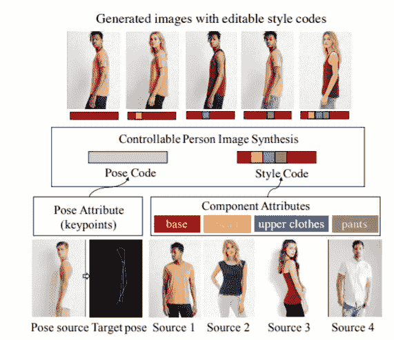

图一。方法概述

姿态属性由姿态编码器编码，组件属性通过分解组件编码器(DCE)编码为样式代码。后面将详细描述上述两种编码器。

目前，本文被实现为 Pytorch。在 [Github](https://github.com/menyifang/ADGAN) 上，姿态传递和组件属性传递的过程是以 gif 文件的形式上传的，如果你有兴趣的话，推荐你看看。

# 2.方法

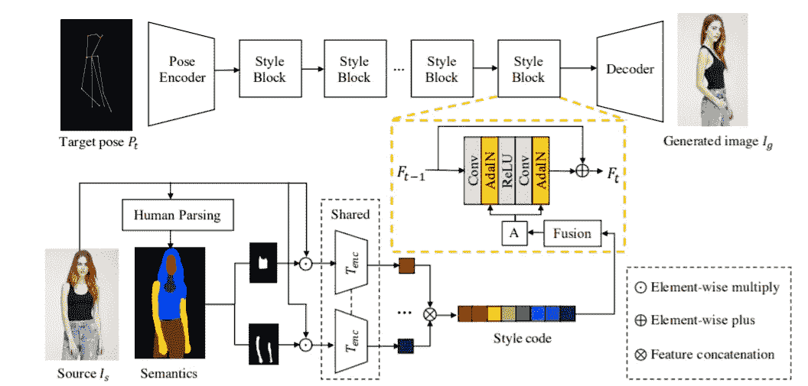

图二。全型号。

目标姿态表示使用 [Openpose](https://github.com/CMU-Perceptual-Computing-Lab/openpose) 从源图像中提取姿态关键点生成的热图(H*W*18)。因此，该模型不需要任何注释，因为它可以从图像源中提取

## 2–1 姿态编码器

姿态编码器使用 N 下采样卷积层对目标姿态(Pt)进行编码。在这种情况下，N = 2，并且据说使用了编码器的常规配置。

## 我想知道，

不知道什么是常规配置。有没有正式形式的下采样？

## 2–2 分解组件编码(DCE)

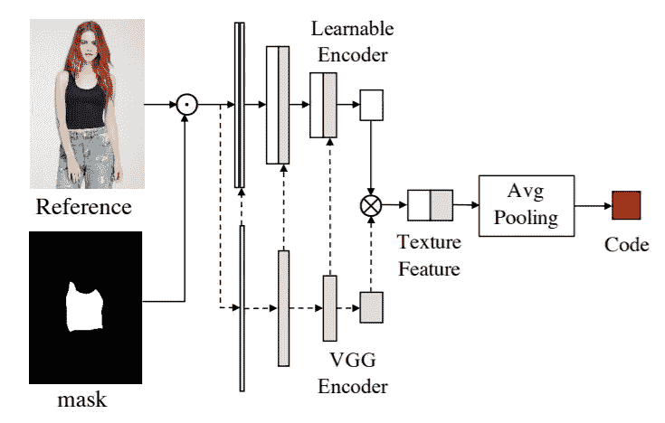

图 3。数据通信设备(Data Communications Equipment)

在本文中，分割图可以通过 [LIP_SSL](https://github.com/Engineering-Course/LIP_SSL) 提取，它有 20 个标签，然后合并为 8 个标签(即背景、头发、脸、上衣、裤子、裙子、手臂和腿)
具有分量 I 的分解的人物图像可以生成如下。

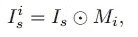

图 4 分解的人物形象方程

其中⊙表示元素间的乘积。

VGG 编码器(VGG)使用 COCO 数据集进行预训练。注意，VGG 是不可训练的。并且，VGG 功能与可学习的编码器连接。

通过每个模型的输出被连接起来。在连接特征之后，通过平均池提取样式代码。

根据本文，区分可学习编码器和固定 VGG 的原因是可学习编码器可以提取复杂的特征，而固定 VGG 可以提取全局纹理

作者认为 DCE 效应提高了生成图像的质量，模型的收敛性得到了改善。

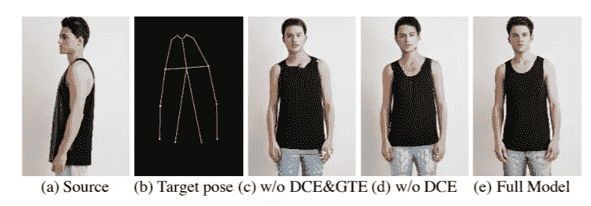

图 5。DCE 效应 1

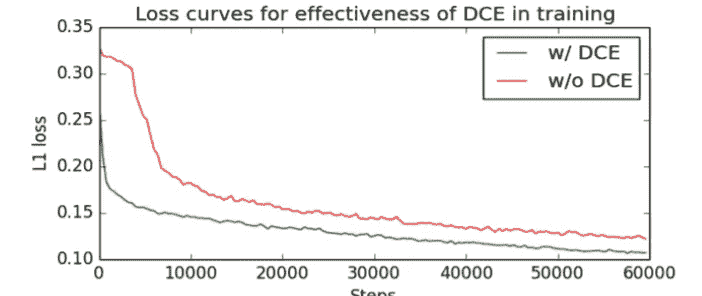

图 6。DCE 效应 2

## 我想知道，

首先，它没有规定如何实现可学习编码器。我不知道这是 VGG 还是使用定制的编码器。

而且，他们说串联 VGG 的特征，我不知道它是连接 VGG 的所有特征还是有选择地连接。

## 根据 [github](https://github.com/menyifang/ADGAN/blob/4dd70649ad136829b92dd6a1a823af7594a0220f/models/model_adgen.py#L84) ..

*   定制编码器由 4 个卷积层组成。
*   从每个第一 conv 块中提取 VGG 特征，并连接到定制编码器

## 2–3 纹理风格转移

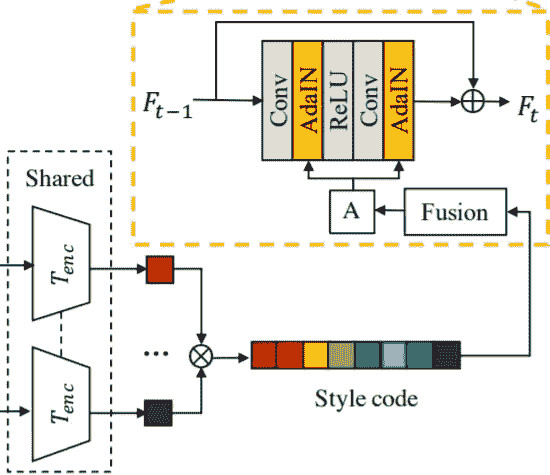

图 7。风格编码->融合模块

如图 6 所示，在连接通过 DCE 提取的样式代码后，将它们放入融合模型。
此时，A 是通过融合模型(FM)提取的 [AdaiN](https://arxiv.org/pdf/1703.06868.pdf) 层的仿射变换参数(尺度和平移σ)。

该论文介绍了由 3 个完全连接的层组成的 FM，前两层允许网络通过线性重组灵活地选择期望的特征，最后一层提供所需维度的参数。

这款 FM 的图像质量也得到了提升。(图 7。)

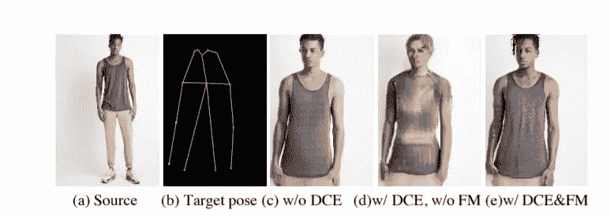

图 8。融合模型的效果

## 我想知道，

这可能是因为我没有详细看过 AdaiN 的论文，但我不确定 FM 是如何用代码实现的。
最后输出的是两个参数吗？并且，
我不清楚是否所有的样式代码都用于提取参数。也不清楚这是适用于所有样式块还是每个样式块。

## 2-4 人图像重建

像 2–1 的姿态编码器一样，使用了 N 个常规解码器配置，N=2。常规配置也不在此描述。

# 3.结果

总之……它展示了我迄今为止读过的论文中最好的结果。

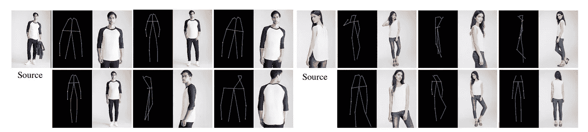

图 9:
根据任意姿态生成的图像。

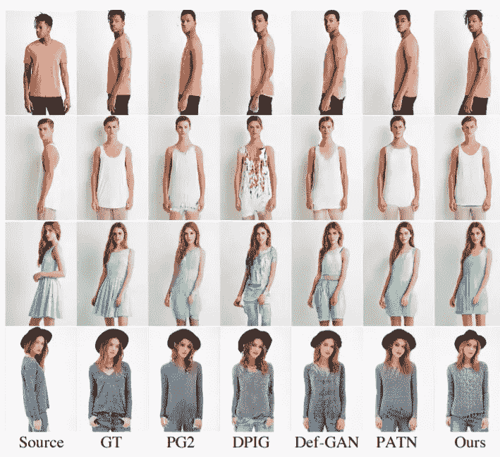

图 10。与其他论文生成的图像进行比较

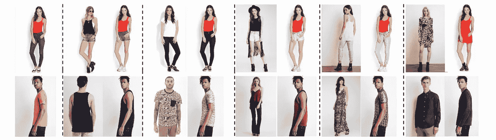

图 11。属性转移的结果

如果数据包含许多偏差，也有失败的案例。

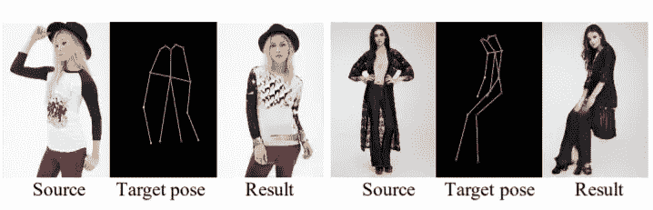

图 12。失败案例

# 我对纸的看法。

在我看来，这篇论文的长处在于不需要数据标注。在没有数据标注的自定义数据中，可以使用 Openpose 和 LIP_SSL 进行提取，所以可以说是健壮的。

但换句话说，我认为姿态提取和分割图的提取会极大地影响模型的性能。