# 论文综述-AsynDGAN:在不共享医学图像数据的情况下训练深度学习

> 原文：<https://medium.com/analytics-vidhya/paper-review-asyndgan-train-deep-learning-without-sharing-medical-image-data-ac93b5592be4?source=collection_archive---------21----------------------->

每一个数字、表格都来自于论文。(如果来自其他论文或其他网站，则标记。)

# 内容

1.  摘要
2.  方法
3.  结果和实验
4.  我的看法

# 1.摘要

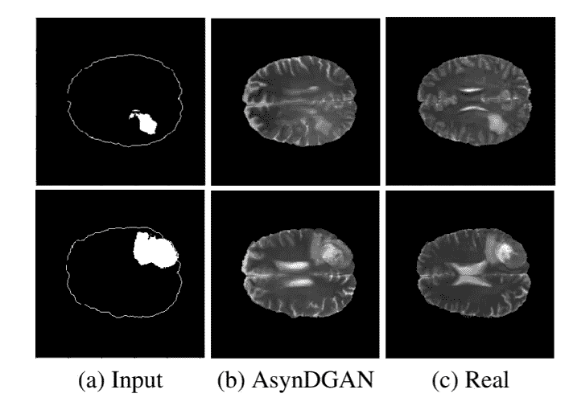

图一。AsynDGAN 合成的脑肿瘤图像与真实图像的比较

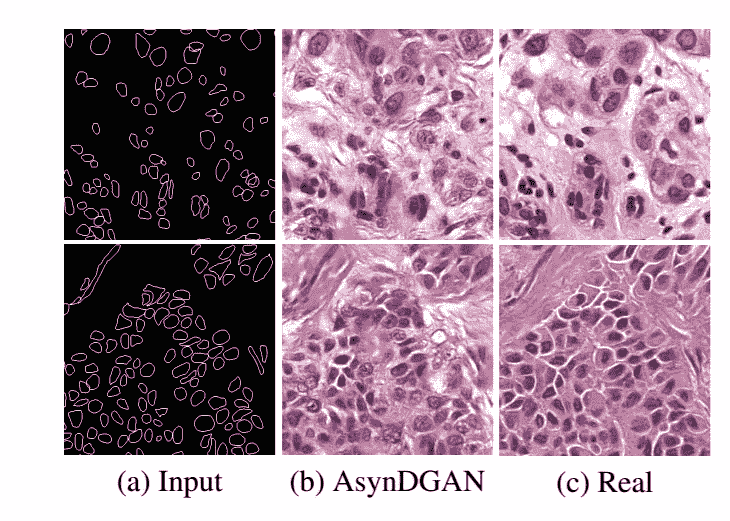

图二。AsynDGAN 合成核图像与真实图像的比较

[本文](https://arxiv.org/abs/2006.00080)被 CVPR 2020 接受。一般来说，由于医疗数据关系到患者的隐私，往往无法与他人分享。因此，由于公布的医疗数据很少，作者认为需要大量数据的模型，如深度学习，很难应用于医疗数据。

作者认为，从分布式鉴别器学习中心生成器 G，并使用从 G 创建的图像，可以在医院之间不共享数据的情况下进行学习，并解决隐私问题。

他们还说，提出的模型可以解决以下问题:

*   我们的实验表明，我们的方法可以从多个数据集学习真实图像的分布，而无需共享患者的原始数据
*   实验表明，与其他分布式深度学习方法相比，我们的方法效率更高，所需带宽更低
*   我们的实验表明，与由一个真实数据集训练的模型相比，我们的方法获得了更高的性能，而与由所有真实数据集训练的模型相比，我们的方法获得了几乎相同的性能
*   我们的实验表明，我们的方法有可证明的保证，发电机可以学习分布式分布

代码可从[这里](https://github.com/tommy-qichang/AsynDGAN)获得

# 2.方法

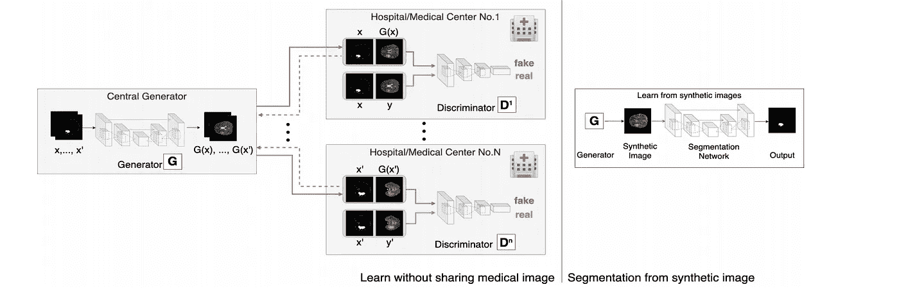

图三。整个模型结构。

如图 2 所示，中央生成器 G 接收特定于任务的输入(本文中的分段)。g 创建一个合成图像来欺骗本地鉴别器(D1，D2，…，D_n)。D_n 需要区分合成数据(x)和真实数据(G(x_n))。在 G 和 D 之间，只传输渐变和合成图像。因此，作者认为数据隐私没有被侵犯，因为只有本地医疗实体访问他们自己的真实数据(G(x_n))。

## AsynDGAN 的目标

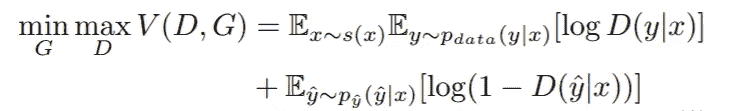

Eq 1。经典条件 GAN 的目标

在 AsynDGAN 中，G 由 N 个不同的 D 监督，每个 D 与数据集的一个子集相关联。因此，s(x)可以表示如下。

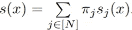

Eq 2。辅助变量 x 上的混合分布

因此，损失函数可以写成如下形式。

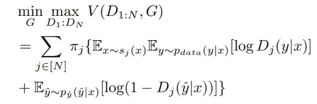

Eq 3。完全损失函数

# 优化过程

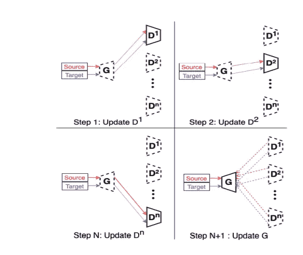

图 4。AsynDGAN 的优化过程。

在图 3 中，实线箭头表示正向传递，虚线箭头表示在我们的迭代更新过程的反向传递期间的梯度流。实线块表示它正在被更新，而虚线块表示它们在更新步骤中被冻结。红色和蓝色矩形分别是源遮罩和目标实像。

模型更新遵循以下过程。

1.  D-update:计算第 j 个鉴别器的对抗损失 D_j，并更新 D_j，其中 j = 1，2，…，n。
2.  G-update:在更新所有鉴别器之后，G 将使用如下的对抗性损失进行更新。

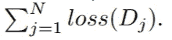

Eq 4。对抗性损失

这可以描述如下。

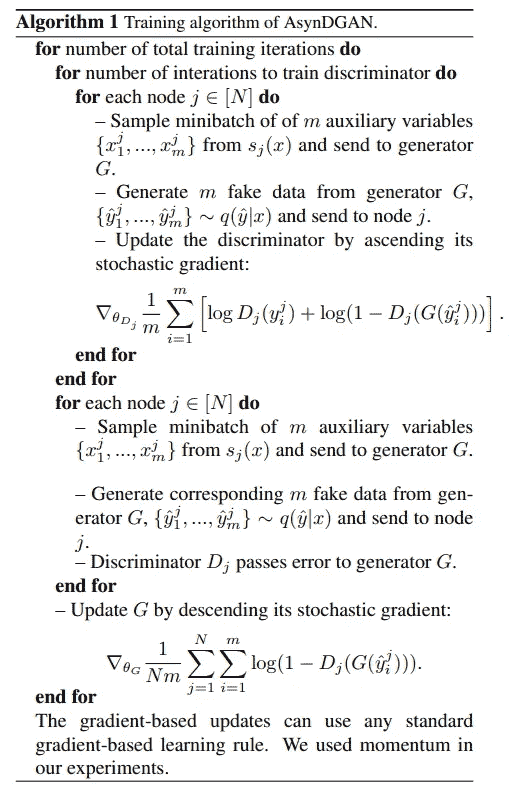

# 3.结果和实验

## 数据。

作者使用合成数据集， [BraTS2018](https://www.med.upenn.edu/sbia/brats2018/data.html) ，[多器官](https://ieeexplore.ieee.org/document/7872382)。
合成数据集由 3 个一维高斯组合而成。
即 y= ∑ (y_j + E_x=j)。此时，每个 y_j 遵循 y _ 1 ~ N(3，2)、y_2 ~N (1，1)和 y_3~N (3，0.5)。j = {1，2，3}。

## 合成数据集上的实验

## 环境

*   Syn-All:使用数据集中的所有样本训练常规 GAN。
*   Syn-Subset-n:仅使用局部子集 n 中的样本训练常规 GAN，其中 n ∈ {1，2，3}。
*   AsynDGAN:以分布式方式使用所有子集中的样本来训练 AsynDGAN。

## 结果

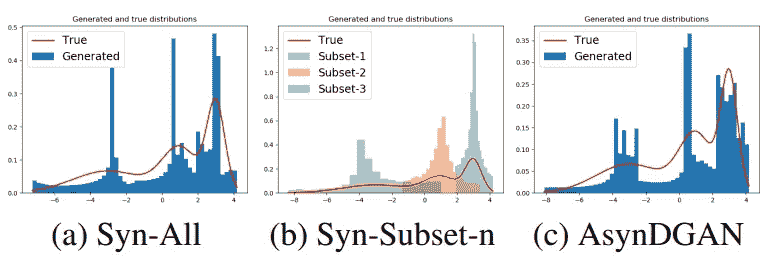

图五。不同方法生成的分布

在图 4 中，假设 a 是基线，c 的结果看起来比 b 的结果好。

## 脑肿瘤分割实验，细胞核分割

## 环境

*   真实全部:使用来自整个训练集的真实图像进行训练
*   实数子集-n:实数子集-n。使用来自第 n 个子集的实数图像进行训练，其中 n = 1，2，，10。用于脑瘤分割和
    n∈{乳腺、肝脏、肾脏、前列腺}。对于细胞核分割
*   Syn-All:使用从常规 GAN 生成的合成图像进行训练。使用所有真实图像直接训练 GAN
*   AsynDGAN:使用来自提议的 AsynDGAN 的合成图像进行训练

## 脑肿瘤分割结果

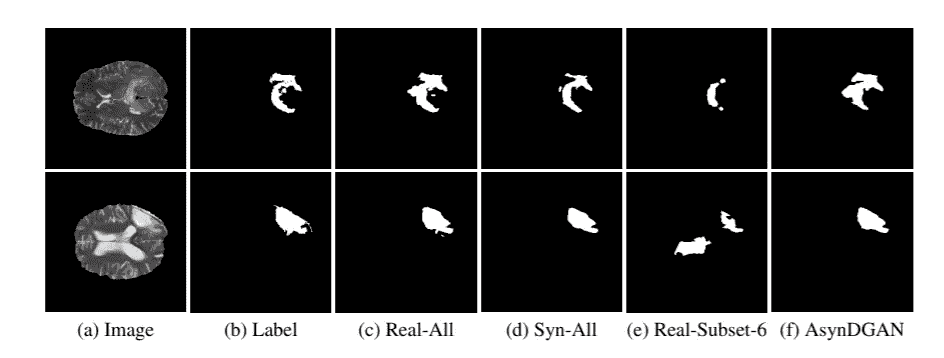

图六。典型的脑肿瘤分割结果。

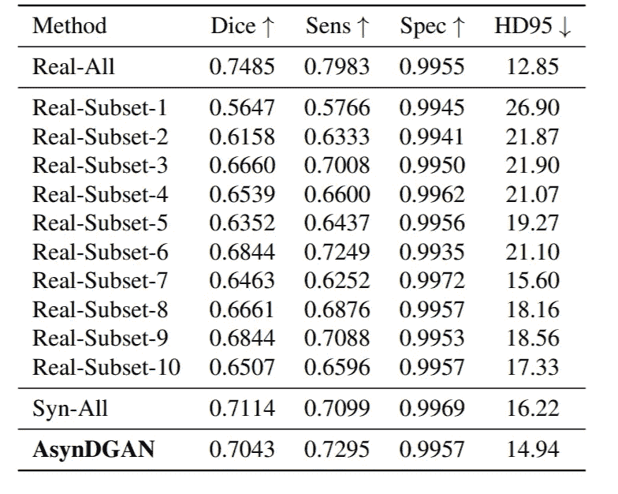

表 1。脑瘤分割结果。

## 细胞核分割结果

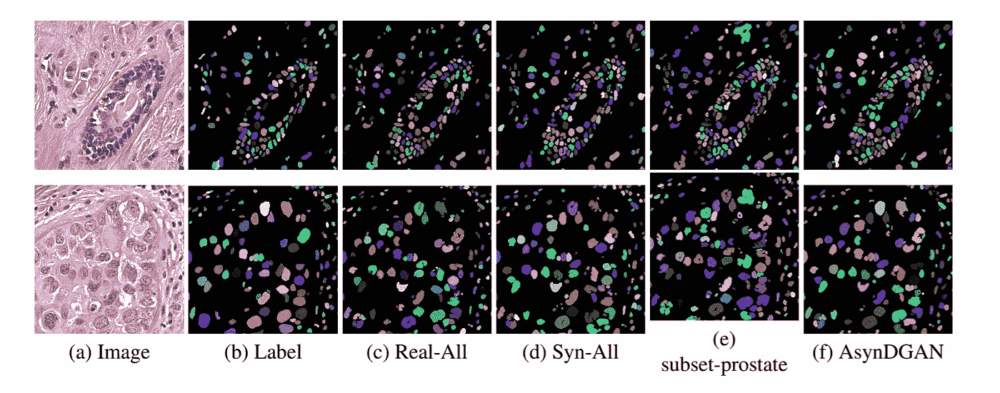

图 7。典型细胞核分割结果

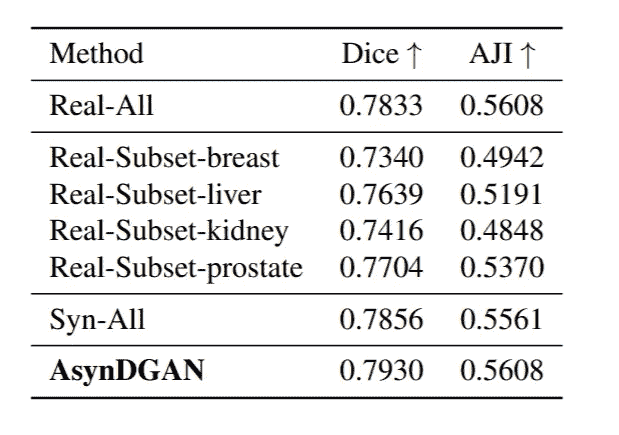

表二。细胞核分割结果

## 结果

当然 Real-All 表现最好。但是存在隐私问题，所以很多数据集无法访问。因此，在现实中，该模型显示了真实子集的性能。

然而，AsynDGAN 解决了隐私问题，并且比 Real-Subset-n 更好。此外，它显示了类似于 Syn-All 的结果，该结果是在使用所有真实数据学习后合成的。

# 我的看法

本文的观点为我们将深度学习应用于医学数据提供了重要的启示。

然而，为了实际实现，从分布式鉴别器更新 G 的过程，即

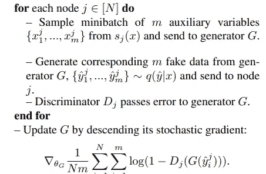

算法二。从 D 更新 G

但是，实际上，梯度和合成图像应该由几个医学实体从 D 转移到 G。这个实现看起来是非常具有挑战性的任务。