# 论文综述-用于联合目标探测和视点估计的圆柱形卷积网络

> 原文：<https://medium.com/analytics-vidhya/paper-review-cylindrical-convolutional-networks-for-joint-object-detection-and-viewpoint-813acead4b2c?source=collection_archive---------29----------------------->

每一个数字、表格都来自于论文。(如果来自其他论文或其他网站，则标记。)

# 内容

1.  摘要
2.  方法
3.  结果和实验
4.  结论
5.  我的看法

# 1.摘要

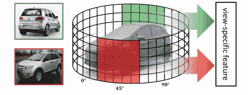

图一。圆柱形卷积网络示意图

[本文](https://arxiv.org/abs/2003.11303)被 CVPR 2020 接受。

作者表示，许多 CNN 模型通过数据扩充、大模型容量和空间转换等可见功能来处理几何变形。作者还认为，视点变化发生在 3D 空间，而许多 CNN 模型在 2D 空间处理它。因此，他们认为模型处理大型几何变换(例如，对象比例、视点、部件变形)的能力有限。

根据该论文，为了解决视点变化的问题，最近已经引起了对使用 CNN 同时估计视点和对象检测的兴趣。有一篇论文，首先用一组 2D 渲染的图像来表示一个 3D 物体，从不同的视点提取每幅图像的特征，然后聚合它们进行物体类别分类。但是，显然，这是不实际的。这是因为在实际问题中，通常不会给出具有不同视点的 2D 图像和 3D 图像。

因此，作者提出了圆柱卷积网络。这篇文章的主旨是这样的。

*   关键思想是提取以物体视点(即方位角)为条件的特定于视图的特征，该特征像在 3D 物体识别方法中一样在每个视点编码结构信息。
*   我们提出了一种新的可微分 argmax 算子，称为 sinonic soft-arg max，它可以管理视点的正弦属性，以预测来自离散视点箱的连续值。

作者认为这改进了对象检测和视点估计。

目前(2020–8–4)，该型号的官方代码尚未发布。

# 2.方法

# 2–1.问题陈述和动机

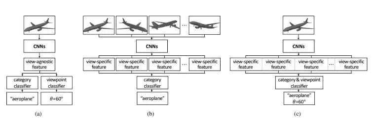

图二。圆柱形卷积网络的直觉

首先，该模型的目的是预测给定照片的对象类别和视点，即，在 2D 空间中。N_c 和 N_v 分别是对象类和视点的数量。并且 c 和 v 的值分别根据数据集中的类的数量和视点的数量而不同。

如图 2 所示，在(a)的情况下，类别分类器和视点分类器独立操作，因此它们不能提高彼此的性能。此外，由于(b)需要多视角图像，因此在实际应用中存在问题。在(c)情况下，通过在每个视点处的圆柱卷积核提取视点特定特征来估计对象类别似然性，并选择最大化对象类别似然性的视点核

# 注意。

既然视点是连续变量，你可能会问，“这个问题不是回归问题吗？”然而，作者使用本文提出，回归方法不能很好地表示对称或接近对称的对象的不同观点之间存在的歧义

# 2–2.圆柱卷积网络

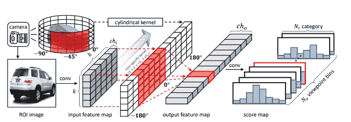

图三。圆柱卷积网络的关键思想

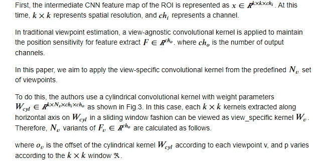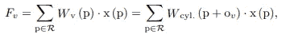

Eq 1。计算 F_v

作者说，视图特定特征受益于附近视点之间的结构相似性。

## 2–3.联合类别和视点估计

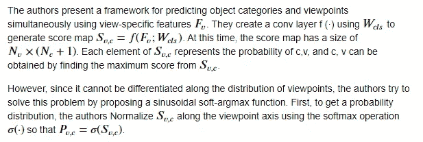

# 类别分类。

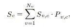

Eq 2。每个类别的分类 c

作者认为等式 2。是一个计算 c 得分的公式，但是因为包含了 v 的项，所以从 S_c 开始的梯度修正了视点的概率。

## 视点估计

接下来，在视点估计的情况下，似乎可以选择在识别对象类别时表现出最佳性能的特定于视图的特征。作者认为，由于视点具有周期性特征，可以通过正弦 soft-argmax 实现回归 P(v，c)。因此，如下计算每个类别 c 的对象视点估计。

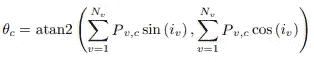

Eq 3。每个类别的视点分类 c

其中，sin (i_v)和 cos (i_v)，通过将正弦函数应用于每个视点箱 i_v(即，0，15，对于 N_v = 24)来提取。

## 包围盒回归

作者将附加卷积层用于 Wreg 的包围盒回归，以产生 N_v × N_c × 4 个包围盒偏移，其中 t_(v，c)= F(F _ v；W_reg)。每组 4 个值对 N_v ×N_c 组之一的初始位置的边界框变换参数进行编码。这导致对每个类别和视点箱使用不同的盒子组

## 损失函数

因此，全损耗函数计算如下:

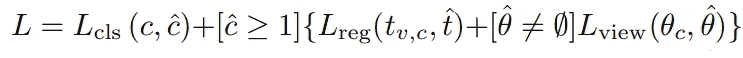

Eq 4。完全损失函数。

'^(hat)'的意思是地面真相。艾弗森括号指示器函数[ ]如果为真，则评估为 1，否则为 0。对于背景，c_hat = 0，没有地面实况边界框和视点，因此 L_reg 和 L_view 被忽略。如果数据集没有视点注释(θ_hat = ∅)，则忽略 L_view，并以无监督的方式训练视点估计任务。在相反的情况下，以监督的方式训练视点估计任务。他们对 L_cls 使用交叉熵，对 L_reg 和 L_view 使用平滑 L1，

# 3.结果和实验

# 数据。

作者使用了 [Pascal 3D+](https://yuxng.github.io/xiang_wacv14.pdf) 和 [KITTI 数据集](https://ieeexplore.ieee.org/document/6248074)。详细描述请参考论文和链接。

# 实验

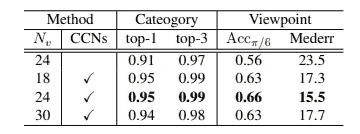

表 1。联合对象类别和视点估计性能

表 1。显示了 Pascal 3D+数据集的性能。正如你所看到的，N _ v = 24(CCN)给出了最好的性能。

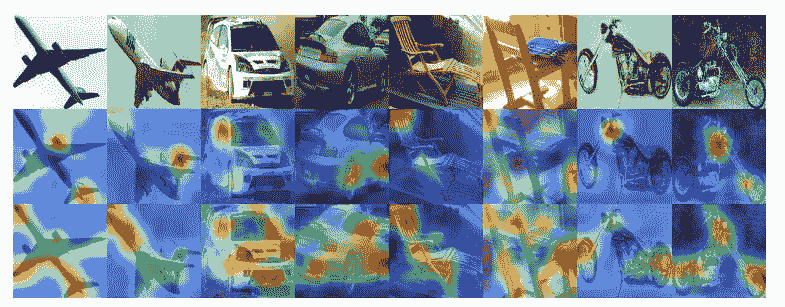

图五。通过 [Grad-CAM](https://arxiv.org/abs/1610.02391) 将学习到的深度特征可视化

图 5 从上到下分别示出了输入、注意力图(没有 CCN)和注意力图(有 CCN)。如你所见，该对象的注意力图被提取得很好。

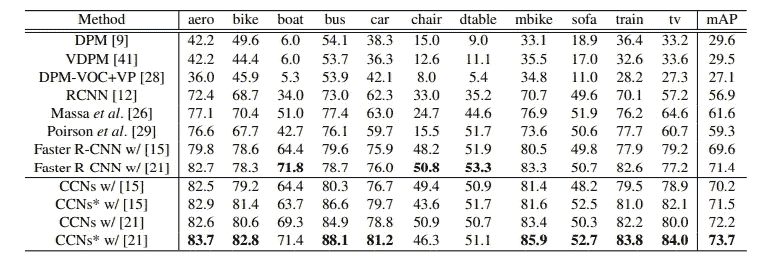

表二。Pascal 3D+数据集上目标检测的比较

表二。与其他型号进行性能比较。除了一些类别之外，作者的模型显示了最好的性能。

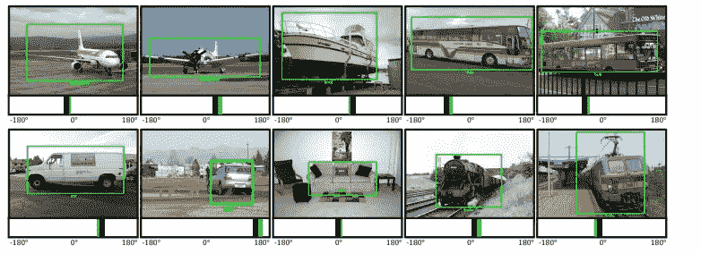

图六。Pascal3D+数据集上联合目标检测和视点估计的定性示例

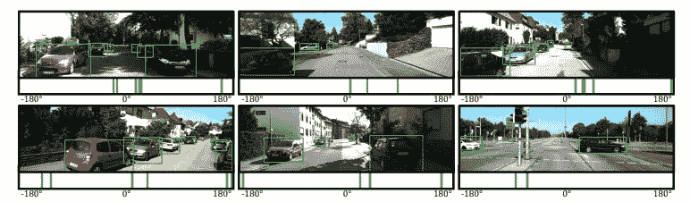

图 7。KITTI 数据集上联合目标检测和视点估计的定性例子

图六。，图 7。显示对象检测和视点估计的结果。这时，绿色是预测，黑色是地面实况。

# 结论

作者提出了一种通过圆柱卷积网络(CCN)同时执行视点估计和对象检测的模型。作者所说的关键思想如下:

*   关键思想是利用以滑动窗口方式从圆柱形卷积核采样的特定于视图的卷积核，来预测每个视点处的对象类别可能性
*   利用这种可能性，我们使用所提出的正弦 soft-argmax 模块同时估计对象类别和视点。

# 我的看法

我认为观点评估是一个非常吸引人的话题。因为它可以应用于多个领域(如数据扩充、提高性能)。然而，我怀疑这个模型将能够区分以下图片。

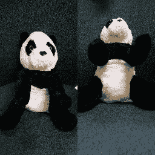

图 8。两张不同视角的娃娃照片

图 8。横轴几乎相同，但纵轴绝对不同。如果我对这篇论文的理解是正确的，我认为模型对这些照片给出了相同的输出，尽管这些照片具有不同的垂直视点。无论如何，它仍然看起来非常令人印象深刻的工作。