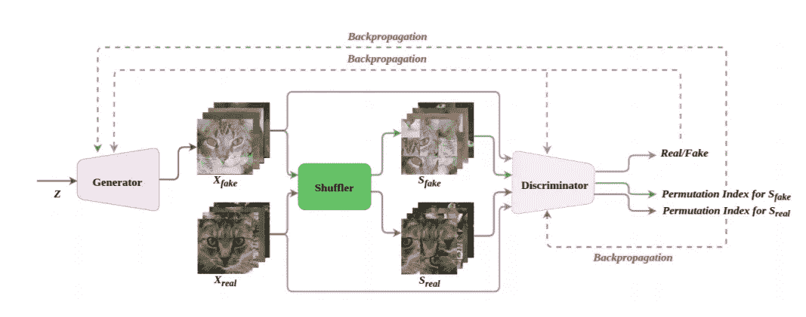
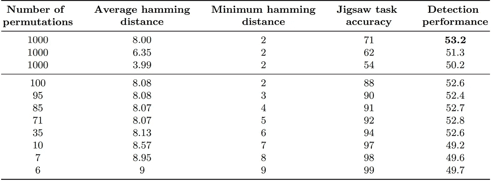
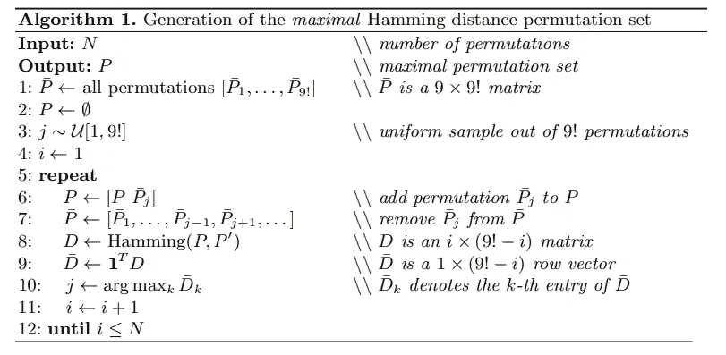
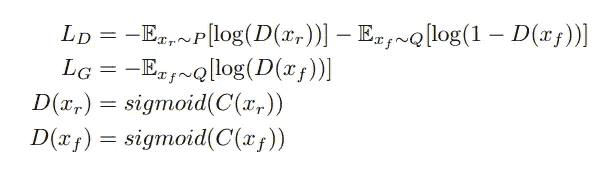
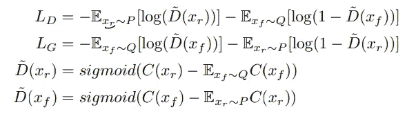
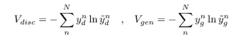
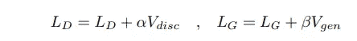
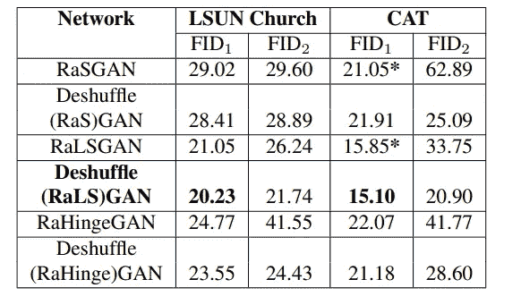
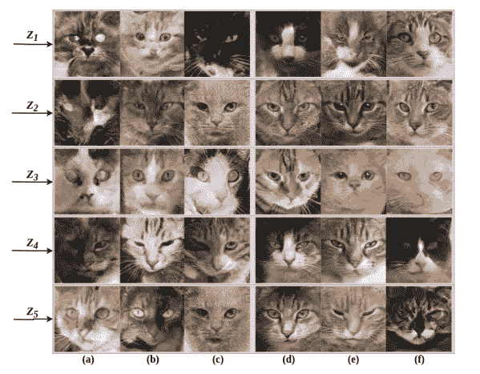
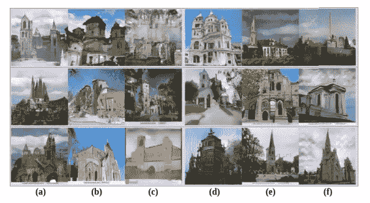

# 论文综述——de shuffle GAN:改进结构学习的自我监督 GAN(ICIP 2020)

> 原文：<https://medium.com/analytics-vidhya/paper-review-deshufflegan-a-self-supervised-gan-to-improve-structure-learning-1d601f3d95f8?source=collection_archive---------28----------------------->

## 内容

1.  摘要
2.  方法
3.  结果和实验

## 1.摘要

[本文](https://arxiv.org/abs/2006.08694)被 ICIP 2020 接受。

> 作者认为，就真实性和与原始数据分布的相似性而言，提高 [GAN](https://papers.nips.cc/paper/5423-generative-adversarial-nets.pdf) 性能的关键点之一是能够为模型提供学习数据空间结构的能力。

解决七巧板学习空间表征的想法已经存在。([【1】](https://arxiv.org/abs/1603.09246)，[【2】](https://arxiv.org/abs/1903.06864))但是，本文提出用上述思想来提高甘的学习能力。

作者将该模型实现为 pytorch。但据我所知，还没有落实。

# 2.方法

图一。模型的结构

作者介绍了 Shuffler，它像拼图一样混合输入图像，以改善空间表达学习。

Shuffler 将输入图像划分为 9 个图块，H 和 W 的输入大小为/3，然后以随机顺序洗牌。此时，可能的排列数是 9！，根据[汉明距离](https://en.wikipedia.org/wiki/Hamming_distance)选择 30 种排列。同样的程序适用于所有样品。

在 DeshuffleGAN 中，鉴别器 D 不仅能区分标准 GAN 与 X_real 或 X_fake，还能预测 S_fake 和 S_real 的排列顺序。d 在执行两个任务时共享权重，输出层除外。

因此，去混洗的任务是用 d 来解决 S_fake 和 S_real 的拼图。如果生成器 G 生成的图像质量不好，拼图块将不会相互关联。在这种情况下，D 向 G 给出负反馈以提高生成图像质量

## 看一看[1]，[2]之后

作者说，根据海明距离选择排列顺序。对我来说这看起来模棱两可。所以，我看一看[1]，[2]。有一个表格和算法解释选择排列顺序。

表 1。置换集影响的烧蚀研究(来自[1])

来自[1]

尽管如此，我还是不知道他们为什么选择 30 种排列。有什么原因吗？..

## 在作者的评论之后。

上述问题的答案是，他们的目标不是解决具有挑战性的去混洗问题，他们只想选择数量少但有效的排列。

## 2 比 1 的不利损失

图 2 经典 GAN 训练损耗

注意，P 是实数据分布，Q 是生成数据分布，C(x)是 x 的实性的度量，L_D 和 L_G 是 D 和 G 的平均损失函数。

作者将拉甘的理论描述如下。

> 经典的 GAN 训练导致训练中的问题，因为对于真实和虚假数据，G 将 D 推到输出 1，而事实上鉴别器应该收敛到 0.5，以实现输入和生成的数据分布之间的 JS 发散

作者还说，

> 训练的目的应该是不仅增加假数据是真实的概率，而且降低真实数据是真实的概率

因此，RaGAN 提出了一个新的目标，即相对主义，即鉴别器将估计输入数据比生成数据更真实的概率。

在这篇论文中，据说使用了 RaGAN 损耗和 DCGAN 结构。作者说，他们只增加了一个 conv 层的输出 D 的排列。

图三。射频损耗

d 预测 X_real 和 X_fake 的 r/f 概率，因为混洗数据不影响敌对目标

## 2–2.去混洗损失

对于鉴别器，目标是最小化 S_real 的真实洗牌顺序和洗牌顺序预测之间的误差。作者认为只根据 S_real 更新 D 的原因是因为使用 S_fake 有可能学习到无意义的数据。

相反，对于生成器，目标是最小化真实洗牌顺序和对 S_fake 的洗牌顺序的预测之间的误差。如果 G 很好地生成样本，训练有素的 D 使用真实数据将能够对生成的样本进行去洗牌。在这种情况下，D 给予 G 以正反馈
相比之下，如果 G 生成的样本很糟糕，训练有素的 D 使用真实数据将无法对生成的样本进行洗牌。这种情况下，D 给 g 负反馈。

D 和 G 的去混洗目标被给定为交叉熵损失。

图 4。D 和 G 的交叉熵损失

其中 N 表示样本数量，y_d 是 S_real 的大小为 30×1 的独热编码标签向量，y_bar_d 是 S_real 的置换索引的预测向量。

具有 30×1 独热码编码向量的原因似乎是通过上述汉明距离选择了 30 个排列。

## 2–3.完全目标

图五。完全目标函数

本文选取α为 1，β为 0.2

# 3.结果和实验

## 3–1.目标函数

在 [ 3]中具有标准对抗性训练损失的 RaSGAN，在[ [4](https://arxiv.org/abs/1611.04076) 中具有最小平方损失的 RaLSGAN，以及在[ [5](https://arxiv.org/abs/1705.02894) 中具有铰链损失的 RaHingeGAN 被用作基线方法。基线的去混洗版本增加了去混洗损失，如图 5 所示。

## 3–2.结果

表二。评估结果(FID)

除了在 CAT 数据集上的 RaSGAN 之外，在所有设置中，去 DeshuffleGANs 相对于基线实现了较低的 FID。

图 CAT 数据集的生成结果。

图 7。LSUN 教堂数据集的生成结果。

从正态分布中采样 5 个不同的向量，并作为输入提供给 6 个不同的 GAN 模型，如下所示。
(a)拉斯甘，(b)拉斯甘，(c)拉欣根，(d)德舒夫雷(拉斯)甘，(e)德舒夫雷(拉斯)甘，(f)德舒夫雷(拉欣格)甘

# 我的看法

就我个人而言，我认为在基本 GAN 框架没有显著变化的情况下，通过增加一个洗牌损失项来提高性能是非常好的。