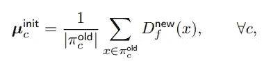

# 论文综述——通过自调节 GANs 生成多样化图像

> 原文：<https://medium.com/analytics-vidhya/paper-review-diverse-image-generation-via-self-conditioned-gans-fa847f696e04?source=collection_archive---------23----------------------->

每一个数字、表格都来自于论文。(如果来自其他论文或其他网站，则标记。)

# 内容

1.  摘要
2.  方法
3.  结果和实验
4.  我的看法

# 1.摘要

图一。聚类图像合成

图二。2 个特定类别的可视化

[本文](https://arxiv.org/abs/2006.10728)被 CVPR 2020 接受。作者说，对于模式崩溃，在无条件 GAN 的情况下，存在模式丢失的情况。在条件 GAN 的情况下，可以通过给定标签来强制发生器具有所有模式。然而，在实践中，通常很难获得带有标签的数据。

因此，作者引入了一种无类别标签训练的自条件 GAN 模型来解决模式崩溃问题。该模型自动对鉴别器 D 中的特征空间进行聚类，通过这些聚类，D 使生成器覆盖所有语义类别

作者认为，他们得到了一个很好的结果模式崩溃基准(高斯混合，堆叠 MNIST，CIFAR-10)

代码可从[这里](https://github.com/stevliu/self-conditioned-gan)获得

# 2.方法

第一，GAN 必须模仿 P_real(目标分布)。他们将数据集划分为 k 个簇{π_1，.。。，π_k}是在训练期间确定的。他们没有使用地面真相。

训练样本最初聚集在随机初始化的鉴别器特征空间中

图三。d 和 G 是在自动找到的聚类 c 的条件下训练的。

d 应该能够识别从数据集中的聚类π_c 中采样的真实图像，并且能够将其与由类条件生成器 G 合成的伪图像区分开

反之，在 c 的条件下生成的 G 必须通过模仿π_c 的形象来欺骗 D，此时不使用地面真值标签，而是对随机鉴别器特征进行聚类，并周期性地对鉴别器特征进行重新聚类。

作者说他们算法的两个关键点是:

> 1.关于由当前划分给出的聚类标签的条件 GAN 训练。
> 
> 2.根据实际数据的当前鉴别器特征周期性地更新分区。

## 条件 GAN 训练

该模型由类条件生成器 G(z，c)和类条件鉴别器 D(x，c)组成。请注意，内部鉴别器要素图层设置为 D_f，最后一个图层设置为 D_h。

Eq 1。我在纸上找不到运算的符号。也许串联？

要优化的对抗性目标是:

Eq 2。敌对目标

在这种情况下，从分类分布 P_π中对聚类索引 c 进行采样，分类分布 P _π根据训练集中的真实大小对每个聚类进行加权。Eq 2。用极小极大法优化。

Eq 3。MinMax 时尚优化

总体培训程序如下。

## 通过聚类计算新分区

在训练期间，共享鉴别器层 D_f 需要更好地了解数据的分布。因此，该模型通过在由当前鉴别器特征引起的度量上重新划分目标数据集来周期性地更新π。他们使用 k 均值聚类[32]来根据 D_f 输出空间获得到 k 个聚类的新划分。

Eq 4。根据 D_f 输出空间对 k 个簇的新划分

D_f(x)是 D_f 特征空间中每个聚类的均值。μc 定义如下。

Eq 5。定义μc

## 聚类初始化。

在进行第一次聚类时，作者说他们使用了 k-means++初始化。在后续重新聚类的情况下，使用从先前聚类获得的平均值来初始化。新聚类的公式是:

Eq 6。为了计算聚类

这时，Eq 6 的 D。表示当前鉴别器特征空间。

## 与旧集群匹配。

重新划分后，为了防止条件 G 和 D 从零开始重新学习，作者说，通过匹配新的和旧的集群，使每个生成器的目标分布不会发生剧烈变化。他们的目标是找到一个排列ρ: [k] → [k]，使目标最小化:

Eq 7。最小化的目标

作者使用经典的匈牙利最小成本匹配算法解决了上述匹配损失，并获得了在未来时期用于 GAN 训练的新聚类。算法 1。提供整个培训过程的总结。

# 3.结果和实验

# 数据。

作者使用真实数据集(堆叠 MNIST，CIFAR-10 等)。)和合成数据集(2D 环数据集，2D 网格数据集)。

*   2D 环数据集是 8 个 2D-高斯数据集的混合，平均值(cos 2πi/8，sin 2πi/8)和方差为 1e-4。这时，我∈ {0，。。。, 7}.
*   2D 网格数据集是 25 个 2D-高斯数据集的混合，平均值(2i 4，2j 4)和方差为 0.0025。此时，我，j ∈ {0，.。。, 4}.

# 实验。

\表 1。恢复的模式数、高质量样本百分比和反向 KL 发散度量。结果是 10 次试验平均值

图 4。在 2D 网格数据集上生成的可视比较样本。

表二。恢复的模式数量、反向 KL 偏差和初始得分(IS)指标。结果是 5 次试验平均值

表 2 中的 FID 是一个受欢迎的指标，但我不确定表 1 中高质量样品的百分比是什么意思。使用了什么指标..无论如何，我们可以看到作者的模型在所有四个数据集上都获得了模式崩溃、反向 KL FID 和 IS 度量的良好结果。

表 3。FID 和 IS 用于改变 k。结果是 5 次试验的平均值

它对很小的 K 值表现不佳，但对大范围的 K 值表现良好。

表 4。FID，FSD，用于 ImageNet，Place365

总的来说，它表现出良好的性能，但仍然无法达到完全监督的类条件的质量。作者说。

> 虽然 Logo-GAN-RC 优于我们的方法，但它是基于监督的预训练 ImageNet 分类器的。

还有很多其他的图和表，但我认为这足以介绍这篇论文。

还有很多其他的图和表，但我认为这足以介绍这篇论文。更多的图表请参考论文。

# 我的看法

本文的核心思想是自监督标签聚类。

这确实是一个需要解决的重要问题，因为在很多情况下，标签和注释并不包含在真实数据中。但是，不幸的是，没有多少提到数据的质量，因为论文的主题是标签聚类。