# 基于论文参考的草图图像彩色化

> 原文：<https://medium.com/analytics-vidhya/paper-review-reference-based-sketch-image-colorization-using-augmented-self-reference-and-dense-4e646f811ff2?source=collection_archive---------20----------------------->

每一个数字、表格都来自于论文。(如果来自其他论文或其他网站，则标记。)

# 内容

1.  摘要
2.  方法
3.  结果和实验
4.  我的看法

# 1.摘要

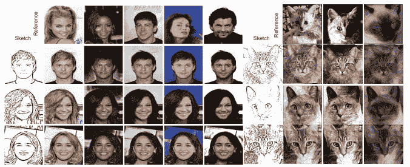

图一。使用 CelebA、ImageNet 的定性结果

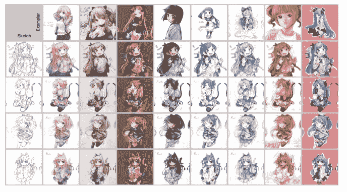

图二。使用 Tag2pix 的定性结果

[本文](https://arxiv.org/abs/2005.05207)被 CVPR 2020 接受。

作者说，彩色化任务在灰度图像中是成功的，但在草图或轮廓图像的情况下，它们是具有挑战性的，因为它们不包括像素密度。

解决这个问题的常用方法是利用用户提示和参考图片。

然而，在参考图像的情况下，由于很少的数据集以及草图和参考之间的信息差异，研究仍然很慢。

因此，作者试图从两个方面解决上述问题。

*   我们利用一个由原始图像通过颜色扰动和几何失真产生的增强自我参考。该参考包含来自原始图像本身的大部分内容，从而为也来自同一原始图像的草图提供了完整的对应信息
*   我们的模型通过基于注意力的像素特征转移模块(我们称之为空间对应特征转移(SCFT)模块)将从参考获得的上下文表示显式地转移到草图的空间对应位置

作者认为，上述两种方法可以在没有人工标注标签的情况下优化网络。

目前(2020–7–29)，这款车型的官方代码还没有发布。

# 2.方法

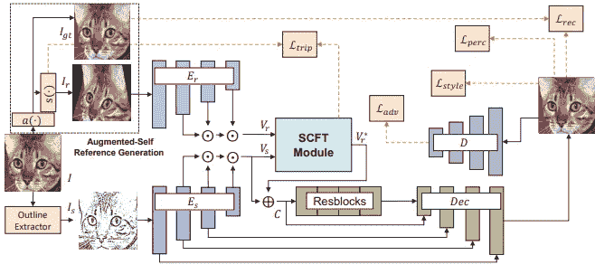

图三。模型的整体工作流程

## 2–1.整体工作流程

如图 3 所示，I 是彩色图像源，I_s 是使用轮廓提取器提取的草图图像，I_r 是通过应用薄板样条变换(TPS)获得的参考图像。接收 I_s 和 I_r 的模型使用两个独立的编码器 E_s(I_s)和 E_r(I_r)提取激活图 f_s 和 f_r。

为了将信息从 I_r 传递到 I_s，该模型使用了受自我注意机制启发的 SCFT 模块。SCFT 计算所有 I_r 和 I_s 像素之间的密集对应。基于从 SCFT 得到的视觉映射，结合了 I_r 和 I_s 之间信息的上下文特征通过模型得到最终的彩色输出。

## 2–2.扩充自参考生成

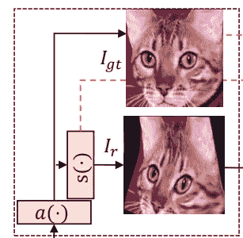

图 4。外观变换 a()和 TPS 变换 s()

执行外观和空间变换以从 I 生成 I_r。此时，作者认为，由于 I_r 是从 I 生成的，所以它保证包括对 I_s 着色有用的数据。

外观变换 a():向每个 RGB 像素添加特定随机噪声的过程。这样做的原因是为了防止模型记忆颜色偏差。(即苹果->红色)此外，作者认为，通过为每次迭代提供不同的参考，该模型强制利用 E_s 和 E_r。此时，a(I)被用作基本事实 I_gt。

TPS 变换 s():在应用外观变换之后，非线性空间变换算子被应用于 a(I)。作者说，这防止了模型从 I 开始在相同的像素位置懒惰地引入颜色，同时强制模型识别语义上有意义的空间对应，即使对于具有空间不同布局(例如，不同姿势)的参考图像也是如此。

## 2–3.空间对应特征转移

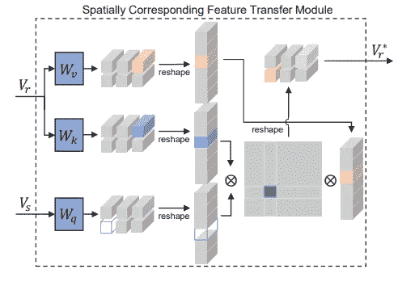

图五。空间对应特征转移(SCFT)模块

作者所声称的 SCFT 模块的目的如下。

*   学习从参考文献中获取信息。
*   学习应该将草图图像转移到哪个部分。

首先，两个编码器 E_r 和 E_s 由创建激活图的 L 个 conv 层组成。然后，执行下采样以使激活图适合相同的 f^L 和空间大小，并沿着通道连接。因此，最终的激活图 V 如下。

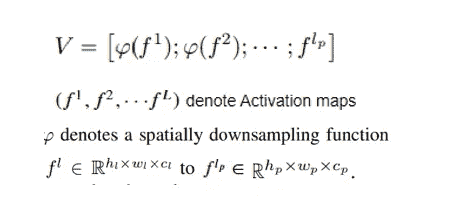

Eq 1。最终激活图 V 和符号

这时，“；”是通道连接运算符。通过以上内容，作者认为低-高级特征可以同时被捕获。我们可以这样重塑 V:

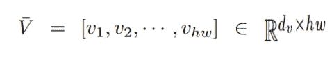

Eq 2。重塑的 V

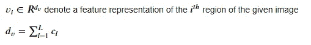

等式 2 的符号。

因为这部分有很多符号，我认为使用 latex 编辑器中的图像会更好。(因为 medium 不支持 latex 编辑器。)

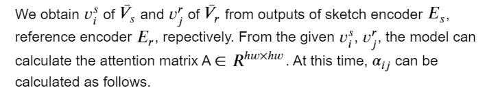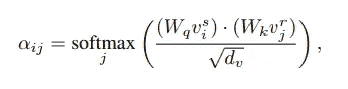

Eq 3。αij 的方程

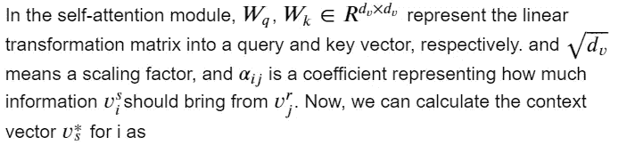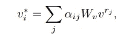

Eq 4。计算上下文向量 v*

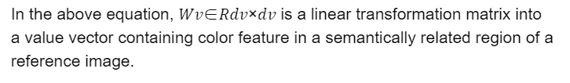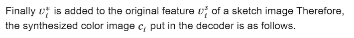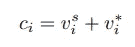

Eq 5。合成彩色图像 c_i

## 2–4.目标函数

## 基于相似性的三重损失。

作者认为，通过应用空间变换，可以获得权重 w_ij 的全部信息，该权重 w _ ij 表示输入图像或查询的第 I 个像素位置与输出的第 j 个像素位置或一个关键字有多大关系。此外，他们说 wij 的值可以被认为是像素到像素的关联。使用这种像素级的对应信息，作者提出了一种基于相似性的三元组损失来直接监督像素查询和用于计算注意力图的关键向量之间的亲和力。

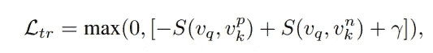

Eq 6。基于相似性的三重损失

此时，s(，)是缩放的点积，γ是指示 S(v_q，v^p_k)和 S(v_q，v^n_k)应该保持的最小距离的余量。L_tr 鼓励查询表示接近正确的(正的)键表示，同时惩罚远离错误的(负采样的)键表示

## L1 损失。

由于地面真实图像 I_gt 已经存在(在 2–2 中),对不同的 I_gt 和输出施加惩罚的重建损失可以计算如下。

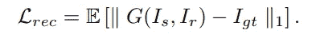

Eq 7。重建损失

## 对抗性损失。

本文采用对抗损失的条件甘。作者说保留输入图像 I_s 很重要，所以将 I_s 设置为一个条件。因此，对抗性损失公式计算如下:

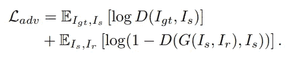

Eq 8。对抗性损失

## 知觉丧失。

都说感知损失让网络产生的输出更似是而非(？).作者使用多层激活图来使用感知损失，以不仅反映高级语义，还反映低级风格，如

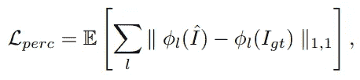

Eq 9。知觉丧失

φ_ l 代表在第 1 层从 VGG19 网络中提取的第 1 层的激活图

## 风格丧失。

对于给定的φ_ l∈R(C _ l×H _ l×W _ l)，缩小激活图之间协方差差异的样式损失计算如下。

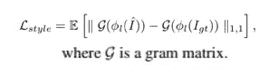

Eq 10。风格丧失

## 最终损失。

因此，最终损失函数如下:

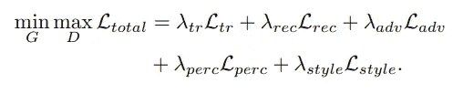

Eq 11。最终损失函数

# 3.结果和实验

## 数据。

文中使用的数据集有: [Tag2pix](https://arxiv.org/abs/1908.05840) ，[白纬玲数据集](https://arxiv.org/abs/1906.11888)， [SPair-71k 数据集](https://arxiv.org/abs/1908.10543)，ImageNet，[人脸数据集](https://arxiv.org/abs/1411.7766)，Edges→鞋子数据集。
关于每个数据的描述，请参考文章和链接。

## 实验

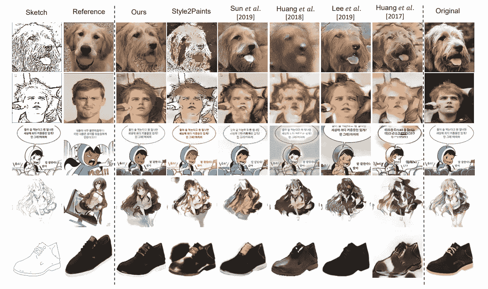

图六。将着色结果与基线进行定性比较

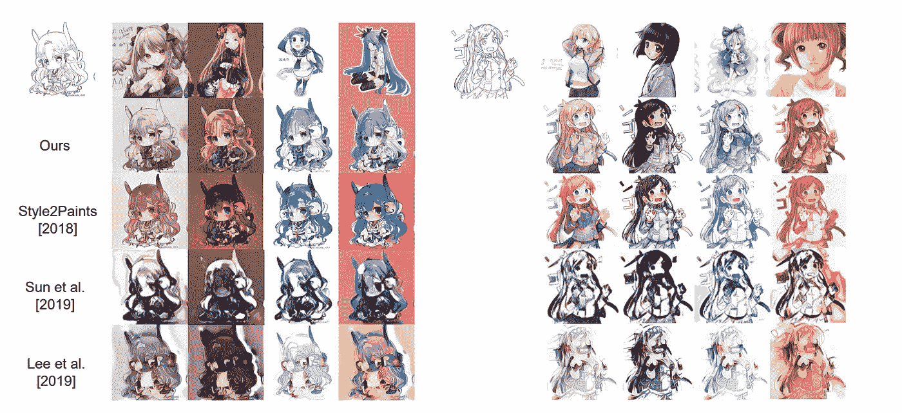

图 7。与 Tag2pix 数据集上的基线进行定性比较。

与图 6、图 7 中的其他基线结果相比，本文的结果看起来比其他基线结果更好。

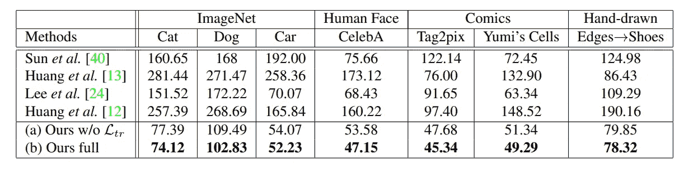

表 1。数据集的定量比较

表 1。使用 FID 测量的分数显示，作者的论文表现最佳。

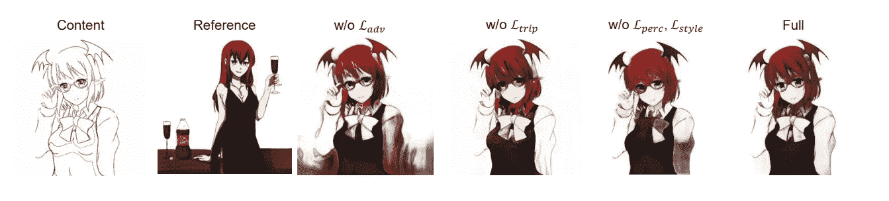

图 8。损失函数的有效性

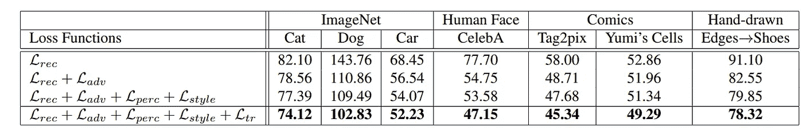

表二。FID 根据损失函数项的消融进行评分

如图 8 和表 2 所示，可以看出性能随着每一项而提高。

还有许多其他用户研究、数字和表格，因此如果您感兴趣，请参考本文的附录。

# 我的看法

就我个人而言，我非常惊讶 Tag2pix 这样的数据集能够运行良好。总的来说，动漫数据集很少，而且有很多变量，比如姿势、视角和身体比例，所以我认为学习很难。当然，即使考虑到它是彩色化的一个特定领域，看到它工作良好也是令人惊讶的。