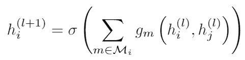

# 【论文分解】用图卷积网络对关系数据建模(Schlichtkrull 等人，2018)

> 原文：<https://medium.com/analytics-vidhya/paper-series-2-modeling-relational-data-with-graph-convolutional-networks-schlichtkrull-et-al-b009ff48ab87?source=collection_archive---------7----------------------->

这几天真的迷上了几何深度学习。特别是，我对图形神经网络(GNN 的)及其应用非常感兴趣。对于那些不熟悉这个话题的人，我强烈建议你们帮自己一个忙，好好读一读，因为那里有很多很好的资源。

我今天要写的论文是一项建立在最近流行的图形卷积网络(GCN 网络)之上的研究。本文的合著者 Thomas Kipf 是流行的 GCN 模型的作者，他也有一篇很棒的博文解释了这个话题。

# 1.介绍

作者首先介绍了一个被称为[统计关系学习(SRL)](https://en.wikipedia.org/wiki/Statistical_relational_learning) 的主题。SRL 在知识库环境中的任务非常重要，因为现代知识库太大太复杂，无法手工管理。也就是说，本文的作者试图通过将知识库视为多关系图来解决这个问题，实体是节点，关系是边。

作者在本文中使用的两个任务是实体分类和链接预测。

## 实体分类

用于该任务的模型类似于在*使用图卷积网络的半监督分类(Kipf 和 Welling，2017)* 中提出的 GCN。在图上运行 GCN 后，对每个节点使用 softmax 分类器。本质上，你有两个模型:GCN +分类器。

## 链接预测

这类似于实体分类任务，但是我们有一个额外的组件。用于该任务的模型类似于一个[自动编码器](https://en.wikipedia.org/wiki/Autoencoder)。编码器部分将通过关系 GCN (R-GCN)在执行卷积运算后基本上提供节点表示，解码器是一种张量分解方法，称为 DistMult，来自*嵌入知识库中用于学习和推理的实体和关系(Yang et al .，2014)* 。

这两项任务的总体架构如下:

论文中的图 3。

# 2.神经关系建模

本节将分析消息传递在 GNN 环境中是如何工作的。

## 2.1 关系图卷积网络

这指的是本文中使用的 R-GCN。它基本上是 Kipf 和 Welling 2017 年 GCN 的延伸。主要区别在于， ***Kipf 和 Welling，2017 是基于对本地邻域的操作，而 R-GCN 是针对大规模关系数据的。***

R-GCN 可以被认为是更一般的消息传递框架的一个特例:

我一直在重复我自己，但是神经网络中消息传递的本质是，一个节点在一次消息传递后的表示基本上是其邻居的总和。这在上面的等式中很明显(注意 sigma)。这里$g_m$可以是从神经网络到简单的权重乘法的任何东西(如 Kipf 和 Welling，2017 年的情况)。

在这个通用消息传递框架的基础上，作者扩展了这个等式以考虑多关系图:

首先，$\mathcal{N}_i^r$指的是在关系$r$下的节点$i$的邻居集。例如，如果节点 1 有三个邻居，其中只有两个处于“is_friend_of”关系下，那么我们只将这两个节点纳入聚合。$c_{i，r}$是一个归一化常数，可以学习或简单地设置为$\mathcal{N}_i^r$.的长度注意第二项不包括在求和中。

您可以看看图中的 R-GCN 是如何工作的:

论文中的图 2。

您可以看到，R-GCN 消息传递框架同时考虑了传入和传出方向。

## 2.2 正规化

可以想象，像 R-GCN 这样的模型的参数数量会随着图表的大小快速增长。为了解决这个问题，作者提出了两种正则化技术:基对角分解和块对角分解。

## 基对角分解

回想前一等式中的权重矩阵，该分解方法实质上将该矩阵分解成基变换的线性组合:

作者并没有真正说明如何获得基向量 V，但他们确实说明了这可以被视为“不同关系类型之间有效的权重分配”的一种形式。

## 块对角分解

块对角分解本质上是相同的，除了我们用矩阵代替向量。

同样，对于我们从哪里得到这些问题，也没有一个明确的解释。如果我发现了什么，我会更新文章。

这就是本文的基本内容。如果你对 R-GCN 模型的实际表现很好奇，我强烈建议你看一看原文。

> 我有意省略了本文的其他部分(即特定任务的实现、实验设置等。)因为我想更专注于直觉和方法。如果时间到了，我可以随时编辑这些细节，但现在这不是这个系列的主要焦点。