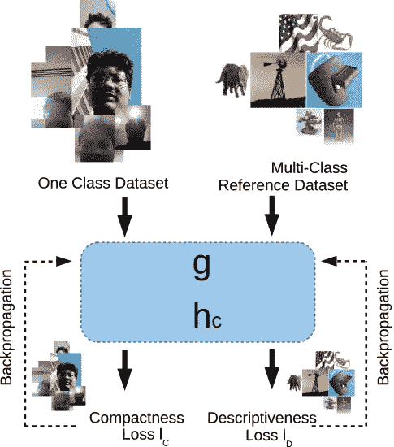

# 深度一类分类

> 原文：<https://medium.com/analytics-vidhya/paper-summary-deep-one-class-classification-doc-adc4368af75c?source=collection_archive---------7----------------------->

## 许多应用对一类分类的高需求的可行解决方案

在这个故事中，介绍了约翰·霍普金斯大学为一类分类学习深度特征。这是作为 IEEE 图像处理汇刊(IEEE TIP)的期刊文章发表的。在本文中，一种新的基于深度学习的方法应用于单类迁移学习，其中来自不相关任务的标记数据用于单类分类中的特征学习。在各种数据集上的实验表明，所提出的深度一类分类(DOC)方法比现有的分类方法取得了显著的改进。

他们甚至在他们的 Github 上向所有人公开代码！
让我们看看他们是如何做到的。

图 1 **一级分类**

# 概述

1.  **什么是一级分类**
2.  **深度一类分类(DOC)算法**
3.  **实验结果**

# **1。一级分类是什么**

一类分类训练分类器在给定单个类样本时能够识别类外对象[1]。一类分类在许多真实世界的计算机视觉应用中遇到[2，3，4]，包括新奇检测、异常检测、医学成像和移动主动认证。

# **2。深度一类分类(DOC)算法**

## 这是什么纸？研究人员到底做了什么？

尽管单类分类对许多应用是有希望的，但是现有的单类分类方案的方法仅仅训练在给定的概念上，不能在真实数据集上产生有希望的结果。作者认为，如果我们在考虑描述性的同时考虑紧凑性，我们可以学会更有效地表达自己。

本研究从迁移学习的角度优化一类分类问题。作者通过设计优化单类分类任务的深度功能来解决这一特定问题，他们将其命名为单类迁移学习。

## **论文关于 DOC 算法的介绍**

所提出的方法在选择的卷积神经网络(CNN)之上操作，并产生描述性特征，同时在给定类的特征空间中保持低的类内方差。为此，提出了两个损失函数，紧凑性损失( *lC* )和描述性损失( *lD* )以及并行 CNN 架构。

所提出的方法(图 2)冻结了来自预训练深度模型的初始特征 *g_s* ，并学习 *gl* 和 *hc* 。 *gl* 指特征提取网络 *h_c* 指分类子网络。

图 2 单类特征学习方法

基于分类子网络( *hc* )的输出，针对紧凑性损失( *lC* )和描述性损失( *lD* )两种损失进行优化。因此，整体损失函数引入紧凑性损失( *lC* )作为正则项，同时最小化描述性损失( *lD* )。

损失函数

所提出的方法通过反向传播从总损失函数中学习 *g_l* 和 *h_c* 的权重。

图 3 建议方法的概述

**紧密度损失( *lC* )使用给定的单类数据集，增加同一类内不同图像特征的相似度。损失函数由特定批次的成分样本之间的平均相似性表示。**

****描述性损失( *lD* )是一种多类分类损失函数，它使用外部多类参考数据集在很大程度上分离每个类的不同要素表示。损失函数由 ImageNet 数据集的交叉熵表示。****

********

****图 4 提议的架构:(a)训练，以及(b)提议的 DOC 方法的测试框架。****

****为了训练 DOC 算法，图 4(a)中所示的架构用于训练 DOC 算法，而图 4(b)用于测试。设共同特征提取子架构为 *g(⋅)* ，共同分类子架构为 *hc(⋅)* 。对于参考和二级网络，测试的是 AlexNet 和 VGG16。****

****训练网络模型由两个 CNN 处理，一个参考网络和一个次级网络，具有目标和参考数据输入。参考网络和次级网络的权重在每个对应的对应物上绑定。基于两个损失(描述性损失和紧凑性损失)的学习，使用在参考和次级网络中提取的特征。****

****测试模型包括两个阶段:模板生成和匹配。在训练期间学习的激励图被用作从一小组样本生成模板的特征。然后，根据保存的模板，用一类 SVM、SVDD、k-最近邻分类器等进行分类。****

## ****他们是如何做到的？****

****作者有三种使用深度学习进行一类分类的策略来比较 DOC 的性能。使用的数据集是椅子的正常和异常图像。总之，这三种策略都不能产生一个紧凑的描述性特征。****

1.  ******提取深层特征******
2.  ******使用外部数据集微调两类分类器******
3.  ******使用单一类别数据进行微调******

********

****图 5 异常图像检测中一类分类的可能策略。(a)正常和异常图像样本。(b)使用 AlexNet 功能获得的功能空间。(c)通过使用由 ImageNet 数据样本表示的外来物体来训练两类 CNN 而获得的特征空间。(d)仅使用正常对象通过微调获得的特征空间。(e)使用所提出的方法获得的特征空间。****

****图 5(b)使用预先训练的训练数据，通过策略 1 从现有 CNN 架构中提取深层特征。在策略 1 中，因为深度特征是描述性的，所以期望相同类别的样本在提取的特征空间中聚集在一起。策略 2 将图 5(c)中的特征空间分类为两类图像，一类来自正常的椅子，另一类来自 ImageNet 数据集。图 5(d)由策略 3 在仅使用常规椅子类别的预训练 AlexNet 网络上进行微调。图 5(e)是使用 DOC 方法获得的特征空间。****

****在图 5(b)和 5(c)中，正常和异常图像的样本没有被充分分离。在图 5(b)中，现有的 CNN 体系结构不具有在现有的 CNN 体系结构中将正常和异常椅子的类别充分分离为不同簇的能力。在图 5(c)中，在正常和异常椅子的图像之间存在细微差异，但是它们比其他 ImageNet 对象图像更相似。这阻止了正常和异常图像被充分地分离为不同的组。在图 5(d)中，因为所有类别标签都是相同的，所以当显示异常椅子对象时没有辨别能力，并且正常和异常样本都被投射到同一点。****

****图 5(e)显示了正常和异常样品的相对分离。所提出的方法表明，通过添加损失函数来表示描述性和紧凑性，可以学习策略 1 的方法的有效表示。****

# ****3.实验结果****

****在使用 1001 异常对象数据集的异常图像检测中，异常的性质是先验未知的，因此在单个类中执行训练。随着所提出的框架的引入，AlexNet 的性能提高了大约 14%,并且所提出的方法在该数据集上表现最佳。****

********

****接下来，在一类新颖性检测中，Caltech256 数据集用于基于先前观察到的样本来评估新样本的新颖性。很明显，与现有方法相比，DOC 方法产生了显著的改进。DOC 方法将 AlexNet 的性能提高了约 13%。****

********

****1 类新奇检测问题中的错误分类的性质非常类似于基于多类 CNN 的分类。大多数假阴性情况表明美国国旗在图像的背景中或者离图像太近而不能清楚地识别其特征。假阳性图像通常是美国国旗的颜色或挥舞旗帜的纹理。****

********

****图 6 新颖性检测的一类问题的错误检测样本****

# ****参考****

****[1] H .何和 y .马。《不平衡学习:基础、算法和应用》，Wiley-IEEE 出版社，第一版，2013 年。****

****[2]马尔科和辛格。“新颖性检测:综述—第 1 部分:统计方法”，信号处理，83(12):2481–2497，2003。****

****[3]帕特尔、切拉普、钱德拉和巴尔贝罗。“移动设备上的连续用户认证:最新进展和剩余挑战”，IEEE 信号处理杂志，33(4):49–61，2016 年 7 月。****

****[4]佩雷拉和帕特尔“移动主动认证中入侵者的高效和低延迟检测”，IEEE 信息取证与安全汇刊，13(6):1392–1405，2018。****

****[[ArXiv](https://arxiv.org/pdf/1801.05365.pdf)][[Github](https://github.com/PramuPerera/DeepOneClass)]学习一类分类的深度特征****

# ****过去论文摘要列表****

## ****数据不确定性学习****

******2020:** [ [DUL](https://mako95.medium.com/cvpr2020-paper-summary-data-uncertainty-in-face-recognition-1f17547473a2) ]****

## ****一级分类****

******2019:** [ [DOC](/swlh/paper-summary-deep-one-class-classification-doc-adc4368af75c) ]****

****2020 年: [ [DROC](/the-shadow/exploring-important-feature-repressions-in-deep-one-class-classification-droc-d04a59558f9e) ]****

## ****生物医学图像分割****

******2018:**[【UOLO】](/swlh/paper-summary-biomedical-image-segmentation-and-object-detection-uolo-c1175ba5c8c4)****

## ****图像聚类****

******2020:**[【DTC】](/swlh/paper-deep-transfer-clustering-dtc-learning-to-discover-novel-visual-categories-ec5a26aea075)****