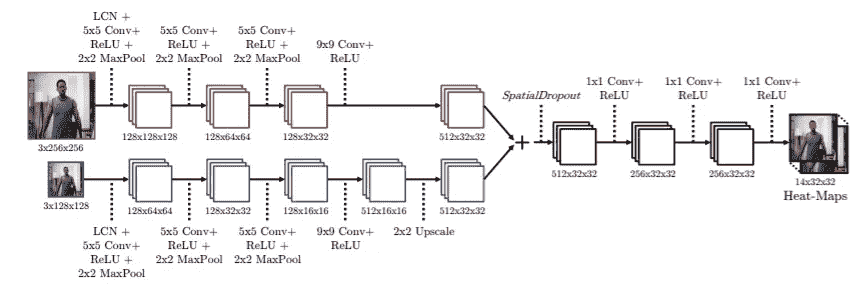
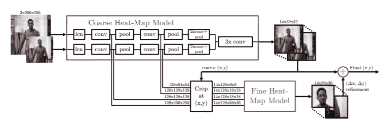
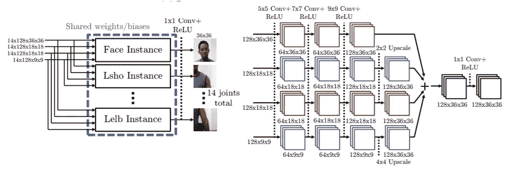
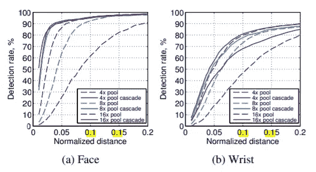
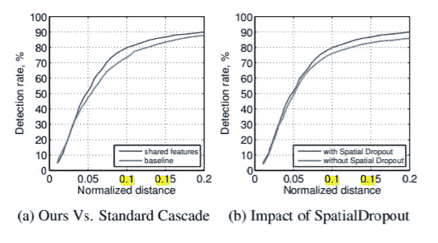
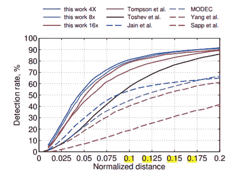

# 论文摘要:使用卷积网络的有效目标定位

> 原文：<https://medium.com/analytics-vidhya/paper-summary-efficient-object-localization-using-convolutional-networks-476347519985?source=collection_archive---------19----------------------->

斯蒂芬·路易斯在[拍的照片](https://unsplash.com/photos/6NvgXrIbHtA)

# 关键想法

1.  输出包含每个关节概率的热图，而不是直接回归坐标。
2.  粗略模型+精细热图模型来改进粗略预测。
3.  预测的热图和生成的接缝高斯分布之间的 MSE 损失。

[论文链接](https://www.cv-foundation.org/openaccess/content_cvpr_2015/papers/Tompson_Efficient_Object_Localization_2015_CVPR_paper.pdf)

# 粗糙模型

粗略热图估算模型

粗略预测模型输入原始图像的 3 个变型，每个变型缩小到尺寸(256，256)，(128，128)，(64，64)。每个图像实例然后通过一个 4 层卷积网络进行处理。这 3 层相加，最后进入一个空间下降层和 3 个最终卷积层。由于最终卷积层的过滤器大小为 1，它们基本上表现为完全连接的层。

最终输出是每 14 个关节的粗略的 32x32 热图。每个关节热图中最大值的(x，y)位置被认为是关节的位置。

# 模型架构

完整模型架构图

本文提出的完整模型体系结构是由一个附加的精细热图模型细化的粗模型构成的。基于近似的关节位置裁剪粗略模型的中间层。通过精细热图模型处理每个关节的裁剪部分，并输出包含每个关节的细化的热图。最后，将预测的细化应用于粗略预测，以进行最终预测。

# 精细热图模型

给定精细热图模型的输入，在 14 个不同的关节位置裁剪 4 个中间层。在预测头部的情况下，腿部的裁剪是不必要的，事实上，每次预测只需要 14 次裁剪中的 1 次。因此，这 14 个通道被分开，每个通道分别输入到模型的 14 个实例中。**除了最终卷积层，每个模型实例共享其参数。**

# 具体细节

空间下降:空间下降应用于粗略模型，以满足正则化的需要。与执行逐像素丢弃的普通丢弃不同，空间丢弃丢弃整个通道。

精细热图模型的级联:可以实现用精细热图模型的级联放大和细化预测的过程，但没有显示任何性能提升。

数据扩充:“在训练期间，每个输入图像被随机旋转(r∈[20♀，+20♀])、缩放(s ∈ [0.5，1.5])和翻转(概率为 0.5)”

热图损失:预测热图和目标热图之间的均方误差距离。目标地图由以地面真实关节为中心的高斯分布生成，方差=1.5。

训练程序:首先训练粗略模型，然后在粗略模型冻结时训练精细热图模型。最后，两个模型被同时训练，两个损失以 10:1 的比率进行交易。

# 绩效评估

精细热图模型的性能影响

精细热图模型的引入显著提高了高精度(低允许误差)的检测率。

本文中使用的技术对性能的影响

精细热图模型的空间漏失和共享参数在特定距离内均提高了 10%的检测率。

FLIC 数据集性能比较

本文提出的模型优于所有现有的方法。