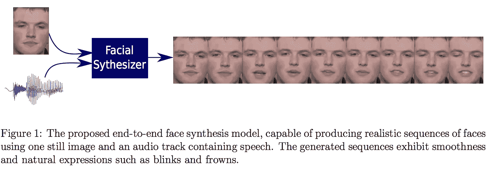
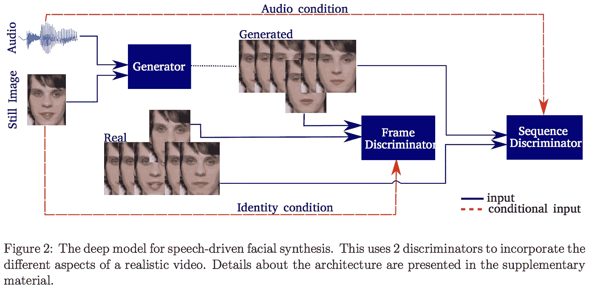
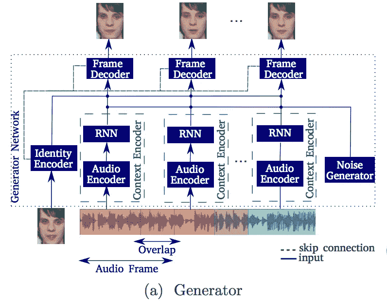
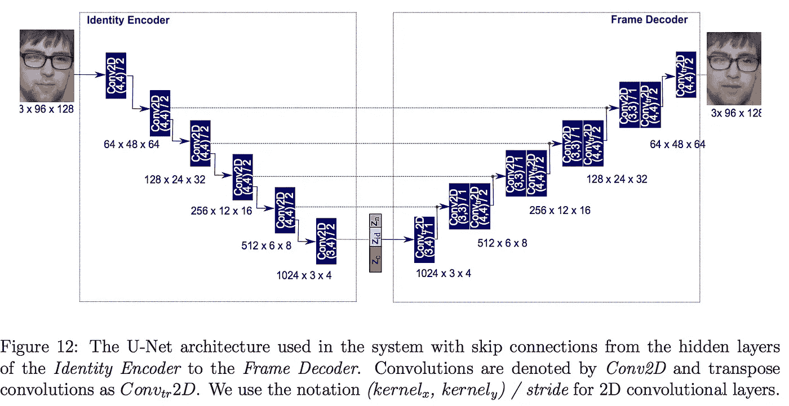
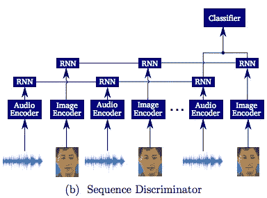
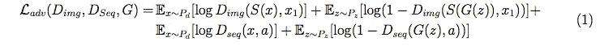
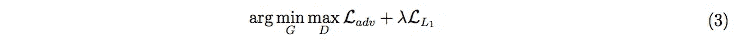

# 论文摘要:基于时间 GANS 的端到端语音驱动人脸动画

> 原文：<https://medium.com/analytics-vidhya/paper-summary-end-to-end-speech-driven-facial-animation-with-temporal-gans-7d5f3a623629?source=collection_archive---------14----------------------->

总结论文:[https://arxiv.org/pdf/1805.09313.pdf](https://arxiv.org/pdf/1805.09313.pdf)

1.  **是关于什么的:**

提出了一个从语音生成人脸动画的系统。

> 语音驱动的面部动画是使用语音信号自动合成说话角色的过程。

系统的输入是语音信号，它自动合成一个以静止图像形式呈现的说话字符。

点击此处查看生成的动画:

> 我们提出了一个系统，用于生成一个说话的头部视频，使用一个人的静态图像和一个包含语音的音频剪辑，…

**2。索赔:**

1.  不依赖任何手工制作的功能。
2.  这是第一种能够直接从原始音频生成独立于主题的真实视频的方法。

> 我们的方法可以生成具有(a)与音频同步的嘴唇运动和(b)诸如眨眼和眉毛运动 1 的自然面部表情的视频。

**3。主旨:**

> 我们通过使用具有两个鉴别器的时间 GAN 来实现这一点，这两个鉴别器能够捕捉视频的不同方面。

**4。善良的度量:**

基于以下因素评估生成的视频

1.  他们的敏锐
2.  重建质量，以及
3.  唇读准确度。

> 最后，进行了用户研究，证实了时间 GAN 比基于静态 GAN 的方法产生更自然的序列。

**5。相关工作:GAN 基视频合成**

GAN [25][20]在视频中的直接应用用 3D 卷积代替了 2D 卷积。这使得网络能够对时间依赖性进行建模，但是也需要固定长度的时间步长。

MoCoGAN [24]使用基于 RNN 的发生器，为运动和内容提供独立的潜在空间。它使用 2D 和 3D CNN 分别判断帧和序列。在 3D CNN 鉴别器中使用滑动窗口方法来处理变长序列。

**6。提议的架构:**

提议的架构有三个组成部分:一个发电机和**两个**鉴别器。

*   **发生器:**发生器网络的输入是单个图像和音频信号。音频信号被分成每个长度为 0.16 秒的重叠帧。
*   **帧鉴别器:**帧鉴别器评估取自合成/真实序列的单个帧。这驱动发生器产生详细的帧。
*   **序列鉴别器:**序列鉴别器评估序列-音频对，以确定它们是真实的还是合成的。这使得音频和视频同步，并鼓励面部表情的产生(例如眨眼)

7 .**。组件的详细描述:**

**7.1 发电机:**

生成器必须生成给定人员的动画(通过单张照片提供),就好像该人员在讲所提供的语音记录一样。因此，直觉上，它必须用自然的面部姿态将面部动画与语音信号对应起来。

我们可以把它想象成一个两部分的过程，第一部分是产生面部动画来匹配语音信号。第二部分是确保动画发生在提供的主题上。

为此，发电机有三个子模块:

**7.1.1 身份编码器:**

该模块负责特征化所提供的主题，以便动画应用于该主题。该编码器由几层 CNN 组成，并产生主题的 50 维编码，称为 z_id。

**7.1.2 上下文编码器:**

对于每个时间步长，该模块对语音信号进行编码。使用(1D 卷积+批量范数+ relu)的块对其进行编码；然后该编码信息被馈送到 2 层 gru。GRU 层的输出是该时间步长的语音信号的编码。这种编码被命名为 z_c。

**7.1.3 帧解码器:**

现在，帧解码器必须为语音的每个时间步长生成带有合适动画的主题图像帧。当然，它的输入将是 z_id 和 z_c(编码身份和编码语音帧)。作者还使用 10D 高斯噪声 z_n 作为帧解码器的输入。这种噪声是由 1 层 GRU 网络产生的，其输入也是高斯噪声。在我看来，添加这种噪声的目的是为了在解码相同的主题和语音帧时在动画中有一些变化。

在身份编码器和帧解码器之间使用 U-Net 架构来保持主体身份。

请注意，在下图中，z_id 是由 identity encoder 生成的，而 z_c 和 z_n 与它连接在一起。还要注意标识编码器和帧解码器之间的跳跃连接(绿色虚线)。

**7.2 鉴别器:**

正如我们之前提到的，这个架构使用了两个鉴别器。帧鉴别器负责在所有时间步长内重建目标人脸；而序列鉴别器负责创建与语音/音频同步的自然且连贯的视频。

让我们详细看看这两个模块的架构。

**7.2.1 帧鉴别器:**

> 帧鉴别器是一个 6 层 CNN，它决定一个帧是否真实。使用这种鉴别器的对抗性训练确保了生成的帧是真实的。原始静止帧被用作该网络中的一个条件，在通道上与目标帧连接以形成如图 3 所示的输入。这将在框架上加强此人的身份。

**7.2.2 序列鉴别器:**

> 图 3 所示的序列鉴别器区分真实视频和合成视频。鉴别器在每个时间步长接收一个帧，该帧使用 CNN 编码，然后馈入 2 层 GRU。在序列的末尾使用一个小的(2 层)分类器来确定序列是否真实。音频作为条件输入添加到网络，允许该鉴别器对语音-视频对进行分类。

图 3

**8。培训**

帧鉴别器(D_img)在使用采样函数 S(x)从视频 x 中均匀采样的帧上被训练。

序列鉴别器(D_seq)根据整个序列 x 和音频 a 对真实和虚假序列进行分类。

他们将交叉熵损失用于鉴别器。GAN 的总损耗是每个鉴频器损耗的总和。

额外的像素损失(L_1)也被用于改善嘴部运动相对于音频的同步。仅针对图像的下半部分(嘴出现的地方)计算像素级重建损失。这种重建损失不适用于图像的上半部分，因为它阻碍了改进，因此阻碍了面部姿态(眉毛等)。).

对于地面真实帧 F 和尺寸为 W×H 的生成帧 G，像素级重建损失为:

> 最终目标是获得满足等式 3 的最佳发电机 G*。

> λ超参数控制每个损耗因子的贡献，并根据验证集上的调整程序设置为 400。
> 
> 训练该模型，直到在 10 个时期的验证集上没有观察到重建度量的改善。

**9。参考文献:**

[20] M .斋藤、e .松本和 s .斋藤。具有奇异值裁剪的时态生成对抗网。在 IEEE 计算机视觉国际会议(ICCV)，第 2830-2839 页，2017 年。

[24] S. Tulyakov、M. Liu、X. Yang 和 J. Kautz。MoCoGAN:分解视频生成的运动和内容。arXiv 预印本 arXiv:1707.04993，2017。

25 c . von drick、H. Pirsiavash 和 A. Torralba。用场景动态生成视频。《神经信息处理系统(NIPS)进展》，613–621 页，2016 年。