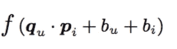
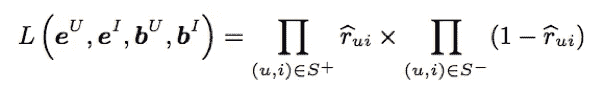

# (论文摘要)用户和项目冷启动推荐的元数据嵌入

> 原文：<https://medium.com/analytics-vidhya/paper-summary-metadata-embeddings-for-user-and-item-cold-start-recommendations-d9b13f1378dd?source=collection_archive---------4----------------------->

在这篇文章中，我将试着解释论文“[用户和项目冷启动推荐的元数据嵌入](https://arxiv.org/pdf/1507.08439)”。这是一篇相对容易理解的论文，并且解释得很好。

它提出了一种混合矩阵分解模型，将用户和项目表示为其内容特征潜在因素的线性组合。根据论文，它在冷启动或稀疏交互数据情况下(使用用户和项目元数据)优于协作和基于内容的模型，并且在交互数据丰富的情况下(热启动或具有密集的用户-项目矩阵)至少与纯协作矩阵分解模型一样好。

由该模型产生的特征嵌入编码了在标签推荐中有用的语义信息(像 word2vec 或单词嵌入)。

**矩阵分解与基于内容的方法**

标准矩阵分解(MF)模型在冷启动场景中表现不佳:当协作交互数据稀疏时，很难有效地估计用户和项目潜在因素。

基于内容的(CB)方法通过元数据表示项目来解决这个问题。因为这些是预先知道的，所以甚至可以为没有收集协作数据的新项目计算推荐。

CB 模型中不存在迁移学习:每个用户的模型都是孤立估计的，不会受益于其他用户的数据。因此，CB 模型比 MF 模型表现更差，在 MF 模型中，协作信息是可用的，并且需要关于每个用户的大量数据

做同一件事的两种方式有什么效果？例如铅笔裙和长袍应该有相似的矢量，另一方面，旅行者和飞行员应该有不同的嵌入。后者是通过将项目特征与嵌入线性结合来实现的。

这在时尚感上更有意义，即使两个非常相似的物品也可能有非常不同的味道。此外，模特应该对流行时尚有更多的建议，而不是过时的时尚物品。

LightFM 应该是一种混合内容协作模型，之所以这样命名是因为它与分解机器相似。

用户 u 和项目 I 的模型预测可以由下式给出

其中 q 是用户的潜在表示，由它的特征潜在向量的和给出。p 也是如此，它是项目的潜在代表。用户和项目的偏差项由特征偏差的总和给出。

Sigmoid 函数可用于 f(。)如果要预测二进制值。

优化目标是最大化由下式给出的可能性

模型训练是用异步随机梯度下降完成的(这是与 hogwild 并行的梯度下降，不是每个参数都用每个例子更新)。

有四种损失函数可用:

1.逻辑:当正(1)和负(-1)交互存在时有用。

2.BPR:贝叶斯个性化排序成对损失。最大化正面例子和随机选择的负面例子之间的预测差异。当仅存在阳性相互作用且需要优化 ROC AUC 时有用。

3.WARP:加权近似秩成对损失。通过重复采样负样本直到找到违反等级的样本，最大化正样本的等级。当只存在积极的交互，并且希望优化推荐列表的顶部时，这很有用。

4.k-OS WARP: k 阶统计量损失。WARP 的一个修改，使用任何给定用户的第 k 个正例作为成对更新的基础。

*翘曲也是三重损失

有两种学习率计划可供选择:

1.阿达格拉德

2.阿达德尔塔

杂交是如何实现的？

有多种方法可以实现杂交。

Lightfm 假设每个特征(我们拥有的元数据)的向量，并使用它们作为权重，然后进行加权求和，以获得最终的向量项或用户。

以向用户推荐电影为例。电影的潜在表示是其特征(元数据)的潜在表示的总和。例如，如果电影“绿野仙踪”由以下特征描述:“音乐幻想”、“朱迪·嘉兰”和“绿野仙踪”，那么它的潜在表征将由这些特征的潜在表征的总和给出。

该模型学习用户和项目的嵌入(高维空间中的潜在表示)，其方式为**编码用户对项目的偏好**。当相乘时，这些表示产生给定用户的每个项目的分数；得分高的项目更可能引起用户的兴趣。

另一个采用的例子是，如果我们有电影的元数据，如恐怖，滑稽和戏剧性。那么电影的最终嵌入将是潜在向量的加权和。用户也一样。一些解释还说，用户的特征(元数据)也是一样的，就像用户喜欢恐怖、滑稽和戏剧性的程度一样。我想说这没有必要。因为加权和最终将为项目和用户提供相等长度的向量。用户和项目向量表示相同的事物或相同种类的特征也不是必须的。这一点需要注意，通过做点积，我们没有找到相似性，但有一个线性运算，可以选择使用其他函数。

我们了解到，用户和项目的潜在表征是根据它们的特征表征来表达的。在我看来，它更倾向于基于内容的模型。但是对于提供的不同输入存在不同的情况。

如果没有向 fit 或 predict 方法提供特征矩阵，则它们被隐含地假定为单位矩阵:也就是说，每个用户和项目都由该用户(或项目)唯一的一个特征来表征。在这种情况下，LightFM 简化为传统的协同过滤矩阵分解方法。

当提供特征矩阵时，它的形状应该是“(num_ <users>x num_features)”。然后将为每个特征估计一个嵌入:即，将有“num_features”个嵌入。为了获得用户 I 的表示，模型将查找特征矩阵的第 I 行，以找到该行中具有非零权重的特征；然后，这些特性的嵌入将被加在一起，以获得用户表示。例如，如果用户 10 在用户特征矩阵的第 5 列中具有权重 1，在第 20 列中具有权重 3，则通过将第 5 和第 20 个特征的嵌入相加(将后者乘以 3)将找到该用户的表示。物品也是如此。</users>

当提供特征矩阵时，将不再使用隐式标识特征矩阵。这可能导致模型的表达性较差:因为没有估计每个用户的特征，所以模型可能不适合。为了解决这个问题，请将每个用户(每个项目)的功能(即一个标识矩阵)作为您提供的功能矩阵的一部分。