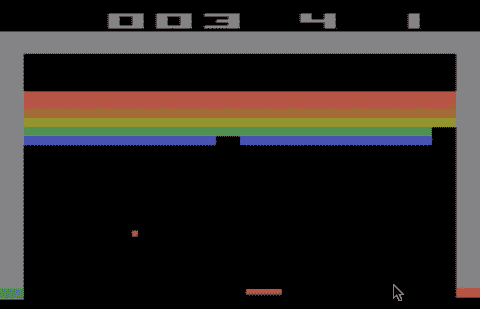
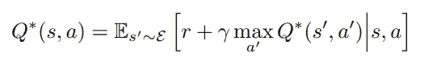
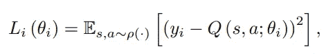
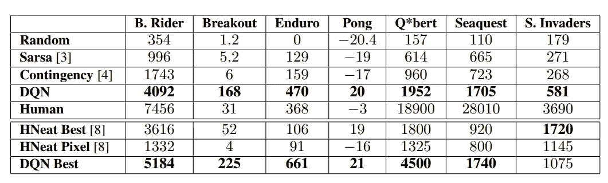

# 【论文摘要】用深度强化学习玩雅达利

> 原文：<https://medium.com/analytics-vidhya/paper-summary-playing-atari-with-deep-reinforcement-learning-5e48bc080c9d?source=collection_archive---------4----------------------->

我能通读 DeepMind 已经完成的所有工作，这真是让我大吃一惊。这是他们论文的第一条。

## 1.介绍

**1.1 —强化学习(RL)比监督学习更难训练的原因是:**

1.  通常稀疏、嘈杂、延迟的标量奖励信号
2.  数据样本不是独立的、高度相关的状态序列。
3.  数据分布会发生变化，因此它不应该采用固定的底层分布。

**1.2 —他们如何克服 RL 问题:**

1.  对于复杂 RL 环境中的原始视频数据

->使用具有 Q 学习的 CNN，使用随机梯度下降来更新权重

2.对于相关数据和非平稳分布

->一种经验回复机制，随机采样先前的转换

**1.3——他们建造的网络超越了之前所有的 RL 和人类玩家**

1.  没有游戏的具体信息或手工设计的视觉功能
2.  无法访问仿真器的内部状态
3.  刚刚从视频输入中得知，奖励，终端信号，以及可能的行动集合。

## 2.背景

**2.1 —什么代理可以观察:**

1.  来自游戏模拟器的图像(无法访问内部状态)
2.  奖励依赖于先前的一系列行动和观察。

**2.2 —仅从当前屏幕无法全面了解当前情况。**

1.  运用一系列的行动、观察和学习策略。
2.  有限马尔可夫决策过程，其中每个序列是一个不同的状态。

**2.3 —目标是最大化未来回报**

1.  未来的奖励会打折扣
2.  最佳行动值

**2.4—RL 培训工作如何进行？**

1.  许多 RL 背后的基本思想是**估计动作值函数，通过使用 Bellman 方程作为迭代更新，**这样的值迭代收敛到最优动作值函数。
2.  使用带权的非线性函数逼近器作为 Q 网络
3.  最小化 Q-网络和目标之间的误差的损失函数序列，通过如下的贝尔曼方程的作用值函数

**2.5 —作品特点**

1.  无模型—使用来自仿真器的样本，而不构建仿真器的估计值
2.  政策外——贪婪策略，对状态空间进行充分探索。

## 3.深度强化学习

目标是将 RL 算法连接到深度神经网络，该网络直接对 RGB 图像进行操作，并使用随机梯度更新。

利用经验重放，将 Q-learning 更新应用于从存储样本池中随机抽取的经验样本。

**3.1 —优于标准在线 Q-learning 的优势**

1.  经验的每一步都可能用于许多称重更新
2.  由于样本之间的强相关性；对样本进行随机化打破了这些相关性，并减少了更新的方差
3.  重播..

## 4.预处理和模型架构

**4.1 —预处理**

1.  原始帧(210 × 160)通过将 RGB 转换为灰度进行预处理
2.  向下采样(110×84)
3.  最终裁剪为(84 x 84)的粗糙区域，以获取游戏区域。

**4.2 —模型架构**

1.  神经网络的输入:84 × 84 × 4 图像(使用历史的最后 4 帧)
2.  第一个隐藏层:步幅为 4 的 16 个 8 × 8 过滤器
3.  第二个隐藏层:步长为 2 的 32 个 4 × 4 滤波器
4.  最后一个隐藏层:全连接，由 256 个整流单元组成
5.  输出层:完全连接的线性层，每个有效动作都有一个输出

## 5.实验

1.  RMSProp 带 32 号迷你包
2.  0.1 电子贪婪
3.  代理看到并选择每 k 帧(k=4 -> k=3)上的动作

## 6.结论

1.  仅使用原始像素作为输入

2.结合随机小批量更新和经验回放记忆的 q 学习

3.在没有调整架构或超参数的情况下，它在七个游戏中的六个游戏中表现出色。

【https://www.cs.toronto.edu/~vmnih/docs/dqn.pdf 