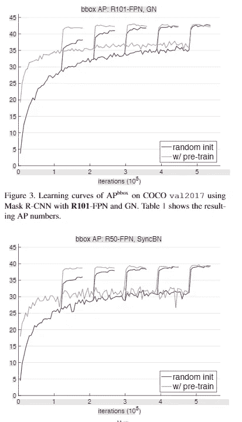
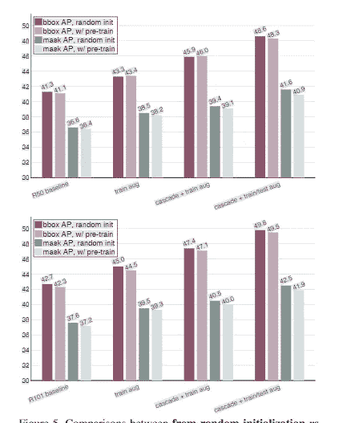

# [论文摘要]反思 ImageNet 职前培训

> 原文：<https://medium.com/analytics-vidhya/paper-summary-rethinking-imagenet-pre-training-d661ab7406b7?source=collection_archive---------0----------------------->

## 预训练总是一种优越的训练方法吗？

Gif 来自这个[网站](https://giphy.com/gifs/andrea-8lQyyys3SGBoUUxrUp)

**摘要**

这篇论文的作者发现，即使网络是随机初始化的，最终的性能与预训练(迁移学习)模型没有太大的不同。(特别是来自 ImageNet 数据的预训练模型。).

现在，当我们谈论收敛速度时，预训练模型具有更快的收敛时间。但总的来说，这些发现挑战了“预先训练的模型是最好的方法”这一普遍观念。

**简介**

近年来，越来越多的研究人员使用迁移学习技术，这种技术采用预先训练好的网络，并针对不同的任务进行微调。

本文对上述范式提出了挑战，并表明我们仍然可以从随机初始化方案中获得非常有竞争力的性能。(关键是使用一个归一化方案和更长的训练时间。).

1.  ImageNet 预训练加速收敛
2.  ImageNet 预训练不会自动给出正则化。
3.  ImageNet 预培训并未显示出对某些任务的益处。

**方法论**

作者使用了标准化方案，如组/同步批处理标准化，并发现这两种方案都能在随机初始化的网络上实现有竞争力的性能。此外，作者增加了从零开始训练的网络的历元数。(训练时间较长)。

**结果**

上图说明了一切，对于区域建议任务，预训练的网络确实收敛得更快，但经过从头开始训练的网络会及时赶上。

同样，即使当不同的增强时，网络之间也没有太大的差异。

**进一步讨论**

1.  从头开始训练是可能的，但需要时间
2.  只需要好的规范化方案
3.  ImageNet 预培训对某些任务很有用。

当我们没有足够的数据来完成目标任务时，ImageNet 预培训*可能是一个不错的选择。否则，从头开始训练网络可能是个好主意。*

**参考**

1.  何，k .，吉希克，r .，&多拉尔，P. (2018)。反思 ImageNet 预培训。arXiv.org。检索于 2019 年 1 月 4 日，来自[https://arxiv.org/abs/1811.08883](https://arxiv.org/abs/1811.08883)