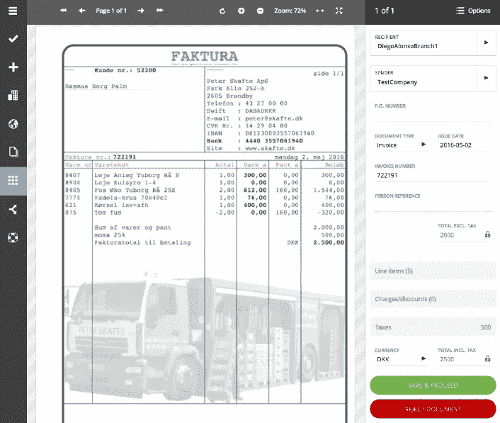
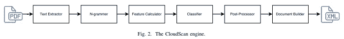
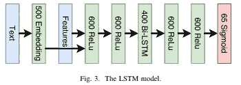

# 论文简介:clouds can——一个使用递归神经网络的免配置发票分析系统

> 原文：<https://medium.com/analytics-vidhya/paper-synopsis-cloudscan-a-configuration-free-invoice-analysis-system-using-recurrent-neural-7c32baf66342?source=collection_archive---------1----------------------->

来源—[https://arxiv.org/pdf/1708.07403.pdf](https://arxiv.org/pdf/1708.07403.pdf)

CloudScan 是一个带有图形用户界面(GUI)的发票分析系统，无需配置，无需预先注释和设置。

## 工作流程:

云扫描管道

*   CloudScan 将 PDF 文件作为输入，提取单词及其位置(如果存在嵌入文本，则使用商业 OCR 引擎)。创建 N 元单词(长度不超过 4)。从生成的 N 元语法中提取文本特征。

**功能列表—**

1.  n-gram 的原始文本
2.  将所有字母替换为“x”，所有数字替换为 0，其他字符替换为“.”后的文本
3.  特定于域的布尔特征(例如，日期、金额、国家或邮政编码)

LSTM(分类器)架构

*   使用 LSTM 将每个 N-gram 分类为 32 个感兴趣的领域(其中 8 个被考虑用于结果/评估)。将分类后的 ROI 输入到后处理器，后处理器在正则表达式解析器的帮助下过滤掉不符合语法的 N 元语法。最后，结果被导出到通用商业语言(UBL)。输出是 UBL 发票。
*   输出呈现在用户界面上，用户可以在这里纠正错误。经修正的 UBL 发票被添加到 CloudScan 数据集合中作为训练数据集。分类器在 N-grams 和来自用户验证的 UDL 发票的标签上被训练。

## 结果:

*   LSTM 模型在看过的发票布局上获得 0.891 的 F1 平均分数，在没看过的发票布局上获得 0.840 的 F1 平均分数。
*   将逻辑回归模型视为基线模型。基线模型在看过的发票布局上获得 0.887 的平均 F1 分数，在没看过的发票布局上获得 0.788 的平均 F1 分数。

## 推测:

**优点-** CloudScan 为最终用户提供了一个用户友好的界面，无需任何配置、前期注释和设置。由于每个用户提出了不同的发票布局或标准，该模型不依赖于任何特定的布局；产生一个通用模型。

**缺点-** CloudScan 取有限的文本特征，有特征工程的空间。提到的 LSTM 模型是一个非常普通的模型，可以使用 LSTM 甚至变形金刚架构的其他变体来做进一步的探索。

**可能的后续步骤-**

*   我们可以在功能工程上花更多的精力，甚至可以研究 PDF 视觉信息。
*   随着最近在 NLP 领域的进展，随着伯特、ELMO、乌尔姆菲特等的出现，所提出的模型具有非常简单的架构。