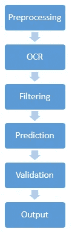
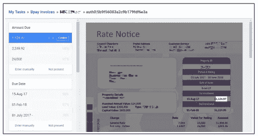
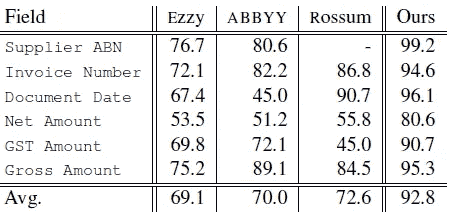
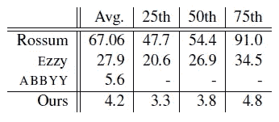

# 论文摘要:从发票中提取结构化数据

> 原文：<https://medium.com/analytics-vidhya/paper-synopsis-extracting-structured-data-from-invoices-2e08477100a2?source=collection_archive---------1----------------------->

来源—[https://www.aclweb.org/anthology/U18-1006](https://www.aclweb.org/anthology/U18-1006)

**SYPHT** 是一款内容驱动的可扩展发票分析机器学习解决方案，用于文档字段提取。它结合了 OCR、启发式过滤和监督排名模型来进行字段级预测。

## 工作流程:

*   SYPHT 将 PDF 或图像文件作为输入，规范化为每页一个 JPEG。每一页都被传递到 OCR 引擎，该引擎提取文本标记和相应的文档内位置。Spacy 用于标记 OCR 输出。
*   基于目标字段类型将标记子集过滤为候选项。

**可用候选类型:**

1.  1.供应商 ABN
2.  3.发票号
3.  4.文件日期
4.  5.净总值
5.  6.商品及服务税金额
6.  7.总额

**功能列表—**

1.  标记文本
2.  词性标签
3.  单词形状
4.  文本邻域的稀疏表示
5.  记号与其他预测的相对位置

*   令牌和页面图像用作梯度推进决策树模型(Light GBM)的输入。如果预测低于某个阈值*，则返回空值*，表示没有字段值被预测。

sy PHT-验证工具

*   用户还可以提供置信度阈值，低于该阈值需要用户干预。为此，SYPHT 附带了预测辅助注释和验证工具— SYPHT VALIDATE。标记突出显示、键盘导航等功能大大减少了注释时间。
*   在验证阶段之后，JSON 格式的对象通过包含字段-值对的 API 返回。

## 结果:

按领域的预测准确性

预测延迟(秒)

## 推测:

**优点-** SYPHT 提供了一个用户友好的界面，无需配置或手动注释。SYPHT VALIDATE 工具带有标记高亮，键盘导航大大减少了注释时间。SYPHT 的平均预测延迟降低了 25%。指定领域的最高性能

**缺点-** SYPHT 取有限的文本特征，有特征工程的空间。其他建筑如 LSTM，变形金刚可以被探索。

**可能的后续步骤-**

*   我们可以在特征工程上花更多的精力
*   更多的选择，如伯特，ELMO，乌尔姆菲特可以探索。
*   可以使用对象检测和分类模型来使视觉组件更加直观。