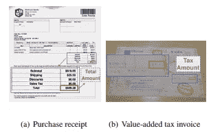
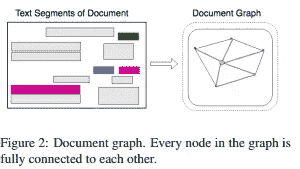
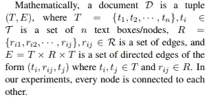
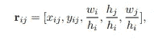
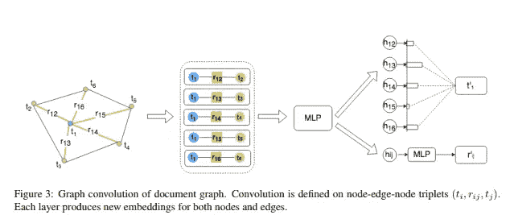
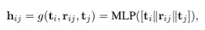
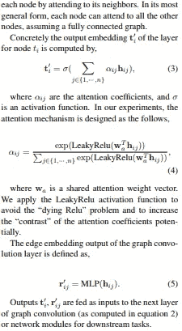
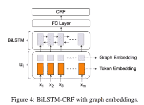
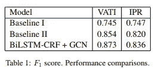

# 论文摘要:从视觉丰富的文档中提取多模态信息的图形卷积

> 原文：<https://medium.com/analytics-vidhya/paper-synopsis-graph-convolution-for-multimodal-information-extraction-from-visually-rich-a18cc1981ef1?source=collection_archive---------1----------------------->

来源—[https://arxiv.org/pdf/1903.11279.pdf](https://arxiv.org/pdf/1903.11279.pdf)

vrd 的示例

本文的目的是基于图卷积模型从视觉丰富的文档中提取预定义的实体。

## 工作流程:

VRDs 可以表示为文本段的图形(由段的位置和其中的文本组成)。

给定文本上下文和视觉上下文(文档的布局和单个片段相对于其他片段的位置)，嵌入表示文本片段中的信息(使用内部光学字符识别系统生成)。

由图卷积产生的图嵌入概括了文档中文本片段的上下文，其进一步与使用标准 BiLSTM-CRF 模型的实体提取的文本嵌入相结合。

文档建模

边缘嵌入表示

*其中 xij 和 yij 分别是两个文本框之间的水平和垂直距离，wi 和 hi 是对应文本框的宽度和高度。嵌入的第三、第四和第五个值分别是节点 ti 的长宽比、节点 tj 的相对高度和宽度*

其中||是连接操作

应用图形卷积来计算图形中文本段的可视文本嵌入。卷积是在节点-边-节点三元组上定义的，而不仅仅是节点。对于备注 ti。对于节点 ti，我们使用多层感知器(MLP)网络提取每个邻居 tj 的特征 hij。

自我注意机制

图卷积是基于自我关注机制，通过关注邻居来计算每个节点的输出隐藏表示。输出被作为输入馈送到图形卷积的下一层。

输入嵌入(图嵌入+令牌嵌入(Word2vec))被馈送到 BiLSTM 网络。来自 BiLSTM 网络的输出被传递到完全连接的 CRF 层。

图卷积层和 BiLSTM-CRF 层联合训练。为了提高预测精度，增加了片段分类任务，以将每个片段分类到预定义的标签中。

## 结果:

该模型应用于两个真实数据集的信息抽取

1.  **增值税发票(VATI):**

**规格**

*   3000 个用户上传图片和 16 个实体进行提取
*   语言—中文
*   发票有一个固定的模板，尽管许多包含噪音和干扰对象

1.  一、**国际采购收据(IPR):**

**规格**

*   1500 张扫描收据
*   语言—英语
*   存在 146 个模板

**基线—**

1.  基线 1 将 BiLSTM-CRF 应用于每个文本片段，是一个单独的句子。
2.  基线 2 将标记模式应用于串联文档。它将一维文本上下文结合到模型中。

结果。

很明显，模型远远超过基线模型。

## 推测:

过去的论文通常谈论文本特征，但这篇论文同时谈论文本和视觉部分，这无疑是一条主线。注意机制和图结构帮助该模型取得了很好的效果。

**缺点-** 对于定制的训练数据集，标记任务可能是一项具有挑战性且耗时的任务。

**未来可能的工作-**

*   该模型仅将位置坐标作为视觉组件，可能其他组件如字体大小、字体颜色等也很重要。
*   随着最近在自然语言处理领域的进展，随着伯特、ELMO、乌尔姆菲特等的出现，我们可以检查更好的单词嵌入(而不是 word2vec)。