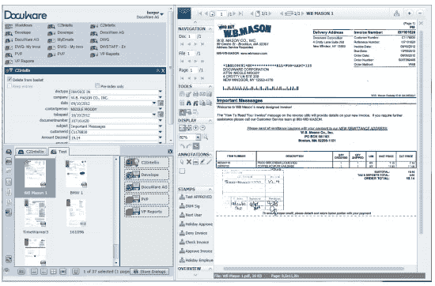
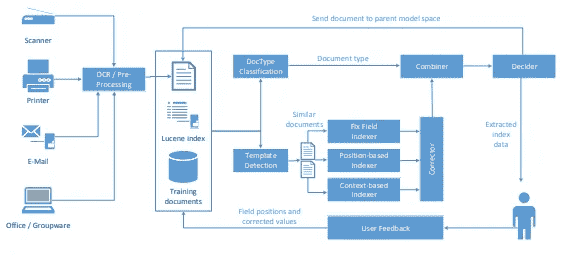
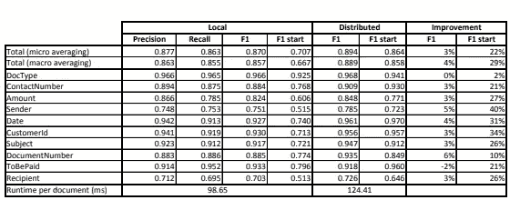

# 论文摘要:Intellix —针对文档归档的最终用户培训信息提取

> 原文：<https://medium.com/analytics-vidhya/paper-synopsis-intellix-end-user-trained-information-extraction-for-document-archiving-42239cb8c1fa?source=collection_archive---------3----------------------->

来源—[https://www.weidlings.de/christoph/papers/Intellix2013.pdf](https://www.weidlings.de/christoph/papers/Intellix2013.pdf)

Intellix 是低配置和高灵活性的自动信息提取系统，从扫描的商业文件。处理 10 个常用的感兴趣的领域，例如，文档类型、发送者、接收者等。

## 工作流程:

Intellix 索引过程

输入文件通过商业外部 OCR 引擎传递，该引擎生成包含文本和位置信息的 XML 格式的结果。

OCR 结果被传递到单词袋 KNN 分类器(k=5)用于文档类型分类。分类器返回匹配模板的列表。

输入数据和匹配模板列表被传递给索引器组件，即固定字段索引器、基于位置的索引器、基于上下文的索引器。每个索引器组件输出每个候选者的提取数据和提取分数。

校正器组件(基于用户反馈)k 执行典型的 OCR 错误校正和其他用户定义的校正。

组合器组件合并 KNN 分类器和三个索引的结果。得分最高的候选人被选中。

最后一步是决定者。它收集每种文档类型的模式信息(从历史用户交互中收集的数据)。这个模块根据模板类型知道哪些字段对用户是重要的。如果重要字段提取分数低于阈值，则文档必须再次经历整个过程，使用父模型提供更多的训练数据(在几个组织数据上训练)。

最后，提取的数据呈现给用户。用户可以通过 UI 工具接受或进行更改，该工具再次被添加到模型训练数据中。

## 结果:

结果

## 推测:

**优点-** 目标用户(小型办公室和家庭办公室(SOHO))用户保持最高优先级。组织层面的方法,《亲子架构》从其他论文中脱颖而出。所需的执行时间和计算资源似乎是合理的。

**缺点-** 模型依赖于模板。对于新模板，将需要手动标记。没有考虑视觉特征。像伯特、埃尔莫、LSTM 这样的模式本来是可以探索的。

**可能的后续步骤-**

*   我们可以在特征工程上花更多的精力，甚至可以研究视觉信息。
*   随着最近在自然语言处理领域的进展，伯特，ELMO，乌尔姆菲特等在图片中，这些模型可能已经被探索。