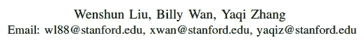
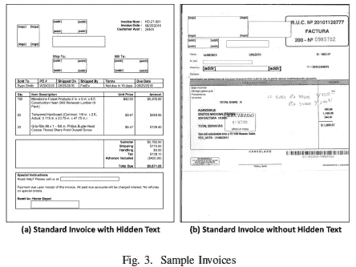
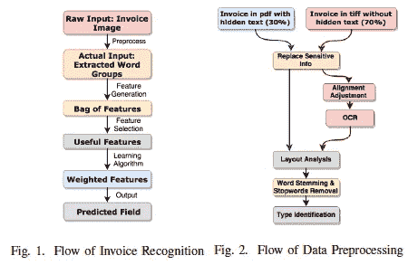
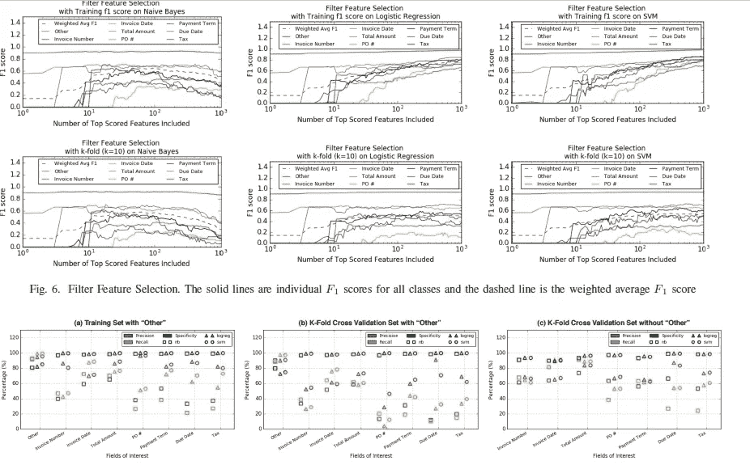
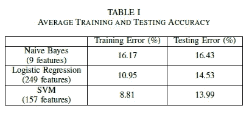

# 论文摘要:商业发票上的非结构化文档识别

> 原文：<https://medium.com/analytics-vidhya/paper-synopsis-unstructured-document-recognition-on-business-invoice-103fc808ea12?source=collection_archive---------2----------------------->

一种考虑商业发票识别的文本和布局信息的词袋方法。

**候选类型-**

0.(负类)

1.  发票号码，
2.  发票日期
3.  总数
4.  采购订单编号
5.  付款条件
6.  到期日
7.  税

## 工作流程:

*   该方法将从 Oracle 公司的内部测试库中生成的扫描商业发票图像作为输入。其中一些是带有隐藏文本的 PDF 文件，大多数是 TIFF 格式，需要在输入到 PDF 布局分析工具之前进行预处理。
*   在初始预处理之后，文件被传递到 OCR，然后传递到布局分析工具。从布局分析工具中检索标记化文本组的坐标。
*   对获得的标记化文本组执行词干提取、停用词移除和类型识别(基于正则表达式的日期、货币、数字、电话和电子邮件)。
*   对于每个令牌，应用特征选择-

特征重要性

**功能列表-**

1.  水平对齐的标记
2.  垂直对齐的标记
3.  邻近令牌(距离阈值)
4.  竖直位置
5.  类型

## 结果:

结果

模型即(朴素贝叶斯，逻辑回归和 SVM)被考虑。从图 7(a)和(b)可以看出

*   在精确度和召回率方面，朴素贝叶斯比逻辑回归和 SVM 具有更差的性能。
*   逻辑回归和 SVM 在所有感兴趣的领域都有相似的精度，除了 PO #、到期日和税收，SVM 表现稍好。
*   **这表明，在进行预测时，SVM 在提取所有特征中最有用的特征方面优于逻辑回归和朴素贝叶斯。**

## 推测:

**优点-** 本文讲述模板独立的方法。依赖于模板的方法可能对特定的预定义模板很有效，但在现实生活中经常失败。

该方法尽管仅采用文本信息，但也采用布局信息。

**缺点-** 论文对特征工程谈得不多。有一个特征工程的空间。

它采用一些有限风格的自动生成的发票图像作为训练和测试数据。不确定真实生活中相机拍摄图像的结果。

可以探索其他模型架构，如装袋和增压模型进行比较。

## **可能的后续步骤-**

1.  可以将不同类型的真实生活摄像机捕获的图像作为训练和验证数据。
2.  可以尝试其他模型架构，如装袋或助推模型。
3.  由于论文没有过多地讨论特征工程，所以可以在这方面花更多的时间。