# 论文演练:高分辨率多尺度神经纹理合成

> 原文：<https://medium.com/analytics-vidhya/paper-walkthrough-high-resolution-multi-scale-neural-texture-synthesis-5bae39abff8f?source=collection_archive---------14----------------------->

## Xavier snel grove2017 年优秀论文的摘要实施，加上一点上下文

# 纹理合成

纹理合成是一个非常漂亮的机器学习应用程序，你可以获取一个被称为**示例纹理**的纹理图像，并使用它来生成**示例纹理:**图像，这些图像在视觉上不同，但在纹理方面仍然相似。

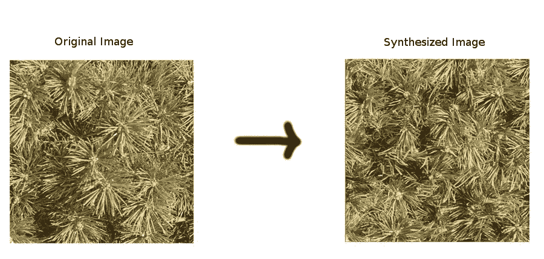

合成图像中的每个像素都是由机器生成的。

就我个人而言，我认为这真的很酷，因为它让除了我的小旧电脑之外一无所有的小旧我创造出独特的、美学上令人愉悦的图像。或许更重要的是，纹理合成让我们可以大规模地做到这一点。一个熟练的艺术家可以花 30 分钟创造一小段有趣的纹理，一个好的纹理合成算法可以将它转换成一幅跨越墙壁的壁画(或者两幅，或者一千幅)。如果你仍然不相信，想想视频游戏纹理和建筑立面。

总之，有许多不同的机器学习技术可以实现像样的纹理合成结果，但我在这里想谈的是**神经纹理合成** : 使用神经网络的纹理合成。特别是，我将首先用简单的术语描述最标准的神经纹理合成过程，然后涵盖最近的一篇论文[改进了这个过程。](https://wxs.ca/research/multiscale-neural-synthesis/)

# 神经纹理合成

关于神经纹理合成的开创性论文是 Gatys 等人在 2015 年发表的[使用卷积神经网络的纹理合成](http://papers.nips.cc/paper/5633-texture-synthesis-using-convolutional-neural-networks.pdf)，我在这里[重新实现了它](https://github.com/Lewington-pitsos/texture_syn)供感兴趣的人使用。下面我将解释这篇文章中的高级概念，但是这篇文章本身绝对值得一读。

# **神经合成**

暂时忘记纹理。想象一下，我们想要做的是创建一个与给定图像相似但不相同的图像(示例图像****)，我们必须使用神经网络来完成。在一个非常高的层面上，我们*可能*尝试的一件事是从一个已经很好地“理解”图像的模型开始(也许像一个高分的 imagenet 分类器)，生成一个随机噪声的**样本图像**，然后不断对该图像进行更新，直到模型看不出它和样本图像之间的差异(或者看不出太多*差异)为止。如果模型真的像人类一样理解图像，那么这两幅图像看起来应该非常相似。*****

****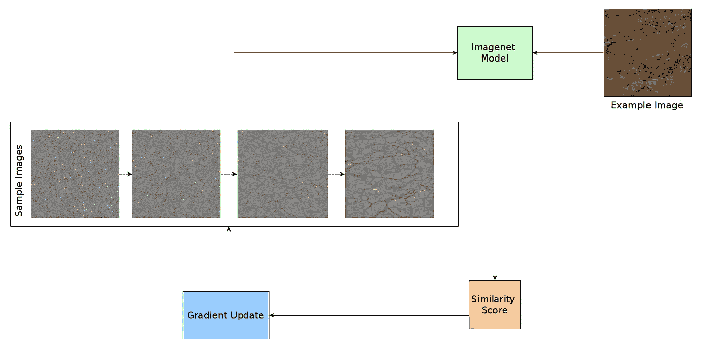****

****好吧，但是我们到底如何判断模型是否认为两幅图像“相似”？我们*不会*使用的一件事是模型的分类分数，因为两幅图像可能非常不同，但仍然有非常相似的分类分数。相反，我们要做的是选择网络的一些层(准随机)，每当我们将图像输入网络时，我们将记录这些特定层响应该图像而给出的输出(也称为*特征地图*)。我们将所有这些输出的集合一起称为一个**视图**，这将是我们判断输入到模型中的图像的相似性的基础:如果两个图像导致模型生成相似的视图，我们将认为这两个图像是相似的。****

****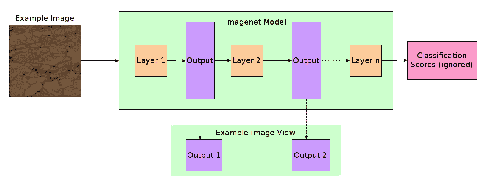****

****所以，回到上面描述的过程，我们实际要做的是:****

1.  ****将示例图像输入模型并记录结果视图，我们称之为**目标视图。******
2.  ****从随机噪声中创建初始样本图像。****
3.  ****将样本图像输入到模型中，并记录生成的视图(从与之前完全相同的层中获取)，我们称之为**样本视图**。****
4.  ****将样本视图与目标视图进行比较，以获得它们之间的**相异度得分**。****
5.  ****计算样本图像中每个像素相对于相异度分数的梯度，并对这些像素执行梯度更新。这将为我们留下样本图像的第二次迭代，它与示例图像更加相似。****
6.  ****重复步骤 3-5，直到相异分数足够低。****

****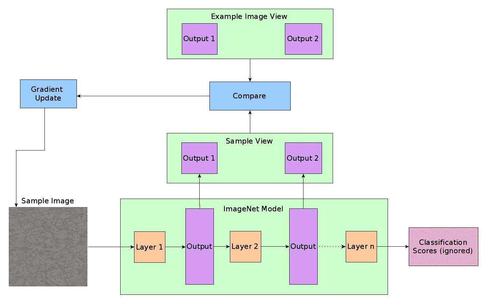****

****完成所有这些后，我们应该有了我们要实现的目标:一个看起来很像示例图像，但又不完全相同的样本图像。****

****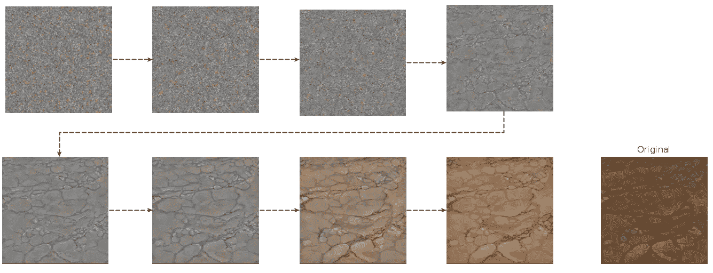****

# ******神经纹理合成******

****好吧，但是这和纹理合成有什么关系？如果你还记得的话，纹理合成的目标是创建与示例纹理相似的原始图像。上面描述的神经合成过程创建了总体上类似于示例图像*的图像*。因此，本质上我们已经解决了一个比我们着手解决的问题更难的问题，我们需要做的就是重复完全相同的过程，但这一次在计算不相似性时忽略视图中与纹理无关的信息。理论上，这将允许我们生成一个与示例图像纹理相同的样本图像，但在其他方面却完全不同。****

****更具体地说:我们不是直接将目标视图与生成的样本视图进行比较，而是从目标视图中提取一些统计数据(**目标统计数据**)，这些统计数据仅捕获示例图像的纹理相关方面(关于使用哪些统计数据的更多信息可以在[的论文](http://papers.nips.cc/paper/5633-texture-synthesis-using-convolutional-neural-networks.pdf)中找到)。然后，我们从样本视图中提取完全相同的统计数据(**样本统计数据**)，并通过将样本统计数据与目标统计数据进行比较来计算相异度得分，完全忽略视图本身。除此之外，上述 6 步流程保持不变。因为我们现在只在纹理相关信息的基础上进行更新，所以我们应该得到一个在纹理方面与示例纹理相似的样本图像，但在其他方面是唯一的。****

****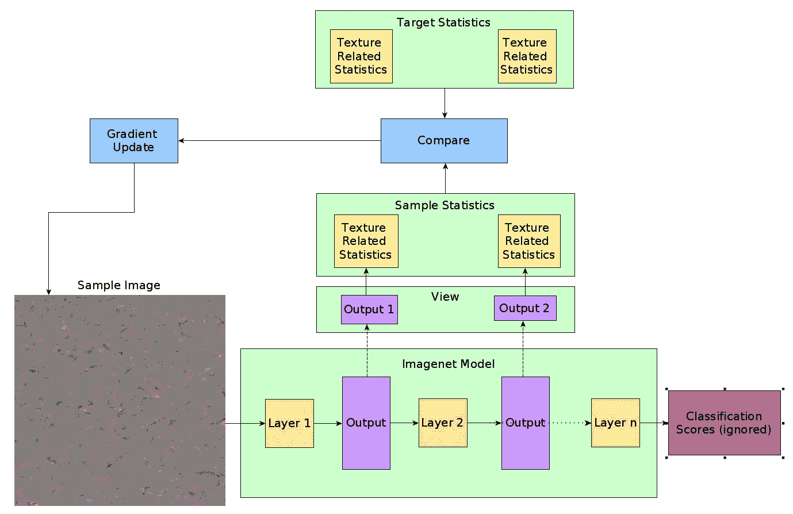****

****粗略地说，这是 Gatys 等人的论文中描述的过程，使用它，他们能够合成一些[漂亮的纹理](http://bethgelab.org/deeptextures/):****

****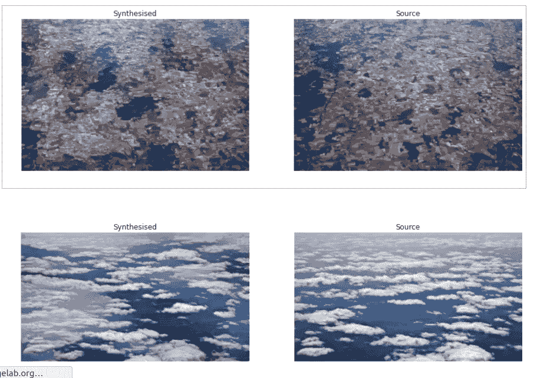****

****我的实现(做了一点简化，这样它就不会杀死我可怜的计算机)产生的结果大致相同:****

****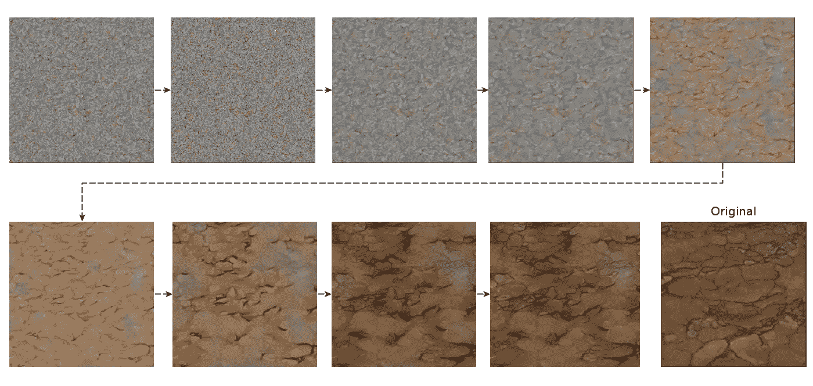****

# ****Snelgrove 的改进****

****一切都很好，但我们能做得更好吗？根据 Xavier Snelgrove 2017 年的论文: [*高分辨率多尺度神经纹理合成*](https://wxs.ca/research/multiscale-neural-synthesis/) 答案是肯定的*。*本文的中心观点是，当我们使用 Gatys 等人的方法时，我们的模型倾向于过于关注纹理相关数据的细节，而忽略了总体模式。例如，我们可以在上面看到，生成的样本纹理不忠实于示例纹理的某些宽泛方面(例如，泥浆图像中破裂泥浆的每个片段的清晰度或云图像中的深蓝色/浅蓝色梯度)。受此启发，Snelgrove 提出了一个聪明的方法来迫使模型更多地关注广泛的特征:将样本和示例图像的附加模糊版本传递到模型中，并使用结果视图进行比较。理论上，这种策略应该淡化纹理的细节，同时仍然捕捉其广泛的方面。****

****更具体地说:Snelgrove 建议你首先生成一个稍微模糊、稍微小一点的版本，而不是将示例图像单独传递给你的模型。然后，生成一个较小的、已经模糊的示例纹理的较小的、模糊的版本，以此类推，直到得到原始的、非模糊的示例纹理，加上大约 4 个“级别”的模糊和模糊版本。Snelgrove 称这整个堆栈为**金字塔**，在本例中为**示例金字塔**。****

****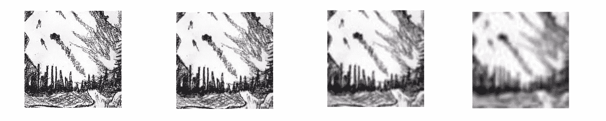****

****一个典型的金字塔，各级缩放到相同的大小。****

****然后，您通过您的模型传递示例金字塔的每个级别，并且每次都生成和记录目标统计数据，从而生成一个目标统计数据堆栈(**目标堆栈**)。****

****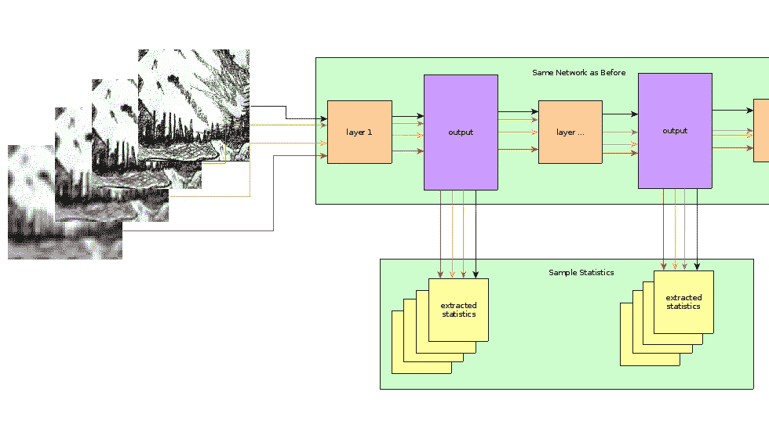****

****接下来，在处理(最初的随机噪声)样本图像之前，您还从与示例金字塔尺寸匹配的*样本金字塔*中制作了一个模糊的**样本金字塔**。您通过网络运行样本金字塔，并为每一层生成样本统计数据，留给我们一个**样本堆栈。**最后，我们通过比较目标堆栈和样本堆栈(逐层)来计算相异度分数，并在此基础上对样本*图像*执行梯度更新。根据 Snelgrove 的说法，洗涤、漂洗、重复，你最终会合成出高质量的纹理。****

****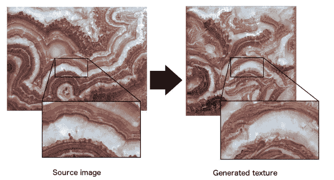****

****为了更好的衡量和学术兴趣，我继续用 pytorch 粗略地实现了 Snelgrove 的论文。我自己的结果没有那么好，但即使如此，我们也可以清楚地看到，使用金字塔方法，我能够比我用香草(即 Gatys 等人)神经纹理合成获得的结果有显著的改善:****

****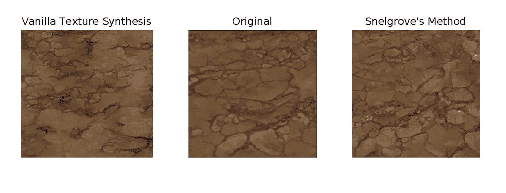****

****这就是这篇文章的全部内容。我的目的是尽可能简单地解释这些观点，所以如果你想要更多的细节，我强烈建议你阅读原始论文。****