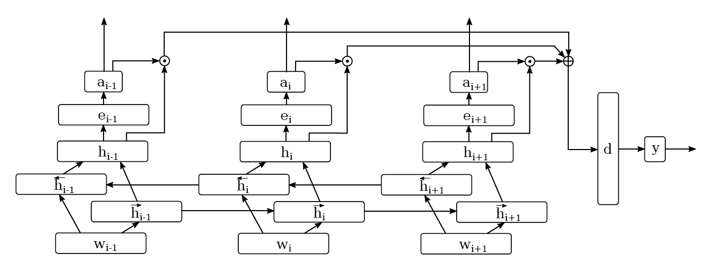
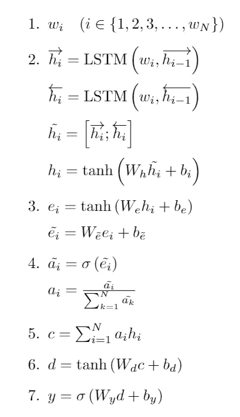
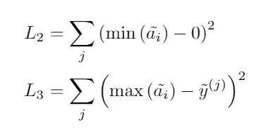
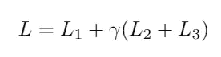

# 【论文分解】零炮序列标注:从句子到记号的知识转移(Rei 和 gaard，2018 NAACL)

> 原文：<https://medium.com/analytics-vidhya/paper-zero-shot-sequence-labeling-transferring-knowledge-from-sentences-to-tokens-rei-and-826f3ce78b42?source=collection_archive---------18----------------------->

[链接到纸张。](https://www.aclweb.org/anthology/N18-1027/)

我最近在我的实验室做一个项目，是关于使用 NLP 技术的隐喻检测。这被证明是一个非同小可的问题，而且对我来说是一个令人惊讶的活跃的研究领域。

今天，我将看看由 Marek Rei 先生和 Anders Sø gaard 撰写并在 NAACL 2018 上发表的论文*零镜头序列标签:将知识从句子转移到标记*。我不会包括本质上的细节，而是将重点放在方法上。你可以在原始文件中检查实施细节的结果。

我决定阅读这篇论文的原因是因为我和我的团队目前正试图将我们的任务形式化为一个零射击学习任务。这篇论文的任务设置和我们的 100%不一致，但读一读也无妨。

# TL；速度三角形定位法(dead reckoning)

> 作者试图在文本的标记层次上进行零元学习。他们所做的是首先训练一个模型来学习如何对*句子*进行分类，然后使用像注意力这样的机制来提取令牌级别的信息。这个问题被公式化为一个零射击学习任务，因为没有预先给定用于训练的标记的标签。

# 1.介绍

如以上概述中所述，本文解决了当令牌没有标签时 ***序列标签*** 的问题。对于任何不熟悉的人来说，序列标记基本上是标记序列中的标记的任务(例如[位置标记](https://en.wikipedia.org/wiki/Part-of-speech_tagging))。

如论文中所述:**“不是直接训练模型来预测每个标记的标签，而是使用句子级目标来优化模型。”**

作者承认，这种方法将无法比直接在令牌上训练的监督模型执行得更好。然而，本文的动机是，它为在令牌级信息不可用或难以处理的情况下利用文本数据开辟了可能性。

# 2.网络体系结构

## 概观

基本架构如下:

总流程是:

1.  得到每个单词的单词嵌入表示( *w_i)。*
2.  通过双向 LSTM ( *h_i* )运行字嵌入 *w_i* ，并连接前向和后向隐藏状态向量。
3.  通过线性投影运行隐藏状态向量的串联，然后是双曲正切激活函数，以获得表示 *e_i* 。这是通过一个线性投影运行一次，以获得*\波浪号{e_i}* 。
4.  在机器翻译等更典型的情况下，注意力值 *a_i* 是通过 softmax 归一化对 *\tilde{e_i}* 的值进行归一化得到的。这阻止了长句子拥有“不公平”的优势，因为长句子总是有更大的量级。然而，这种形式的标准化可能不适合于这种设置，因为它假设有一个具有正确标签的标记，而序列标签不是这种情况。相反，作者首先通过逻辑 sigmoid 函数运行 *\tilde{e_i}* ，并在没有指数函数的情况下执行类似 softmax 的归一化。
5.  在获得关注值 *a_i* 之后，它们被用于对级联的隐藏向量表示 *c* 进行加权。
6.  然后通过线性投影运行 *c* 以获得句子表示 *d* 。
7.  *d* 通过最终线性投影，并通过逻辑 sigmoid 函数。如果其输出 *y* 高于阈值(在本例中为 0.5)，则该句子被标记为“正”

以下是我刚刚列出的等式:

## 损失函数

作者提出损失函数的方法很有创意。总共有三个损失函数。

第一个损失函数只在句子层面起作用。我们的模型能够正确分类句子的标签吗？

第二个和第三个损失函数处理令牌级信息，比第一个稍微复杂一些。根据作者的说法，他们使用了几个约束条件:

1.  "句子中只有一些，而不是所有的标记可以有一个肯定的标签。"
2.  “只有当整个句子是肯定的时，一个句子中才有肯定的标记。

(根据作者的说法，这些约束是基于启发式的，而不是严格的证明)。

记住*\波浪线{a_i}* 是**未标准化的**注意力权重。第二个损失函数将这些权重中的最小权重推至接近 0，这基本上确保了不是所有的标记都将具有肯定的标签，并且第三个损失函数鼓励模型将大的注意力权重分配给肯定句子的最大标记(如果 *\tilde{y}* 为 0，则最大权重也将为 0)。

最终损失函数为:

其中γ基本上是控制那些辅助损失函数有多重要的超参数。

作者还用其他方法进行了实验，包括基于梯度的方法和简单的基于频率的朴素方法。他们的方法优于其他方法。

# 结束语

总的来说，这篇论文写得很好。作者本可以包括更多关于他们如何得出损失函数的细节，因为这似乎是他们的一个重要贡献，但总的来说，这是非常有益的。

我没有想到序列标签设置中的零射击学习会以这种方式公式化，所以创造力+1。

这也是我决定在媒体上做分析的第一篇论文。我一直告诉自己，我想这样做，因为这是我保持写作和学习的完美方式。我会努力保持下去，但我肯定需要保持它更短。